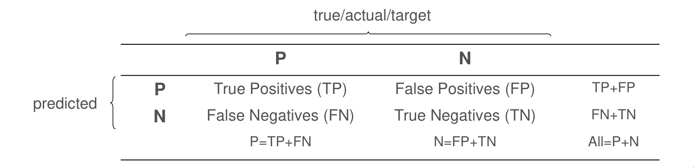
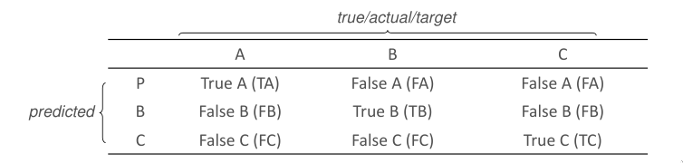

# Avaliação de Modelos

```toc

```

## Overfitting

Quando um modelo se adapta demasiado aos dados de treino, não conseguindo
rotular com sucesso objetos ainda não observados, estamos perante um modelo em
_overfitting_.

Este fenómeno ocorre porque os dados de treino, apesar de conterem as
regularidades da população, contêm também **erros de amostragem**. Ao ajustar o
modelo aos dados, o algoritmo **não** consegue identificar estas
irregularidades. O modelo é, então, **enviesado para os dados de treino**,
memorizando os dados de treino, em vez de os aprender.

De modo a evitar este fenómeno, podemos **dividir os dados de treino em vários
subconjuntos**, desde que todos eles mantenham a **distribuição original dos
dados**. Realizada a partição, utilizam-se alguns dos subconjuntos para
aprender e treinar o modelo e usamos outros para escolher o melhor modelo
encontrado, aquele que apresente o melhor desempenho.

Algumas estratégias para evitar o _overfitting_ passam por:

- De acordo com o princípio da _Occam's Razor_, na presença de dois modelo com
  desempenho semelhantes, escolher o mais simples.
- Usar conjuntos de treino e teste independentes entre si.
- Treinar com recurso ao conjunto de treino e escolher o melhor modelo com base
  num conjunto de validação.

## Estratégias de Treino

### Hold-Out

Quando estão disponíveis vários milhares de dados, dividimos este conjunto em
**dois subconjuntos** (sempre que possível manter a distribuição original dos
dados): o **conjunto de treino** e o **conjunto de teste**, normalmente numa
proporção $70/30$. Contudo, ficamos com uma estimativa enviesada se escolhermos
o modelo que apresenta melhor desempenho. Para solucionar isto, a partir do
subconjunto de teste é criado o conjunto de validação, utilizado para escolher
o melhor dos modelos. Finalmente, a exatidão do modelo é avaliada no conjunto
de teste.

### Leave-One-Out

Esta estratégia de treino é utilizada quando temos **poucos registos** com que
aprender. Usualmente, o **conjunto de teste é formado por apenas um registo**,
utilizando o resto dos registos para treinar o modelo. Este processo é repetido
para cada um dos registos, criando **tantos modelos quanto o número de
registos**. No final, a performance do modelo é avaliada com o número de
registos classificados corretamente.

### Cross-Validation

É uma estratégia de treino utilizada quando temos acesso a poucos milhares de
registos e **não conseguimos garantir a manutenção da distribuição do conjunto
de dados** ao proceder à sua divisão.

Através do conjunto de dados total, geram-se **$k$ subconjuntos mutuamente
exclusivos**, com tamanhos semelhantes, mantendo a distribuição da classe dos
dados originais (**validação cruzada estratificada**).

Utilizamos cada conjunto para avaliar o modelo aprendido pelos outros $k-1$
subconjuntos.

$$
D = D_1 \cup D_2 \cup D_3 \cup D_4
$$

- Treina-se em $D_2 \cup D_3 \cup D_4$ e valida-se em $D_1$.
- Treina-se em $D_1 \cup D_3 \cup D_4$ e valida-se em $D_2$.
- Treina-se em $D_1 \cup D_2 \cup D_4$ e valida-se em $D_3$.
- Treina-se em $D_1 \cup D_2 \cup D_3$ e valida-se em $D_4$.

À semelhança da estratégia de _leave-one-out_, são gerados vários modelos.
O processo é repetido várias vezes, de modo a aumentar a confiança nos
resultados obtidos.

## Avaliação

Avaliar o desempenho dos modelos é uma tarefa importante, pois nos permite
dizer qual destes é o mais indicado a usar.

Com vários modelos possíveis que se ajustam aos conjunto de dados, muitas das
vezes apenas podemos escolher um. Mas qual escolher? Este é problema da
**seleção do modelo**. De modo a resolvê-lo analisam-se várias propriedades dos
modelos em questão, com o objetivo de encontrar aquele que, de facto, melhor se
adapta aos dados.

### Matriz de Confusão

Considere-se um modelo de classificação $M: A \mapsto C$, como uma função que
mapeia um conjunto de variáveis a um rótulo ou classe.

O modelo é treinado contra um conjunto de dados rotulados, o conjunto de
treino. A informação resultante da classificação do conjunto de teste pode ser
representada numa matriz de confusão. Cada linha da matriz representa as
**instâncias da classe real dos dados** do conjunto de treino, enquanto que as
colunas da matriz representam as **classes atribuídas pelo modelo**, durante o
processo de classificação.



### Exatidão e Erro

A partir da informação representada na matriz de confusão, podemos definir
algumas medidas importantes.

$$
\text{Accuracy} = \frac{\text{TP} + \text{TN}}{\text{TP} + \text{FP} + \text{TN} + \text{FN}} \\
\text{Error} = 1 - \text{accuracy} = \frac{\text{FP} + \text{FN}}{\text{TP} + \text{FP} + \text{TN} + \text{FN}}
$$

A análise destas métricas, sem outros dados, constitui alguns problemas. A
exatidão **não** indica qual o tipo de erro mais frequente (falsos positivos ou
falsos negativos), que em muitos domínios precisam de ser diferenciados. Além
disso, a exatidão é enviesada para um valor maior se o conjunto de treino for
constituído maioritariamente por observações pertences a uma das classes.

### Precision, Recall e Fallout

De modo a solucionar os problemas descritos acima, introduzem-se mais medidas.

$$
\text{Recall} = \frac{\text{TP}}{\text{TP} + \text{FN}} \\
\text{Specificity} = \frac{\text{TN}}{\text{TN} + \text{FP}} \\
\text{Precision} = \frac{\text{TP}}{\text{TP} + \text{FP}}
$$

O _recall_ ou _sensitivity_ indica a **percentagem de observações positivas
classificadas como positivas**. O _fallout_ ou _specificity_ indica a
**percentagem de observações negativas classificadas como negativas**. A
_precision_ indica a **percentagem de observações positivas entre as
observações classificadas como positivas**.

Um elevado valor de _recall_ sem uma boa _precision_ não nos dá confiança
acerca da qualidade da classificação. É possível obter um elevado valor de
recall classificando todos os registos como positivos. Contudo, o valor de
precisão será bastante baixo. Por outro lado, ao classificar apenas um registo
como positivo, obtemos uma precisão máxima, mas um baixo valor de _recall_. Ao
avaliar um modelo, temos de ter em conta estas duas medidas. Para isso,
definimos uma nova medida, a _F-measure_ ou medida de balanço, dada por uma
média harmónica ponderada.

$$
\text{F-measure} = \frac{(\beta^2 + 1) \times \text{precision} \times \text{recall}}{\beta^2 \times \text{precision} + \text{recall}}
$$

Normalmente, a medida mais utiliza é _F1 measure_, onde $\beta$ toma o valor 1.

$$
\text{F1} = 2 \times \frac{\text{precision} \times \text{recall}}{\text{precision} + \text{recall}}
$$

### Múltiplas Classes

Na maior parte das tarefas de classificação, existem mais do que duas classes.
Nesses casos, podemos extender o conceito da matriz de confusão para
classificações não binárias.



As medidas tomam agora valores por classe: a classe principal é vista como
positiva, enquanto que as restantes são vistas como negativas.
