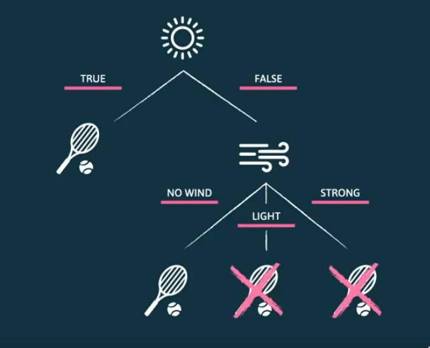

# Árvores de Decisão

```toc

```

## O que são Árvores de Decisão?

As árvores de decisão (_decision trees_) são um modelo de decisão original do _machine learning_
simbólico. Estas são representadas por um **grafo sem ciclos**, onde um nó
representa um **teste a um valor assumido por uma variável**. Assim, cada nó
corresponde a uma proposição lógica. Cada nó tem tantas arestas, ou ramos,
quantos os valores a variável pode assumir. Os nós terminais são **folhas** e
representam os valores assumidos pela variável de destino, a classe. Cada ramo
pode ser visto como uma conjunção de proposições, daí a sua origem no _machine
learning_ simbolista.

<!-- TODO Replace with SVG -->



## Variáveis Contínuas

O modelo foi também adaptado para lidar com variáveis numéricas. Cada nó testa
desigualdades em vez de testar o valor assumido pela variável. Existe o ramo em
que a desigualdade se verifica e outro em que esta não se verifica. Assim, cada
nó cria uma **partição do espaço de possíveis valores**.

## Algoritmos de Treino

Dada a natureza recursiva das árvores em que um nó pode ser uma folha ou uma
raiz de uma outra árvore, os algoritmos que operam sobre este tipo de
estruturas são também eles recursivos.

Na construção da árvore de decisão, **se todos os registos pertencerem à mesma
classe, é criada uma folha, rotulada com essa classe**. Caso contrário, cria-se
um **nó com a melhor variável para discriminar entre as classes** (a variável
mais relevante). De seguida, divide-se o conjunto de dados consoante a escolha
realizada, criam-se os ramos que representam cada um dos valores possíveis e
repete-se o processo para cada um dos ramos.

## Escolher a Melhor Variável

A escolha da próxima variável a considerar, no processo de construção de uma
árvore de decisão, é de extrema importância pois condiciona o tamanho final da
árvore. Existem várias métricas de escolha. Contudo todas apresentam as
seguintes propriedades:

- Devolver $0$ se o nó for puro (todos os registos pertencem à mesma classe).
- Devolver $1$ se a impureza do nó for máxima (o número de registos por classe
  é igual).
- Devolver $x \in ]0, 1[$ em caso contrário.

A métrica mais utilizada é a entropia de _Shannon_, baseada na teoria da
informação.

### Surpresa e Informação

Uma definição intuitiva de surpresa assenta no facto de, **quanto menor a
probabilidade de um evento ocorrer, maior é a nossa surpresa** face à
ocorrência desse evento. Definimos surpresa de um evento $k$ como o inverso da
probabilidade da ocorrência deste. Por exemplo, o evento "_Homem morde cão._"
evoca mais surpresa do que "_Cão morde homem._".

$$
s_k = \frac{1}{p(x_k)}
$$

A informação fornecida pela ocorrência deste evento é proporcional à surpresa.
Definimos a informação dada pela ocorrência de um evento como:

$$
I_i = \log_2({s_k}) = -\log_2({p(x_k)})
$$

Como seria de esperar, na ocorrência de um evento pouco provável, temos uma
maior informação, face a um evento mais provável.

Devemos notar que probabilidades são multiplicadas e a informação é somada,
devido ao logaritmo. O logaritmo base 2, faz com que a informação seja
representada em _bits_.

### Entropia de Shannon

A entropia de Shannon corresponde ao número mínimo de _bits_ necessários para
representar informação.

Para $x \in X$ eventos diferentes, a entropia de Shannon é calculada de acordo
com a fórmula seguinte.

$$
I(x) = \sum_{x \in X} p(x) \times I_x = - \sum_{x \in X} p(x) \times \log_2{(p(x))}
$$

### Ganho de Informação (_Information Gain_)

O ganho de informação permite-nos escolher qual a próxima variável a considerar
na construção de uma árvore de decisão.

Se, para determinada variável $F_x$, existirem $k$ valores possíveis, a árvore
é dividida em $k$ subconjuntos: $\{X_1, X_2, ..., X_k\}$.

Após realizarmos a partição da tabela em cada valor possível para o atributo,
calculamos a entropia de cada uma destas partições. De seguida calculamos a
entropia total, definida como a média ponderada das entropias de cada partição.

$$
E(F_x) = \sum_{i=1}^{k} \frac{\#X_i}{\#X} \times I(X_i)
$$

Define-se o ganho de informação como

$$
\text{gain}(F_k) = I(X) - E(F_k)
$$

A heurística, apesar de **não** garantir a escolha da árvore mais simples, leva
à construção de uma árvore bastante simples. Ao computar o ganho de cada
variável, escolhemos aquela que apresenta um maior ganho de informação ou, de
forma equivalente, a menor entropia ponderada.

## Pruning

O processo recursivo de construção de uma árvore de decisão continua até à
geração de um nó puro, o que tende a tornar as árvores bastante grandes. A
**elevada profundidade ou ramificação** da árvore pode ser causada pela
presença de **ruído nos dados**. Muitas vezes, estas ocorrências levam ao
fenómeno de _overfitting_.

O processo de poda, ou _pruning_, é uma abordagem para evitar o _overfitting_.
Esta torna as árvores menores, com o objetivo de maximizar o seu desempenho
sobre dados ainda não observados. As árvores podem ser podadas _a priori_ ou _a
posteriori_.

### Pre-Pruning

Este tipo de poda **interrompe o crescimento da árvore sempre que um nó não
melhore a exatidão do modelo de forma significativa**, de acordo com um limite
especificado.

É mais eficiente do que podar a árvore posteriormente, pois para
o processo de treino mais cedo.

### Post-Pruning

Neste tipo de poda, treina-se uma árvore tão grande quanto possível e depois
removem-se os ramos que não fornecerem uma melhoria de exatidão
estatisticamente significativa.

## Overfitting

Para além do processo de poda da árvore, a limitação da profundidade da árvore
permite que o modelo não se ajuste tanto aos dados de treino, permitindo uma
melhor performance no conjunto de teste e evitando o _overfitting_.
