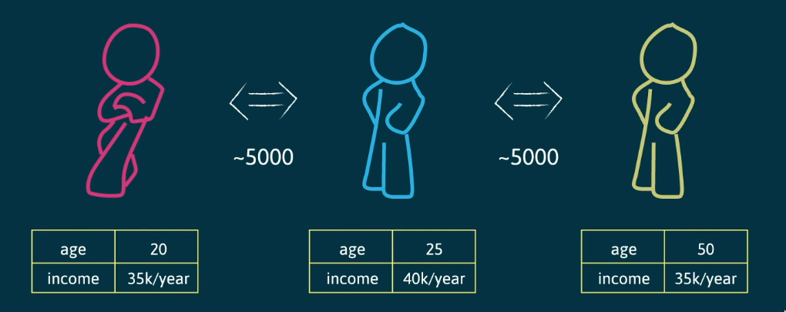
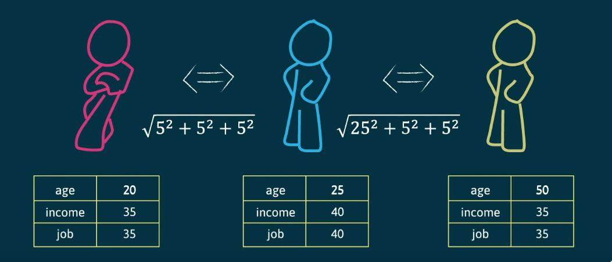

# Lazy Learning

```toc

```

Os analogistas defendem uma aprendizagem por analogia, também conhecida por
_lazy learning_, onde as decisões são tomadas tendo em conta a comparação do
objeto a classificar com objetos já conhecidos. Os algoritmos limitam-se a
memorizar o conjunto das observações, daí o termo _lazy learning_.

## Classificador K-Nearest Neighbors

Este classificador, também conhecido for KNN, perante um novo objeto, começa
por procurar os $k$ registos mais semelhantes a este novo objeto, entre os
objetos já conhecidos. Analisando os rótulos desses $k$ objetos, o novo objeto
seria classificado com o rótulo apresentado pela maioria dos objetos
analisados.

Para tal, os registos são classificados como pontos num plano euclidiano e o
algoritmo simplesmente memoriza os dados de treino, sem qualquer
pré-processamento adicional. Para encontrar os $k$ vizinhos mais próximos,
computa-se uma função de distância entre cada um dos objetos e o novo objeto a
classificar, com o objetivo de descobrir os $k$ pontos mais próximos.

$$
f(x_{new}) = \underset{c \in Z}{\operatorname{arg\ max}} \sum_{i=1}^{k} \delta(c, f(x_i)) \quad \text { onde } \delta(c, \hat{z}) = \begin{cases} 1 & \text{ se } \hat{z} = c \\ 0 & \text{ se } \hat{z} \neq c \end{cases}
$$

Por não haver uma fase de treino, sendo que o algoritmo apenas memoriza os
dados de treino, diz-se que o algoritmo não produz um modelo.

## Número de Vizinhos

Os resultados do algoritmo dependem fortemente do número $k$ de vizinhos
escolhido. Normalmente, escolhe-se $k$ experimentalmente. Começando com $k =
1$, avaliam-se os resultados num conjunto de validação e repete-se o processo
para maiores valores de $k$. Finalmente escolhe-se o número de vizinhos $k$ que
apresenta o melhor desempenho.

Na presença de classificações binárias (com duas classes), é habitual escolher
um valor ímpar de $k$, de modo a evitar empates, no processo de classificação.
Para classificações não binárias, se encontrarmos um empate, reduzimos o valor
de $k$ até quebrar o empate.

## Comparação

### Funções de Distância

Uma função de distância permite calcular a distância entre dois pontos em
$\mathbb{R}^{n}$. Existem várias funções de distância possíveis. Contudo,
todas apresentam as seguintes propriedades.

$$
d(x, y) \geq 0 \\
d(x, x) = 0 \\
d(x, y) = d(y, x) \\
d(x, y) \leq d(x, z) + d(z, y)
$$

As funções de distância mais utilizadas são casos particulares da chamada
_distância de Minkowski_.

$$
d(x, y) = \sqrt[n]{|x_1 - y_1|^n + |x_2 - y_2|^n + ... + |x_n - y_n|^n}
$$

A distância euclidiana corresponde ao caso particular quando $n = 2$.

$$
d(x, y) = \sqrt{|x_1 - y_1|^2 + |x_2 - y_2|^2 + ... + |x_n - y_n|^2}
$$

A distância de Manhattan corresponde ao caso particular quando $n = 1$.

$$
d(x, y) = |x_1 - y_1| + |x_2 - y_2| + ... + |x_n - y_n|
$$

A distância de Hamming é uma função utilizada para dados categóricos.
Corresponde ao número de diferentes atributos em dois vetores.

$$
d(\text{toned}, \text{roses}) = 3 \\
d(11011, 10010) = 2
$$

### Semelhança de Cossenos

Uma função de distância nem sempre é a métrica mais adequada para comparar duas
observações. Imagine-se que as nossas observações descrevem documentos, cada
um destes caracterizado pela frequência absoluta de certas palavras. Com o
objetivo de encontrar documentos sobre temas semelhantes, uma função de
distância separa dois documentos que, apesar de partilharem o mesmo tema, têm
diferentes tamanhos.

A métrica da semelhança de cossenos resolveria o problema. Apesar de os dois
documentos terem tamanhos diferentes, a frequência relativa de uma certa
palavra chave é bastante semelhantes nos dois.

$$
\text{cos}(x, y) = \frac{x \cdot y}{\| x \| \| y \|}
$$

### Correlação

Além das métrica de distância e da semelhança de cossenos, a proximidade de
duas observações pode ainda ser expressa por diferentes coeficientes de
correlação. Tais incluem o coeficiente de correlação de Pearson e o rank de
Spearman.

### Vizinhos à Mesma Distância

Numa situação onde vários vizinhos se encontrem à mesma distância, como podemos
escolher os $k$ vizinhos? Se forem todos da mesma classe, o objeto é
classificado como pertencente a essa classe. Caso contrário, o classificador
não consegue escolher os vizinhos a considerar e não classifica o objeto.
Perante muitos destes casos, é habitual escolher uma função de semelhança que
melhor discrimine entre os objetos.

### Escalas Diferentes

Outro problema é o de diferentes variáveis utilizarem diferentes escalas. Na
figura abaixo, apesar da diferença de idades entre a pessoa vermelha e a pessoa
amarela ser bastante alta, o algoritmo indica que estes objetos são mais
próximos entre si, do que qualquer um destes com o objeto azul. Isto deve-se ao
facto de a diferença salarial apresentar valores várias ordens de grandeza
acima da diferença de idades. Para tal, normalizam-se os dados de modo a tornar
estas diferenças mais próximas. O salário poderia ser representado então pelo
número de milhares de unidades monetárias por ano.



### Variáveis Redundantes

Um outro problema é a presença de variáveis que estejam correlacionadas com
outras. No exemplo abaixo, as variáveis _income_ e _job_, depois de
normalizadas, apresentam a mesma informação. A presença de variáveis
redundantes atribui mais peso a essas mesmas variáveis do que às outras,
dificultando a discriminação entre os objetos.



### KNN Ponderado

Também é possível atribuir um peso a cada um dos vizinhos consoante a sua
semelhança com o objeto a classificar.

$$
f(x_{new}) = \underset{c \in Z}{\operatorname{arg\ max}} \sum_{i=1}^{k} w_i \cdot \delta(c, f(x_i)) \quad \text { onde } w_i(x_{new}) = \begin{cases} \frac{1}{d(x_{new}, x_i)} & \text{ se } x_{new} \neq x_i \\ 1 & \text{ se } x_{new} = x_i \end{cases}
$$

## Overfitting

De modo a evitar o _overfitting_, o valor $k$ de vizinhos mais próximos pode
ser aumentado e podem ser usados pesos uniformes, ao invés de pesos ponderados.
