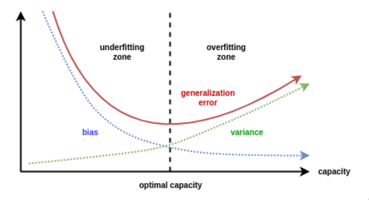

# Avaliação de Modelos de Regressão

```toc

```

À semelhança dos classificadores, os modelos de regressão podem ter uma boa
performance no conjunto de treino e não conseguir manter essa performance no
reconhecimento de novas observações. Para tal, é necessário poder quantificar a
performance destes modelos fora do conjunto de treino.

## Funções de Erro

É possível aplicar qualquer um dos métodos de treino anteriormente referidos e,
de modo a quantificar o erro num conjunto de treino, é possível estimar uma
função de erro, também conhecida por _loss function_. Estas funções de erro são
calculadas no conjunto de teste, e é computada a sua média e desvio padrão em
cada um dos _folds_, no caso de se utilizar validação cruzada.

Algumas medidas de erro são

$$
\text{MAE}(\hat{z}, z) = \frac{1}{n} \sum_{i=1}^{n} |z_i - \hat{z}_i| \quad \text{ mean absolute error}\\
\text{RMSE}(\hat{z}, z) = \sqrt{\frac{1}{n} \sum_{i=1}^{n} (z_i - \hat{z}_i)^2} \quad \text{ root mean square error}\\
\text{MAPE}(\hat{z}, z) = \frac{1}{n} \sum_{i=1}^{n} \left|\frac{z_i - \hat{z}_i}{zi}\right| \quad \text{ mean absolute percentage error}
$$

## Análise de Resíduos

À quantidade $z_i - \hat{z}_i$ dá-se o nome de resíduo. A sua análise,
tipicamente através de um _scatter plot_ por cada um dos atributos, pode ser
útil para identificar a presença de _learning biases_, onde existe uma
tendência para um padrão ou comportamento particular.

## Generalização

Após a tarefa de treino, o modelo deve ser capaz de prever ou descrever novas
observações. Se a nova observação pertencer à mesma população, estamos perante
uma generalização de **primeira ordem**. Caso contrário, estamos perante uma
generalização de **segunda ordem**. O objetivo é, então, evitar o
_underfitting_ e o _overfitting_ do modelo aos dados de treino. Abaixo
encontra-se a definição formal de _overfitting_.

$$
\begin{aligned}
&M_2 \text{ está em overfit se} \\
&\exists M_1: M_2 \text{ é especialização de } M_1 \text{ e } \\
&\quad \text{erro}_{M_2}(\text{treino}) < \text{erro}_{M_1}(\text{treino}) \\
&\quad \text{erro}_{M_2}(\text{teste}) > \text{erro}_{M_1}(\text{teste})
\end{aligned}
$$

O processo de aprendizagem num elevado número de dimensões é mais suscetível a
_overfitting_ comparativamente a um baixo número de dimensões. Isto deve-se ao
facto de, à medida que as dimensões aumentam, a importância de cada uma das
componentes diminui, devido ao crescimento do volume com o número de dimensões.
Assim, os dados rapidamente se tornam bastante esparsos (com muitos 0's),
fazendo com que o modelo sofra de _overfitting_.

### Bias e Variância

É possível demonstrar que o erro é constituído por duas principais componentes,
juntamente com alguns termo provenientes do ruído dos dados.

A primeira corresponde a um _bias_, que reflete a inabilidade do modelo
aprendido em aproximar a função geradora (a que melhor se aproxima dos dados).
Tal componente pode ter uma elevada contribuição se o modelo não tiver poder
expressivo suficiente. É considerado um erro de aproximação.

A segunda componente, a variância, é descrita pela inadequação da informação
presente nos dados de treino sobre a função geradora. É considerado um erro de
estimação.



Os bons modelos conseguem um balanço entre estas duas componentes. Um modelo
com elevado poder expressivo mas com uma amostra de treino limitada consegue um
pequeno _bias_ a custo de uma elevada variância, sofrendo de _overfitting_. Por
outro lado, um modelo com baixo poder expressivo consegue uma baixa variância,
porém um _bias_ elevado, sofrendo de _underfitting_.

Para qualquer modelo, apenas conseguimos eliminar o _bias_ e a variância
simultaneamente com um conjunto de treino infinito.
