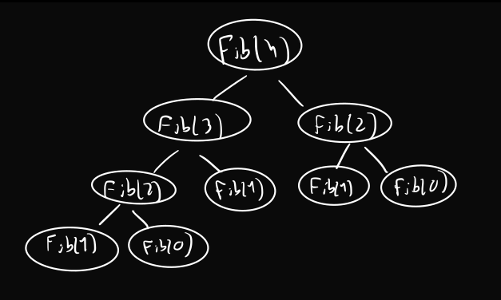

# Introdução

```toc

```

A cadeira é perfeitamente acompanhável recorrendo apenas aos slides, notas do professor, coletânea de exercícios e a estes resumos. Contudo, e segundo o professor regente da UC, alunos que queiram aprofundar conhecimento podem (e devem) fazê-lo recorrendo a alguns livros indicados na bibliografia:

- [Introduction to Algorithms](https://web.iiit.ac.in/~pratik.kamble/storage/Algorithms/Cormen_Algorithms_3rd.pdf), de Thomas H. Cormen, Charles E. Leiserson, Ronald L. Rivest e Clifford Stein (MIT Press)

- [Algorithms](http://algorithmics.lsi.upc.edu/docs/Dasgupta-Papadimitriou-Vazirani.pdf), de S. Dasgupta, C. Papadimitriou e U. Vazirani, McGraw-Hill

## Cálculo dos Números de Fibonacci

Um dos exemplos clássicos de algoritmos introdutórios é o [**cálculo de números de Fibonacci**](color:orange) - por um lado por ser relativamente fácil de compreender, e por outro por ser igualmente fácil melhorá-lo (em relação à sua complexidade temporal).

Sabemos, claro, que para calcular o $n$-ésimo elemento da sequência de Fibonacci, temos:

$$
Fib(n)=\begin{cases}
0 &\text{ se } n = 0 \\
1 &\text{ se } n = 1 \\
Fib(n-1) + Fib(n-2) &\text{ caso contrário}
\end{cases}
$$

### Implementação 1 (Naive)

A implementação _naive_ numa linguagem de programação (e.g C++, como abaixo), passaria por algo como:

```cpp
int Fib(int n) {
  if (n <= 1) {
    return n;
  }
  return Fib(n - 1) + Fib(n - 2);
}
```

Esta implementação tem, contudo, um problema - apesar de ser fácil de escrever, é extremamente ineficiente, podendo calcular números mais do que uma vez - este problema até pode não parecer fazer grande diferença ao calcular números de Fibonacci pequenos, mas quando se pretender calcular, por exemplo, $Fib(400)$, a tarefa tornar-se-á profundamente mais desagradável.

Abaixo podemos observar a [**árvore dos subproblemas**](color:orange) de uma chamada $Fib(4)$, onde os dois filhos de um nó são as duas chamadas recursivas realizadas nesse nó. Podemos ver que, mesmo num problema "pequeno", calculamos o mesmo número várias vezes.



Podemos, para avaliar melhor a complexidade temporal desta solução, definir uma função $T(n)$ - uma função que, neste caso, corresponderá a "quanto tempo" (vulgo quantidade de operações) é necessário para calcular um dado $Fib(n)$.

Ora, olhando para o corpo da função, podemos admitir que:

$$
T(n)=\begin{cases}
c_0 &\text{se } x == 0 \text{ ou } x == 1 \\
T(n - 1) + T(n - 2) + c_1 &\text{caso contrário}
\end{cases}
$$

O ramo de cima corresponde aos casos base - há um número **constante**, constante essa $c_0$ de operações a realizar caso estejamos na presença do caso base.  
O ramo de baixo acontece caso os casos base não se verifiquem - terá de ocorrer uma chamada recursiva a $Fib(n-1)$ e a $Fib(n-2)$ (tendo, portanto, de adicionar o "tempo" que essas 2 chamadas levarem), e temos também um número constante de operações requeridas (`if`, soma, por exemplo), $c_1$.  
Temos que $c_0, c_1 \geq 2$.

Podemos, ainda, provar que $T(n) > fibo(n)$ (a função matemática, não a nossa implementação da mesma):

:::details[Prova por indução forte]

(Já agora, [a diferença entre as induções simples e forte](https://math.stackexchange.com/q/517440)).

[**Casos Base**](color:green):

- $n = 0: \quad T(0) > fibo(0) \leftrightarrow c_0 > 0$ - acontece sempre, já que $c_0 >= 2$.
- $n = 1: \quad T(1) > fibo(1) \leftrightarrow c_0 > 1$ - acontece sempre, pela mesma razão.

[**Caso indutivo**](color:orange):

- A provar: $T(n+1) > fibo(n+1)$
- Assumimos: $\forall_{0 \leq k \leq n}, T(k) \geq fibo(k)$, a nossa **hipótese de indução**.
- Prova:
  $$
  \begin{split}
  &T(n + 1) = T(n) + T(n - 1) + c_1 \text{, pela definição de }T(n) \\
  &T(n + 1) > fibo(n) + fibo(n - 1) + c_1 \text{, pela hipótese de indução} \\
  &T(n + 1) = fibo(n + 1) + c_1 \text{, pela definição de }fibo(n) \\
  &T(n + 1) > fibo(n + 1) \text{, já que }c_1 \geq 2
  \end{split}
  $$

Fica, então, provado que $T(n) > fibo(n)$.

:::

Podemos, ainda, referir que:

$$
\forall_{n \geq 11} \text{ } fibo(n) \geq \left(\frac{3}{2}\right)^n
$$

provado nas notas do professor (no fim desta página).

### Implementação 2 (Memoization)

Ora, o nosso objetivo, para tornar o algoritmo mais eficiente, passará então por arranjar uma maneira de ir guardando os números já calculados, de modo a não ter de os calcular novamente. Uma das técnicas que nos pode ajudar a fazê-lo é a [**memoization**](color:yellow).

:::tip[Memoization]

Técnica que garante que um método não calcula os mesmos valores mais do que uma vez, guardando os valores já calculados numa estrutura de dados (por ex. um mapa, um vetor, etc).

:::

Em C++, a aplicação da memoization ao cálculo de um número de Fibonacci passaria por qualquer coisa como:

```cpp
int Fib(int n) {
  if (n <= 1) {
    return n;
  }
  // vetor inicializado com n + 1 elementos -> de 0 a n
  std::vector<int> A(n + 1);
  A[0] = 0;
  A[1] = 1;
  for (int i = 2; i <= n; i++) {
    A[i] = A[i - 1] + A[i - 2];
  }
  return A[n];
}
```

Foi, então, inicializado um vetor de $n + 1$ elementos, onde os primeiros dois elementos correspondem aos **casos base**. A partir daí, podemos ir juntando novos valores ao vetor, partindo de valores previamente calculados, evitando cálculos desnecessários - aqui, **cada número de Fibonacci é calculado apenas uma vez**.

Em relação a esta implementação, temos:

$$
T(n)=\begin{cases}
c_0 &\text{se } x \leq 1\\
c_1 \cdot n + c_2 &\text{caso contrário}
\end{cases}
$$

O ramo de cima é igual ao da implementação anterior. O de baixo, contudo, é bastante diferente - não estamos dependentes de chamadas recursivas. Temos uma componente $c_1 \cdot n$, correspondente às operações realizadas durante o loop principal, e uma $c_2$ corrrespondente às outras operações da função, todas realizadas em tempo constante.

Esta implementação tem, ainda, um pormenor que pode ser melhorado - a complexidade no [**espaço**](color:yellow) é linear ($S(n) \in O(n)$), já que precisamos de criar um vetor com $n$ entradas. Podemos, no entanto, melhorar este aspeto.

### Implementação 3 (Constantes Auxiliares)

O algoritmo seguinte é bastante semelhante ao anterior, recorrendo, no entanto, a **constantes auxiliares** temporárias ao invés de uma estrutura de dados adicional. Evita, na mesma, os cálculos repetidos desnecessários, mas sem o "incómodo" da complexidade no espaço ser linear - é $O(1)$.  
Em C++, corresponderia a qualquer coisa como:

```cpp
int Fib(int n) {
  if (n <= 1) {
    return n;
  }
  int prev = 0;
  int curr = 1;
  int temp;
  for (int i = 2; i <= n; i++) {
    temp = prev + curr;
    prev = curr;
    curr = temp;
  }
  return curr;
}
```

De realçar que a complexidade temporal continua igual à anterior, $T(n) \in O(n)$.

## Invariante de um Loop

Resta, por fim, definir o **invariante de um loop**.

:::tip[Invariante de um Loop]

Corresponde a uma **propriedade que o algoritmo mantém** durante todo o loop. Colapsa no final do loop.

:::

Dito assim pode parecer estranho, por isso podemos olhar para o seguinte algoritmo:

```cpp
int sumArray(std::vector<int> arr) {
  int sum = 0;
  for (int i = 0; i < arr.size(); i++) {
    sum += arr[i];
  }
  return sum;
}
```

Aqui, temos que, em [**qualquer momento do loop**](color:orange), a variável `sum` é dada por:

$$
\operatorname{sum} = \sum^{i - 1}_{k = 0}\operatorname{arr} [k]
$$

onde $i$ é a variável do ciclo que vai sendo incrementada. Podemos verificar, a qualquer momento do loop, que `sum` corresponde, de facto, ao valor daquele somatório.

---

- [Slides](https://drive.google.com/file/d/1iyuzEQdYwsUpZR6HAjMK0jfS2JDtTBON/view?usp=sharing)

- [Notas da Aula - Prof. José Fragoso](https://drive.google.com/file/d/1E1Ch3yhfTJKf9Df7jj2_3O8kx1efN1xD/view?usp=sharing)
