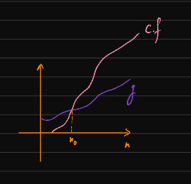
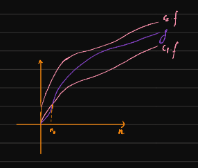
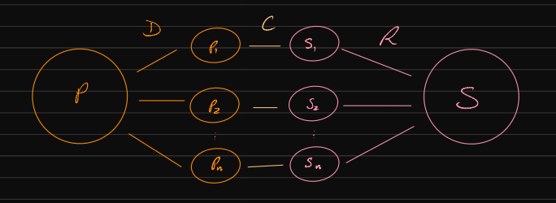

# Notação Assimptótica e Teorema Mestre

```toc

```

## Notação Assimptótica

A secção de IAED dos resumos sobre [esta matéria](../iaed/introducao-algoritmos#notação-assimptótica) já cobre os aspetos relevantes a abordar, ainda que relativamente superficialmente. Tentando relembrar estes conceitos de uma forma sucinta:

- Majorante assimptótico:

$$
g \in O(f) \text{ sse } \exists_{c}\exists_{n_0}, \forall_{n \geq n_0}, \quad g(n) \leq c\cdot f(n)
$$

É o **limite assimptótico superior**, com notação $O$ - afere a complexidade no pior caso.

:::details[**Limite assimptótico superior**]



:::

- Minorante assimptótico:

$$
g \in \Omega(f) \text{ sse } \exists_{c}\exists_{n_0}, \forall_{n \geq n_0}, \quad g(n) \geq c\cdot f(n)
$$

É o **limite assimptótico inferior**, com notação $\Omega$ - afere a complexidade no melhor caso.

- _Tight-band_:

$$
g \in \Theta(f) \text{ sse } \exists_{c_1, c_2}\exists_{x_0}, \forall_{n \geq n_0}, \quad c_1\cdot f(n) \leq g(n) \leq c_2\cdot f(n)
$$

É o **limite assimptótico apertado**, com notação $\Theta$ - quando o melhor e o pior caso têm a mesma complexidade.

:::details[**Limite Assimptótico Apertado**]



:::

Houve ainda dois [**lemas**](color:yellow) associados à notação assimptótica abordados em aula, um deles diretamente relacionado com o limite acima:

:::info[Lema 1]

$$
g \in \Theta(f) \text{ sse } g \in O(f) \wedge g \in \Omega(f).
$$

:::

:::info[Lema 2 - **Transitividade**]

$$
f \in O(g) \wedge g \in O(h) \implies f \in O(h).
$$

:::

[**As provas de ambos os lemas encontram-se nas notas do professor, no fim da página.**](color:green)

---

Muitas vezes, uma abordagem que permite diminuir significativamente o tempo assimptótico em que é possível resolver um problema é usar uma abordagem de [**Dividir e conquistar**](color:orange).

:::info[Dividir para Conquistar]

Metodologia:

- [**D**](color:orange)ividir o problema a resolver num conjunto de subproblemas.

- [**R**](color:yellow)esolver (recursivamente) cada um dos subproblemas.

- [**C**](color:red)ombinar as soluções dos subproblemas para obter a solução do problema original.



:::

Exemplos de problemas que têm soluções deste tipo são

- Procura de um elemento numa array ordenada com [Binary Search](https://en.wikipedia.org/wiki/Binary_search_algorithm)
- Travessia de uma árvore binária
- Ordenação de uma array com [Merge Sort](../iaed/algoritmos-eficientes-ordenacao#merge-sort) (pode ser útil rever, foi abordado em aula). As notas do professor abordam também a complexidade temporal de cada método do Merge Sort (e a sua complexidade total)

O Teorema Mestre oferece um método para calcular o crescimento Assimptótico deste tipo de problemas.

## Teorema Mestre

### Teorema Mestre Simplificado

Sejam $a \geq 1, b > 1, d \geq 0$ constantes e $T(n)$ definido por

$$
T(n) = a T(n/b) + O(n^d)
$$

Diz então o Teorema Mestre Simplificado que

$$
T(n) = \begin{cases}
O(n^{\log_b a}) && \text{if } d < \log_b a \\
O(n^d\log n) && \text{if } d = \log_b a \\
O(n^d) && \text{if } d > \log_b a
\end{cases}
$$

As constantes $a, b$ e $d$ devem ser pensadas da seguinte forma:

- Nesta solução de D&C, cada problema de tamanho $n$ divide-se em $\mathbb{a}$ problemas de tamanho $\mathbb{n/b}$;
- $\mathbf{n^d}$ corresponde ao custo nesta solução para gerar os subproblemas, e, no fim, juntar os seus resultados (em relação a um problema de tamanho $n$).

:::tip[Prova]

Pode ajudar a acompanhar esta prova desenhar no papel a árvore descrita na prova.

Na raiz, temos que o preço (pontual) é dado por $O(n^d)$.

Num segundo nível, temos $a$ subproblemas de tamanho $n/b$.
Portanto, cada um tem um custo de $O(\frac{n}{b}^d)$.
Consequentemente, no total, neste nível, a complexidade é $aO(\frac{n}{b}^d)$.

No terceiro nível, dividimos cada problema em $a$ subproblemas, obtendo então $a^2$ subproblemas.
Cada um destes subproblemas terá dimensão $n/b^2$, pois dividimos cada problema no nível 2 $b$ vezes.
Então, cada problema tem custo $O(\frac{n}{b^2}^d)$, pelo que a complexidade do nível todo é $a^2 O(\frac{n}{b^2}^d)$.

Fica então fácil de generalizar que no nível $k$ teremos $a^k$ problemas de tamanho $\frac{n}{b^k}$ com custo pontual $O(\frac{n}{b^k}^d)$.

Calcular a complexidade da nossa solução corresponde então a somar a complexidade de cada nível, até um nível da árvore em que o custo pontual é constante (neste caso assumimos que isso acontece apenas quando $n=1$).
Para isso precisamos de saber quantas divisões temos de fazer até chegar a esse nível. A resposta é o valor $k$ tal que $\frac{n}{b^k} = 1 \Leftrightarrow k = \log_b n$.

Ficamos então com o somatório:

$$
\sum_{k=0}^{\log_b n} O \left( a^k (\frac{n}{b^k})^d \right) =
O \left( n^d \sum_{k=0}^{\log_b n} \left( \frac{a}{b^d} \right)^k \right)
$$

Analisemos agora caso a caso:

- No caso 1, temos que $d < \log_b a \Leftrightarrow b^d < a \Leftrightarrow \frac{a}{b^d} > 1$.
  Neste caso, o somatório explode e é dominado pelo último termo, ou seja a complexidade tem _upper bound_ de
  $$
  O \left( n^d \left( \frac{a}{b^d} \right)^{\log_b n} \right) =
  O \left( n^d \frac{a^{\log_b n}}{n^d} \right) =
  O \left( a^{\log_b n} \right)
  $$
- No caso 2, ficamos com
  $$ O \left( n^d (log_b n + 1) \right) = O \left( n^d \log n \right) $$
- No caso 3, o somatório é majorado por uma série que converge (uma vez que $d > \log_b a \Leftrightarrow b^d > a \Leftrightarrow \frac{a}{b^d} < 1$) pelo que
  $$ O \left( n^d \right) $$

:::

:::details[Exemplo 1]

Tenhamos $T(n) = T(\frac{n}{3}) + n$.
Aqui, podemos dizer que:

$$
a = 9, \quad b = 3, \quad d = 1
$$

Daqui, obtemos que

$$
\log_{b}{a} = \log_{3}{9} = 2 > 1 = d
$$

Assim sendo, admitimos que estamos na presença do [**caso 1**](color:orange), e que, portanto,

$$
T(n) = O(n^{\log_{b}{a}}) = O(n^2).
$$

:::

:::details[Exemplo 2]

Tenhamos:

```cpp
int f(int n) {
  int i, j;
  i = 0;
  j = 0;
  while (i < n) {
    j++;
    i += 2;
  }
  if (n > 1) {
    i = 2*f(j) + f(j);
  }
  return i;
}
```

Podemos procurar ver como o ciclo se comporta (e qual é a sua condição de paragem) recorrendo ao [**método da tabela**](color:green). Neste caso:

| $k$ | $i$  | $j$ |
| --- | ---- | --- |
| $0$ | $0$  | $0$ |
| $1$ | $2$  | $1$ |
| $2$ | $4$  | $2$ |
| ... | ...  | ... |
| $k$ | $2k$ | $k$ |

Onde $k$ é a variável de controlo do loop (conta o número de iterações), e $i$ e $j$ são variáveis que vão sendo atualizadas durante o mesmo. Podemos notar que $k = 0$ corresponde ao momento exatamente antes do loop.

Ora, podemos perceber que $i$ vai crescendo com aspeto $2k$ - isto é, vai sempre sendo igual ao dobro do número de iterações atual do ciclo. Além disso, através da tabela, podemos também observar que, no fim do ciclo, $j = k$.

Temos que o ciclo para com $i \geq n$ - ou seja, quando

$$
2k \geq n \leftrightarrow k \geq \frac{n}{2}
$$

Podemos, então, dizer que o ciclo corre $\frac{n}{2}$ vezes, e que a sua complexidade temporal é $O(n)$.

Como observado, $j = k$ no fim do ciclo, pelo que a chamada recursiva da função (dentro do bloco `if`) é realizada com [$j = \frac{n}{2}$](color:orange) [**duas vezes**](color:yellow) (a função recursiva é chamada duas vezes), pelo que podemos admitir que essa secção leva $2\cdot T(\frac{n}{2})$. A função $T(n)$ total da função corresponde, portanto, a

$$
T(n) = \textcolor{yellow}{2}\cdot T\left(\textcolor{orange}{\frac{n}{2}}\right) + O(n).
$$

Ora, daqui podemos retirar que

$$
a = 2, \quad b = 2, \quad d = 1 \\
\log_{b}{a} = \log_{2}{2} = 1 = d
$$

Estamos na presença do [**caso 2**](color:green), e portanto podemos admitir que

$$
T(n) = O(n^d \cdot \log{n}) = O(n \cdot \log{n}).
$$

:::

:::details[Exemplo 3]

Tenhamos:

```cpp
int f(int n) {
  int i = 0;
  while (i * i < n) {
    i++;
  }
  if (n > 1) {
    i = f(n / 4) + f(n / 4) + f(n / 4)
  }
  return i;
}
```

Mais uma vez vamos recorrer ao método da tabela para perceber como o loop se comporta:

| $k$ | $i$ |
| --- | --- |
| $0$ | $0$ |
| $1$ | $1$ |
| $2$ | $2$ |
| ... | ... |
| $k$ | $k$ |

$i$ cresce, portanto, de igual forma ao número de ciclos. Ao mesmo tempo, temos que a condição de paragem é

$$
i^2 \geq n \leftrightarrow k^2 \geq n \leftrightarrow k \geq \sqrt{n} \leftrightarrow k \geq n^\frac{1}{2}
$$

A complexidade do loop é, portanto, $O(\sqrt{n})$.

Além disso, a chamada recursiva dentro do bloco `if` é realizada três vezes, desta vez sem recorrer a "variáveis auxiliares" - a chamada é sempre feita com $\frac{n}{4}$. Temos, então, que

$$
T(n) = 3 \cdot T(\frac{n}{4}) + O(\sqrt{n})
$$

de onde obtemos

$$
a = 3, \quad b = 4, \quad d = \frac{1}{2} \\
\log_{b}{a} = \log_{4}{3} > \frac{1}{2}
$$

Estamos, portanto, na presença do [**caso 3**](color:yellow), e portanto

$$
T(n) = O(n^{log_{b}{a}}) = O(n^{log_{4}{3}}).
$$

:::

:::details[Exemplo 4]

Tenhamos:

```cpp
int f(int n) {
  int i = 0;
  int j = 0;
  while (n * n > i) {
    i += 2;
    j++;
  }
  if (n > 1) {
    i = 5 * f(n/2) + f(n/2) + f(n/2) + f(n/2)
  }
  while (j > 0) {
    i += 2;
    j--;
  }
  return i;
}
```

Neste caso temos [**dois loops**](color:green), pelo que a complexidade de ambos será relevante para resolver o problema.

Fazendo a tabela para o primeiro loop:

| $k$ | $i$  | $j$ |
| --- | ---- | --- |
| $0$ | $0$  | $0$ |
| $1$ | $2$  | $1$ |
| $2$ | $4$  | $2$ |
| ... | ...  | ... |
| $k$ | $2k$ | $k$ |

Temos que o primeiro loop para quando

$$
i \geq n^2 \leftrightarrow 2k \geq n^2 \leftrightarrow k \ geq \frac{n^2}{2},
$$

pelo que a sua complexidade será $O(\frac{n^2}{2}) = O(n^2)$.

Olhando já para o segundo loop (já voltamos ao `if` no meio), podemos observar que o número de iterações é exatamente o mesmo do primeiro - no primeiro, $j$ era igual ao número de iterações do mesmo. Aqui, decrescemos $j$ até chegar a 0: $\frac{n^2}{2}$ iterações, tal como em cima. A complexidade será, claro $O(n^2)$. A soma das suas complexidades corresponderá a $2 \cdot O(n^2)$. Contudo, a constante $2$ é irrelevante para o cálculo da complexidade, pelo que podemos só admitir que a complexidade conjunta dos ciclos será do tipo $O(n^2)$.

A chamada recursiva é realizada 4 vezes, dentro do `if`, sempre recorrendo a $\frac{n}{2}$, pelo que vamos ter

$$
T(n) = 4 \cdot T(\frac{n}{2}) + O(n^2)\\
\text{ } \\
a = 4, \quad b = 2, \quad d = 2\\
\log_{b}{a} = log_{2}{4} = 2 = d
$$

pelo que estamos na presença do [**caso 2**](color:orange), e portanto

$$
T(n) = O(n^2 \cdot \log{n}).
$$

:::

[**Existem mais alguns exemplos semelhantes nas notas do professor.**](color:green)

### Teorema Mestre Generalizado

Este teorema pode ser estudado com mais detalhe [aqui](<https://en.wikipedia.org/wiki/Master_theorem_(analysis_of_algorithms)>) (incluindo a sua prova, bastante extensa).

Sejam $a \geq 1, b > 1$ constantes e $T(n)$ definido por
$$ T(n) = aT(\frac{n}{b}) + \Theta(f(n)) $$  
Diz então o Teorema Mestre Generalizado que:

$$
T(n) = \begin{cases}
\Theta(n^{\log_b a}) && \text{if } f(n) \in O(n^{\log_b a}) \\
\Theta(n^{\log_b a}\log n) && \text{if } f(n) \in \Theta(n^{\log_b a}) \\
\Theta(f(n)) && \text{if } f(n) \in \Omega(n^{\log_b a})
\end{cases}
$$

Primeiro caso precisa de uma _condição de regularidade_ - pode ser encontrada nos slides e nas notas do professor, mas em ASA não é necessária.

Tal como no caso simples, devemos pensar nestas fórmulas da seguinte forma:

- Nesta solução de D&C, cada problema de tamanho $n$ divide-se em $\mathbb{a}$ problemas de tamanho $\mathbb{\frac{n}{b}}$;
- $\mathbf{f(n)}$ corresponde ao custo nesta solução para gerar os subproblemas, e, no fim, juntar os seus resultados (em relação a um problema de tamanho $n$).

O segundo caso tem ainda mais uma generalização, que não vamos indicar aqui mas pode ser encontrada na [wikipedia](<https://en.wikipedia.org/wiki/Master_theorem_(analysis_of_algorithms)#Generic_form>).

:::tip[Prova]

O professor disse que a prova do teorema generalizado era muito complicada e que seria preciso bastante tempo para o explicar.
A prova não foi dada em aula pelo que também não a vamos fazer aqui.  
Pode no entanto ser encontrada no livro [Introduction to Algorithms](https://edutechlearners.com/download/Introduction_to_algorithms-3rd%20Edition.pdf), incluído na bibliografia da cadeira.

<!-- correia tens de ver se queres os livros aqui ou não -->

:::

:::info[Exemplos]

Podemos encontrar um exemplo para cada caso na [página da Wikipedia](<https://en.wikipedia.org/wiki/Master_theorem_(analysis_of_algorithms)#Examples>).\\
// actually não sei se há exemplos do generalizado na ficha, mas se houver:
Para exemplos que trabalham com código, ver as fichas dos laboratórios (2021/2022). // meter link

:::

---

- [Slides](hdshjbvdjhksvds)liuhh
- [Notas da Aula - Prof. José Fragoso](https://web.tecnico.ulisboa.pt/jose.fragoso/asa/aula2.pdf)
