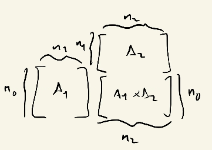
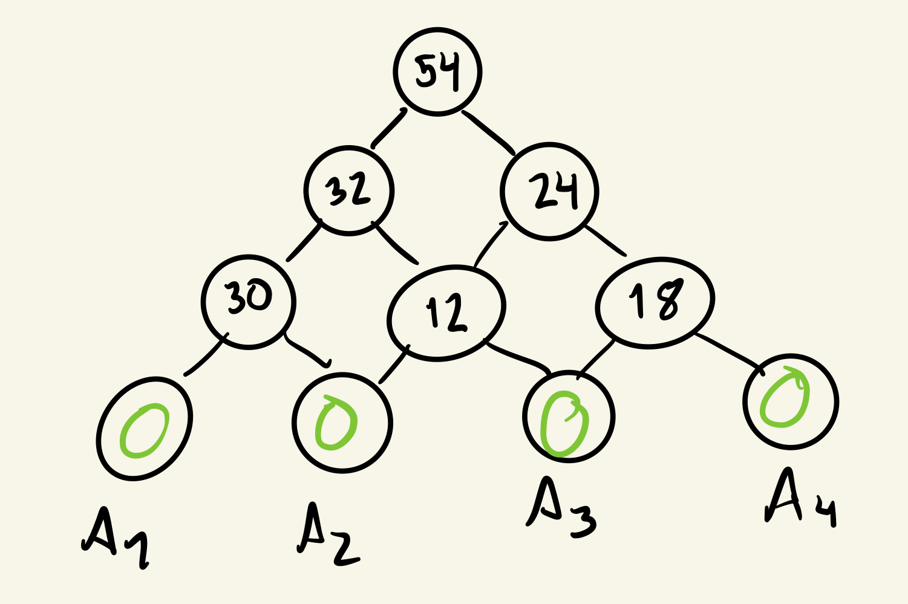

# Técnicas de Síntese de Algoritmos

```toc

```

Nesta cadeira são estudadas três principais técnicas para síntese de algoritmos:

- [**Dividir para Conquistar**](color:orange), abordada na [secção anterior](./teorema-mestre).
- [**Programação Dinâmica**](color:yellow), já abordada de relance na [secção introdutória](./introducao), aprofundada aqui.
- [**Algoritmos Greedy**](color:green), abordada pela primeira vez aqui.

## Programação Dinâmica

Vamos, então, aprofundar o tema da **programação dinâmica**.

:::info[Programação Dinâmica]

Corresponde a uma abordagem de resolução de problemas que transforma um problema bastante complexo em sequências de problemas mais simples (até, eventualmente, encontrar um caso base). O objetivo de estudar esta técnica passa por construir uma certa forma de olhar e analisar os problemas, com vista a encontrar padrões que nos ajudem a chegar a soluções ótimas para os mesmos.

Procuramos evitar repetir operações e resolver cada sub-problema uma única vez, por uma ordem ótima, geralmente guardando os dados que vamos obtendo numa dada estrutura - por exemplo, numa tabela.

:::

Pode ser útil rever o exemplo da [sequência de Fibonacci](./introducao#cálculo-dos-números-de-fibonacci) na secção introdutória destes resumos.

O problema sobre o qual nos vamos debruçar mais é o [**Problema da Mochila/Knapsack Problem**](color:orange). Trata-se de um problema clássico de introdução ao tema da programação dinâmica, dado que tem várias abordagens mais óbvias - e definitivamente não-ótimas - que são úteis de dissecar para perceber porque é que estão mal, e por onde podemos ir para obter uma abordagem melhor. Resta realçar que, nesta sub-secção, vamos apenas olhar para o problema da mochila **não fracionária** - não podemos colocar quantidades fracionárias de itens na mochila, ou se coloca todo ou não se coloca.

:::tip[Definição do problema]

Dados $n$ objetos (um objeto tem um valor, $v_i$, e um peso, $w_i$, associados) e uma mochila, como é que podemos maximizar o valor transportado pela mochila e respeitar o peso máximo, $W$, que a mochila pode guardar.

:::

### Problema da Mochila com Repetição

Vamos, primeiro, olhar para a versão do problema [**com repetição**](color:yellow) - o mesmo objeto pode ser adicionado à mochila mais do que uma vez - e para algumas estratégias que podiam, erradamente, ser escolhidas para o resolver.

:::details[Estratégia Errada 1 - Item de Maior Valor]

Tenhamos que a nossa mochila tem $W$ máximo 10, e 2 objetos:

- um primeiro objeto com 8kg e valor 8€;

- um segundo objeto com 5kg e valor 5€.

Numa tentativa inicial, podíamos pensar "bem, vamos adicionar os objetos por ordem decrescente do seu valor". Contudo, esta estratégia tem um contra-exemplo simples - considerando os objetos acima, e seguindo este raciocínio, adicionaríamos o objeto que vale 8€ à mochila. O algoritmo parava aí, porque não poderíamos adicionar mais nada sem exceder $W$. Contudo, essa não é a solução correta - dado que estamos na presença do problema com repetição, podíamos adicionar duas vezes o segundo objeto, ficando efetivamente com a mochila a guardar um valor maior, provando que a estratégia falha.

Pode não ter ficado claro, mas a estratégia não falha _só_ por estarmos na presença do problema com repetição - se tivéssemos um terceiro objeto, a pesar 4kg e a valer 4€, a estratégia também falharia, mesmo sem pensar em repetição.

:::

:::details[Estratégia Errada 2 - Item de Menor Peso]

Considerando, de novo, uma mochila com $W$ máximo 10, mas desta vez:

- um primeiro objeto com 1kg e a valer 1€;

- um segundo objeto com 10kg e a valer 20€.

Poderíamos, agora, pensar "vamos adicionar os objetos por ordem crescente de peso". Esta estratégia, contudo, também falha - aqui, ao adicionar sucessivamente o primeiro objeto, ficaríamos com a mochila a guardar 10€, e não os 20€ (a solução correta) caso tivéssemos optado por escolher uma vez o segundo objeto.

A estratégia falha também sem repetição - adicionando o primeiro objeto, de menor peso, já não podíamos adicionar mais nenhum, ficando a mochila a valer 1€, que claramente não é a solução correta.

:::

:::details[Estratégia Errada 3 - Item de Maior Densidade de Valor]

Por fim, consideremos uma mochila de $W$ máximo 5, e:

- um primeiro objeto com 3kg e a valer 6€;

- um segundo objeto com 4kg e a valer 7€.

Podíamos pensar "vamos adicionar os itens por ordem crescente de densidade de valor" - teoricamente, adicionaríamos os itens "mais importantes" de estarem na mochila primeiro. Contudo, não funciona bem assim - neste caso, adicionar-se-ia primeiro o primeiro objeto (a sua densidade é de 2€/kg, maior que a do segundo objeto), e não se poderia adicionar mais nenhum. Contudo, esta opção falharia, visto que assim a mochila ficaria com valor de 6€, quando a solução ótima seria a de escolher o segundo objeto uma vez, ficando a mochila a valer 7€.

:::

Como podemos observar, não aparenta haver uma [**escolha ótima**](color:orange) - não parece dar para afirmar "aquele objeto tem definitivamente de estar na mochila". Temos, portanto, de **olhar para todas as opções**.

Procuramos, em programação dinâmica, definir a quantidade que queremos recursivamente. Neste caso, será dado por $v[i, j]$, o valor máximo que é possível transportar se o peso limite é $j$, com $j \leq W$, e se apenas podem ser selecionados os objetos numerados de 1 a $i$. A solução ótima encontra-se em $v[n, W]$.

$$
v[i, j] = max(v[i - 1, j], v[i - 1, j - w_i] + v_i)
$$

Corresponde a algo como:

```cpp
#define max(a, b) (a > b ? a : b)

// Neste caso, a função retorna o valor máximo a colocar na mochila.
// Contudo, o algoritmo em si não implica retornar esse valor:
// Podíamos, por exemplo, fazer print da solução e retornar void.
int knapsack(std::vector<int> values, std::vector<int> weights, int maxWeight) {
  if (maxWeight == 0) return 0;

  int maxValue = 0;
  int numObjects = weights.size();
  for (int i = 0; i < numObjects; i++) {
    if (weights[i] <= maxWeight) {
      maxValue = max(maxValue, knapsack(values, weights, maxWeight - weights[i])) + values[i];
    }
  }

  return maxValue;
}

```

Esta é, contudo, uma solução péssima. Tendo $w$ como o peso máximo e $n$ como o número de objetos:

$$
T(w) \leq n \cdot T(w - 1) = n^2 \cdot T(w - 2) = ... = n^w
$$

<!-- Is this the correct way to put it? cc @diogotcorreia-->

Ou seja, a complexidade temporal da função é $O(n^w)$. Consideramos $T(w - 1), T((w - 1) - 1), \text{ etc }$ porque, no pior caso, estamos sempre a retirar objetos com peso 1 (considerando apenas peso naturais), e daí podemos retirar a natureza exponencial do problema. A primeira chamada pode correr $n$ vezes, mas cada uma das seguintes também pode correr $n$ vezes, e assim sucessivamente, $w$ vezes.

<!-- Is this the correct way to put it? cc @diogotcorreia-->

Ora, mas [**o número de sub-problemas distintos é $n \cdot W$**](color:yellow) (corresponde ao número de entradas numa possível tabela de resolução do problema com DP). Assim sendo, podemos definitivamente obter uma solução mais eficiente para o problema, **sem fazer os mesmos cálculos mais do que uma vez**, coisa que acontece na implementação acima.

```cpp
#define max(a, b) (a > b ? a : b)

int knapsack(std::vector<int> values, std::vector<int> weights, int maxWeight) {
  int numElements = weights.size();
  // inicializar um vetor para substituir as chamadas recursivas
  // todos os indices sao inicializados a 0
  std::vector<int> k = std::vector<int>(maxWeight + 1, 0);
  for (int w = 1; w <= maxWeight; w++) {
    k[w] = k[w - 1]; // o valor guardado na mochila nunca é menor que o anterior
    for (int i = 0; i < numElements; i++) {
      if (weights[i] <= w) {
        k[w] = max(k[w], k[w - weights[i]] + values[i]);
      }
    }
  }

  return k[w];
}

```

É possível que ver o vídeo seguinte e seguir o algoritmo ajude:

::youtube{#8LusJS5-AGo}

Este algoritmo corre exatamente $n \cdot W$ vezes - $\Theta (n \cdot W)$ - já que não temos nenhum `break` a meio do loops nem nenhuma chamada recursiva a meio. É, portanto, uma abordagem muito melhor do que a exponencial anterior.

### Problema da Mochila sem Repetição

O problema da mochila sem repetição permite-nos olhar para o problema de uma maneira diferente - aqui, vamos, na recursão, procurar o valor máximo que se consegue transportar na mochila _até a um certo índice $i$_ - no problema com repetição não podiamos fazê-lo, dado que um mesmo objeto podia ser contado duas vezes. Podemos, então, definir a quantidade recursiva como

$$
k(w, i) = \begin{cases}
0, &\text{ se } w = 0 \vee i = 0\\
max\{k(w, i - 1), k(w - w_i, i - 1) + v_i\} &\text{ caso contrário}
\end{cases}
$$

O segundo ramo corresponde a "vou ou não usar o elemento de índice $i$"?

Em código, corresponderia a algo deste género:

```cpp
#define max(a, b) (a > b ? a : b)

int knapsack(std::vector<int> values, std::vector<int> weights, int maxWeight) {
  int numElements = weights.size();
  std::vector<int> prevColumn = std::vector<int>(maxWeight + 1, 0);
  std::vector<int> currColumn = std::vector<int>(maxWeight + 1, 0);

  for (int i = 0; i < numElements; i++) {
    for (int w = 1; w <= maxWeight; w++) {
      if (weights[i] <= w) {
        currColumn[w] = currColumn[w - 1];
        currColumn[w] = max(
          prevColumn[w],
          prevColumn[w - weights[i]] + values[i]
        );
      }
    }
    prevColumn = currColumn;
  }

  return currColumn.back();
}
```

Aqui, o algoritmo volta a ser $\Theta(n \cdot W)$.

:::details[Exemplo da aplicação do algoritmo]

Consideremos um peso máximo de 8kg, e dois objetos:

- um primeiro com 5kg, a valer 6€;
- um segundo com 4kg, a valer 4€.

A tabela correspondente à aplicação do algoritmo seria:

|     | 0   | 1   | 2   |
| --- | --- | --- | --- |
| 0   | 0   | 0   | 0   |
| 1   | 0   | 0   | 0   |
| 2   | 0   | 0   | 0   |
| 3   | 0   | 0   | 0   |
| 4   | 0   | 0   | 4   |
| 5   | 0   | 6   | 6   |
| 6   | 0   | 6   | 6   |
| 7   | 0   | 6   | 6   |
| 8   | 0   | 6   | 6   |

Devemos calcular a matriz **por coluna** - se olharmos para o código, podemos observar que temos várias vezes $i - 1$ - só precisamos da coluna anterior para calcular a atual, o que poupa trabalho.

Para calcular $k(6, 2)$, por exemplo, teríamos de ver que se trata do segundo caso (nem $w$ nem $i$ são 0).  
De seguida, e já no segundo caso, teríamos então de ver o máximo entre $k(6, 2 - 1 = 1)$ e $k(6 - w_2, 2 -1) + v_2 = k(6 - 4 = 2, 1) + 4$. Temos que $(6,1)$, previamente calculado, é 6, e que $k(2, 1)$ é 0 - temos, então, de ver o máximo entre 6 e 0 + 4, e preenchemos a entrada com esse valor (6). O preenchimento de qualquer entrada segue uma lógica semelhante.

:::

Este problema podia, claro, ser resolvido recorrendo à [memoization](./introducao#implementação-2-memoization-e-programação-dinâmica), caso optássemos por passar a tabela como argumento da função e a fôssemos preenchendo. O trade-off seria que a memoization, apesar de só calcular o que realmente é necessário (que, no pior caso, é tudo), ocupa mais espaço $(\Theta(W) \text{ vs } \Theta(n))$.

### Maior Sub-sequência Comum (LCS)

:::info[Definição do problema]

Dadas duas sequências, $X$ e $Y$, encontrar a maior sub-sequência comum entre elas. **Não precisam de ser contíguas**, isto é, tendo "ABC" e "AC", a maior sub-sequência comum entre ambas as sequências é "AC", apesar de "A" e "C" não aparecerem consecutivamente na primeira sequência.

A solução para este problema é a chave para ferramentas como o [diff](https://www.man7.org/linux/man-pages/man1/diff.1.html), [git](https://en.wikipedia.org/wiki/Git), entre outras ferramentas que requerem comparação de dados.

:::

Não podemos, obviamente, verificar literalmente todas as sub-sequências possíveis - cada sequência tem $2^{length}$ sub-sequências, tornando-se impraticável fazer a comparação. Podemos, contudo, procurar tirar algumas conclusões sobre o problema:

- se duas sequências têm o último elemento igual, então esse elemento faz [**necessariamente**](color:yellow) parte da LCS, e procuramos os próximos elementos que fazem parte da LCS "cortando" o último elemento de cada sequência;

- caso não sejam iguais, então das duas uma:

  - procuramos a maior sub-sequência comum "cortando" o último elemento da primeira subsequência;

  - procuramos a maior sub-sequência comum "cortando" o último elemento da segunda subsequência.

Em ambos os casos, voltamos a repetir estes passos sucessivamente, até chegar ao caso base (onde já não podemos cortar mais elementos).

Podemos definir esta recursão tal que, tendo duas sequências $X$ e $Y$:

$$
c(i, j) = \begin{cases}
0 &\text{se } i = 0 \vee j = 0\\
c(i - 1, j - 1) + 1 &\text{se } X[i] = Y[j]\\
max\{c(i - 1, j), c(i, j - 1)\} &\text{se } X[i] \neq Y[i]
\end{cases}
$$

Onde aqui $i$ e $j$ correspondem, respetivamente, a índices de elementos de $X$ e $Y$.

Utilizando programação dinâmica, podemos implementar um algoritmo que resolve este problema em $\Theta(nm)$, onde $n$ e $m$ são os comprimentos de cada sequência:

```cpp
#define max(a, b) (a > b ? a : b)

int lcs(std::string x, std::string y) {
  std::vector<std::vector<int>> lengths =
    std::vector<std::vector<int>>(x.size() + 1, std::vector<int>(y.size() + 1, 0));
  int lenX = x.size();
  int lenY = y.size();

  for (int i = 0; i <= lenX; i++) {
    for (int j = 0; j <= lenY; j++) {
      if (i == 0 || j == 0) {
        lengths[i][j] = 0;
      } else if (x[i - 1] == y[j - 1]) {
        lengths[i][j] = lengths[i - 1][j - 1] + 1;
      } else {
        lengths[i][j] = max(lengths[i - 1][j], lengths[i][j - 1]);
      }
    }
  }

  return lengths[lenX][lenY];
}
```

Podemos observar a matriz resultante de resolver o problema da LCS das sequências "BDCABA" e "ABCBDAB":

|     |     | B   | D   | C   | A   | B   | A   |
| --- | --- | --- | --- | --- | --- | --- | --- |
|     | 0   | 0   | 0   | 0   | 0   | 0   | 0   |
| A   | 0   | 0   | 0   | 0   | 1   | 1   | 1   |
| B   | 0   | 1   | 1   | 1   | 1   | 2   | 2   |
| C   | 0   | 1   | 1   | 2   | 2   | 2   | 2   |
| B   | 0   | 1   | 1   | 2   | 2   | 3   | 3   |
| D   | 0   | 1   | 2   | 2   | 2   | 3   | 3   |
| A   | 0   | 1   | 2   | 2   | 3   | 3   | 4   |
| B   | 0   | 1   | 2   | 2   | 3   | 4   | 4   |

Aqui, não podemos escolher preencher a matriz só recorrendo à última coluna (como no último problema que tinhamos visto), pelo que a complexidade especial passa, necessariamente, por $\Theta(nm)$. Olhando para cada entrada da matriz, podemos ainda observar que o algoritmo é respeitado - caso estejamos na presença de 2 letras iguais, a entrada cresce em 1 sem depender dos elementos à sua esquerda/acima dela; caso contrário, está diretamente dependente do máximo entre esses dois elementos.

### Multiplicação de Cadeias de Matrizes

O problema colocado é, dado um número arbitrário de matrizes (por uma certa ordem), descobrir a maneira mais eficiente (menor número de operações) para calcular o seu produto encadeado. Por exemplo, dadas três matrizes $A_1, A_2, A_3$, fazer o seu produto pela ordem $(A_1 \cdot A_2) \cdot A_3$ é diferente de fazer o produto pela ordem $A_1 \cdot (A_2 \cdot A_3)$ - consoante a colocação dos parêntesis, o custo muda.

No caso exposto acima, o custo varia entre:

- $(n_0 \cdot n_1 \cdot n_2) + n_0 \cdot n_2 \cdot n_3$

- $(n_1 \cdot n_2 \cdot n_3) + n_0 \cdot n_1 \cdot n_3$

Temos, tendo duas matrizes $A_1$, $n_0 \text{ x } n_1$, e $A_2$, $n_1 \text{ x } n_2$, que o número de operações necessárias para fazer o seu produto é $n_0 \cdot n_1 \cdot n_2$:



O número de colocação de parêntesis cresce **exponencialmente** com o número de matrizes, pelo que, mais uma vez, não será célere experimentar todas as opções. Devemos, portanto, definir a recursão do problema, e procurar resolvê-lo utilizando programação dinâmica.

Tenhamos que $c(i, j)$ corresponde ao número mínimo de operações (produtos escalares) necessários para calcular os produtos das matrizes $A_i$ à $A_j$:

$$
c(i, j) = \begin{cases}
0 &\text{se } i = j\\
min_{i \leq k < j}\{c(i, k) + c(k + 1, j) + n_{i - 1} n_k n_j \} &\text{caso contrário}
\end{cases}
$$

Este segundo ramo equivalente a encontrar a colocação de parêntesis ótima para que um produto

$$
(A_i \cdot ... \cdot A_k)(A_{k + 1} \cdot ... \cdot A_j)
$$

tenha o menor custo operacional associado possível.

A solução proposta (utilizando DP) tem complexidade temporal $\Theta(O(n^3))$, podendo, contudo, ser melhorada para uma solução quadrática.

:::details[Exemplo da aplicação do algoritmo]

Tenhamos 4 matrizes:

$$
A_1, 5 \text{ x } 2, \quad A_2, 2 \text{ x } 3, \quad A_3, 3 \text{ x } 2, \quad A_4, 2 \text{ x } 3
$$

O algoritmo de resolução do problema irá criar uma matriz tal que:

|     | 1   | 2   | 3   | 4   |
| --- | --- | --- | --- | --- |
| 1   | 0   | 30  | 32  | 54  |
| 2   | -   | 0   | 12  | 24  |
| 3   | -   | -   | 0   | 18  |
| 4   | -   | -   | -   | 0   |

Podemos pensar nas linhas como a "matriz mais à esquerda" do produto e nas colunas como a "matriz mais à direita". Assim, a entrada $1, 4$ da matriz corresponde ao custo mínimo de realizar o produto $A_1 \cdot ... \cdot A_4$, por exemplo.

A diagonal principal é, claro, composta por zeros - a matriz não se irá multiplicar por si própria.

A diagonal seguinte corresponde aos produtos dois a dois entre matrizes - a entrada $1, 2$ corresponde ao produto matricial entre $A_1$ e $A_2$, sendo que esse é "direto".

A partir daí, a tarefa recai em pegar nos dois elementos "filhos" (esta noção pode ser melhor observada na árvore abaixo) e calcular qual será o menor custo, somando o custo dos filhos ao custo que o produto seguinte terá de ter. Por exemplo:

$$
A_1 \cdot A_2 \cdot A_3:\\
(A_1 \cdot A_2) \cdot A_3 = 30 + 5\cdot 3\cdot 2 = 60\\
A_1 \cdot (A_2 \cdot A_3) = 12 + 5\cdot 2\cdot 2= 32\\
$$

Aqui, optamos pela segunda opção, com custo menor.
O resto do algoritmo seguirá uma lógica semelhante.



:::

## Algoritmos Greedy

:::info[Algoritmos Greedy]

Corresponde a uma abordagem de resolução de problemas que escolhe **sempre** a melhor opção disponível atualmente - diferente da programação dinâmica usual, onde não temos necessariamente uma escolha ótima e temos sempre de ver todos os caminhos que podemos percorrer. São, geralmente, mais fáceis de explicar (têm uma escolha lógica a cada passo).

A opção ótima escolhida num dado momento pode não ser a que leve ao melhor resultado; contudo, mesmo que isso aconteça, o algoritmo nunca volta atrás. Escolhe, portanto, a opção ótima [**localmente**](color:green), que não é necessariamente a melhor opção [**global**](color:yellow).

Em Matemática Discreta, encontrámos um algoritmo que segue a abordagem greedy - o [Algoritmo de Dijkstra](../md/kruskal-dijkstra#algoritmo-de-dijkstra).

:::

Estão, de seguida, alguns problemas cuja resolução pode ajudar a perceber a abordagem greedy.

### Problema da Mochila Fracionária sem Repetição

Voltamos, aqui, ao problema da mochila sem repetição, com um _twist_ - desta vez, podemos colocar quantidades fracionárias de itens na mochila. Isto é, podemos colocar, por exemplo, meio objeto na mochila - coisa que não podia acontecer nas variantes do problema apresentadas acima.

Tenhamos, por exemplo, uma mochila que pode levar até 50kg, e três objetos:

- um primeiro objeto que pesa 10kg e vale 60€;
- um segundo objeto que pesa 20kg e vale 100€;
- um terceiro objeto que pesa 30kg e vale 120€;

Será que podemos encontrar uma **escolha _greedy_** aqui? Bem, neste caso, como podemos "dividir" objetos, existe uma escolha ótima a cada passo - colocar os itens na mochila por ordem decrescente de densidade (€/kg). Tentamos sempre colocar o objeto inteiro. Quando não pudermos, o algoritmo para - colocamos a fração que podemos, e a partir daí a mochila está no seu limite de peso.

Temos que a densidade de cada um dos objetos acima é, respetivamente, 6€/kg, 5€/kg e 4€/kg. Agora, teríamos de os ordenar por ordem decrescente de densidade (fantástico, já estão), e passar à fase "relevante" do algoritmo: colocá-los na mochila. Dar-se ia tal que:

- num primeiro momento, a mochila ainda pode levar mais 50kg, e o objeto com maior densidade só pesa 10kg, pelo que o podemos colocar todo. A mochila fica a valer 60€, e pode, agora, levar mais 40kg;

- num segundo momento, a mochila ainda pode levar mais 40kg, e o objeto com mais densidade (restante) só pesa 20kg, pelo que o podemos colocar todo. A mochila fica a valer 160€, e pode, agora, levar mais 20kg;

- num terceiro e último momento, a mochila ainda pode levar mais 20kg. Contudo, o próximo objeto pesa 30kg, pelo que não o podemos colocar todo - colocamos 2/3 da sua quantidade, e o respetivo valor também é cortado (são colocados 80€ do objeto 3). A mochila passa, assim a valer 240€, e a mochila está completamente cheia. Pelo que o algoritmo para.

O código para este algoritmo seria qualquer coisa como:

```cpp
int fracKnapsack(std::vector<int> values, std::vector<int> weights, int maxWeight) {
  // Assumimos, aqui, que os objetos estão ordenados por ordem decrescente de densidade
  int maxValue = 0;
  for (uint i = 0; maxWeight != 0 && i < weights.size(); i++) {
    if (maxWeight >= weights[i]) {
      maxWeight -= weights[i];
      maxValue += values[i];
    } else {
      float ratio = (float) maxWeight / weights[i];
      maxValue += values[i] * ratio;
      maxWeight = 0;
    }
  }
  return maxValue;
}
```

A complexidade é linear, $O(n)$ (de realçar que, sem a condição de paragem `maxWeight == 0` seria $\Theta(n)$, dado que correria _sempre_ as $n$ iterações).

### Seleção de Atividades

---

TODO - adicionar cenas
