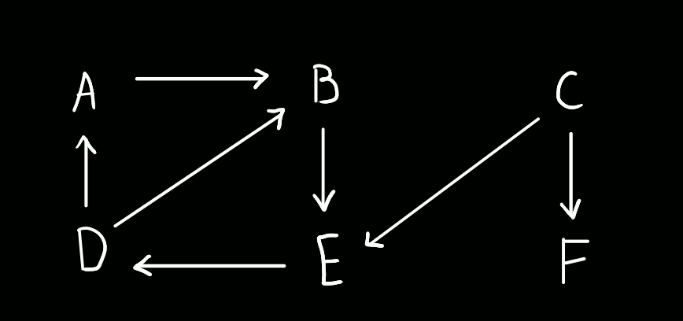

# Algoritmos Elementares sobre Grafos

```toc

```

Vamos procurar rever e aprofundar conceitos previamente abordados em IAED, tais
como DFS (incluindo ordenação topológica e componentes fortemente ligados) e BFS.

## DFS - _Depth First Search_

Consiste num algoritmo recursivo que utiliza a noção de _backtracking_. Procura esgotar
todos os caminhos possíveis em frente, voltando para trás quando já não há mais possibilidades de seguir em frente.

:::details[Exemplo simples da execução do algoritmo]

Consideremos o seguinte grafo:



Tenhamos ainda que, em caso de empate entre dois vértices, o algoritmo deve escolher
o vértice que vem antes por ordem alfabética. Começaremos no vértice A.

- Do vértice A, podemos ir apenas para o vértice B. (_timestamp_ 1 a "abrir" A)

- Do vértice B, podemos ir apenas para o vértice E. (_timestamp_ 2 a "abrir" B)

- Do vértice E, podemos ir apenas para o vértice D. (_timestamp_ 3 a "abrir" E)

- Do vértice D, podemos ir para os vértices A e B. Contudo, ambos já foram visitados,
  pelo que não temos para onde ir, e assim que descobrimos D, trancamo-lo. (_timestamp_ 4 a "abrir" D, _timestamp_ 5 a "fechar" D)

(começa aqui um _backtracking_, após o "fecho" de um vértice)

- Do vértice E não temos para onde ir, pelo que o trancamos. (_timestamp_ 6 a "fechar" E)

- Do vértice B não temos para onde ir, pelo que o trancamos. (_timestamp_ 7 a "fechar" B)

- Do vértice A não temos para onde ir, pelo que o trancamos. (_timestamp_ 8 a "fechar" A)

Trancámos, então, o vértice onde começámos a procurar - restam, contudo, vértices
por explorar. Assim sendo, começamos uma nova procura, desta vez pelo vértice C.

- Do vértice C, podemos ir apenas para os vértices E e F. Contudo, E já foi visitado,
  pelo que optamos por ir para F. (_timestamp_ 9 a "abrir" C)

- Do vértice F não temos para onde ir, pelo que o trancamos. (_timestamp_ 10 a "abrir" F, _timestamp_ 11 a "fechar" F)

- Do vértice C não temos para onde ir, pelo que o trancamos. (_timestamp_ 12 a "fechar" C)

Aqui, terminamos a procura - não restam vértices por explorar.

A tabela abaixo indica os tempos de descoberta e fecho de cada vértice:

|       | A   | B   | C   | D   | E   | F   |
| ----- | --- | --- | --- | --- | --- | --- |
| $d_i$ | 1   | 2   | 9   | 4   | 3   | 10  |
| $f_i$ | 8   | 7   | 12  | 5   | 6   | 11  |

(Aqui, $d_i$ corresponde ao tempo de descoberta e $f_i$ ao tempo de fecho)

Ao resolver um exercício de procura DFS, provavelmente optar-se-ia por desenhar algo deste género:


Podíamos ainda, no fim, desenhar a **floresta DFS** do grafo acima. O conceito será abordado mais abaixo.

:::

No algoritmo que estudámos em aula, cada vértice do grafo tem algumas propriedades que facilitam o desenrolar da DFS:

- cada vértice tem um pai, `pi`, inicialmente nulo (`Nil`, no pseudocódigo), que corresponde ao seu predecessor na procura.

- cada vértice tem uma cor - `White`, `Gray` ou `Black`. Um vértice é `White` antes
  de ser descoberto, `Gray` entre descoberta e fecho, e `Black` quando está fechado.

- cada vértice tem um tempo de descoberta e um tempo de fecho.

Tendo como argumento um grafo $G$, o pseudocódigo do algoritmo da DFS pode ser tal que:

```rust
// every graph G has a set of vertices V
DFS(G)
  for v in G.V // loop 1
    v.color = White
    v.discovery = 0
    v.closure = 0
    v.pi = Nil
  time := 0
  for v in G.V // loop 2
    if v.color == White
      DFS_Visit(G, v)

DFS_Visit(G, v)
  time = time + 1
  v.discovery = time
  v.color = Gray
  for w in G.Adj[v] // loop 3
    if w.color == White
      w.pi = v
      DFS_Visit(G, w)
  time = time + 1
  v.closure = time
  v.color = Black
```

As complexidades temporais ([**agregadas**](color:orange) - durante todo o decorrer do algoritmo) de cada loop acima são:

- Loop 1 - $\Theta(V)$
- Loop 2 - $\Theta(V)$
- Loop 3 - $\Theta(V + E)$

Onde $V$ é o número de vértices do grafo e $E$ o número de arcos/arestas.

A complexidade do primeiro loop é trivial, o loop é claramente executado apenas uma
vez para cada vértice. A do segundo também segue a mesma lógica, sendo executado uma
vez para cada vértice. A do terceiro não é óbvia. Temos cada, para cada vértice,
`DFS_Visit` é chamada apenas uma vez (porque assim que deixa o estado `White`, não
volta a poder ter esse estado). Além disso, para cada vértice, o loop é executado
$E$ vezes, uma vez para cada arco/aresta que liga aquele vértice a outro. Isto,
claro, considerando todo o decorrer do algoritmo - foi assim que a complexidade do algoritmo foi abordada em aula.

Resta ainda realçar que foi utilizado $\Theta$ e não $O$ - os loops, aqui, são executados
_exatamente_ com aquela complexidade, sempre, qualquer que seja o grafo-argumento do algoritmo.

A complexidade temporal total do algoritmo é, portanto, $\Theta(V + E)$.

:::info[Floresta DFS]

Uma [**árvore DFS**](color:yellow) corresponde à representação de uma procura DFS
pela ordem em que os vértices são descobertos. A raiz da árvore é o vértice inicial.
Um vértice pode ter mais do que um filho, caso haja mais que um vértice a ser descoberto
a partir dele, mas apenas um pai. O conjunto de árvores DFS de um grafo diz-se uma [**floresta DFS**](color:orange).

[**Pode existir mais que uma floresta DFS possível num grafo.**](color:green)

:::

Temos, abaixo, dois exemplos de grafos com respetivas florestas DFS:

:::details[Exemplo 1 - Floresta com uma árvore]


:::

:::details[Exemplo 2 - Floresta com mais do que uma árvore]


:::

:::details[Exemplo 3 - Variação do exemplo anterior]

Podemos, ainda demonstrar que há mais do que uma floresta possível para um dado grafo.
Pegando no grafo do exemplo anterior, e fazendo uma DFS diferente (começando, por exemplo, em C):


:::

Podemos, na floresta DFS, representar vários tipos de arcos (arcos estes que
representam arcos do próprio grafo):

- **Tree edges** - as arestas "normais" da árvore, consecutivas, de nó em nó.

- **Forward edges** - arestas "para a frente", não consecutivas.

- **Back edges** - arestas "para trás", não consecutivas.

- **Cross edges** - arestas "cruzadas". Ao contrário das outras arestas, estas
  **não correspondem** a descendentes/ascendentes diretos - podemos pensar nelas
  como relações entre primos, tios, etc.

:::details[Exemplo - Tipos de Edges]

Pegando no grafo do Exemplo 1 acima:


[**Nem todas as arestas do grafo estão representadas**](color:red) nesta árvore DFS -
estão apenas representadas as arestas "normais" da árvore - **tree edges**.
As restantes arestas são, respetivamente (olhando para o grafo original):

- $AF$ - Forward edge
- $FB$ - Back edge
- $DA$ - Back edge
- $DH$ - Cross edge
- $HG$ - Cross edge

Poderiam ser representadas tal que:


:::

Em termos de tempos de descoberta, para cada tipo de aresta, temos que (tendo dois vértices, $u$ e $v$):

- temos um tree ou um forward edge de $u$ para $v$ caso $d(u) < d(v) < f(v) < f(u)$.

- temos um back edge de $u$ para $v$ caso $d(v) < d(u) < f(u) < f(v)$.

- temos um cross edge de $u$ para $v$ caso $d(v) < f(v) < d(u) < f(u)$.

Antes de abordar a ordenação topológica e os componentes fortemente ligados, é relevante
enunciar o **Teorema do Caminho Branco**.

:::info[Teorema do Caminho Branco]

Tendo dois vértices $u$ e $v$, temos que $v$ é descendente de $u$ se e apenas se,
no momento em que $u$ é descoberto, existir um caminho de vértices brancos - por descobrir - a ligar $u$ a $v$.

:::

Podemos, ainda, provar que **um grafo tem um caminho circular se e apenas se a DFS
revela um arco para trás**. A prova encontra-se abaixo.

:::details[Prova do Lema acima]

Vamos ter, portanto, de procurar provar a equivalência apresentada. Provar a implicação
da direita para a esquerda é fácil - temos que uma back edge só existe entre parentes diretos,
pelo que se esta existir uma back edge $(u, v)$, então podemos começar um caminho
que parte de $u$, chega a $v$ e volta a $u$, estando, portanto, na presença de um ciclo.
A parte complicada reside em provar a implicação da esquerda para a direita -
**se um grafo tem um caminho circular, então a DFS revela uma back edge**.

Tenhamos um qualquer caminho **circular** do tipo $(v_1, ..., v_n, v_1)$.
Podemos procurar ordená-lo por ordem crescente de tempo de descoberta - ficaríamos com
um caminho $(v'_1, ..., v'_n, v'_1)$. Temos, pelo teorema do caminho branco, que
$v'_2, ..., v'_n$ são todos descendentes de $v'_1$ na floresta DFS - assim sendo,
$(v'_n, v'_1)$ é necessariamente uma back edge.

:::

### [Ordenação Topológica](color:orange)

:::info[Ordenação Topológica]

Sequência que contém todos os vértices de um grafo $G(V, E)$ apenas uma vez, tal que
se $(u, v) \in E$, então $u$ aparece antes de $v$ na ordem topológica.
Devido a esta última propriedade, só podemos realizar ordenações topológicas em **grafos acíclicos**.

:::

Segundo o professor, para resolver exercícios associados a ordenação topológica,
pode dar jeito desenhar o grafo na horizontal, como pode ser observado abaixo:


Podemos, aqui, admitir que uma ordenação topológica possível (**não a única**) é
$ABCDEFGH$, já que ao escrever os arcos do grafo, estes apontam todos para a frente:


:::tip[Lema]

Se $G(V, E)$ é um DAG (grafo acíclico dirigido) e $(u, v) \in E$, então $v$ é fechado antes de $u$.

- Caso $d(u) < d(v)$, então $d(u) < d(v) < f(v) < f(u)$, logo $v$ é fechado antes de $u$.

- Caso contrário, então $d(v) < f(v) < d(u) < f(u)$[\*](color:orange), logo $u$ é fechado antes de $v$.

[\*](color:orange) podemos afirmá-lo já que, caso contrário, poder-se ia descobrir
primeiro $v$ e depois $u$, antes de se fechar $v$. Como há um arco de $u$ para $v$,
teríamos encontrado um ciclo - o grafo, contudo, é um DAG, acíclico por definição - impossível de acontecer.

:::

Uma ordenação topológica pode, então, ser dada pela **ordem decrescente de tempos
de fecho** de uma DFS a um dado grafo. Por exemplo, dado o grafo abaixo e respetiva DFS a começar em $A$:


A ordenação topológica via ordem decrescente de tempos de fecho é dada por $GDEHABFC$.
Podemos, claro, confirmar que não há back edges (para confirmar que a ordenação topológica está feita corretamente):


### [SCCs - Componentes Fortemente Ligados](color:green)

:::info[SCC]

Dado um grafo $G(V, E)$, um conjunto de vértices $\overset{\wedge}{V}$ diz-se um SCC,
componente fortemente ligado, de $G$ se e apenas se:

- $\forall_{u, v} \in \overset{\wedge}{V}, u \to v \wedge v \to u$ (por esta última
  parte entenda-se "há um caminho de $u$ para $v$ e um de $v$ para $u$").
  Colocando em termos mais simples, escolhendo um vértice qualquer do SCC, podemos
  criar um caminho que chegue a todos os outros vértices do mesmo SCC.

- É **maximal**, isto é, não está contido em nenhum outro SCC - não existe um $\overset{\wedge}{V'}$ tal que $\overset{\wedge}{V}$ é um subconjunto seu.

:::

Por exemplo, dado o grafo abaixo:


Temos dois SCCs - $ABC$ e $D$. $D$ não pertence a $ABC$ porque, apesar de ser possível
construir um caminho de $D$ para $ABC$, o contrário não se verifica.

Podemos desenhar um **grafo dos componentes**.

:::info[Grafo dos Componentes]

Seja $G(V, E)$ um grafo dirigido. O grafo dos componentes de $G$ é dado por $G(V_{SCC}, E_{SCC})$, onde:

- $V_{SCC}$ é o conjunto dos SCCs de $G$.

- $E_{SCC}$ é o conjunto de todas as arestas de $G$ que ligam um SCC a outro.
  Colocando a afirmação de forma mais formal, temos $\{(c_1, c_2) | \exists_{u, v}: u \in c1 \wedge v \in c_2 \wedge (u, v) \in E\}.$
  De realçar que pode haver mais que uma aresta a ligar dois componentes.

O tempo de descoberta de um componente corresponde ao tempo de descoberta do vértice
que lhe pertence que é descoberto primeiro. O tempo de fecho de um componente corresponde
ao tempo de fecho do vértice que lhe pertence que é fechado por último.

Os componentes de um grafo e os do seu grafo **transposto** (com todos os arcos no
sentido contrário) são necessariamente iguais.

:::

:::details[Exemplo - Grafo dos Componentes]

Dado o grafo abaixo:


O grafo dos componentes correspondente é dado por:


:::

Os grafos dos componentes gozam de um par de propriedades interessantes.

A primeira diz-nos que, dados dois vértices $u$ e $v$ de $G$, se $u$ pertence a um
SCC $C_1$ e $v$ pertence a um outro SCC $C_2$, e existe uma aresta $u, v$, então
não pode existir qualquer aresta tal que $x \in C_1 \wedge y \in C_2 \wedge (y, x) \in E$ -
caso contrário, nenhum dos componentes seria maximal, já que poderíamos fazer caminhos
entre todos os vértices de ambos os componentes em questão. Esta propriedade permite-nos,
ainda, afirmar que o grafo dos componentes é um DAG, necessariamente.

A segunda diz-nos que, tendo dois SCCs, $C_1$ e $C_2$, se temos uma aresta que vai
de um qualquer vértice de $C_1$ para um qualquer vértice de $C_2$, então obrigatoriamente
$f(C_1) > f(C_2)$. A prova encontra-se abaixo.

:::details[Prova da segunda propriedade - Grafo dos Componentes]

Temos 2 casos em que precisamos de nos focar: $d(C_1) < d(C_2)$ e $d(C_1) > d(C_2)$.

- No primeiro caso, descobrimos $C_1$ antes de $C_2$. Seja $u$ o primeiro vértice de
  $C_1$ a ser descoberto. No momento em que é descoberto, existe necessariamente
  (porque temos um caminho de $C_1$ para $C_2$) um caminho de vértices brancos a
  ligar $u$ a todos os vértices de $C_2$. Assim sendo, concluímos, pelo Teorema do
  Caminho Branco, que todos os vértices de $C_2$ são, nesta DFS, descendentes de $u$,
  pelo que o tempo de fecho de $C_2$ é necessariamente menor que o tempo de fecho
  de $u$ e, por consequência, que o tempo de fecho de $C_1$.

- No segundo caso, descobrimos $C_2$ antes de $C_1$. Como, pela propriedade 1, não
  podemos ter um caminho de $C_2$ para $C_1$, podemos garantir que o tempo de fecho
  de $C_2$ é anterior ao tempo de descoberta de $C_1$ e, por consequência, anterior ao tempo de fecho de $C_1$.

A propriedade 2 fica, então, provada.

:::

O algoritmo para chegar aos SCCs de um grafo é bastante simples:

- Fazer uma DFS normal, guardando uma lista com os vértices ordenada de modo decrescente pelos respetivos tempos de fim.
- Transpor o grafo - alterar o sentido de todos os seus arcos.
- Fazer outra DFS (ao grafo transposto), seguindo desta vez a ordem decrescente que
  guardámos no primeiro passo. A ordem decrescente é relevante ao escolher a raiz
  do caminho, mas aquando da exploração do caminho em si, não importa - podemos escolher qualquer vértice.

[**Cada árvore da floresta DFS do grafo transposto corresponderá a um SCC do grafo original**](color:orange).

A complexidade temporal de ambas as DFS é $\Theta(V + E)$. A da transposição é
$\Theta(E)$ (considerando que a representação das arestas é feita através de uma
lista de adjacências). Assim, a complexidade temporal do algoritmo como um todo será $\Theta(V + E)$.

:::details[Exemplo da aplicação do algoritmo]

Tenhamos o grafo abaixo (com DFS inicial já realizada, respetivos tempos de descoberta e de fecho indicados):


Os vértices, por ordem decrescente de tempo de fim, serão então $GIJLKHDCFBEA$.

O respetivo grafo transposto será o seguinte:


Por fim, a DFS realizada por ordem decrescente dos tempos de fim da DFS inicial é tal que:


Assim sendo, a floresta DFS final é:


Temos 5 árvores na floresta DFS, pelo que temos 5 SCCs. O grafo dos componentes correspondente é, então:


:::

## BFS - _Breadth First Search_

É, tal como a DFS, um algoritmo para travessia de grafos. Se na DFS o objetivo prendia-se
em percorrer os caminhos em profundidade, até eventualmente ter de voltar para trás
(_backtracking_), na BFS o objetivo passa por percorrer os caminhos em largura.
Utiliza a noção de fila (vulgo queue) para guardar os vértices a serem explorados
num futuro próximo. O próximo vértice a ser explorado é sempre o que está no início da fila.
De realçar ainda que utilizamos uma fila regular, do tipo FIFO, _first in first out_.

Começamos na raiz, com a fila inicialmente vazia, e vamos adicionando os vértices adjacentes ao vértice atual à fila.
Fazemo-lo sucessivamente, extraindo sempre o primeiro elemento da fila e repetindo
o processo até a fila estar vazia - quando estiver, a procura está concluída.

O pseudocódigo do algoritmo é o seguinte:

```rust
BFS(G, v) // v é o vértice-raiz da procura
  for each n in V except v
    n.color = white
    n.distance = inf // inicialmente a infinito
    n.pi = nil
  v.color = gray
  v.distance = 0
  v.parent = nil
  Q := new queue
  Q.enqueue(v)
  while Q is not empty
    u := Q.dequeue()
    for each n in Adj(u)
      if n.color == white
        n.color = gray
        n.distance = u.distance + 1
        n.pi = u
        Q.enqueue(n)
    u.color = black
```

:::details[Exemplo de Aplicação do Algoritmo]

Vamos utilizar um grafo não dirigido, como o seguinte:


O decorrer do algoritmo é:

- Começamos por explorar $S$ - tem adjacências $R$ e $W$, pelo que adicionamos esses vértices à queue.
- Exploramos $R$, por ser o próximo vértice da queue, e adicionamos $V$ (a sua única adjacência) à queue.
- Exploramos $W$, e adicionamos $T$ e $X$ à queue.
- Exploramos $V$, que não tem qualquer adjacência, pelo que não se adiciona nada à queue.
- Exploramos $T$, que tem como adjacências $X$ e $U$. $X$ já foi adicionado à queue por $W$, pelo que apenas $U$ é adicionado.
- Exploramos $X$, que tem como adjacências $W$, $T$ e $Y$. Todos exceto $Y$ já foram
  adicionados à queue previamente, pelo que apenas $Y$ é adicionado.
- Exploramos $U$, que não tem adjacências por explorar, pelo que nada é adicionado.
- Exploramos $Y$, que não tem adjacências por explorar, pelo que nada é adicionado.

O algoritmo termina aqui. Os números ao lado de cada vértice correspondem à distância
do vértice que escolhemos como raiz da BFS, neste caso o vértice $S$.
A estrutura vertical que podemos observar à esquerda corresponde à fila em que os
vértices iam sendo colocados.

:::

Em termos de complexidade (agregada), podemos dizer que o primeiro loop (`for`)
tem complexidade $\Theta(V)$ (passa por todos os vértices menos um, sem operações
recursivas no seu interior), enquanto que o segundo loop (`while`) tem complexidade
$\Theta(V + E)$, já que a queue irá incluir todos os vértices, e para cada vértice
são verificadas todas as suas adjacências. Podemos, assim, admitir que a complexidade temporal da BFS é $\Theta(V + E)$.

### [Árvore _Breadth-First_](color:yellow)

Por **árvore BF** temos um sub-grafo de $G$ correspondente à travessia BFS por $G$
a começar num dado vértice $v$. [**A árvore BF a começar num dado vértice $v$ é
igual a uma árvore DFS a começar no mesmo vértice**](color:orange) - os vértices
atingíveis a partir de uma fonte são sempre os mesmos, os "tempos" em que descobrimos
cada vértice na procura é que podem ser diferentes.

Por exemplo, para a BFS:


A árvore BF correspondente é a abaixo:


As "distâncias" (os tempos indicados na BFS) correspondem a **níveis** da árvore (como se pode ver acima).

---

- [Notas DFS - Prof. José Fragoso](https://drive.google.com/file/d/1oqrsRIFE72_zZ7-1URzRsPrz8gXY_NWR/view?usp=sharing)
- [Notas SCCs e BFS - Prof. José Fragoso](https://drive.google.com/file/d/1Fa14Veb5Q9sKgouVtpSClVmMxoGRgRGW/view?usp=sharing)
- [Notas sobre DFS - Universidade de Edimburgo](https://www.inf.ed.ac.uk/teaching/courses/inf2b/algnotes/note10.pdf)
