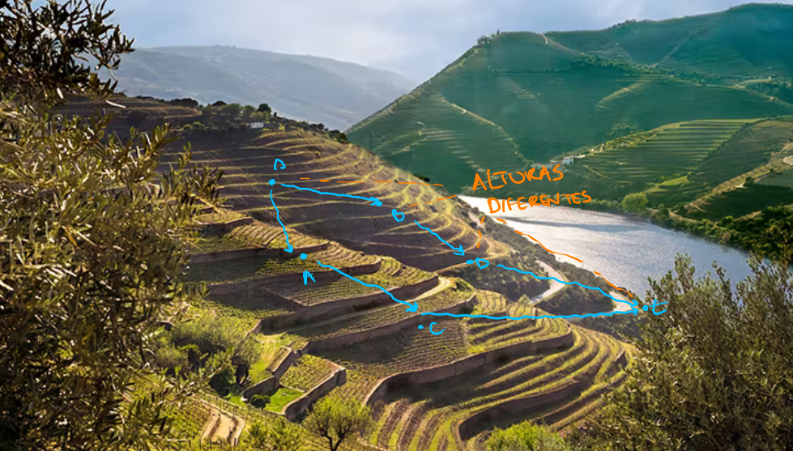

# Fluxos Máximos

```toc

```

:::tip[Motivação]

A EDP pretende construir uma nova central de distribuição de energia para a área
Metropolitana de Lisboa na Serra de Montachique, visto que partindo de lá predispõe
de uma rede de energia elétrica já construída.
Temos, claro, que cada ligação tem uma capacidade limite de energia que pode transportar.
Assim sendo, o engenheiro Paulo ficou encarregue de descobrir o [**fluxo máximo**](color:green)
de energia que pode ser transportado num dado momento pela rede, distribuído pelas várias ligações da mesma.

O problema do fluxo máximo é utilizado para modelar soluções para vários problemas
deste género, como redes de saneamento e água, transporte de partes por linhas de montagem, entre outras.
É um problema bastante presente na indústria!

:::

O problema do fluxo máximo consiste, então, em encontrar o melhor caminho - o caminho
onde conseguimos levar mais material - de uma fonte a um destino/sumidouro sem violar
a capacidade de nenhum arco da rede.

## Redes de Fluxos

Uma rede de fluxos corresponde a um grafo $G = (V, E)$ dirigido, onde cada arco do
mesmo tem uma capacidade associada não negativa. O grafo é necessariamente ligado.
Consideramos sempre, claro, que há um caminho possível entre $s$ e $t$ que passa por
qualquer outro vértice do grafo (caso contrário haveria vértices que não faria sentido
aparecerem no grafo, já que não seriam úteis à rede).

Uma propriedade bastante importante destas redes é a [**conservação do fluxo**](color:orange):

$$
\sum_{v \in V} f(u, v) = 0, \quad\forall_{u \in V - \{s, t\}}
$$

Isto é, para todos os vértices da rede (exceto a fonte e o destino), a quantidade
de material que sai tem de ser a mesma que entra. Observe-se o exemplo abaixo:


Podemos notar que para todo o vértice do grafo (exceto a fonte e o sumidouro) a
quantidade de material que sai é igual à quantidade de material que entra.
Por exemplo, no vértice $C$ temos $12 + 7 = 19$ material a entrar (via $B$ e $E$)
e $15 + 4 = 19$ a sair (via $F$ e $D$).

Vale a pena realçar que [**o fluxo que sai da fonte é necessariamente igual ao que entra no sumidouro**](color:red).
Também na imagem acima podemos verificar que tal se verifica: $11 + 8 = 15 + 4 = 19$,
verificando-se, portanto, que _flow in equals flow out_. Diz-se que este valor é,
então, o [**valor do fluxo**](color:orange) da rede.

Por fim, podemos olhar para redes de fluxo diferentes - redes que apresentam mais
do que uma fonte e/ou sumidouro. Para estes casos específicos, definem-se:

- uma **super-fonte**, que liga (com capacidade $\infty$) todas as fontes do grafo original;

- um **super-sumidouro**, ao qual ligam (com capacidade $\infty$) todos os sumidouros do grafo original.

Tanto a super-fonte como o super-sumidouro limitam-se a fornecer tanto fluxo quanto
pretendido pelas fontes e a receber tanto quanto enviado pelos sumidouros originais,
pelo que todas as propriedades referidas acima acabam por manter-se.
Abaixo podemos observar um exemplo desta transformação:


## [Método de Ford-Fulkerson](color:green)

O **método de Ford-Fulkerson** transcende uma implementação de algoritmo específica -
corresponde a uma combinação de ideias e implementações de outros algoritmos: redes
residuais, caminhos de aumento e cortes. Será, contudo, abordada uma implementação
para um algoritmo genérico de Ford-Fulkerson mais abaixo.

O método baseia-se na seguinte lógica:

```rust
FordFulkersonMethod(G, s, t)
  inicializar o fluxo f a 0
  enquanto existir um caminho de aumento p
    aumentar o fluxo f segundo p
  return f
```

Vamos, então, introduzir as três ideias fulcrais ao método.

### Redes Residuais

Uma rede residual, $G_f$, de uma rede de fluxo $G$ com fluxo $f$ indica-nos como
podemos mudar o fluxo nas arestas de $G$. Temos que cada arco pode ter uma capacidade
residual associada, $c_f(u, v)$, igual à diferença entre a capacidade do arco e o
fluxo que o atravessa atualmente. $G_f$ indicará, portanto, a capacidade residual
de cada arco de $G$ tal que $c_f(u, v) = c(u, v) - f(u, v) > 0$ (os arcos já com
capacidade máxima não nos interessam aqui). Formalizando, temos:

$$
c_f(u, v) = \begin{cases}
  c(u, v) - f(u, v) & \text{se } (u, v) \in E\\
  f(v, u) & \text{se } (v, u) \in E
\end{cases}
$$

O segundo ponto é particularmente relevante, e podemos observá-lo na imagem abaixo:
para uma aresta no "sentido contrário", consideramos que a sua capacidade residual
corresponde ao próprio fluxo que o arco transporta. A definição deverá ficar mais
clara com a imagem-exemplo da secção abaixo.

### Caminhos de Aumento

Dado um grafo com respetivas redes de fluxo $f$ e residual $G_f$, temos que um
**caminho de aumento** $p$ corresponde a um caminho simples de $s$ para $t$ em $G_f$.
Podemos, em $p$, aumentar o fluxo em todo o arco de $p$ com uma quantidade até $c_f$,
a **capacidade residual** de $p$, tal que:

$$

c_f(p) = \min\{c_f(u, v): (u, v) \in p\}


$$

Significa, então, que podemos aumentar o fluxo em todo o arco de $p$ por uma quantidade
igual à menor capacidade residual dos arcos que o compõem. Abaixo podemos ver um exemplo:


O caminho destacado à direita corresponde a um caminho de aumento $p$ para a rede
em à esquerda. Temos que $c_f(p) = \min\{5, 4, 5\} = 4$, pelo que podemos aumentar o
fluxo em todo o caminho de aumento $p$ por $4$.

De realçar que podemos aqui observar a rede residual, e as noções de caminhos residuais
devem então ficar mais claras: existem arcos nos dois sentidos do arco de $G$,
respeitando a definição proposta acima para $c_f(u, v)$. Os arcos que já transportam
capacidade máxima de fluxo apenas apresentam arco numa direção.

Podemos, claro, visto que estamos a trabalhar com capacidades e fluxos não negativos, afirmar que:

$$

f' = f + f_p \wedge |f'| = |f| + |f_p| > |f|


$$

Ou seja, que o fluxo da rede após a aplicação do aumento à rede, $f'$, é estritamente
maior que o fluxo da rede original, $f$. Consideramos para este efeito que $f_p = c_f(p) > 0$.

### Cortes em Redes de Fluxo

Os cortes em redes de fluxo correspondem a uma partição $(S, T)$ de $V$, com $T = V-S$,
tal que $s \in S \wedge t \in T$.
Seja $f$ um fluxo, o **fluxo líquido de um corte** corresponde a:

$$

f(S, T) = \sum_{u \in S} \sum_{v \in T} f(u, v) - \sum_{u \in S} \sum_{v \in T} f(v, u)


$$

A imagem abaixo poderá tornar o conceito mais claro:


Na rede da imagem, consideramos $S = \{A, B, D\} \wedge T = \{C, E, F\}$.
Os arcos que cruzam o corte são $(B, C), (C, D)$ e $(D, E)$.
Como a definição acima indica, [**o sentido dos arcos é relevante**](color:red) para a determinação
do fluxo líquido do corte: voltando a olhar para a imagem-exemplo dos caminhos de aumento, temos que:

$$
f(B, C) = 12, f(D, E) = 11, f(C, D) = 4 \implies f(S, T) = 12 + 11 - 4 = 19
$$

Assim sendo, o fluxo líquido do corte associado à rede acima é $19$. Realça-se ainda
que $f(S, T)$ foi aumentado segundo os arcos que cruzavam o corte de $S$ para $T$
e diminuído segundo os que o cruzavam no sentido contrário, tal como a definição indica.

Por fim, a [**capacidade de um corte**](color:blue) corresponde à soma das capacidades residuais
dos arcos que cruzam o corte de $S$ para $T$, isto é:

$$
c(S, T) = \sum_{u \in S} \sum_{v \in T} c(u, v)
$$

O [**corte mínimo**](color:green) de uma rede será, então, o corte com a menor capacidade de entre todos os cortes da mesma.

Pegando ainda na imagem anterior, teríamos que a capacidade do corte referido seria igual a $12 + 14 = 26$.

Temos ainda algumas afirmações a fazer quanto aos cortes:

- Dado um fluxo $f$ para uma rede $G$, o fluxo líquido de qualquer corte da rede é o mesmo, sendo igual a $|f|$.

- O valor de qualquer fluxo $f$ numa rede $G$ é majorado pela capacidade de qualquer corte da rede.

:::details[Prova do primeiro ponto]

Temos que $V = T \cup S$, e então $f(S, V) = f(S, T \cup S) = f(S, T) + f(S, S) = f(S, T) + 0 = f(S, T)$, já que $f(S, S) = 0$.

Tendo $f(S, V) = f(S, T)$, e com $|f| = f(S, T) = f(S, V)$, podemos começar a construir a prova pretendida:

$$
\begin{aligned}|f| &= f(S, V) = f(s, V) + f(S - \{s\}, V)\\
\\
&= \sum_{v \in V}f(s, v) - \sum_{v \in V}f(v, s) + \sum_{u \in S - \{s\}}(\sum_{v \in V}f(u, v) - \sum_{v \in V}f(v, u)) \\
\\
&= \sum_{v \in V}(f(s, v) + \sum_{u \in S - \{s\}}f(u, v)) - \sum_{v \in V}(f(v, s) + \sum_{u \in S - \{s\}}f(v, u)) \\
\\
&= \sum_{v \in V}\sum_{u \in S}f(u, v) - \sum_{v \in V}\sum_{u \in S}f(v, u)
\end{aligned}
$$

Ora, visto que $V = S \cup T \wedge S \cap T = \emptyset$, podemos simplificar a
soma acima mais ainda (em função de $S$ e $T$ em vez de $S$ e $V$):

$$
\begin{aligned}|f| &= \sum_{v \in S} \sum_{u \in S}f(u, v) + \sum_{v \in T} \sum_{u \in S}f(u, v) - \sum_{v \in S} \sum_{u \in s}f(v, u) - \sum_{v \in T} \sum_{u \in S}f(v, u) \\
\\
&= \sum_{v \in T} \sum_{u \in S}f(u,v) - \sum_{v \in T} \sum_{u \in S}f(v, u) + (\sum_{v \in S}\sum_{u \in S}f(u, v) - \sum_{v \in S}\sum_{u \in S}f(v, u))
\end{aligned}
$$

Esta última diferença entre parêntesis anula-se, pela conservação do fluxo, pelo que ficamos com:

$$
\begin{aligned}|f| &= \sum_{v \in T} \sum_{u \in S}f(u,v) - \sum_{v \in T} \sum_{u \in S}f(v, u) \\
\\
&= f(S, T)
\end{aligned}
$$

:::

Seja $(S, T)$ um corte de $G$ e $f$ um qualquer fluxo da rede. Temos, pela afirmação
provada imediatamente acima, que $|f| = f(S, T)$. A partir daí, podemos facilmente deduzir:

$$
\begin{aligned}|f|&=f(S, T)\\
&= \sum_{u \in S} \sum_{v \in T} f(u, v) - \sum_{u \in S} \sum_{v \in T} f(v, u)\\
&\leq \sum_{u \in S} \sum_{v \in T} f(u, v)\\
&\leq \sum_{u \in S} \sum_{v \in T} c(u, v)\\
&= c(S, T)
\end{aligned}
$$

Assim sendo, podemos extrair que o valor do fluxo mínimo é majorado pelo valor de
qualquer corte da rede. Mais ainda, **o valor do fluxo máximo de uma rede é majorado
pela capacidade do corte mínimo da mesma**, afirmação particularmente útil para o Teorema apresentado abaixo:

:::info[Teorema do Fluxo Máximo - Corte Mínimo]

Seja $f$ o fluxo de uma rede $G$ com fonte $s$ e sumidouro $t$. Para uma rede assim
apresentada, as seguintes proposições são equivalentes:

- $f$ é o fluxo máximo da rede.

- A rede residual $G_f$ não contém caminhos de aumento.

- $|f| = c(S, T)$ para algum corte $(S, T)$ na rede.

:::

A equivalência das três afirmações pode ser provada através de uma **implicação
cíclica** entre elas. Procuremos prová-las:

:::details[Prova do teorema]

[**$(1) \implies (2)$**](color:orange) indica que se $f$ for o fluxo máximo da rede,
então $G_f$ não contém caminhos de aumento. Suponhamos o oposto: que $G_f$ contém
caminhos de aumento, mesmo considerando $f$ como um fluxo máximo da rede. Nesse caso,
haveria pelo menos um caminho $p$ tal que $|f| + |f_p| > |f|$, uma contradição, já que $f$ já é máximo.

[**$(2) \implies (3)$**](color:yellow) indica que se $G_f$ for uma rede residual
sem caminhos de aumento, então $|f| = c(S, T)$ para algum corte $(S, T)$ na rede.
Tenhamos $S = \{v | G_f \text{ tal que há um caminho de s para v} \}$, $T = V - S$.
Por contradição, suponhamos que $|f| \neq c(S, T)$ para todo o corte da rede.
Isso implicaria, claro, que $f(S, T) < c(S, T)$ para todo o corte, já que é impossível
ter o contrário. Agora das duas uma:

- Existe um arco $(u, v)$ tal que $c_f(u, v) > 0$; caso tal acontecesse, esse arco
  estaria na rede residual, pelo que não pode ser verdade.

- Existe um arco de refluxo; contudo, se tal acontecesse, seria possível chegar a
  $u$ a partir de $t$, o que também não pode acontecer.

A proposição fica então provada.

Por fim, [**$(3) \implies (1)$**](color:red). Temos, claro, que $|f| \leq c(S, T)$
para todo o corte da rede. Tendo $|f| = c(S, T)$, temos obrigatoriamente que $|f|$
terá de ser o fluxo máximo da rede, visto que caso não fosse, $|f| > c(S, T)$ para
um qualquer corte na rede, o que não pode acontecer.

A implicação cíclica fica assim provada, pelo que as afirmações são necessariamente equivalentes.

:::

### Implementação Genérica de Ford-Fulkerson

Depois de explicada a teoria por detrás do método de Ford-Fulkerson, chegou então
a altura de mostrar a sua implementação:

```rust
FordFulkerson(G, s, t)
  for each edge e in G.E
    e.f = 0 // fluxo pelo arco = 0 inicialmente
  while (existe um caminho p de s para t na rede residual)
    c_f(p) = min{c_f(u, v) | (u, v) in p} // capacidade residual de p
    for each edge e in p
      if e in E_f
        e.f += c_f(p) // incrementa fluxo pelo arco
      else
        e.f -= c_f(p) // decrementa fluxo pelo arco
```

Começamos por inicializar o fluxo de todos os arcos da rede a $0$. De seguida,
procuramos sucessivamente encontrar caminhos de aumento na rede residual (até estes
deixarem de existir), e atualizamos os arcos que formam cada caminho de acordo com
o fluxo a aumentar: se o arco pertence a $E$, o fluxo é aumentado; caso não corresponda
a um arco da rede original, o fluxo é subtraído pela quantidade indicada.

Encontra-se abaixo um exemplo da aplicação do algoritmo de Ford-Fulkerson:

:::details[Exemplo da aplicação do Algoritmo]

Consideremos uma rede $G$, inicialmente vazia, com capacidades tais que:


O primeiro caminho de aumento encontrado é o que se segue. Podemos notar que neste
primeiro instante não se veem arestas com sentido contrário, já que todas têm fluxo $0$ atualmente:


Foi encontrado mais um caminho de aumento, e agora já podemos notar as tais "arestas contrárias" a aparecer:


Os passos seguintes seguem todos a mesma lógica, até que não existam mais caminhos de aumento.


Chegámos, por fim, a uma rede sem caminhos de aumento restantes. O valor do corte
mínimo corresponde, então, ao valor do fluxo máximo da rede: $23$.

Podemos dizer, aqui, que um corte mínimo seria tal que $S = \{s, v_1, v_2, v_4\} \wedge T = \{v_3, t\}$.
Os arcos que cruzam o corte têm necessariamente de estar saturados (ou seja, o fluxo
deles é igual à capacidade máxima do arco). Mais ainda, **a soma do fluxo que atravessa
o corte é igual ao valor do fluxo**. Abaixo podemos observar o corte mínimo na rede:


:::

Em relação à análise da complexidade temporal do algoritmo, podemos afirmar que:

- o loop inicial leva $\Theta(E)$ tempo;

- calcular a capacidade residual mínima do caminho pode levar $O(E)$ tempo;

- atualizar o fluxo do arco $e$ em $p$ leva $O(1)$ tempo; é realizado no máximo $E$ vezes por ciclo.

Resta, então, falar sobre a complexidade do ciclo `while` em si: encontrar um caminho
leva $O(E)$ tempo, recorrendo a uma DFS/BFS adequada. O ciclo em si, contudo, pode
ser executado até $|f^*|$ vezes (onde $f^{*}$ é o fluxo máximo da rede), tornando
a complexidade temporal do algoritmo $O(|f^{*}|E)$. A razão para ter de ser executado
até $|f^{*}|$ vezes, da maneira que está construído atualmente, pode ficar mais
aparente ao olhar para o exemplo seguinte:


Considerando uma rede como a que está acima, temos que $|f^{*}|$ = $2000000$.
Na pior das hipóteses, teremos de realizar igual quantidade de caminhos que passem
pelo arco $(u, v)$, o que pode tornar a aplicação do algoritmo impraticável. Assim sendo,
vamos estudar o algoritmo de Edmonds-Karp, que permite uma majoração da complexidade
de $O(VE^2)$, bastante melhor na vasta maioria dos casos.

## [Algoritmo de Edmonds-Karp](color:pink)

O algoritmo de Edmonds-Karp tem por base o método de Ford-Fulkerson, procurando uma
majoração diferente para a complexidade temporal do mesmo.

O objetivo aqui passa por encontrar sempre o [**caminho de aumento mais curto**](color:orange),
isto é, com menos arcos, não menos pesado, presente na rede residual $G_f$. Para tal,
o algoritmo recorre a uma **BFS** com origem em $s$ e destino em $t$ - a procura
para assim que encontrar um caminho de aumento que os una. O algoritmo termina
quando não existem mais caminhos de aumento - isto é, quando a BFS não consegue
encontrar mais caminhos de aumento que unam $s$ e $t$.

:::info[Monotonia de Edmonds-Karp]

É interessante definir [**distância de Edmonds-Karp**](color:yellow): $\delta_f(s, t)$,
a distância do caminho mais curto entre $s$ e $t$ em $G_f$.

Mais ainda, é relevante notar que, visto que a BFS vai sempre encontrando os caminhos
de aumentado _atualmente_ mais curtos (e que estes vão desaparecendo), podemos afirmar
com segurança que, durante o decorrer de Edmonds-Karp, $\delta_f(s, t)$ terá uma
**tendência crescente** (não estritamente, claro).

:::

Abaixo segue um exemplo bastante simples do decorrer do algoritmo sobre uma rede:

:::details[Exemplo da aplicação do Algoritmo]

Comecemos com uma rede que se encontra inicialmente da seguinte forma:


Podemos notar que inicialmente o fluxo que passa por todas as arestas é 0, e que
portanto a respetiva capacidade residual é igual à capacidade máxima do arco.

Nas BFSs abaixo, os números acima de cada vértice correspondem à distância percorrida
desde $s$ até ao vértice em questão. Podemos, nesta primeira procura, notar que há
2 caminhos de aumento de tamanho $3$. Escolhemos um deles (por exemplo $s \to c \to d \to t$),
e, ao escolhê-lo, verificamos que a capacidade residual mínima de entre as arestas
do caminho é $4$ - o fluxo em todos os arcos é incrementado em $4$ unidades.


De seguida, vamos ao outro caminho de aumento com 3 unidades (descoberto anteriormente),
$s \to a \to b \to t$. Aqui, a menor capacidade residual dos seus arcos é $12$, e
o fluxo em todos os arcos é incrementado em $12$.


Explorados todos os caminhos de aumento de tamanho $3$, a BFS seguinte encontra um
caminho de tamanho $4$. A menor capacidade residual de um dos seus arcos é $7$, e
o fluxo em todos os arcos é incrementado em $7$.


A partir daqui não existe uma procura que encontre um caminho de aumento para a rede, pelo que o algoritmo termina.

Temos que o fluxo máximo encontrado é igual à soma dos fluxos que saem da fonte,
que é igual à soma dos fluxos que chegam ao sumidouro e à soma dos fluxos que atravessam
o corte mínimo da rede, $23$:


Podemos notar que todos os arcos que atravessam o corte no sentido "positivo", da
partição de $s$ para a de $t$ estão saturados. Mais ainda, e apesar de não ser aqui
percetível, é relevante verificar que o fluxo dos arcos que cruzam o corte no sentido
"negativo" contribui negativamente para o fluxo máximo da rede: se tivéssemos um arco
que cruzasse aqui o corte no sentido contrário com fluxo $4$, o fluxo máximo da rede seria $23 - 4 = 19$.

Por fim, é interessante verificar que o fluxo máximo pode também ser dado pela quantidade
de fluxo aumentada a cada BFS realizada: é óbvio, claro, a cada BFS o fluxo é aumentado,
nunca decrescido. Aqui, verifica-se com $4 + 12 + 7 = 23$.

:::

Podemos notar que as distâncias de Edmonds-Karp podem variar entre $1, ..., |V| - 1$:
um caminho de aumento pode ter no mínimo 1 aresta (se o grafo ligar diretamente $s$ a $t$),
e no máximo $|V| - 1$ arcos (tal como o exemplo de seguida demonstra):


Ora, temos ainda que podemos ter $|E|$ caminhos de aumento até $\delta_f(s, t)$ aumenta
(podemos ter um caminho que contenha todas as arestas, onde uma aresta vai ficando
saturada de cada vez), e assim podem existir $O(|V|\cdot|E|)$ caminhos de aumento numa rede.

Visto que cada caminho de aumento pode ser encontrado em $O(|V| + |E|) = O(|E|)$
tempo (via BFS), temos que a complexidade temporal de Edmonds-Karp é $O(|V|\cdot|E|^2)$.

:::danger[A complexidade pode enganar]

Não nos podemos esquecer que o algoritmo de Edmonds-Karp não é mais que uma implementação
do método de Ford-Fulkerson, partilhando assim a sua majoração temporal ($O(|f^*| |E|)$).
Assim sendo, dependendo da topologia do grafo, a realização do algoritmo pode até
levar tempo inferior a $V E^2$ a terminar!

Este tipo de perguntas pode sair em exame, e é bastante útil ter em mente: o algoritmo
tem ambas as majorações temporais, consideramos a que for menor perante a topologia
da rede apresentada. O algoritmo apresentado abaixo (para encontrar emparelhamentos
bipartidos máximos) é um dos casos onde isto acontece.

:::

## Emparelhamento Bipartido Máximo

:::info[Motivação]

Imaginemos que temos um conjunto de $m$ máquinas e outro de $n$ tarefas. Cada máquina
pode ser atribuída a apenas uma tarefa, mas nem todas as máquinas podem realizar
todas as tarefas. Na melhor das hipóteses, qual será o maior número de tarefas que
o conjunto de máquinas pode realizar simultaneamente? Mais ainda, nesse mesmo melhor caso, que máquina realiza que tarefa?

:::

Podemos formalizar o problema acima através de um conjunto $J$, um conjunto que mapeia
todas as máquinas a todas as tarefas que podem executar, tal que:

$$
J = \{(m_i, t_j), m_i \longmapsto t_j\}.
$$

O nosso objetivo passará então por procurar o melhor emparelhamento possível tal
que há um valor ótimo de "arestas ativas" - máquinas a realizar tarefas, portanto.
$J$ pode ser representado por um grafo, claro:


Como podemos notar, o grafo que corresponde a $J$ diz-se um **grafo bipartido** -
um grafo onde $V$ pode ser separado em $V_1$ e $V_2$, em que não existem arestas
entre os vértices de $V_1$ nem entre os de $V_2$, apenas de $V_1$ para $V_2$ (e
possivelmente vice-versa). O problema do [**emparelhamento bipartido máximo**](color:orange)
passará, então, por encontrar o emparelhamento com cardinalidade máxima num grafo
bipartido: em relação a este exemplo, encontrar o número máximo de tarefas que podem
ser executadas simultaneamente, considerando que cada máquina pode estar ligada a apenas uma tarefa ao mesmo tempo.

Em relação ao grafo acima, podíamos dizer que um possível emparelhamento bipartido
seria $(m_2, t_1)$, $(m_4, t_2)$ e $(m_3, t_3)$. Este emparelhamento não é máximo -
existem outros emparelhamentos com cardinalidade superior a este. Um **emparelhamento
bipartido máximo** correspondente a este conjunto seria, por exemplo, $(m_1, t_1)$, $(m_2, t_2)$
e $(m_3, t_4)$ e $(m_4, t_3)$. Aqui, verificamos que a cardinalidade do emparelhamento
é $4$, não podendo sequer aumentá-la mais. Pode ser importante realçar ainda que
um emparelhamento bipartido ser **máximo** não significa que este cobre necessariamente
todas as "máquinas" do mesmo - significa apenas que não é possível encontrar um
outro emparelhamento bipartido com cardinalidade superior.

### Como encontrar o emparelhamento bipartido máximo?

Será interessante ter um algoritmo que nos permita encontrar o emparelhamento bipartido
máximo de um grafo. A lógica utilizada para o mesmo é bastante simples: adicionamos
uma fonte e um sumidouro ao grafo, com a fonte ligada à partição das "máquinas" e
o sumidouro ligado à partição das "tarefas". Atribuímos então fluxo unitário a cada
arco, de modo a que uma máquina possa apenas realizar uma tarefa ao mesmo tempo.
Pegando no grafo acima, podemos verificar como ficaria depois destas alterações:


O fluxo máximo nunca poderá, claro, exceder $\min{\{f_s, f_t\}}$, ou seja nunca
poderá haver uma máquina a realizar múltiplas tarefas, nem poderá haver tarefas a
ser realizadas por mais que uma máquina. Podemos ainda notar que, formalmente, $f(u, v) = 1$
apenas se a máquina $u$ estiver a realizar a tarefa $j$.

Este algoritmo corresponde a uma situação em que a complexidade temporal do método
de Ford-Fulkerson prevalece sobre a de Edmonds-Karp. Temos necessariamente que:

$$
|f^*| \leq m \leq |V|, \quad \text{ onde m corresponde ao número de máquinas}
$$

já que no pior caso todas as máquinas podem realizar uma tarefa. Nesse caso, podemos
afirmar que por Ford-Fulkerson a complexidade temporal do algoritmo é dada por
$O(f^* E) = O(VE)$, que é melhor que a de Edmonds-Karp, dada por $O(VE^2)$.

## Algoritmos baseados em Pré-Fluxo

Até aqui observámos algoritmos para o fluxo máximo baseados em caminhos de aumento.
Estes algoritmos têm, contudo, a particularidade menos agradável de possuírem operações
**pouco localizadas** - as procuras por caminhos de aumento iniciam-se sempre em $s$,
mesmo que percorrer a rede desde aí se possa tornar pouco eficiente. Abaixo encontra-se
um exemplo de uma situação onde os algoritmos baseados em caminhos de aumento se
podem tornar mais morosos do que podiam/deviam ser idealmente:


Ao olhar para este exemplo, podemos até pensar no porquê de não levarmos só o fluxo
$k$ todo até $v_k$ e depois verificar os caminhos a partir daí, escusando de percorrer
_sempre_ a rede toda - pensamos nós e pensou [Karzanov](https://en.wikipedia.org/wiki/Alexander_V._Karzanov)
em 1974, uns bons anos depois do aparecimento do método de Ford-Fulkerson.
O matemático russo expôs um dos algoritmos que vamos abordar mais à frente, _Push-Relabel_,
para fazer frente a esta mesma situação. Tarjan e Goldberg, sensivelmente uma década
depois, apresentaram o algoritmo _Relabel-To-Front_ baseado neste último.

:::tip[Pré-Fluxos]

Os algoritmos baseados em pré-fluxos são, como referido acima, mais **localizados**
que os baseados em caminhos de aumento. Trabalham sobre um vértice de cada vez, em
vez de procurar encontrar caminhos por toda a rede, observando os vizinhos de cada vértice.

Durante o decorrer do algoritmo, [**a conservação do fluxo não se verifica**](color:orange).

Cada vértice contém um pré-fluxo, fluxo que nele incide, sendo que o objetivo será
"expulsá-lo" completamente de si para os vizinhos (tendo como objetivo final que
todo o fluxo que sai de $s$ atinja $t$). O primeiro passo é **sempre** saturar todos
os arcos que ligam $s$ aos seus vizinhos, expulsando o máximo de fluxo possível da
fonte, sendo que futuramente poderão (e normalmente irão) ocorrer refluxos.

:::

Antes de definir pré-fluxo, é importar referir uma das suas propriedades: a restrição
de capacidade. $f$ só pode ser considerado um pré-fluxo caso:

$$
\forall_{(u, v) \in E}, 0 \leq f(u, v) \leq c(u, v)
$$

Posto isto, podemos ainda afirmar que o fluxo que entra num vértice $u$ deve ser
**maior** (sim, maior) ou **igual** ao que dele sai para este poder ser considerado
um pré-fluxo, sendo a respetiva quantidade de fluxo _a mais_ considerada o seu **excesso**, $e$:

$$
e(u) = \sum_{v \in V} f(v, u) - \sum_{v \in V} f(u, v).
$$

A primeira coisa a fazer é, como referido acima, **saturar** todos os arcos que
ligam $s$ aos seus vizinhos, expulsando o máximo de fluxo possível da fonte. Este
passo é partilhado pelos dois algoritmos estudados abaixo, e é um dos pontos fulcrais dos mesmos.

De seguida, é importante ter em conta que cada vértice tem uma [**altura**](color:orange)
associada - podemos pensar nas várias alturas como as várias secções de uma encosta -
o fluxo _cairá_ pela encosta até ao sumidouro. O fluxo, claro, só poderá cair de
um vértice $u$ para outro $v$ caso esteja "mais alto" na colina - para tal, é necessário
ir atualizando as alturas dos vértices da rede com o decorrer do algoritmo.



Poderemos, no decorrer do algoritmo, encontrar situações em que queremos expulsar
fluxo de um vértice, mas todos os arcos que dele saem estão ou saturados ou com
as respetivas adjacências à mesma altura/acima dele. Quando isso acontece, efetuamos
a operação _**relabel**_, explorada mais à frente, que atualiza a sua altura (permitindo então que o fluxo caia).

No final do algoritmo, nenhum dos vértices (exceto $s$ e $t$) tem excesso de fluxo no seu reservatório.

:::tip[Função de Alturas]

Seja $G=(V, E)$ uma rede de fluxo com fonte $s$ e sumidouro $t$. Mais ainda, seja
$f$ um pré-fluxo da rede. Uma função $h: V \to \N$ é uma função tal que:

- $h(s) = |V|$;

- $h(t) = 0$;

- $h(u) \leq h(v) + 1$

para todo o arco residual $(u, v) \in E_f$. Caso $h(u) > h(v) + 1$, então o arco
$(u, v)$ não pertence à rede residual.

:::

### Operações Básicas

O conjunto dos algoritmos baseados em pré-fluxo é composto por algumas operações
básicas (que todos partilham) - _push_ e _relabel_.

_Push_ ocorre quando um dado vértice $u$ possui excesso. Recebe como argumento $v$,
para além de $u$, onde $v$ corresponde ao vértice-destino de um arco que sai de $p$.
Caso o arco $(u, v)$ **não esteja saturado** e $h(u) = h(v) + 1$, podemos _expulsar_
fluxo de $u$ para $v$, isto é, "atirar fluxo pela colina abaixo". O pseudocódigo da operação é bastante simples:

```rust
Push(u, v) // complexidade temporal: O(1)
  // excesso < capacidade residual -> não saturamos o arco
  let delta := min(e(u), c_f(u, v))
  if (u, v) in E // arco da rede
    (u, v).f = delta
  else // arco residual
    (u, v).f -= delta
  e(u) -= delta
  e(v) += delta
```

Existem dois tipos (bastante óbvios, pelo nomes) de _pushes_:

- **_pushes_ saturantes**, onde a operação _push_ satura o arco pelo qual vai enviar o fluxo;

- **_pushes_ não-saturantes**, caso contrário. De notar que após um _push_ deste tipo,
- $u$ deixa de ter excesso (caso contrário poderia, e deveria, enviar mais fluxo pelo arco).

A utilidade desta definição será clara mais à frente.

Acima foi referido que _push_ só pode ser realizado caso, entre outras condições,
$h(u) = h(v) + 1$ - isto é, caso o **diferencial de altura** entre os vértices seja
igual a 1. Caso não seja o caso (e não houver nenhum vértice que atualmente nos
permita expulsar fluxo em excesso do vértice), somos forçados a fazer _**relabel**_
do mesmo: a alterar a sua altura, de modo a poder expulsá-lo.

```rust
Relabel(u)
  h(u) := 1 + min{h(v) | (u, v) in E_f}
```

Ou seja, a nova altura de $u$ corresponde à menor altura de um dos seus vizinhos,
mais 1 (para ficar mais alto que ele).

Tal como Dijkstra e Bellman-Ford tinham `InitializeSingleSource` no seu início,
temos aqui uma operação semelhante. Queremos:

- Inicializar a altura de $s$ a $|V|$;

- Inicializar a altura de todos os outros vértices a 0, bem como o respetivo excesso;

- Inicializar o fluxo de todos os arcos (e dos respetivos residuais) a 0;

- Expulsar todo o fluxo possível da fonte, atirando para as suas adjacências.
  Os excessos de cada vértice vizinho são atualizados de acordo com o fluxo atirado.

O nome da operação não foge muito do apontado acima: `InitializePreFlow`, com pseudo-código como este:

```rust
InitializePreFlow(G, s)
  for each v in V
    u.h = 0
    u.e = 0
  for each (u, v) in E
    (u, v).f = 0
    (v, u).f = 0
  s.h = |V|
  for each u in s.adj
    f(s, u) = c(s, u) // saturar o arco
    f(u, s) = -f(s, u) // arco residual
    u.e = f(s, u)
    s.e -= f(s, u) // excesso em s incrementado conforme o fluxo atirado
```

### [Método Push-Relabel](color:orange)

O pseudocódigo genérico do método de _push-relabel_ é:

```rust
PushRelabel(G)
  InitializePreFlow(G)
  while there is a vertex u with excess
    let v be a vertex where (u, v) is a residual edge and h(u) = h(v) + 1
    if v exists // se houver um vértice que respeite a condição acima
      push(u, v)
    else
      relabel(u)
```

Dois pontos interessantes a retirar do método (e de todos os algoritmos que o
implementam, **incluindo o algoritmo abaixo**) é que:

- os vértices $s$ e $t$ devem, no final, ter fluxos simétricos, e o seu respetivo
  módulo deve corresponder ao fluxo máximo da rede;

- todos os outros vértices devem, no final, apresentar excesso $0$.

Tal como o método de Ford-Fulkerson, _push-relabel_ não é considerado um algoritmo -
não nos dá, de forma determinística, uma opção a escolher. Pode, contudo, parecer
algo "básico", pelo que será interessante provar a sua correção (e que de facto
resolve o problema do fluxo máximo)[**\***](color:yellow). A complexidade temporal
do algoritmo é $O(V^2 \cdot E)$, já melhor que a de Edmonds-Karp.

[**\***](color:yellow) As provas serão adicionadas assim que possível. Por agora
apenas é mencionado o método em si, já que apenas é avaliado o algoritmo abaixo
(e esse tem exemplo associado, incluindo uma abordagem mais aprofundada).

### [Algoritmo Relabel-To-Front](color:yellow)

O método _push-relabel_, como referido acima, tem complexidade $O(|V|^2 \cdot E)$ -
uma melhoria em relação a Edmonds-Karp. Contudo, estudaremos de seguida um algoritmo
(que implementa as operações básicas _push_ e _relabel_), com uma terceira operação-base
adicional que permite a alteração da complexidade temporal para $O(|V|^3)$, bastante
melhor para redes muito densas, com muito mais arcos que vértices.

Um dos pilares do algoritmo é uma lista $L$, que mantém todos os vértices $V \backslash \{s, t\}$,
inicialmente ordenados arbitrariamente. O algoritmo atravessa $L$ do início ao fim,
aplicando [**_Discharge_**](color:yellow) a cada um dos vértices: sucessivos _pushes_
e _relabels_ até que o vértice já não possua excesso. Caso o vértice tenha sido
_relabeled_, passa para o início de $L$ (daí o nome do algoritmo, _relabel-to-front_),
e a passagem pela lista é recomeçada. O algoritmo termina caso consiga passar por
todos os elementos da lista sem realizar qualquer descarga - estamos, então, na
presença do fluxo máximo da rede.

```rust
Discharge(u)
  while u.e != 0
    v = u.current
    if v = nil
      Relabel(u)
      u.current = head(u.neighbors) // primeiro vizinho de u
    else if c_f(u, v) > 0 and h(u) = h(v) + 1
      Push(u, v)
      u.current = v.next // proximo vizinho
    else
      u.current = v.next
```

Aqui, consideramos que `u.current` corresponde ao vértice da lista de adjacências
de $u$ que estamos atualmente a visitar.

- Caso este seja `nil`, chegámos ao fim das adjacências do vértice. Assim sendo,
  e como ainda não expulsámos o fluxo todo de $u$, precisamos de realizar um _relabel_
  (com vista a poder, agora, atirar mais fluxo pela colina), voltando a ler a lista desde o início.

- Caso não seja `nil` **e** possamos atirar fluxo para `u.current`, atiramo-lo (via _push_) e passamos ao próximo vizinho.

- Caso não seja `nil` mas também não possamos atirar fluxo, passamos só ao próximo vizinho.

O algoritmo corresponde, então, a uma sequência de descargas por $L$ até haver uma
passagem completa pela mesma sem necessidade de descarregar fluxo. O pseudocódigo é o que se segue:

```rust
RelabelToFront(G, s, t)
  // consideramos L já inicializada
  InitializePreFlow(G, s)
  for each u in L
    u.current = head(u.neighbors)
  u = head(L)
  while u != nil
    let previous_height := h(u)
    Discharge(u)
    if h(u) > previous_height
      head(L) = u
    u = u.next // next -> proximo vertice de L
```

A aplicação do algoritmo é trivial, porém é bastante fácil enganarmo-nos num passo
intermédio (costumam ser uns quantos, e é fácil haver detalhes a passar despercebidos).
Nos slides encontram-se exemplos da execução do algoritmo.

Por fim, podemos afirmar que a complexidade temporal do algoritmo é $O(V^3)$. Podemos trivialmente provar
que, por vértice, podemos realizar no máximo $V$ operações de _relabel_ (começando
da altura base, podemos encontrar todos os vértices em escada, subindo a altura de
$1$ em $1$ até V). Havendo $V$ vértices, podemos afirmar que no máximo ocorrerão $V^2$
operações de _relabel_ durante _relabel-to-front_. Por fim, temos que cada iteração
pode ter até $V$ descargas (atirando fluxo para todos os vértices), e havendo no
máximo $V^2$ _relabels_, podemos claramente majorar a complexidade temporal da execução do algoritmo em $O(V^3)$.

---

- [Notas Ford-Fulkerson - Prof. José Fragoso](https://drive.google.com/file/d/13Ua5JJ6mJZUhEImbcAMGrCBG5iPiUxN3/view?usp=sharing)
- [Notas Edmonds-Karp/CBM - Prof. José Fragoso](https://drive.google.com/file/d/1YRzHWWA4glyzkYj2eshiLtD2XNWw8fmw/view?usp=sharing)
- [Notas Pré-Fluxos - Prof. José Fragoso](https://drive.google.com/file/d/13_3-tNuxZuiHZNPZXiXUL8hVudvSO4uC/view?usp=sharing)
