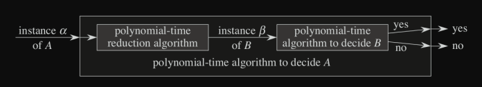

# Completude $NP$

```toc

```

Os algoritmos abordados até agora podem ser resolvidos em tempo polinomial - a sua complexidade temporal do pior caso é sempre do tipo $O(n^k)$, para alguma constante $k$. Contudo, nem todos os programas partilham esta propriedade: há problemas, como o clássico _Halting problem_ que não possuem qualquer solução:

::youtube{#macM_MtS_w4}

Além desses, há também problemas que se julgam apenas ter soluções em tempo superpolinomial, e será esse o foco desta secção: procurar provar que há problemas que são necessariamente difíceis, sem resolução eficiente (polinomial). É importante conseguir provar que há certos problemas sem resolução eficiente, mais não seja para evitar estar à procura de uma solução eficiente que não existe.

Temos, então, três principais classes de problemas:

- os problemas [$P$](color:orange), para os quais podemos encontrar uma solução de forma eficiente, em tempo polinomial.

- os problemas [$NP$](color:yellow), "Não-Determínisticos Polinomiais", que possuem solução (conhecida) superpolinomial, mas que são **verificáveis** em tempo polinomial: dado um [**certificado**](color:green), é possível verificar em tempo eficiente se o mesmo corresponde a uma solução para o problema. Aqui, dizemos que um certfificado corresponde a uma potencial solução para o problema: no caso de um programa que procura descobrir o caminho mais longo de um grafo, um _certificado-exemplo_ corresponderia a um qualquer caminho que fosse fornecido como i$np$ut. Podemos afirmar que $P \subseteq NP$: todos os problemas com solução em tempo polinomial também são, claro, verificáveis em tempo polinomial.

- os problemas [$NPC$](color:pink), ditos "$NP$-Completos". Um problema diz-se $NP$-Completo se for $NP$ _e_ for tão "difícil" quanto qualquer problema $NP$ - isto é, dado um problema $P$, se $P$ for $NP$ e qualquer problema $NP$ for redutível a $P$, então $P$ é $NP$-Completo. A noção de redutibilidade de um problema será clara mais à frente. Se alguma vez for descoberto que um problema $NP$-Completo pode ser resolvido em tempo polinomial, **todos os problemas $NP$** podem ser resolvidos em tempo polinomial, fazendo colapsar grande parte da criptografia moderna, bem como outras áreas da computação. Acredita-se, portanto, que $P \neq NP$.

Até agora, o nosso objetivo ao analisar algoritmos sempre foi procurar encontrar uma majoração, notação $O$, para a complexidade temporal que um dado algoritmo pode ter - um pior caso. Nos problemas $NPC$, vamos procurar fazer precisamente o oposto: tentar demonstrar que um dado problema é "pelo menos tão difícil" como outro que já sabemos ser díficil, algo semelhante à noção de $\Omega$, minorante da complexidade temporal.

## Redutibilidade de um Problema

Dados dois problemas $X$ e $Y$, podemos afirmar que $X$ é redutível em tempo polinomial a $Y$, $X \leq_p Y$, caso possamos reescrever $X$ como instância do problema $Y$ de forma a que qualquer solução para o problema $Y$ seja uma solução para o problema $X$. Formalmente, dizemos que tem de existir uma função $f: X \to Y$ tal que $X \leq_p Y$ se:

$$
\forall_{x \in X}, \quad X(x) = 1 \quad \text { se e só se } \quad Y(y) = Y(f(x)) = 1
$$

Dizemos que $f$ é uma **função de redução**, com respetivo **algoritmo de redução** associado $F$.



Acima podemos ver o exemplo de como a lógica funciona - pegamos numa instância de um problema, reduzimo-la numa instância de outro problema através de um algoritmo de redução que leva tempo polinomial, e a resposta ao problema reescrito será a mesma que a do problema original!

Intuitivamente, se podemos reduzir um problema $X$ a outro $Y$ em tempo polinomial, então $X$ não deverá ser "mais difícil" de resolver que $Y$.

Um problema diz-se **$NP$-Díficil** caso possamos reduzir qualquer problema $NP$ a ele próprio em tempo polinomial - nenhum dos outros será "mais díficil" que ele próprio. São também, portanto, **tão difíceis** quanto problemas $NP$-Completos. Não têm necessariamente de ser problemas em $NP$ - o _halting problem_ é $NP$-Díficil, já que é tão ou mais difícil de resolver que qualquer problema $NP$, mas nem sequer tem solução (nem polinomial nem superpolinomial).

**Se alguma vez for descoberta uma solução em tempo polinomial para um problema $NP$-Difícil, foi descoberta uma solução em tempo polinomial para todos os problemas $NP$**.

Podemos, agora, ter uma noção melhor das relações entre estas várias classes de problemas:


Por fim, podemos afirmar que:

$$
X \in NP \wedge Y \in NPC \wedge Y \leq_p X \implies X \in NPC
$$

Isto é, se houver um problema que é $NP$-Completo (e, portanto, $NP$-Díficil), todos os problemas em $NP$ para os quais o podemos reduzir serão também $NP$-Completos, já que terão de ser _pelo menos tão difíceis_ quanto $Y$, que já é, por definição, $NP-$Díficil.

### Teorema de Cook-Levin

Ora, precisamos então de ter um problema raiz que seja $NP$-Completo para, a partir desse, conseguir extrair todos os outros: todos os outros problemas $NP$-Completos poderão ser reduzidos para esta raiz, provando-se então que também são $NP$-Completos.

O **teorema de Cook-Levin** diz-nos, de forma muito sucinta, que o [problema de SAT](../lp/algoritmos-sat), abordado em LP, é $NP$-Completo. A prova é bastante extensa, pelo que não será apresentada aqui. Contudo, tanto as notas do prof. Fragoso como o vídeo abaixo contêm excelentes explicações do mesmo!

::youtube{#LW_37i96htQ}

SAT é então a raiz da completude $NP$, e SAT pode reduzir-se a todos os outros problemas $NPC$. Contudo, nem sempre é simples fazê-lo, devido às diferenças que podem existir entre SAT e o outro problema em mãos. É então aí que entra a noção de **transitividade** na redução de problemas:

$$
X \leq_p Y \wedge Y \leq_p Z \implies X \leq_p Z.
$$

Esta propriedade permite-nos pegar em qualquer problema $NP$-Completo e dizer que SAT é necessariamente redutível ao mesmo, mesmo que inicialmente tenhamos provado que é $NP$-Completo via outro problema $NPC$.

A prova da transitividade é bastante simples: voltando à noção de função de redução, e com

$$
X \leq_p Y \wedge Y \leq_p Z,
$$

temos necessariamente que

$$
x \in X \leftrightarrow f(x) \in Y \wedge y \in Y \leftrightarrow g(y) \in Z,
$$

onde $f$ e $g$ são as funções de redução associadas às reduções de $X$ a $Y$ e $Y$ a $Z$, respetivamente. Podemos, então, afirmar que:

$$
x \in X \leftrightarrow f(x) \in Y \leftrightarrow g(f(x)) \in Z,
$$

já que a composição de reduções continua a custar tempo polinomial!

<!-- TODO: ADICIONAR JUSTIFICAÇÃO PARA A COMPOSIÇÃO DE REDUÇÕES CONTINUAR A CUSTAR TEMPO POLINOMIAL -->

## Reduções Clássicas

Há um conjunto de reduções clássicas entre vários problemas $NPC$, problemas estes abordados nas aulas teóricas e que são úteis ter em mente:


Todos os problemas acima mencionados são $NPC$, e podemos utilizá-los nas reduções em exame - temos sempre de partir de um problema que sabemos ser $NPC$, problema esse que não é necessariamente dado no enunciado. Nesta secção vão ser abordadas algumas destas reduções clássicas.

### Redução de CNF-SAT para 3CNF-SAT

Numa primeira fase, devemos definir CNF-SAT e 3CNF-SAT.

:::tip[CNF-SAT]

Temos que uma _fórmula_ está na forma CNF SAT, _conjunctive normal form_ (equivalente à [forma clausal](../lp/logica-proposicional-sc#forma-clausal) abordada em LP) se corresponde a uma conjunção de disjunções. Cada sub-conjunto de disjunções diz-se uma cláusula, e cada um dos seus elementos diz-se um literal - uma variável ou a negação de uma variável.

:::

A forma 3CNF-SAT é praticamente igual a esta última, com um _twist_: cada cláusula deve conter **exatamente** 3 literais. Sendo assim, para reduzir CNF-SAT a 3CNF-SAT, teremos de arranjar um algoritmo que nos transforme um dado conjunto de cláusulas noutro conjunto equivalente, mas em que cada cláusula contenha agora 3 literais. Mais ainda, se $\phi$ é uma fórmula na forma CNF-SAT e $\phi'$ é a mesma fórmula, reescrita na forma 3CNF-SAT, temos que $\phi$ só é satisfazível caso $\phi'$ também o seja.

Para reescrever uma cláusula de CNF-SAT para 3CNF-SAT, teremos então de considerar quatro casos:

- a cláusula contém 1 literal;
- a cláusula contém 2 literais;
- a cláusula contém 3 literais;
- a cláusula contém 4 ou mais liteirais.

O algoritmo irá funcionar **cláusula-a-cláusula**, em vez de olhar logo para o conjunto de todas as cláusulas e procurar reescrever outro equivalente.

O caso onde a cláusula contém 3 literais é, claro, bastante simples: não tocamos na cláusula, visto que já está na forma que pretendemos.

Para os próximos casos iremos utilizar **variáveis auxiliares**, de controlo: consideremos que temos em mãos uma cláusula do tipo $x \vee y$. Não podemos simplesmente adicionar uma variável qualquer à cláusula e dizer "tem 3 literais, estamos bem" - se o valor lógico dessa variável for $T$, verdadeiro, essa cláusula acabará por ter sempre valor lógico verdadeiro, algo que não queremos. Temos então duas opções:

- A clássica abordada em aula: reescrever a cláusula sob a forma da conjunção de duas novas cláusulas: $(x \vee y \vee z) \wedge (x \vee y \vee \neg z)$. A introdução de outra cláusula com a negação de $z$ é bastante interessante: desta forma, e como se trata de uma **conjunção**, torna-se impossível ter $x$ e $y$ falsos com a conjunção verdadeira, tornando $z$ uma mera formalidade.

- A mencionada pelo [Pedro Chaparro](https://github.com/PedroChaps), bastante mais simples, que consiste apenas em adicionar uma das variáveis em duplicado à cláusula. $x \vee y$ tornar-se-ia $x \vee y \vee y$, por exemplo. **Não tenho a certeza se esta forma de resolver é aceite em contexto de avaliação**, apesar de ser correta.

Consideremos agora que temos uma cláusula com apenas 1 literal, $x$. Podemos, claro, aplicar o segundo método acima referido e ficar com $x \vee x \vee x$, que está correto. A forma clássica, contudo, seria ter duas variáveis de controlo, formando quatro novas cláusulas:

$$
(x \vee y \vee z) \wedge (x \vee y \vee \neg z) \wedge (x \vee \neg y \vee z) \wedge (x \vee \neg y \vee \neg z)
$$

Tal como no caso dos 2 literais, $y$ e $z$ não passam aqui de uma formalidade, já que o seu valor lógico acaba por ser irrelevante quando olhando para o valor da conjunção das 4 cláusulas.

O caso das cláusulas com 4 ou mais literais é o menos trivial. Consideremos que temos uma cláusula inicial do tipo $(x_1 \vee \neg x_2 \vee x_3 \vee \neg x_4 \vee x_5)$. A estratégia utilizada para transformar a cláusula num conjunto de cláusulas de 3 literais passa, mais uma vez, por **variáveis de controlo**. Seguimos um padrão, tal que a cláusula em questão é equivalente a:

$$
x_1 \vee \neg x_2 \vee y_1\\
\neg y_1 \vee x_3 \vee y_2\\
\neg y_2 \vee \neg x_4 \vee x_5
$$

Ou seja, as cláusulas das "pontas" terão ambas 2 literais da cláusula original, enquanto que todas as outras terão apenas 1, procurando ir "cortando" os valores das variáveis de controlo. A lógica pode não ser aparente assim de repente, por isso experimentemos atribuir valores lógicos às variáveis originais.

- Tenhamos $x_1 = x_3 = x_5 = F \wedge x_2 = x_4 = T$. Podemos facilmente reparar que a cláusula original teria valor lógico $F$. Experimentemos olhar para o comportamento das três novas cláusulas:

  - Com $x_1$ e $\neg x_2$ a possuírem valor lógico $F$, $y_1$ terá que ter valor lógico verdadeiro para a conjunção das cláusulas também o ter;

  - Com $\neg y_1$ e $x_3$ com valor lógico $F$, $y_2$ terá agora que ter também valor lógico $V$;

  - $\neg y_2, \neg x_4, x_5$ têm todas valor lógico falso, pelo que a conjunção das cláusulas representa também o valor lógico $F$. Bate certo!

- Tenhamos agora $x_1 = T \wedge x_3 = x_5 = x_2 = x_4 = F$. A cláusula original possui valor lógico verdadeiro, pelo que:

  - Com $x_1$ verdadeiro, $y_1$ poderá possuir qualquer valor lógico. Deixemos a variável em _standby_;

  - $y_2$ terá de ficar igualmente em _standby_, já que o seu valor lógico requerido poderá depender da próxima cláusula (e de $y_1$);

  - Na última cláusula, verificamos que $y_2$ tem de ter valor lógico $F$. Assim sendo, $y_1$ terá igualmente de o ter, tornando a conjunção das 3 cláusulas verdadeira, tal como pretendido!

Mais uma vez, aqui o valor lógico das próprias variáveis de controlo não é "relevante", acabando por ser o valor lógico das variáveis originais a ditar o valor da conjunção das cláusulas em 3CNF-SAT.

Podemos então dizer que encontrámos um algoritmo, com 4 casos distintos, para reescrever uma fórmula CNF-SAT na forma 3CNF-SAT, tal que a fórmula na forma CNF-SAT só é satisfazível caso a mesma na forma 3CNF-SAT o seja.

Para analisar o **custo da redução**, e verificar se o mesmo é polinomial, é relevante indicar o número de cláusulas _criadas_ pelo algoritmo por cláusula original (tenhamos aqui $n =$ número de literais da cláusula original):

$$
\begin{cases}
  4 &\quad n = 1\\
  2 &\quad n = 2\\
  1 &\quad n = 3\\
  n - 2 &\quad n > 3
\end{cases}
$$

Considerando que originalmente teríamos $m$ cláusulas, a aplicação do algoritmo reescreve a fórmula noutra que, na pior das hipóteses, possui $O(mn)$ cláusulas. O custo de redução é, portanto, polinomial, e CNF-SAT é redutível a 3CNF-SAT.

:::warning

O professor disse nas aulas teóricas que uma pergunta-exemplo semelhante a algo que podia sair em exame seria "provar que 4CNF-SAT é $NP$-Completo". A estratégia passaria, então, por procurar reduzir 3CNF-SAT a 4CNF-SAT (e encontrar um algoritmo que o consiga fazer em tempo polinomial): sendo 3CNF-SAT redutível a 4CNF-SAT, não deverá ser mais difícil que 4CNF-SAT. Contudo, sendo 3CNF-SAT $NP$-Completo, poderíamos afirmar que 4CNF-SAT seria $NP$-Completo!

:::

### Redução de 3CNF-SAT para Clique

---

- [Slides]()
- [Notas]()
<!-- second test -->
