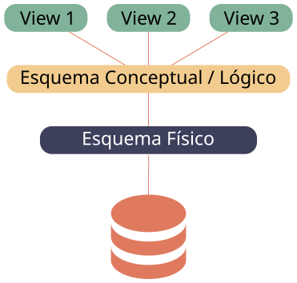

# Introdução aos Sistemas de Gestão de Bases de Dados

```toc

```

## BD vs SGBD

Embora possam ser confundidos (incorretamente) no dia-a-dia, existe uma clara diferença
entre [**bases de dados**](color:green) e [**sistemas de gestão de bases de dados**](color:yellow).

Uma [**base de dados**](color:green) é, como o próprio nome indica, um conjunto de dados
que estão interligados entre si.
Frequentemente, descreve organizações que existem no mundo real.  
Por exemplo, numa instituição como o Técnico, é preciso associar professores a um
departamento. Teremos então duas [**entidades**](color:pink): professores e departamentos.
Estas duas entidades estão [**relacionadas**](color:purple): o professor _X_ pertence ao departamento _Y_.

Por outro lado, um [**sistema de gestão de bases de dados**](color:yellow) é um pacote de
software que está desenhado para guardar e gerir bases de dados.
Existem diferentes tipos de SGBDs, como veremos mais à frente.  
Os SGBDs têm de uma grande quantidade de funcionalidades para facilitar a vida a
quem usa bases de dados (e.g. programadores), como garantias de consistência,
controlo de acessos, gestão de concorrência (_transactions_), e muito mais.  
Estas são também vantagens da utilização de SGBDs em vez de [**ficheiros**](color:red),
visto que, nesse caso, um programador necessitaria de programar estas funcionalidades a partir do
zero todas as vezes, enquanto que os SGBDs conseguem abstrair toda essa complexidade.


Hoje em dia, existem vários [**sistemas de gestão de bases de dados**](color:yellow),
cada um com as suas vantagens e desvantagens, entre os quais:
MySQL, MariaBD, PostgreSQL, SQLite, Microsoft SQL Server, Oracle Database, H2,
Microsoft Access, e muitos outros.
Todos estes são exemplos de SGBDs relacionais. Existem outros tipos de SGBDs,
como é o caso do _NoSQL_, sobre os quais iremos falar no futuro.

Hoje em dia, existem também serviços cloud que nos dão acesso a bases de dados
de uma forma extremamente simples e escalável, como a Amazon Web Services e
a Azure Cloud.

## Vantagens e Desvantagens de SGBDs

[**Vantagens**](color:green)

Já referenciámos algumas das vantagens dos SGBDs, no entanto existem muitas mais.

- **Independência dos dados**

  Existe uma camada de abstração entre a representação dos dados quando são armazenados
  e aquilo a que as aplicações têm acesso. Uma aplicação não tem de saber (nem sabe)
  como é feito o armazenamento dos dados.  
  Podemos, por exemplo, tanto por razões de _performance_ como de resiliência,
  ter os dados armazenados em discos diferentes ou até máquinas diferentes.
  As nossas aplicações nunca precisam de ter isto em conta.

- **Acesso Eficiente aos Dados**

  A nível de armazenamento, os SGBDs usam várias técnicas sofisticadas para tornar
  o armazenamento e recolha de dados num processo eficiente.

  A nível de interface, conseguimos inferir certos dados a partir de informação
  já existente, assim como representar relações complexas.

- **Integridade dos Dados e Segurança**

  Quando estamos a modelar dados do mundo real, por vezes existem restrições a que temos
  de obedecer para assegurar que os dados são válidos. Este processo é denominado por
  garantia da integridade dos dados, e é algo que os SGBDs fazem por nós.  
  Por exemplo, no Técnico queremos garantir que um aluno não está a fazer mais
  de 42 ECTS por semestre. Podemos dar esta regra ao nosso SGBD e não temos
  de nos preocupar com esta restrição no desenvolvimento da aplicação.

  Ao contrário de outras formas de armazenamento de dados, como ficheiros, os SGBDs
  dão-nos uma granularidade de permissões muitíssimo elevada de forma a controlar
  os acessos para cada utilizador.

- **Armazenamento Persistente**

  Quando usamos um SGBD temos a certeza que, quando acabamos de executar uma instrução
  (e.g. inserir, atualizar, apagar, etc.), essa instrução foi executada e guardada
  persistentemente. Caso haja uma falha imediatamente após a execução de qualquer instrução,
  temos a garantia que não perdemos estes dados.

- **Administração dos Dados**

  Permite a separação de funções: quem desenvolve a aplicação não necessita de
  ser a mesma pessoa que administra a base de dados.
  Assim, pode-se ter um profissional muito mais experiente só focado no SGBD,
  melhorando o armazenamento e recolha de dados.

- **Acesso Concorrente e Recuperação de Falhas**

  Os SGBDs proporcionam ferramentas (_transactions_) para minimizar o tempo perdido
  por acessos concorrentes, minimizando também as falhas que possam ocorrer.

- **Redução do Tempo de Desenvolvimento de Aplicações**

  Com todas as ferramentas disponibilizadas pelos SGBDs, assim como linguagens
  próprias de interrogação dedicadas a dados (e.g. SQL), o trabalho dos programadores
  fica imensamente facilitado.
  Estas linguagens dão uma interface de alto nível para os dados, que, tal como já
  vimos, permitem criar várias abstrações que simplificam o desenvolvimento de aplicações.

[**Desvantagens**](color:red)

Embora sejam muitas as vantagens dos SGBDs, existem algumas desvantagens a ter em conta:

- **Aplicações Muito Complexas**

  Por vezes, podemos ter aplicações muito complexas nas quais não nos é possível modelar
  os nossos dados num sistema relacional.

- **Desempenho Inaceitável (e.g. para aplicações de tempo-real)**

  Para algumas aplicações, como uma bolsa, os dados são alterados tão rapidamente
  que o desempenho dos SGBDs não é suficiente.

- **Falta de Análise Flexível para Certos Tipos de Dados**

  Maioritariamente para texto, em que podemos querer fazer pesquisas avançadas
  (e.g. _full text search_, _fuzzy search_), algo que a maioria dos SGBDs não suporta.

- **Falta de Necessidade**

  Para aplicações extremamente simples ou com dados maioritariamente imutáveis,
  pode não fazer sentido a introdução de um SGBD, por mais pequeno que seja
  o _overhead_ de o fazer hoje em dia.
  Uma aplicação deste tipo não beneficiaria de um SGBD.

## Modelo ANSI-SPARC



O aparecimento do [modelo ANSI-SPARC](https://en.wikipedia.org/wiki/ANSI-SPARC_Architecture) foi
um passo importante na criação dos SGBDs relacionais que conhecemos hoje em dia, visto
que propôs a separação da base de dados em 3 níveis.

- **Nível Externo (_views_)**: Uma _view_ descreve como os utilizadores vêem os dados.
  Cada utilizador pode ter _views_ diferentes, particulares a si mesmo, sendo
  reflexões dos dados que lhe são úteis e a que simultaneamente tem acesso.
  Cada _view_ pode ser partilhada por vários utilizadores e cada utilizador
  pode ter acesso a várias _views_.

- **Nível Conceptual/Lógico**: O nível conceptual é responsável por descrever que dados existem
  na base de dados e como se relacionam entre si. Em SGBDs relacionais, isto é
  aquilo a que casualmente nos referimos como _schema_.

- **Nível Físico/Interno**: O nível físico é responsável pelo armazenamento dos dados, isto é,
  pela sua representação interna no sistema.

:::info[Exemplo]

Imaginemos que temos o seguinte esquema lógico:

```
Student (ist_id: string, student_name: string, birthday: date)
Course (course_id: string, course_name: string,
        description: integer)
Shift (shift_id: string, course_id: string, capacity: integer)
Enrollment (ist_id: string, shift_id: string)
Room (room_name: string, course_id: string, capacity: integer)
```

Uma possível _view_ para este esquema lógico seria:

```
CourseShiftRooms (room_name: string, course_name: string,
                  enrolled_count: integer)
```

Podemos reparar que esta relação não está representada explicitamente no
esquema lógico, no entanto todos os dados podem ser derivados das relações
definidas no mesmo.

:::

A [**grande vantagem**](color:green) desde modelo é a independência dos dados. Como estamos
a dividir a estrutura em três níveis, podemos alterar cada um deles sem ter de propagar
estas alterações "para cima":

- Podemos alterar o esquema lógico sem alterar as nossas aplicações, visto que as vistas
  se podem manter.
- Podemos alterar a organização física dos dados, isto é, como são armazenados, sem termos
  de modificar o esquema lógico.

## Modelos de Dados

Um SGBD tem de usar um **modelo de dados**, um conjunto de conceitos e métodos, para descrever
**dados**, **relacionamentos**, **semântica de dados** e **restrições**.

Existem vários tipos de modelos de dados hoje em dia:

- **Relacionais** (os mais usados)
- **Entidade-Relação** (para conceção de bases de dados)
- **Baseados em Objetos** (Orientados a Objetos ou Objeto-Relacionais)
- **Semi-Estruturados** (XML, JSON, etc.)

Historicamente, também era comum o uso de modelos de dados **em rede** e **hierárquicos**.

### Modelo Relacional

Atualmente, o **modelo relacional** é o mais usado.
Como o próprio nome indica, é composto por relações.
Uma **relação**, vulgarmente conhecida como tabela (ou _table_), é constituída pelo seu **nome**,
o **nome de cada atributo** (_field_) e o **tipo de dados de cada atributo**.

:::info[Exemplo]

```
Student (ist_id: string, student_name: string, birthday: date)
```

Podemos depois adicionar linhas (_rows_) nesta relação. Neste caso, cada linha
representa um único aluno.

| `ist_id`   | `student_name` | `birthday` |
| ---------- | -------------- | ---------- |
| ist123456 | Diogo          | 2002-03-06 |
| ist123234 | Rafa           | 2002-08-05 |
| ist124453 | Tomás          | 2002-12-18 |
| ist123534 | Diogo          | 2001-09-16 |
| ist123532 | Diogo          | 2002-04-27 |

:::

Neste exemplo, faria também sentido impor restrições de integridade.
Neste caso, a restrição mais óbvia é garantir que não existem dois alunos diferentes
com o mesmo `ist_id`. No entanto, podem existir alunos com o mesmo nome.  
Mais à frente, veremos como podemos indicar ao SGBD para seguir estas regras,
de forma a assegurar a integridade dos dados.

## Arquitetura de SGBDs

Para falarmos com os SGBDs, temos de usar uma linguagem que eles compreendam de modo a
expressar de forma clara as nossas intenções. No caso do modelo relacional, é geralmente
utilizado o [**SQL**](color:orange) (Structured Query Language).

Na imagem abaixo, podemos ver o esquema que representa a estrutura de todo o fluxo de execução
entre a aplicação e a base de dados, passando pelo SGBD.


Quando executamos uma _query_ (interrogação), esta é enviada à
_query evaluation engine_, que depois acede a várias outras partes
do SGBD para conseguir completar o pedido.

Iremos falar com mais detalhe de cada um destes "módulos" do SGBD mais à frente.