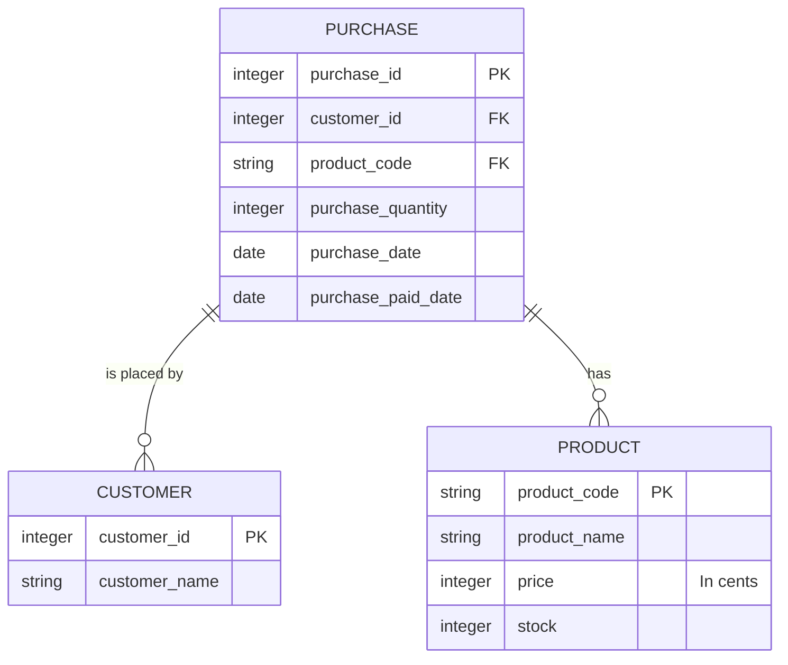

# SQL

```toc

```

## O que é SQL?

Para comunicar com os [SGBDs](/bd/intro-dbms), necessitamos de uma linguagem adequada.
Surgiu assim o [**SQL**](color:orange), [_Structured Query Language_](https://en.wikipedia.org/wiki/SQL),
uma linguagem dedicada à interação com SGBDs, geralmente relacionais, e que está de acordo com
as necessidades de inserir, atualizar, apagar e obter dados.

Dado que inicialmente a linguagem se chamava SEQUEL, hoje em dia são aceites
como pronúncia [tanto S-Q-L como SEQUEL](https://redd.it/opjxwh).

Dado que toda a interação com o SGBD é feita através de SQL, a linguagem suporta um
vasto leque de ações:

- Criação e gestão de tabelas (relações) e outros objetos
  - `CREATE`, `ALTER`, `DROP`
- Manipulação de dados (inserção, atualização e eliminação)
  - `INSERT`, `UPDATE`, `DELETE`
- Interrogação (_query_) de dados
  - `SELECT`
- Transações (para concorrência, como iremos ver mais à frente)
  - `START TRANSACTION`, `COMMIT`, `ROLLBACK`
- Gestão administrativa (como de privilégios de utilizadores)
  - `GRANT`, `REVOKE`

Por norma, as _keywords_ de SQL são escritas em maiúsculas, embora também funcione
com minúsculas.

## Exemplo: Loja

Para facilitar a explicação das cláusulas SQL e de outros conceitos, vamos introduzir
um exemplo muito parecido ao mundo real.

Queremos modelar uma loja (intitulada "Frigu"), onde existem produtos, pedidos e clientes.
Cada produto é identificado pelo seu código de barras, nome, preço e stock.
Os clientes são identificados pelo seu número de cliente e nome.
Finalmente, as encomendas são identificadas pelo número de encomenda,
o cliente que a efetuou, o produto comprado, a quantidade deste
e a data da operação.

Para simplificar, vamos considerar que cada encomenda tem um único tipo de produto;
não é possível comprar dois produtos diferentes na mesma encomenda.  
Consideramos também que o preço de um produto não pode ser alterado, pois isso
afetaria as encomendas a ele associadas. Num programa real, deve-se guardar o preço
de compra juntamente com a encomenda.



:::warning[Porquê preços inteiros em vez de double/float?]
À primeira vista, decidiríamos usar um tipo de dados com suporte para casas decimais
para o preço de um produto. No entanto, e especialmente quando estamos a trabalhar
com dinheiro, devemos evitar estes tipos de dados visto que podem introduzir
[erros de arredondamento](https://en.wikipedia.org/wiki/Floating-point_arithmetic#Accuracy_problems).  
Guardamos, assim, o preço em cêntimos, num inteiro.

Isto não é relevante no contexto da UC de Bases de Dados, mas é sempre importante
num contexto real.
:::

### Restrições

Reparamos que alguns atributos do diagrama acima estão anotados com "PK" e "FK".
Estas anotações correspondem, respetivamente, a "_Primary Key_" e "_Foreign Key_".

Uma [**Primary Key**](color:green) indica qual o campo que identifica uma entrada (_row_)
na tabela.

Por outro lado, uma [**Foreign Key**](color:yellow) indica uma relação entre duas tabelas.
Por exemplo, no diagrama acima, temos uma _foreign key_ entre o `customer_id` da tabela
`purchase` e o `customer_id` da tabela `customer`, para indicar que se referem ao mesmo.

Algo que vamos querer também é garantir que não existem valores _null_ nas colunas,
exceto na coluna `purchase_paid_date` da tabela `purchase`.

## Tipos de Dados em SQL

Quando criamos tabelas, temos de indicar o
[tipo de dados](https://www.postgresql.org/docs/current/datatype.html) de cada coluna.

Em SQL, existem os seguintes tipos de dados, entre outros:

- `char(n)` _(não recomendado)_: string de tamanho fixo `n`.
- `varchar(n)` _(recomendado)_: string de tamanho variável com, no máximo, `n` caracteres.
  Dependendo do SGBD, pode existir um valor máximo para `n`.
- `text` _(non standard)_: campo de texto, normalmente utilizado para grandes blocos de texto.
  Não pode ser utilizado como _primary key_.
- `int`: tipo numérico mais utilizado. Guarda inteiros de 4 bytes, isto é, de
  -2147483648 a +2147483647.
  - `smallint`/`bigint`: respetivamente, tipos numéricos de 2 e 8 bytes.
  - `unsigned int` _(non standard)_: apenas disponível em MySQL/MariaDB, guarda valores
    inteiros sem sinal, isto é, não negativos.
  - `serial`/`int auto_increment`: em PostgreSQL, `serial` equivale a um inteiro
    que é incrementado a cada linha inserida. É normalmente utilizado para atribuir
    um identificador único a cada linha. Em MySQL/MariaDB, o equivalente é `int auto_increment`.
- `numeric(p, d)`: representa um número exato, com `p` dígitos no total e
  `d` casas decimais, ou seja, `p - d` dígitos antes da casa decimal.
  O tipo `decimal(p, d)` é equivalente.
- `float`: representa números com vírgula flutuante com valores entre
  aproximadamente 1E-37 e 1E+37, com precisão de, pelo menos, 6 casas decimais.
  É de realçar que podem ocorrer erros de arredondamento.
  - `double`: semelhante, mas suporta valores entre 1E-307 e 1E+308, com precisão
    de, pelo menos, 15 dígitos.
- `timestamp`: representa um conjunto data e hora
  - `date`: representa uma data
  - `time`: representa uma hora
- `boolean`: representa um booleano (verdadeiro ou falso)

...e muitos outros, dependendo do SGBD.

## Criação e Destruição de Objetos

Em SQL, temos três cláusulas que nos permitem criar, modificar e destruir vários tipos
de objetos, como _databases_, _tables_, _indexes_, _views_, _procedures_, etc.

Regra geral, a sintaxe (simplificada) das cláusulas `CREATE`, `ALTER` e `DROP` é a seguinte:

```sql
-- Criar um objeto
CREATE <type> <name> [optional arguments];

-- Modificar um objeto
ALTER <type> <name> <arguments>;

-- Destruir um objeto
DROP <type> <name>;
```

Vejamos como podemos criar ou destruir certos objetos:

### Databases

Com estas cláusulas, podemos
[criar uma _database_](https://www.postgresql.org/docs/current/sql-createdatabase.html)
ou [eliminá-la](https://www.postgresql.org/docs/current/sql-dropdatabase.html).
Também é possível [modificar uma _database_](https://www.postgresql.org/docs/current/sql-alterdatabase.html),
embora seja menos comum.

```sql
-- Cria uma base de dados chamada "frigu"
CREATE DATABASE frigu;

-- Elimina a base de dados chamada "frigu"
-- Caso não exista, dá erro
DROP DATABASE frigu;

-- Elimina a base de dados chamada "frigu" se esta existir
-- Caso não exista, ignora e completa com sucesso
DROP DATABASE IF EXISTS frigu;
```

:::tip[Dica]
Em PostgreSQL, é possível listar as bases de dados existentes com o comando `\l`.

O equivalente em MySQL/MariaDB é `SHOW DATABASES;`.
:::

### Tabelas

```sql
-- Cria uma tabela "product" de acordo com o exemplo
CREATE TABLE product (
  product_code VARCHAR(255) NOT NULL,
  product_name VARCHAR(255) NOT NULL,
  price INT NOT NULL,
  stock INT NOT NULL,
  PRIMARY KEY(product_code)
);

-- Cria uma tabela "customer" de acordo com o exemplo.
-- SERIAL faz com que seja atribuído um valor
-- sequencial a customer_id para cada linha criada
CREATE TABLE customer (
  customer_id SERIAL NOT NULL,
  customer_name VARCHAR(255),
  PRIMARY KEY(customer_id)
);

-- Cria uma tabela "purchase" de acordo com o exemplo.
-- As colunas com foreign keys têm de ter o mesmo tipo
-- em ambas as tabelas (serial é equivalente a int)
CREATE TABLE purchase (
  purchase_id SERIAL NOT NULL,
  customer_id INT NOT NULL,
  product_code VARCHAR(255) NOT NULL,
  purchase_quantity INT NOT NULL,
  purchase_date TIMESTAMP NOT NULL,
  purchase_paid_date TIMESTAMP,
  PRIMARY KEY(purchase_id),
  FOREIGN KEY(customer_id) REFERENCES customer(customer_id),
  FOREIGN KEY(product_code) REFERENCES product(product_code)
);
```

:::tip[Dica]
Em PostgreSQL, é possível listar as tabelas existentes na base de dados atual com o comando `\dt`.
Para ver as colunas de uma tabela, pode-se utilizar o comando `\d <nome da tabela>`.

O equivalente em MySQL/MariaDB é `SHOW TABLES;` e `DESCRIBE <nome da tabela>`, respetivamente.
:::

De notar que em PostgreSQL se usa `SERIAL`, enquanto que em MySQL/MariaDB se usa
`INT AUTO_INCREMENT`.

Quando criamos uma [**foreign key**](color:yellow), podemos também definir regras
sobre o que fazer quando o valor é alterado/apagado. Por exemplo, o que fazer
se eliminarmos um produto? Queremos apagar todas as compras a si associadas?
Ou não permitimos que este seja eliminado?  
 Para isto, podemos usar as cláusulas `ON DELETE <referential_action>` e
`ON UPDATE <referential_action>`, onde `<referential_action>` é uma de:

- `NO ACTION` (_default_) / `RESTRICT`: produz um erro, pelo que não é possível
  completar a ação
- `CASCADE`: elimina as linhas correspondentes ao que foi apagado, ou atualiza
  os valores, se for o caso
- `SET NULL`: coloca as colunas correspondentes a _null_
- `SET DEFAULT`: coloca as colunas correspondentes no valor _default_

É possível encontrar informação mais detalhada na
[documentação de `CREATE TABLE` do PostgreSQL](https://www.postgresql.org/docs/current/sql-createtable.html).

Como exemplo, poderíamos ter definido a seguinte _foreign key_ para a relação
compra-produto, que atualizaria a compra caso o produto alterasse o seu código
ou eliminaria a compra caso o produto fosse eliminado:

```sql
FOREIGN KEY(product_code) REFERENCES product(product_code)
  ON UPDATE CASCADE ON DELETE CASCADE
```

Podemos também [**alterar tabelas**](color:orange).
Imaginemos que, mais tarde, na vida da nossa aplicação, queremos adicionar a tal
coluna à compra que indica qual foi o preço no momento da compra.

A [cláusula `ALTER TABLE`](https://www.postgresql.org/docs/current/sql-altertable.html)
permite-nos fazer exatamente isto (e muito mais!).

```sql
-- Adiciona a coluna "purchase_price" à tabela "purchase"
ALTER TABLE purchase
  ADD COLUMN purchase_price INT NOT NULL;
```

Finalmente, como vimos para as _databases_, podemos também [**eliminar tabelas**](color:red):

```sql
-- Elimina a tabela "purchase".
-- Dá erro caso a tabela não exista
DROP TABLE purchase;

-- Elimina a tabela "purchase".
-- Ignora caso a tabela não exista
DROP TABLE IF EXISTS purchase;
```

## Inserção de Dados em Tabelas

Podemos facilmente inserir dados em tabelas com a
[cláusula `INSERT`](https://www.postgresql.org/docs/current/sql-insert.html).

A sintaxe (simplificada) desta cálsula é

```sql
INSERT INTO <tabela> [opcionalmente, nome das colunas]
  VALUES <valores a inserir>;
```

Caso não indiquemos as colunas, serão consideradas todas as colunas da tabela
pela ordem em que foram declaradas, ou as primeiras `N` colunas caso só sejam
dadas `N` colunas nos valores a inserir.

Sendo assim, vejamos alguns exemplos:

```sql
-- Inserir um produto
INSERT INTO product VALUES ('111111', 'Bolachas', 50, 10);

-- Inserir múltiplos produtos
INSERT INTO product VALUES ('222222', 'Napolitanas', 25, 15),
  ('333333', 'Leite com Chocolate', 100, 3);

--  product_code |    product_name     | price | stock
-- --------------+---------------------+-------+-------
--  111111       | Bolachas            |    50 |    10
--  222222       | Napolitanas         |    25 |    15
--  333333       | Leite com Chocolate |   100 |     3

-- Inserir múltiplos clientes, indicando quais as colunas
-- que queremos preencher
INSERT INTO customer (customer_name) VALUES
  ('Diogo'), ('Tomás'), ('Rafa');

--  customer_id | customer_name
-- -------------+---------------
--            1 | Diogo
--            2 | Tomás
--            3 | Rafa
```

:::warning[Strings em SQL]
Em **PostgreSQL**, as **strings** têm obrigatoriamente de utilizar _single-quotes_ (`'`), visto
que _double-quotes_ (`"`) são usadas para nos referirmos a objetos da base de dados (tabelas, colunas, etc.).

Em **MySQL/MariaDB**, pode-se usar tanto _single-quotes_ como _double-quotes_ para **strings**,
sendo que para referenciar objetos da base de dados, usa-se _backticks_ (<code>`</code>).
:::

Mas então o que é que acontece se tentarmos inserir dados que não respeitam as restrições
impostas? O SGBD vai [rejeitar](color:red) a nossa _query_!

- Inserir duas linhas com o mesmo valor para a coluna da _primary key_:

  ```sql
  INSERT INTO product VALUES ('123', 'Maçã', 10, 5);

  INSERT INTO product VALUES ('123', 'Banana', 8, 4);
  -- ERROR:  duplicate key value violates unique constraint "product_pkey"
  -- DETAIL:  Key (product_code)=(123) already exists.
  ```

- Inserir uma linha que referencia um valor de outra tabela não existente:

  ```sql
  INSERT INTO purchase (customer_id, product_code,
    purchase_quantity, purchase_date)
    VALUES (100, '222222', 3, now());
  -- ERROR:  insert or update on table "purchase" violates foreign key constraint "purchase_customer_id_fkey"
  -- DETAIL:  Key (customer_id)=(100) is not present in table "customer".
  ```

## Atualização de Dados em Tabelas

Após inserirmos dados (linhas) em tabelas, podemos querer efetuar-lhes alterações.
A [cláusula `UPDATE`](https://www.postgresql.org/docs/current/sql-update.html)
permite-nos fazer exatamente isto: alterar os valores de uma ou mais linhas de uma tabela.

A sintaxe (simplificada) desta cláusula é:

```sql
UPDATE <tabela>
  SET <coluna1> = <expressao1>,
    <coluna2> = <expressao2>,
    ...
  WHERE <condição>;
```

:::danger[Atenção!]
Caso não indiquemos uma condição com a cláusula `WHERE`, o `UPDATE` irá reescrever
sobre [**todas**](color:red) as linhas existentes na tabela.
:::

Sendo assim, vejamos alguns exemplos:

```sql
-- Alterar o nome de um produto
UPDATE product SET product_name = 'Bolachas com Chocolate'
  WHERE product_name = 'Bolachas';

-- Incrementar o stock de um produto por 5
UPDATE product SET stock = stock + 5
  WHERE product_code = '222222';
```

## Eliminação de Dados em Tabelas

Após inserirmos ou atualizarmos dados (linhas) em tabelas, podemos querer apagá-los.
A [cláusula `DELETE`](https://www.postgresql.org/docs/current/sql-delete.html)
permite-nos fazer exatamente isto: eliminar uma ou mais linhas de uma tabela.

A sintaxe (simplificada) desta cláusula é:

```sql
DELETE FROM <tabela> WHERE <condição>;
```

:::danger[Atenção!]
Caso não indiquemos uma condição com a cláusula `WHERE`, o `DELETE` irá apagar
[**todas**](color:red) as linhas existentes na tabela.
:::

Sendo assim, vejamos alguns exemplos:

```sql
-- Apagar todas as linhas de uma tabela
DELETE FROM product;

-- Apagar todos os produtos com preço superior a 50 cêntimos
DELETE FROM product WHERE price > 50;
```

## Interrogação de Dados

Chegamos finalmente à parte mais complexa de SQL: as interrogações (_queries_).
Para efetuar uma _query_, utilizamos a
[cláusula `SELECT`](https://www.postgresql.org/docs/current/sql-select.html).

Como seria de esperar, a sintaxe desta cláusula é muito mais completa do que todas
as outras, visto que é a partir dela que podemos fazer qualquer interrogação
sobre os nossos dados.  
Assim, uma sintaxe simplificada desta cláusula é:

```sql
SELECT <colunas> FROM <tabela>
  -- todas as cláusulas daqui para baixo são opcionais
  WHERE <condição>
  GROUP BY <colunas>
  ORDER BY <colunas> [ordem]
  LIMIT <quantidade>;
  -- e muitos outros...
```

Como podemos ver, é possível juntar a cláusula `SELECT` a muitas outras cláusulas
para obtermos exatamente os dados que queremos.

De seguida, vamos ver algumas destas cláusulas a ser aplicadas independentemente
por uma questão de simplicidade, mas numa situação real é bastante provável que
estas apareçam todas juntas.

### Cláusula `WHERE`

Já conhecemos esta cláusula da [atualização](#atualização-de-dados-em-tabelas)
e [eliminação](#eliminação-de-dados-em-tabelas) de dados em tabelas, mas
vamos agora aprofundar o nosso estudo sobre a mesma.

A sintaxe da [cláusula `WHERE`](https://www.postgresql.org/docs/current/queries-table-expressions.html#QUERIES-WHERE) é, trivialmente,

```sql
WHERE <condição>
```

Podemos ter também condições compostas, isto é, com operadores lógicos `AND` e `OR`, por exemplo.

Vejamos os seguintes exemplos:

```sql
-- Obtém o nome e stock dos produtos com preço superior
-- ou igual a 100 cêntimos (1€)
SELECT product_name, stock FROM product
  WHERE price >= 100;

-- Obtém todas as colunas dos produtos com preço entre
-- 20 e 80 cêntimos
SELECT * FROM product
  WHERE price BETWEEN 20 AND 80;

-- Obtém o código dos produtos com preço superior a
-- 30 cêntimos e stock inferior a 5
SELECT product_code FROM product
  WHERE price > 30 AND stock < 5;

-- Obtém todas as colunas dos produtos com preço
-- igual a 20, 50, 80 ou 90 cêntimos
SELECT * FROM product
  WHERE price IN (20, 50, 80, 90);
```

#### Filtros que Dependem de Outras Tabelas

Além dos exemplos relativamente simples apresentados acima, podemos também
juntas duas _queries_ para efetuar um filtro mais avançado.

```sql
-- Obtém todas as colunas das compras cujos produtos
-- tenham um preço superior a 50 cêntimos
SELECT * FROM purchase
  WHERE product_code IN (
    SELECT product_code FROM product
      WHERE price > 50
  );
```

:::warning[Aviso de Desempenho]
É de notar que intercalar _queries_ desta forma pode causar problemas
de desempenho, pelo que é recomendada a utilização de outra cláusula,
o `JOIN`, que iremos ver mais abaixo.
:::

#### Cláusula `LIKE`

Por vezes, queremos filtrar por um campo de texto, mas por uma expressão e não
por um valor exato. Por exemplo, podemos querer todos os produtos que contenham
"Bolacha" no nome.

A [cláusula `LIKE`](https://www.postgresql.org/docs/current/functions-matching.html)
permite-nos criar expressões simples para efetuar estes filtros.  
A sintaxe é, simplesmente,

```sql
<string/coluna> LIKE <padrão>
```

Este padrão é uma string normal que pode conter dois caracteres especiais, `%` e `_`:

- `%`: corresponde a uma sequência de zero ou mais caracteres
- `_`: corresponde a qualquer caractere uma e apenas uma vez

Como é óbvio, caso o padrão não contenha nenhum destes dois caracteres, as
strings são apenas comparadas por igualdade.

Vejamos, então, alguns exemplos:

| Input | Padrão | Resultado             |
| ----- | ------ | --------------------- |
| `abc` | `abc`  | [_true_](color:green) |
| `abc` | `a%`   | [_true_](color:green) |
| `abc` | `_b_`  | [_true_](color:green) |
| `abc` | `c`    | [_false_](color:red)  |
| `abc` | `c%`   | [_false_](color:red)  |
| `abc` | `%c_`  | [_false_](color:red)  |
| `abc` | `%c%`  | [_true_](color:green) |

:::tip[Maiúsculas e Minúsculas]
No _standard_ SQL, a cláusula `LIKE` é sensível a maiúsculas e minúsculas.  
Em **PostgreSQL**, existe uma extensão, `ILIKE`, que funciona de igual modo, mas ignora
maiúsculas e minúsculas.
:::

:::tip[_Escaping_ do padrão]
Se quisermos procurar uma string que contenha mesmo `%` ou `_`, podemos fazer
_escape_ destes caracteres, como seria de esperar: `5\%`.
:::

### Cláusula `GROUP BY`

Podemos querer agrupar várias linhas de uma tabela que têm o mesmo valor
para uma coluna. Por exemplo, podemos querer saber quantas unidades de cada produto
já se venderam.

Por exemplo, considerando que temos os seguintes dados na tabela das compras
(algumas colunas omitidas para simplificar):

| `customer_id` | `product_code` | `purchase_quantity` |
| ------------: | :------------- | ------------------: |
|             1 | 222222         |                   3 |
|             2 | 222222         |                   6 |
|             1 | 111111         |                   7 |

```sql
-- Obter a soma das quantidades de todas as compras,
-- agrupadas por produto
SELECT product_code, SUM(purchase_quantity) AS quantity
  FROM purchase
  GROUP BY product_code;

--  product_code | quantity
-- --------------+----------
--  222222       |        9
--  111111       |        7
```

Podemos claramente ver que foram somadas as duas linhas que se referiam
ao mesmo produto, independentemente do cliente que efetuou a compra.

### Cláusula `ORDER BY`

Esta cláusula permite-nos definir regras de ordenação para as nossas _queries_.
Podemos ordenar por números, texto, etc e indicar se queremos ordem crescente ou
decrescente.

A sintaxe desta cláusula é

```sql
ORDER BY <coluna1> <ordem1>, <coluna2> <ordem2>, ...
```

sendo que `<ordemX>` é `ASC` (valor por omissão) ou `DESC`.

Considerando os seguintes valores para a tabela `product`,

| `product_code` | `product_name`      | `price` | `stock` |
| -------------- | ------------------- | ------- | ------- |
| 111111         | Bolachas            | 50      | 10      |
| 222222         | Napolitanas         | 25      | 15      |
| 333333         | Leite com Chocolate | 100     | 3       |
| 444444         | Amendoins           | 100     | 1       |

vejamos o seguinte exemplo:

```sql
-- Ordenar por preço crescente
SELECT * FROM product ORDER BY price;

--  product_code |    product_name     | price | stock
-- --------------+---------------------+-------+-------
--  222222       | Napolitanas         |    25 |    15
--  111111       | Bolachas            |    50 |    10
--  333333       | Leite com Chocolate |   100 |     3
--  444444       | Amendoins           |   100 |     1

-- Ordenar por preço decrescente
SELECT * FROM product ORDER BY price DESC;

--  product_code |    product_name     | price | stock
-- --------------+---------------------+-------+-------
--  333333       | Leite com Chocolate |   100 |     3
--  444444       | Amendoins           |   100 |     1
--  111111       | Bolachas            |    50 |    10
--  222222       | Napolitanas         |    25 |    15

-- Ordenar por preço decrescente, desempatar por ordem alfabética
SELECT * FROM product ORDER BY price DESC, product_name;

--  product_code |    product_name     | price | stock
-- --------------+---------------------+-------+-------
--  444444       | Amendoins           |   100 |     1
--  333333       | Leite com Chocolate |   100 |     3
--  111111       | Bolachas            |    50 |    10
--  222222       | Napolitanas         |    25 |    15
```

:::warning[Ordenação de Caracteres Acentuados]
Quando estamos a ordenar caracteres com acentos, a sua ordem
vai depender da [_collation_](https://www.postgresql.org/docs/current/collation.html)
definida nas definições da base de dados, ou se o SGBD suportar, da coluna.
:::

### Cláusula `LIMIT`

Como o nome indica, esta cláusula limita as linhas que nos são apresentadas
ao número que indicamos.

A sintaxe desta cláusula é

```sql
LIMIT <quantidade>
```

Por exemplo, juntando com a cláusula `ORDER BY` (o que não é necessário):

```sql
-- Obter os dois primeiros produtos por ordem alfabética
SELECT * FROM product
  ORDER BY product_name
  LIMIT 2;
```
