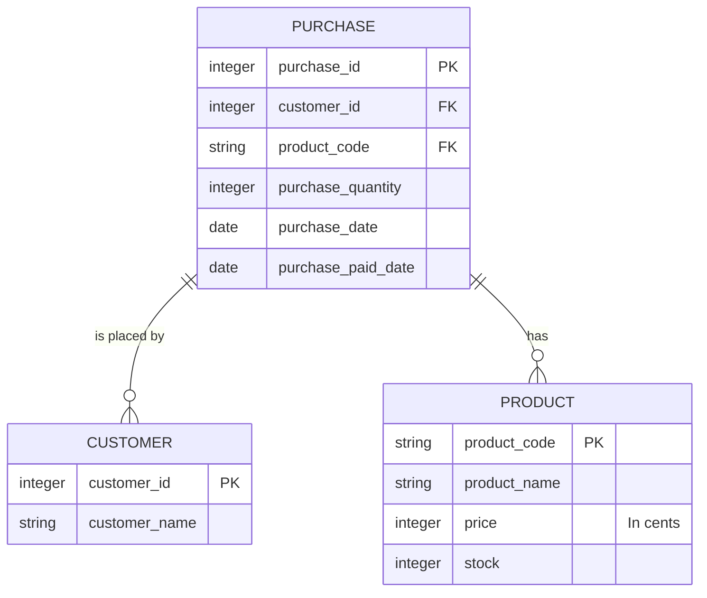

# SQL

```toc

```

## O que é SQL?

Para comunicar com os [SGBDs](/bd/intro-dbms) necessitamos de uma linguagem adequada.
Surgiu assim o [**SQL**](color:orange), Structured Query Language, uma linguagem
dedicada à interação com SGBDs, geralmente relacionais, e que está de acordo com
as necessidades de inserir, atualizar, apagar e obter dados.

Dado que inicialmente a linguagem chamava-se SEQUEL, hoje em dia são aceites
como pronúncia [tanto S-Q-L como SEQUEL](https://redd.it/opjxwh).

Dado que toda a interação com o SGBD é feita através de SQL, a linguagem suporta um
vasto leque de ações:

- Criação e gestão de tabelas (relações) e outros objetos
  - `CREATE`, `ALTER`, `DROP`
- Manipulação de dados (inserção, atualização e eliminação)
  - `INSERT`, `UPDATE`, `DELETE`
- Interrogação (_query_) de dados
  - `SELECT`
- Transações (para concorrência, como iremos ver mais à frente)
  - `START TRANSACTION`, `COMMIT`, `ROLLBACK`
- Gestão administrativa, como de privilégios de utilizadores
  - `GRANT`, `REVOKE`

Por norma, as _keywords_ de SQL são escritas em maiúsculas, embora também funcione
com minúsculas.

## Exemplo: Loja

Para facilitar a explicação dos comandos SQL e de outros conceitos, vamos introduzir
um exemplo muito parecido ao mundo real.

Queremos modelar uma loja (intitulada "Frigu"), onde existem produtos, pedidos e clientes.
Cada produto é identificado pelo seu código de barras, nome, preço e stock.
Os clientes são identificados pelo seu número de cliente e nome.
Finalmente, as encomendas são identificadas pelo número de encomenda,
o cliente que efetuou a encomenda, o produto comprado, a quantidade de produto comprado
e a data da operação.

Para simplificar, vamos considerar que cada encomenda tem um único tipo de produto;
não é possível comprar dois produtos diferentes na mesma encomenda.  
Consideramos também que o preço de um produto não pode ser alterado, pois isso
afetaria as encomendas a ele associadas. Num programa real deve-se guardar o preço
de compra juntamente com a encomenda.



:::warning[Porquê preços inteiros em vez de double/float?]
À primeira vista decidiríamos usar um tipo de dados com suporte para casas decimais
para o preço de um produto. No entanto, e especialmente quando estamos a trabalhar
com dinheiro, devemos evitar estes tipos de dados visto que podem introduzir
[erros de arredondamento](https://en.wikipedia.org/wiki/Floating-point_arithmetic#Accuracy_problems).  
Guardamos assim o preço em cêntimos, num inteiro.

Isto não é relevante no contexto da UC de Bases de Dados, mas é sempre importante
num contexto real.
:::

### Restrições

Reparamos que alguns atributos do diagrama acima estão anotados com "PK" e "FK".
Estas anotações correspondem, respetivamente, a "Primary Key" e "Foreign Key".

Uma [**Primary Key**](color:green) indica qual o campo que identifica uma entrada (_row_)
na tabela.

Por outro lado, uma [**Foreign Key**](color:yellow) indica uma relação entre duas tabelas.
Por exemplo, no diagrama acima, temos uma foreign key entre o `customer_id` da tabela
`purchase` e o `customer_id` da tabela `customer`, para indicar que se referem ao mesmo.

Algo que vamos querer também é garantir que não existem valores _null_ nas colunas,
exceto na coluna `purchase_paid_date` da tabela `purchase`.

## Tipos de Dados em SQL

Quando criamos tabelas temos de indicar o
[tipo de dados](https://www.postgresql.org/docs/current/datatype.html) de cada coluna.

Em SQL existem os seguintes tipos de dados, entre outros:

- `char(n)` _(não recomendado)_: string de tamanho fixo `n`.
- `varchar(n)` _(recomendado)_: string de tamanho variável, com no máximo `n` caracteres.
  Dependendo do SGBD pode existir um valor máximo para `n`.
- `text` _(non standard)_: campo de texto, normalmente utilizado para grandes blocos de texto.
  Não pode ser utilizado como _primary key_.
- `int`: tipo numérico mais utilizado. Guarda inteiros de 4 bytes, isto é, de
  -2147483648 a +2147483647.
  - `smallint`/`bigint`: respetivamente, tipos numéricos de 2 e 8 bytes.
  - `unsigned int` _(non standard)_: apenas disponível em MySQL/MariaDB, guarda valores
    inteiros sem sinal, isto é, não negativos.
- `numeric(p, d)`: representa um número exato, com `p` dígitos no total e
  `d` casas decimais, ou seja, `p - d` dígitos antes da casa decimal.
  O tipo `decimal(p, d)` é equivalente.
- `float`: representa números com vírgula flutuante com valores entre
  aproximadamente 1E-37 a 1E+37, com precisão de, pelo menos, 6 casas decimais.
  É de realçar que podem ocorrer erros de arredondamento.
  - `double`: semelhante, mas suporta valores entre 1E-307 e 1E+308, com precisão
    de, pelo menos, 15 dígitos.
- `timestamp`: representa um conjunto data e hora
  - `date`: representa uma data
  - `time`: representa uma hora
- `boolean`: representa um booleano (verdadeiro ou falso)

...e muitos outros, dependendo do SGBD.

## Criação e Destruição de Objetos

Em SQL temos dois comandos que nos permitem criar e destruir vários tipos de objetos,
como _databases_, _tables_, _indexes_, _views_, _procedures_, etc.

Regra geral, a sintaxe dos comandos `CREATE`, `ALTER` e `DROP` são a seguinte:

```sql
-- Criar um objeto
CREATE <type> <name> [optional arguments];

-- Modificar um objeto
ALTER <type> <name> <arguments>;

-- Destruir um objeto
DROP <type> <name>;
```

Vejamos como podemos criar ou destruir certos objetos:

### Databases

Com estes comandos, podemos
[criar uma _database_](https://www.postgresql.org/docs/14/sql-createdatabase.html)
ou [eliminá-la](https://www.postgresql.org/docs/14/sql-dropdatabase.html).
Também é possível [modificar uma _database_](https://www.postgresql.org/docs/14/sql-alterdatabase.html),
embora menos comum.

```sql
-- Cria uma base de dados chamada "frigu"
CREATE DATABASE frigu;

-- Elimina a base de dados chamada "frigu"
-- Caso não exista, dá erro
DROP DATABASE frigu;

-- Elimina a base de dados chamada "frigu" se esta existir
-- Caso não exista, ignora e completa com sucesso
DROP DATABASE IF EXSITS frigu;
```

:::tip[Dica]
Em PostgreSQL, é possível listar as bases de dados existentes com o comando `\l`.

O equivalente em MySQL/MariaDB é `SHOW DATABASES;`.
:::

### Tabelas

```sql
-- Cria uma tabela "product" de acordo com o exemplo
CREATE TABLE product (
  product_code VARCHAR(255) NOT NULL,
  product_name VARCHAR(255) NOT NULL,
  price INT NOT NULL,
  stock INT NOT NULL,
  PRIMARY KEY(product_code)
);

-- Cria uma tabela "customer" de acordo com o exemplo.
-- SERIAL faz com que seja atribuído um valor
-- sequencial a customer_id para cada linha criada
CREATE TABLE customer (
  customer_id SERIAL NOT NULL,
  customer_name VARCHAR(255),
  PRIMARY KEY(customer_id)
);

-- Cria uma tabela "purchase" de acordo com o exemplo.
-- As colunas com foreign keys têm de ter o mesmo tipo
-- em ambas as tabelas
CREATE TABLE purchase (
  purchase_id SERIAL NOT NULL,
  customer_id SERIAL NOT NULL,
  product_code VARCHAR(255) NOT NULL,
  purchase_quantity INT NOT NULL,
  purchase_date TIMESTAMP NOT NULL,
  purchase_paid_date TIMESTAMP,
  PRIMARY KEY(purchase_id),
  FOREIGN KEY(customer_id) REFERENCES customer(customer_id),
  FOREIGN KEY(product_code) REFERENCES product(product_code)
);
```

:::tip[Dica]
Em PostgreSQL, é possível listar as tableas existentes na base de dados atual com o comando `\dt`.
Para ver as colunas de uma tabela, pode-se utilizar o comando `\d <nome da tabela>`.

O equivalente em MySQL/MariaDB é `SHOW TABLES;` e `DESCRIBE <nome da tabela>`, respetivamente.
:::

De notar que em PostgreSQL se usa `SERIAL`, enquanto em MySQL/MariaDB se usa
`INT AUTO_INCREMENT`.

Quando criamos uma [**foreign key**](color:yellow) podemos também definir regras
sobre o que fazer quando o valor é alterado/apagado. Por exemplo, o que fazer
se eliminarmos um produto? Queremos apagar todas as compras a si associadas?
Ou não permitimos que este seja eliminado?  
 Para isto podemos usar as clausulas `ON DELETE <referetial_action>` e
`ON UPDATE <referential_action>`, onde `<referential_action>` é uma de:

- `NO ACTION` (default) / `RESTRICT`: produz um erro pelo que não é possível
  completar a ação
- `CASCADE`: elimina as linhas correspondentes ao que foi apagado, ou atualiza
  os valores se for o caso
- `SET NULL`: coloca as colunas correspondentes a _null_
- `SET DEFAULT`: coloca as colunas correspondentes no valor _default_

É possível encontrar informação mais detalhada na
[documentação de `CREATE TABLE` do PostgreSQL](https://www.postgresql.org/docs/14/sql-createtable.html).

Como exemplo, poderíamos ter definido a seguinte _foreign key_ para a relação
compra-produto, que atualizaria a compra caso o produto alterasse o seu código
ou eliminaria a compra caso o produto fosse eliminado:

```sql
FOREIGN KEY(product_code) REFERENCES product(product_code)
  ON UPDATE CASCADE ON DELETE CASCADE
```

Podemos também [**alterar tabelas**](color:orange).
Imaginemos que mais tarde na vida da nossa aplicação queremos adicionar a tal
coluna à compra que indica qual foi o preço no momento da compra.

O [comando `ALTER TABLE`](https://www.postgresql.org/docs/14/sql-altertable.html)
permite-nos fazer exatamente isto (e muito mais!).

```sql
-- Adiciona a coluna "purchase_price" à tabela "purchase"
ALTER TABLE purchase
  ADD COLUMN purchase_price INT NOT NULL;
```

Finalmente, como vimos para as _databases_ podemos também [**eliminar tabelas**](color:red):

```sql
-- Elimina a tabela "purchase".
-- Dá erro caso a tabela não exista
DROP TABLE purchase;

-- Elimina a tabela "purchase".
-- Ignora caso a tabela não exista
DROP TABLE IF EXISTS purchase;
```

<!--

TODO:

- criar exemplo com shop, em que há produtos e purchases e clients - done
- data types existentes
- create/drop database - done
- create/drop table - done
- inserting data
- updating data (show that you can update with relation to existing value (i.e. multiply by X))
- deleting data

- queries
  - referir ordem das clausulas
  - where

-->
