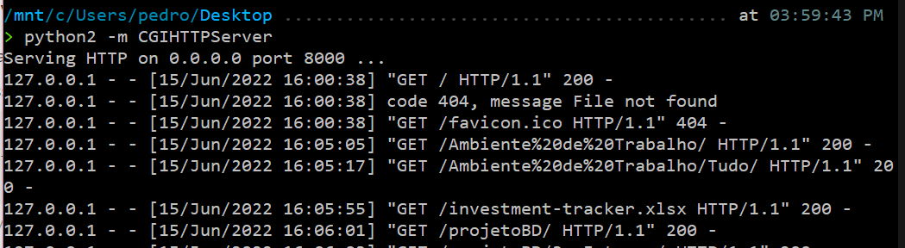
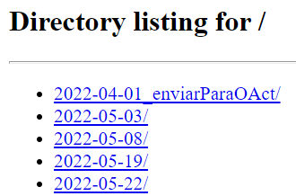
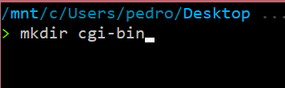
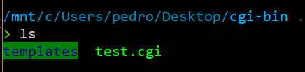
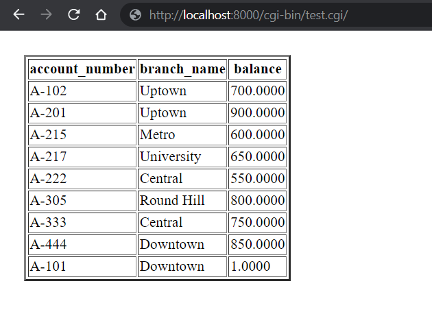

# Correr .cgi localmente


---
title: Correr .cgi localmente
description: >-
 Guia de como correr um script .cgi numa máquina local
path: /bd/Recrusos/Correr-CGI-localmente
type: content
---

# SQL

```toc

```


Olá! :D

Esta página é um tutorial de como correr os ficheiros .cgi no vosso computador, de forma a conseguirem fazer debug e serem mais eficientes a fazer a aplicação web de BD.

---

# Permissões para ter `localhost`

## Windows

Se estiverem em Windows, precisam de dar permissões para ter `[localhost](http://localhost)` no vosso PC.

Para isso, sigam este video:

[https://www.youtube.com/watch?v=ZsZ5L54Cl1A](https://www.youtube.com/watch?v=ZsZ5L54Cl1A)

## Linux

Se estiverem em Linux, não sei como é que fazem. A única coisa que sei é que Windows >> Linux.

# Servidor local

Precisam de um servidor local.

Para isso, corram este código numa shell de Linux (se usarem Windows, podem fazer por WSL):

```bash
python2 -m CGIHTTPServer
```

Ao fazer isso, o output esperado é algo do género:



Este código tem que ficar a correr enquanto querem ter acesso ao script .cgi, ou seja, vão ter que deixar a “janela aberta”. 

Se escreverem [`localhost](http://localhost):8000` no browser vão ver algo do género:



No meu caso, o `[localhost](http://localhost)` está a apresentar a minha pasta de Ambiente de Trabalho.

# Pasta cgi-bin

Agora, precisam de criar um diretório chamado `cgi-bin` na diretoria em que o `[localhost](http://localhost)` está a mostrar:



Este diretório é reconhecido pelo código que correram no 2º passo para correr os ficheiros que lá estão dentro.

Coloquem neste diretório o ficheiro `.cgi` que querem que seja corrido juntamente com o diretório `templates` com os ficheiros `.html` que querem que corra (podem colocar o ficheiro do **lab9** que serve como template e vão mudando as cenas):



## Instalem as dependências

Têm que ter `flask`, `psycopg2` e `postgre` instalados:

```bash
pip3 install Flask
```

```bash
sudo apt-get install postgresql
```

```bash
pip3 install psycopg2
```

Também tive que fazer isto:

```bash
pip3 install --upgrade wheel
```

```bash
pip3 install testresources
```

```bash
pip3 install --upgrade setuptools
```

```bash
sudo apt-get install libpq-dev
```

## Acedam ao ficheiro

Finalmente, basta aceder ao link [`http://localhost:8000/cgi-bin/test.cgi/`](http://localhost:8000/cgi-bin/test.cgi/) que o vosso código flask irá ser corrido!

