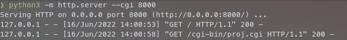
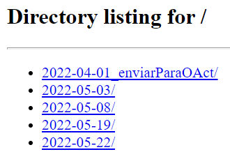
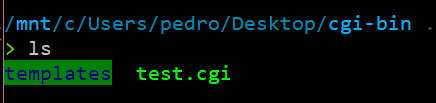
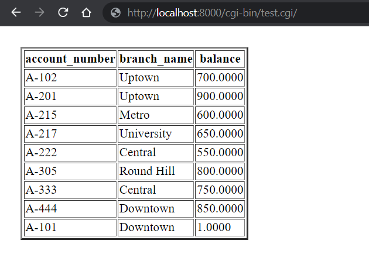

# Correr .cgi Localmente

```toc

```

Olá! \:D

Esta página é um tutorial de como correr os ficheiros `.cgi` no vosso computador, de forma a conseguirem fazer debug e serem mais eficientes a fazer a aplicação web de BD.

## Servidor Local

Precisam de um servidor local. Vamos o usar o que vem com o [Python](https://docs.python.org/3/library/http.server.html#http.server.CGIHTTPRequestHandler).

Para isso, corram este código numa shell de Linux (se usarem Windows, podem fazer por WSL):

```bash
python3 -m http.server --cgi 8000
```

Ao fazer isso, o output esperado é algo do género:



Este código tem que ficar a correr enquanto querem ter acesso ao script `.cgi`, ou seja, vão ter que deixar a “janela aberta”.

Se escreverem [`localhost:8000`](http://localhost:8000) no browser vão ver algo do género:



No meu caso, o [`localhost:8000`](http://localhost:8000) está a apresentar a minha pasta de Ambiente de Trabalho.

## Pasta cgi-bin

Agora, precisam de criar um diretório chamado `cgi-bin` na diretoria que o [`localhost:8000`](http://localhost:8080) está a mostrar:

```bash
mkdir cgi-bin
```

:::tip[Criar um symlink]
Pode não nos dar jeito colocar os ficheiros dentro desta pasta ou ter a pasta com outro nome.
**Alternativamente** a criar a pasta acima, podemos criar um symlink, como se fosse um "atalho":

```bash
ln -s ./web cgi-bin # ./web é o caminho para a pasta original
```

Obviamente, pode-se substituir `./web` pelo caminho adequado para a pasta onde se encontram os scripts `.cgi`.

:::

Este diretório é reconhecido pelo código que correram no 1º passo para correr os ficheiros que lá estão dentro.

Coloquem neste diretório o ficheiro `.cgi` que querem que seja corrido juntamente com o diretório `templates` com os ficheiros `.html` que querem que corra (podem colocar o ficheiro do **lab9** que serve como template e vão mudando as cenas):



## Instalar as Dependências

Têm que ter `flask`, `psycopg2` e, opcionalmente, `postgresql` instalados:

```bash
sudo apt install python3-psycopg2 python3-flask postgresql
```

:::details[Alternativamente, instalar pelo `pip`]

```bash
pip3 install Flask psycopg2
```

Também tive que fazer isto:

```bash
pip3 install --upgrade wheel
pip3 install testresources
pip3 install --upgrade setuptools
sudo apt-get install libpq-dev
```

:::

## Aceder ao Ficheiro

Finalmente, basta aceder ao link [`http://localhost:8000/cgi-bin/test.cgi/`](http://localhost:8000/cgi-bin/test.cgi/) que o vosso código flask irá ser corrido!


