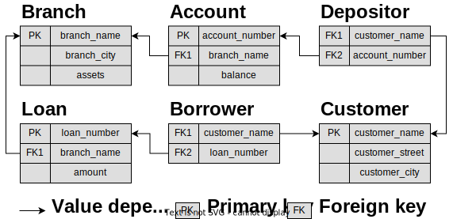
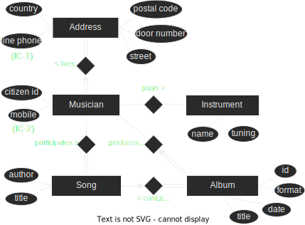
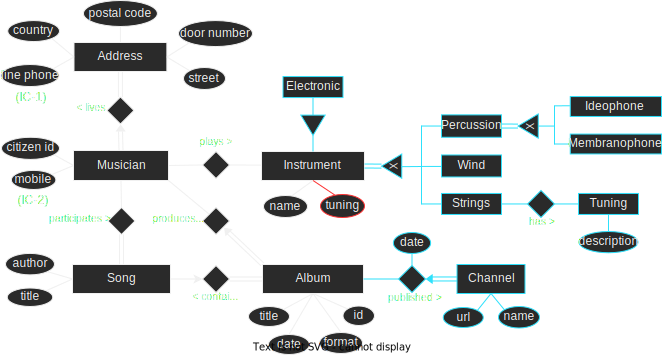

# Exercícios das Aulas de Laboratório (2021-2022)

:::info[Resoluções Incorretas?]
Caso encontres incorreções nas resoluções abaixo, por favor
[reporta-as](https://github.com/leic-pt/resumos-leic/issues/new/choose)
para serem corrigidas.
:::

:::info[Mais Resoluções]
Se quiseres adicionar as tuas resoluções, podes sempre fazer um [PR](https://github.com/leic-pt/resumos-leic)!
:::

[//]: # (Todos os seguintes diagramas estão disponíveis e podem ser editados em: http://cutt.ly/bd_labs_diagrams)

- **Lab 02**: Consultas em SQL
  :::::details[Resolução]
  
  ::::tab-group
  :::tab[José João Ferreira]

  **a)** Quem são os clientes que têm contas com saldo superior a 500€?

  ```sql
  SELECT customer_name
  FROM account JOIN depositor
	  ON (depositor.account_number = account.account_number)
  WHERE balance > 500;
  ```

  **b)** Em que cidades moram os clientes que têm empréstimos entre 1000€ e 2000€?

  ```sql
  SELECT customer_city
  FROM loan
	  JOIN borrower
		  ON (borrower.loan_number = loan.loan_number)
	  JOIN customer
		  ON (customer.customer_name = borrower.customer_name)
  WHERE amount BETWEEN 1000 AND 2000;
  ```

  **c)** Quais seriam os novos saldos das contas na agência de ‘Downtown’, se esta oferecesse um bónus de 10% sobre o saldo atual dos seus clientes?

  ```sql
  SELECT balance * 1.1
  FROM account
  WHERE branch_name = 'Downtown';
  ```

  **d)** Qual é o saldo de todas as contas do cliente que tem o empréstimo L-15?

  ```sql
  SELECT balance
  FROM account a
	  JOIN depositor d
		  ON (d.account_number = a.account_number)
	  JOIN borrower b
		  ON (b.customer_name = d.customer_name)
  WHERE loan_number = 'L-15';
  ```

  **e)** Quais são as agências onde têm conta os clientes cujo nome começa por 'J' e acaba em 'n'?

  ```sql
  SELECT branch_name
  FROM account a JOIN depositor d
	  ON (d.account_number = a.account_number)
  WHERE customer_name LIKE 'J%n';
  ```

  **f)** Quais são as quantias dos empréstimos de todos os clientes que moram numa cidade cujo nome tem exatamente 6 caracteres?
  
  ```sql
  SELECT amount
  FROM loan l
	  JOIN borrower b
		  ON (b.loan_number = l.loan_number)
	  JOIN customer c
		  ON (c.customer_name = b.customer_name)
  WHERE customer_city LIKE '______';
  ```

  **g)** Quais são as quantias dos empréstimos de todos os clientes que moram numa cidade cujo nome tem pelo menos um espaço no meio (e não no início nem no final)?
  
  ```sql
  SELECT amount
  FROM loan
	  NATURAL JOIN borrower
	  NATURAL JOIN customer
  WHERE customer_city LIKE '% %';
  -- nota: NATURAL JOIN é equivalente a um (INNER) JOIN,
  -- juntando 2 tabelas com base em atributos com o mesmo nome
  ```

  **h)** Quais os ativos ("assets") das agências onde o Johnson tem conta?
  
  ```sql
  SELECT assets
  FROM branch
	  NATURAL JOIN account
	  NATURAL JOIN depositor
  WHERE customer_name = 'Johnson';
  ```

  **i)** Quem são os clientes que têm um empréstimo numa agência da mesma cidade onde moram?
  
  ```sql
  SELECT customer_name
  FROM customer
	  NATURAL JOIN borrower
	  NATURAL JOIN loan
	  NATURAL JOIN branch
  WHERE branch_city = customer_city;
  ```

  **j)** Qual é a quantia total em saldos de contas existentes em agências da cidade de Lisboa ('Lisbon')?
  
  ```sql
  SELECT SUM (balance)
  FROM branch NATURAL JOIN account
  WHERE branch_city = 'Lisbon';
  ```

  **k)** Quem são os clientes que moram em cidades onde existem agências do banco?
  
  ```sql
  SELECT customer_name
  FROM customer c JOIN branch b
	  ON (b.branch_city = c.customer_city);
  ```
  :::
  ::::
  :::::

- **Lab 03**: Modelação Entidade-Associação (E-A)
  :::::details[Resolução]
  **Cenário 1**: Editora Discográfica
  ::::tab-group
  :::tab[José João Ferreira]
  
  - [(IC-1) O número de telefone fixo é único](color:yellow)
  - [(IC-2) O número de telefone móvel é único](color:yellow)
  :::
  ::::
  **Cenário 2**: Novos requisitos para a Editora Discográfica
  ::::tab-group
  :::tab[José João Ferreira]
  
  - [(IC-1) O número de telefone fixo é único](color:yellow)
  - [(IC-2) O número de telefone móvel é único](color:yellow)
  :::
  ::::
  :::::