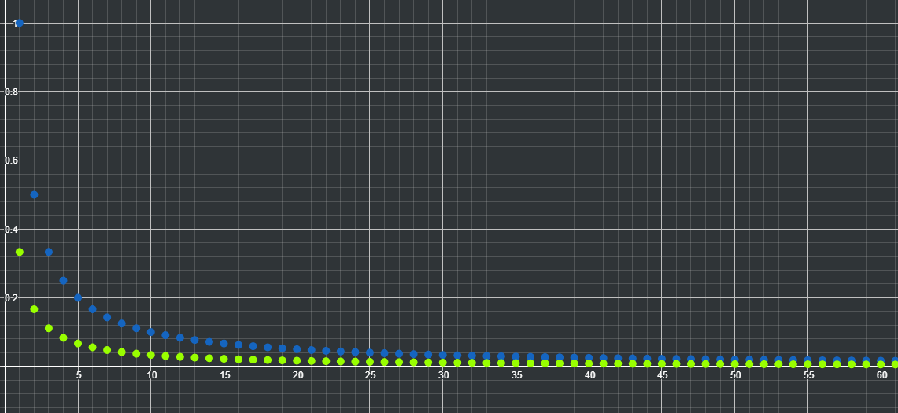

# Sucessões

```toc

```

:::tip[DEFINIÇÃO]

- **Sucessão limitada:** O conjunto dos seus termos é limitado, isto é, é uma sucessão majorada e minorada.
- **Sucessão monótona:** Quando uma sucessão é (estritamente) crescente ou (estritamente) decrescente.
  Por outras palavras, quando $u_{n+1}\ge u_n$ ou $u_{n+1}\le u_n$, respetivamente.

:::

## Operações com sucessões

Podemos efetuar as seguintes operações com sucessões:

- multiplicar por um escalar
- somar e subtrair duas sucessões
- multiplicar duas sucessões
- dividir duas sucessões (com atenção de que o denominador nunca pode ser zero).

Também podemos, para uma sucessão $u_n$ real positiva, $\alpha\in\mathbb Q$ e $\{v_n\}\subset\mathbb Q$, efetuar $(u_n)^\alpha$ e $(u_n)^{v_n}$.

## Sub-sucessões

Seja ($u_n$) uma sucessão de números reais e ($m_n$) uma sucessão estritamente crescente de números naturais positivos. Chama-se à sucessão de termo geral $v_n = u_{m_n}$ uma sub-sucessão de ($u_n$).

:::details[Exemplo 1]

$$
u_n=1+(-1)^n\\
u_{2n}=2\\
u_{2n-1}=0
$$

:::

:::details[Exemplo 2]

$$
u_n=\cos\left(\frac{2n\pi}{3}\right)\\
\text{ } \\
u_{3n}=\cos\left(2n\pi\right)=1\\
u_{3n+1}=\cos\left(2n\pi+\frac{2\pi}{3}\right)=-\frac{1}{2}\\
u_{3n+2}=\cos\left(2n\pi+\frac{4\pi}{3}\right)=-\frac{1}{2}
$$

:::

Utiliza-se as sub-sucessões para conseguir mais facilmente estudar uma sucessão, devido às seguintes propriedades:

- Qualquer sub-sucessão de uma sucessão limitada é também limitada.
- Qualquer sub-sucessão de uma sucessão monótona tem a mesma monotonia que a sucessão original.
- Se uma família de sub-sucessões de uma mesma sub-sucessão é tal que a reunião dos seus termos é igual ao conjunto dos termos da sucessão original então se todas as sub-sucessões dessa família forem limitadas a sucessão original também o é.
- Se duas sub-sucessões de uma mesma sucessão tiverem monotonias diferentes a sucessão original não é monótona. O mesmo se pode concluir se qualquer sub-sucessão da sucessão original não for monótona, evidentemente.

## Existência de sub-sucessões monótonas para qualquer sucessão

:::tip[TEOREMA]
**Existência de sub-sucessões monótonas para qualquer sucessão**  
Seja ($u_n$) uma sucessão de números reais, então ($u_n$) tem, pelo menos, uma sub-sucessão monótona (isto é, crescente ou decrescente)
:::

Por exemplo, a sucessão $u_n=n\cdot(-1)^n$ não é monótona (é alternadamente positiva e negativa).  
No entanto, as sub-sucessões

$$
\begin{array}{ccc}
u_{2n}=2n\cdot (-1)^{2n}=2n &\text{e}& u_{2n-1}=(2n-1)\cdot (-1)^{2n-1}=-2n+1
\end{array}
$$

são, respetivamente, crescente e decrescente.  
É sempre possível encontrar uma sub-sucessão que seja monótona.
A justificação para tal encontra-se no PDF em anexo (aula 4).


É também importante relembrar que uma sucessão constante (e.g. $u_n=1$) também é monótona.

## Sucessão convergente

Uma sucessão convergente é uma sucessão em que existe limite. Por outras palavras, significa que para uma ordem $n$ suficientemente grande (ou seja, $n → +\infin$ ou $n>>$), existe uma vizinhança para qualquer $r>0$ a que pertencem os termos de $u_n$.

$$
\forall _{r>0},\text{ }u_n\in V_r(a), n>>\\
\text{Caso a condição seja verdadeira:} \lim u_n=a
$$

Qualquer sucessão que não seja convergente é divergente.

É também fácil de perceber que uma sucessão constante $u_n=K$, é convergente.

:::details[Exemplo]

Considerando a sucessão $u_n=\frac{1}{n}, n\in \mathbb N^+$, podemos provar que é convergente:

$$
u_n \in V_r(0) \Leftrightarrow |v_n-0|<r\Leftrightarrow \frac 1 n < r \underbrace\Leftrightarrow _{n>0 \land r>0} n>\frac 1 r
$$

Então,

$$
\exist p\in \mathbb N^+: p>\frac 1 r
$$

Logo, para qualquer $n>p$ tem-se $\frac 1 n < r$.

:::

[**Infinitésimo:**](color:green) Diz-se que uma sucessão ($u_n$) é um infinitésimo se $u_n → 0$

:::tip[TEOREMA]
**Limitação das sucessões convergentes**  
Seja ($u_n$) uma sucessão convergente, então ($u_n$) é limitada.  
[**Atenção**](color:red) que o contrário nem sempre se verifica.
:::

**Comportamento da relação de ordem na passagem ao limite:** Sejam ($u_n$) e ($v_n$) duas sucessões convergentes, tem-se:

- Se $\lim u_n<\lim v_n$ então $u_n<v_n$ para $n>>$
- Se $u_n\le v_n$ para $n>>$ então $\lim u_n\le \lim v_n$
- Se $u_n<v_n$ para $n>>$ então $\lim u_n \le \lim v_n$

Esta última propriedade pode-se exemplificar através das seguintes sucessões, representadas no gráfico:

$u_n=\frac{1}{n}$ e $v_n=\frac{1}{3n}$



Podemos intuitivamente perceber que $u_n>v_n,\forall n\in \mathbb N^+$. No entanto, ambas as sucessões tendem para zero, isto é, $\lim u_n = \lim v_n = 0$.

:::tip[TEOREMA]
**Convergência das sub-sucessões das sucessões convergentes**  
Seja ($u_n$) uma sucessão convergente, então qualquer sub-subcessão de ($u_n$) é convergente para $\lim u_n$.
:::

:::tip[DEFINIÇÃO]
**Sublimite de uma sucessão**  
Diz-se que $a$ é um sublimite de ($u_n$) se existe uma sub-sucessão de ($u_n$), ($u_{m_n}$), tal que $u_{m_n}\rightarrow~a$.
:::

De acordo com esta última definição:

- Se existir uma sub-sucessão nas condições da definição, existe um número infinito delas
- Qualquer sucessão convergente só tem um sublimite (que é o limite da sucessão)

:::tip[TEOREMA]
**Convergência das sucessões monótonas e limitadas**  
Seja ($u_n$) uma sucessão de números reais que é monótona e é limitada, então ($u_n$) é convergente.
:::

## Propriedades operatórias com limites

Assumindo que $u_n →a$ e $v_n→b$ :

- $\lim (u_n \pm v_n)=a\pm b$
- $\lim (u_n \times v_n)=a\times b$
- $\lim (\frac {u_n} {v_n})=\frac a b$ (ver exceções na página 7 do PDF da aula 4 em anexo)
- $\lim u_n = a \Rightarrow \lim |u_n|=|a|$
- $\lim u_n^{v_n}=a^b$, sendo que $a\in\mathbb R^+$ e $b\in\mathbb R$

## Sucessões definidas por recorrência

Uma sucessão pode estar definida sem ser pelo seu termo geral $u_n$.

Outra forma de definir uma sucessão é por recorrência. Por exemplo:

$$
\begin{cases}
u_1=1\\
u_{n+1}=\frac{u_n+3}2&,&n\in\mathbb N^+
\end{cases}
$$

Nestas sucessões não é tão fácil determinar a sua monotonia, se é convergente ou não e, consequentemente, o seu limite. Nestes casos é importante recorrer à [Indução Matemática](./inducao-supremo#princípio-da-indução-matemática).

Vejamos como determinar a monotonia da sucessão acima. Começamos ver os valores de $u_1$ e $u_2$, de forma a percebermos se a sucessão irá ser crescente ou decrescente.

$$
\begin{aligned}
u_1=1&&u_2=\frac{u_1+3}2=2
\end{aligned}
$$

Logo, se a sucessão for monótona, terá de ser crescente. Indo agora para a indução matemática, começamos por averiguar a base:

$$
u_2>u_1\Leftrightarrow 2>1 \rightarrow \text{ Proposição verdadeira}
$$

A etapa de indução é:

$$
u_{n+1}>u_n\Rightarrow u_{n+2}>u_{n+1}\\
\text{ }\\
u_{n+1}>u_n\Rightarrow u_{n+1}+3>u_n+3\Rightarrow
\frac{u_{n+1}+3}2>\frac{u_n+3}2\Rightarrow
u_{n+2}>u_{n+1}
$$

Logo, podemos concluir que a sucessão é [**estritamente crescente**](color:green).

Para descobrirmos se a sucessão é convergente apenas precisamos de descobrir se é majorada, visto que é crescente. No entanto, como a sucessão está definida por recorrência, podemos tentar "adivinhar" um valor para a qual esta seja majorada. Conseguimos intuitivamente perceber que $u_n<3$. Como tal, podemos recorrer à indução matemática para o provar:

$$
u_1<3\Leftrightarrow 1<3\\\text{ }\\
u_n<3\Rightarrow u_{n+1}<3\\
u_n<3\Rightarrow u_{n+1}<3+3
\Rightarrow
\frac{u_{n+1}}2<\frac 6 2\Rightarrow
u_{n+1}<3
$$

Logo, como a condição se prova para a base e é hereditária, conseguimos comprovar que a sucessão é majorada, logo é convergente. Infelizmente, isto não nos permite determinar $\lim u_n$. No entanto, ao saber que a sucessão é convergente, podemos usar um método que nos permite descobrir $\lim u_n$.

Como sabemos que ($u_{n+1}$) é uma sub-sucessão de ($u_n$) e que $\lim u_n = \lim u_{n+1}=a$, podemos obter o valor de $a$:

$$
\lim u_{n+1}=\lim \frac{u_n+3}2\Leftrightarrow
a=\frac{a+3}2\Leftrightarrow
2a=a+3\Leftrightarrow
a=3\\
\lim u_n=\lim u_{n+1}=3
$$

## Teorema de Bolzano-Weierstrass

:::tip[Teorema]
**Teorema de Bolzano-Weierstrass**  
Seja ($u_n$) uma sucessão limitada, então ($u_n$) tem pelo menos uma sub-sucessão convergente.
:::

É fácil provar isto, se, [tal como definido anteriormente](#existência-de-sub-sucessões-monótonas-para-qualquer-sucessão), pensarmos que qualquer sucessão tem, pelo menos, uma sucessão monótona. Ora, [se uma sucessão é monótona e limitada, então é convergente](#sucessão-convergente).

## Teorema das Sucessões Enquadradas

:::tip[Teorema]
**Teorema das Sucessões Enquadradas (TSE)**  
Sejam ($u_n$), ($v_n$) e ($w_n$) sucessões de números reais tais que $u_n\le v_n \le w_n$ para $n>>$,
e $u_n\rightarrow a$ e $w_n \rightarrow a$, para algum $a\in\mathbb R$, então $v_n\rightarrow a$.
:::

:::details[Exemplos do uso do teorema]

Pretende-se descobrir o limite da sucessão $u_n=\frac{\sin n}n$

$$
-1\le\sin n\le1\Rightarrow
-\frac 1 n\le \frac{\sin n}n \le\frac 1 n,\text{  }n\in\mathbb N^+
$$

Como $-\frac 1 n$ e $\frac 1 n$ são [infinitésimos](Sucesso%CC%83es%20convergentes%20b3690a7a9f5148b3b189bb05dee46aa7.md), isto é, tendem para zero, podemos concluir que $u_n\rightarrow 0$.

:::

:::tip[Teorema]
**Corolário do Teorema das Sucessões Enquadradas**  
Qualquer produto de uma sucessão limitada por um infinitésimo é um infinitésimo.
:::

### Aplicação do TSE a sucessões definidas por somatórios

Seja

$$
u_n=\sum ^n _{k=1}\frac{k^2+1}{n^4+4k^4}
$$

queremos determinar o limite desta sucessão.

Para tal, começemos por construir o enquadramento da sucessão. Para tal, vamos utilizar a expressão no interior do somatório. Dado que, para qualquer $k\in\mathbb N^+$ tal que $1\le k \le n$, se tem:

$$
\frac {\overbrace{1^2+1}^{\text{Substituir }k\text{ por }1}} {\underbrace{n^4+4n^4}_{\text{Substituir }k\text{ por }n}}\le\frac{k^2+1}{n^4+4k^4}\le\frac{\overbrace{n^2+1}^{\text{Substituir }k\text{ por }n}}{\underbrace{n^4+4\times 1^4}_{\text{Substituir }k\text{ por }1}}\Leftrightarrow\\\Leftrightarrow
\frac2{5n^4}\le\frac{k^2+1}{n^4+4k^4}\le\frac{n^2+1}{n^4+4}
$$

Podemos agora continuar a "construir" o enquadramento, adicionando os somatórios:

$$
\sum^n_{k=1}\frac2{5n^4}\le\sum^n_{k=1}\frac{k^2+1}{n^4+4k^4}\le\sum^n_{k=1}\frac{n^2+1}{n^4+4}\Leftrightarrow\\\Leftrightarrow
\sum^n_{k=1}\frac2{5n^4}\le u_n\le\sum^n_{k=1}\frac{n^2+1}{n^4+4}
$$

Como o valor de um somatório $\sum^n_{k=1}$ em que a expressão no seu "interior" não contenha $k$ é $n$ vezes a expressão no seu "interior", temos que:

$$
n\times\frac2{5n^4}\le u_n\le n\times\frac{n^2+1}{n^4+4}\Leftrightarrow\\\Leftrightarrow
\frac2{5n^3}\le u_n\le \frac{n^3+n}{n^4+4}
$$

Podemos agora determinar o limite de ambas as sucessões:

$$
\frac2{5n^3}\rightarrow \frac2 5\times 0^3=0\\
\frac{n^3+n}{n^4+4}\rightarrow
\frac{\frac1 n+\frac1 {n^3}}{1+\frac4 {n^4}}=\frac{0+0}{1+0}=0
$$

Logo, pelo Teorema das Sucessões Enquadradas, $u_n\rightarrow0$.

## Sucessão de Cauchy

:::tip[Definição]
**Sucessão de Cauchy**  
Seja ($u_n$) uma sucessão de números reais, diz-se que ($u_n$) é uma sucessão de Cauchy se, para qualquer real positivo $r\in\mathbb R^+$,
$|u_n-u_m|<r$ para $n,m>>$.
:::

Por outras palavras, isto significa que, para uma ordem $n$ e $m$ inifinitivamente grandes, o módulo da diferença entre os termos $u_n$ e $u_m$ deverá ser arbitrariamente pequena.

:::tip[Teorema]
**Convergência das sucessões de Cauchy**  
Seja ($u_n$) uma sucessão de números reais, então ($u_n$) é convergente se e só se é uma sucessão de Cauchy.
:::

No PDF da Aula 5 em anexo, páginas 8-9, encontra-se um exemplo de como averiguar se uma sucessão é uma sucessão de Cauchy.

## Sucessão contrativa

:::tip[Definição]
**Sucessão contrativa**  
Seja ($u_n$) uma sucessão de números reais, diz-se que ($u_n$) é contrativa se existir uma constante $C\in]0,1[$ tal que:

$$
|u_{n+1}-u_n|\le C|u_n-u_{n-1}| \text{, para } n>>
$$

:::

Outra maneira mais simples de definir uma sucessão contrativa é dizer que, a partir de certa ordem ($n>>$), a distância entre dois termos consecutivos diminui com uma taxa de contração não superior a $C$, tornando-se assim, muito pequena.

:::tip[Teorema]
**Convergência das sucessões contrativas**  
Seja ($u_n$) uma sucessão contrativa de números reais, então ($u_n$) é convergente.
:::

### Verificar se uma sucessão é contrativa

Tomemos como exemplo a sucessão

$$
\begin{cases}
u_1=-4\\
u_{n+1}=\sqrt{u_n+20}
\end{cases}
$$

Atendendo à definição de sucessão contrativa, podemos escrever o seguinte:

$$
\begin{aligned}
|u_{n+1}-u_n| &= |\sqrt{u_n+20}-\sqrt{u_{n-1}+20}|\\
&=\frac{|\sqrt{u_n+20}-\sqrt{u_{n-1}+20}|\times|\sqrt{u_n+20}+\sqrt{u_{n-1}+20}|}{\sqrt{u_n+20}+\sqrt{u_{n-1}+20}}\\
&=\frac{|u_n+20-(u_{n-1}+20)|}{\sqrt{u_n+20}+\sqrt{u_{n-1}+20}}\\
&=\frac{|u_n-u_{n-1}|}{\sqrt{u_n+20}+\sqrt{u_{n-1}+20}}
\end{aligned}
$$

Sabemos que para $n>2$, $u_n\ge 0$, de acordo com a sua expressão. Logo, conseguimos deduzir que $\sqrt{u_n+20}+\sqrt{u_{n-1}+20}\ge\sqrt{20}+\sqrt{20}$ (relembro que ao inverter, o sinal da inequação se altera). Daqui vem que:

$$
\begin{darray}{c}
\frac{|u_n-u_{n-1}|}{\sqrt{u_n+20}+\sqrt{u_{n-1}+20}}\le\frac{|u_n-u_{n-1}|}{\sqrt{20}+\sqrt{20}}\Leftrightarrow\\
\Leftrightarrow|u_{n+1}-u_n|\le\frac1 {2\sqrt{20}}|u_n-u_{n-1}|\Leftrightarrow\\
\Leftrightarrow|u_{n+1}-u_n|\le\frac{\sqrt 5} {20}|u_n-u_{n-1}|
\end{darray}
$$

Logo, como $C=\frac{\sqrt5}{20}\in]0, 1[$, a sucessão é contrativa, sendo consecutivamente convergente.

Como é convergente, podemos dizer que se $u_n\rightarrow a\in\mathbb R$ então $u_{n+1}\rightarrow a$, pois trata-se de uma sub-sucessão. Podemos assim determinar o limite da sucessão:

$$
\lim u_n=\lim u_{n+1}\Leftrightarrow a=\sqrt{a+20}\Leftrightarrow a^2-a-20=0\Leftrightarrow a=5\lor a=-4
$$

Como sabemos que a sucessão só tem termos positivos para $n>>$, podemos concluir que $\lim u_n=5$.

---

PDFs:

- [Aula 3](https://drive.google.com/file/d/1EFfvY-ky2oTGLccDWyZx940CvnnDJpPy/view?usp=sharing)
- [Aula 4](https://drive.google.com/file/d/13GAs8CbuD8fDubkclV9hx4lItEycT838/view?usp=sharing)
- [Aula 5](https://drive.google.com/file/d/1sFm_e8BqfSV0kBa4NSNwsZt9LI5rXezQ/view?usp=sharing)
