# Funções

```toc

```

:::tip[Definição]
**Função real de variável real**  
Chama-se [**função real de variável real**](color:orange) a qualquer correspondência $f$ que a cada valor de um conjunto $A \subset \mathbb R$ faz corresponder um e um só elemento de um conjunto $B$.  
Chama-se [**domínio**](color:yellow) ao conjunto $A$ e conjunto de chegada ao conjunto $B$.  
Para indicar explicitamente o [**domínio**](color:yellow) e o [**conjunto de chegada**](color:pink) de $f$ usa-se a notação $f:A\rightarrow B$.
:::

## Injetividade, Sobrejetividade e Bijetividade

:::tip[Definição]
Seja $f:A\rightarrow B$ uma função real de variável real. Diz-se que:

- $f$ é **injetiva** se não existem dois elementos de $A$ com a mesma imagem, ou seja, se para quaisquer $x_1,x_2\in A$ se tem $f(x_1)=f(x_2)\Rightarrow x_1=x_2$.
- $f$ é **sobrejetiva** se $f(A)=B$, ou seja, se para qualquer $y\in B$ existe um $x\in A$ tal que $f(x)=y$.
- $f$ é **bijetiva** se $f$ é simultaneamente injetiva e sobrejetiva

:::

Se $f$ é bijetiva, diz-se que $f$ é invertível, isto é, que admite uma inversa: $f^{-1}(f(x))=x$.

Por vezes, as funções podem-se tornar bijetivas fazendo restrições e extensões:

:::tip[Definições]
**Restrição e Extensão**  
Seja $f:A\rightarrow B$ uma função real de variável real.

- Dado um conjunto $A_1\subset A$ chama-se **restrição** de $f$ a $A_1$ à função $f|_{A_1}:A_1\rightarrow B$, $f|_{A_1}(x)=f(x)$ para qualquer $x\in A_1$.
- Dado um conjunto $A_2\supset A$ diz-se que $f_2$ é uma **extensão** de $f$ a $A_2$ se $f_2:A_2\rightarrow B$ e $f$ é uma restrição de $f_2$ a $A$.

:::

## Função Composta

:::tip[Definição]
**Composição de funções**  
Sejam $A_1$, $B_1$, $A_2$, $B_2 \subset \mathbb R$, $f:A_1\rightarrow B_1$ e $g:A_2\rightarrow B_2$ funções reais de variável real tais que $f(A_1)\cap A_2\ne \empty$.  
Sendo $A_3=f^{-1}(A_2\cap B_1)$, chama-se composta de $g$ com $f$, e representa-se por $g \circ f$ , à função:

$$
g \circ f:A_3\rightarrow B_2\quad, \quad (g\circ f)(x)=g(f(x))
$$

:::

É de notar que, pela definição, os conjuntos $A_1$, $A_2$ e $A_3$ não podem ser vazios.

:::details[Exemplo]

$$
f:[-2,2[\rightarrow \R \qquad f(x)=(x-1)^2-1\\g:\R^+_0\rightarrow \R\qquad g(x)=x+1
$$

Começemos por descobrir o domínio da composta $g\circ f$:

$$
f^{-1}(\R^+_0)=\big\{x\in[-2,2[:f(x)\ge 0\big\}=\big\{x\in[-2, 2[:|x-1|\ge 1\big\}=[-2,0]
$$

De seguida, descobrimos a expressão de transformação:

$$
(g\circ f)(x)=g(f(x))=g((x-1)^2-1)=(x-1)^2
$$

Portanto, a composta $g\circ f$ é definida por:

$$
g\circ f:[-2,0]\rightarrow \R\\
(g \circ f)(x)=(x-1)^2
$$

Podemos fazer a mesma coisa para a composta $f\circ g$:

$$
g^{-1}([-2,2[)=\big\{x\in\R_0^+:-2\ge g(x) < 2\big\}=[0,1[\\
(f\circ g)(x)=f(g(x))=f(x+1)=x^2-1
$$

Portanto, a composta $f\circ g$ é definida por:

$$
f\circ g:[0, 1[\rightarrow \R\\
(f\circ g)(x)=x^2-1
$$

:::

### Definição alternativa de função inversa

Pode-se também usar a seguinte notação para caracterizar a função inversa, sendo $f:A\rightarrow B$:

$$
(f^{-1} \circ f)(x)=x,\quad\forall x\in A\\
(f \circ f^{-1})(x)=x,\quad\forall x\in B
$$

## Operações algébricas entre funções

Sejam $D_f, D_g\subset \R$ e $f: D_f\rightarrow \R$ e $g: D_g\rightarrow \R$ duas funções reais de variável real.

### Função soma

$$
(f+g):(D_f\cap D_g)\rightarrow\R\\
(f+g)(x)=f(x)+g(x)
$$

### Função multiplicação

Seja $\alpha\in\R$:

$$
(\alpha f):D_f\rightarrow \R\\
(\alpha f)(x)=\alpha(f(x))
$$

### Função produto

$$
(f\cdot g):(D_f\cap D_g)\rightarrow\R\\
(f\cdot g)(x)=f(x)g(x)
$$

### Função quociente

$$
\bigg(\frac f g\bigg):(D_f \cap g^{-1}(\R \backslash \{0\}))\rightarrow\R\\
\bigg(\frac f g\bigg)(x)=\frac{f(x)}{g(x)}
$$

Para mais fácil interpretação, pode-se ler $g^{-1}(\R\backslash\{0\})$ como $\{x \in D_g: g(x)\ne0\}$.

### Função módulo

$$
|f|:D_f\rightarrow\R\\
(|f|)(x)=|f(x)|
$$

### Função potência

$$
(f^g):(D_g\cap f^{-1}(\R^+))\rightarrow \R\\
(f^g)(x)=(f(x))^{g(x)}
$$

Para mais fácil interpretação, pode-se ler $f^{-1}(R^+)$ como $\{x\in D_f: x > 0\}$.

## Função limitada

Sejam $D_f\subset \R$, não vazio, e $f:D_f\rightarrow\R$ uma função real de variável real. Diz-se que:

- $f$ é majorada se o conjunto $f(D_f)$ é majorado. Nesse caso diz-se que qualquer majorante desse conjunto é majorante de $f$ e diz-se que o supremo de $f$, $\text{sup }f$, é o supremo de $f(D_f)$. Se $\text{sup }f\in f(D_f)$ diz-se ainda que $f$ tem máximo e escreve-se $\text{max }f=\text{sup }f$.
- $f$ é minorada se o conjunto $f(D_f)$ é minorado. Nesse caso diz-se que qualquer minorante desse conjunto é minorante de $f$ e diz-se que o ínfimo de $f$, $\text{inf }f$, é o ínfimo de $f(D_f)$. Se $\text{inf }f\in f(D_f)$ diz-se ainda que $f$ tem mínimo e escreve-se $\text{min }f=\text{inf }f$.
- $f$ é limitada se $f$ é majorada e $f$ é minorada

## Função monótona

Sejam $D_f\subset \R$, não vazio, e $f:D_f\rightarrow\R$ uma função real de variável real. Diz-se que:

- $f$ é crescente se, para quaisquer $x_1,x_2\in D_f, x_1\le x_2 \Rightarrow f(x_1)\le f(x_2)$
- $f$ é decrescente se, para quaisquer $x_1,x_2\in D_f, x_1\le x_2 \Rightarrow f(x_1)\ge f(x_2)$
- $f$ é estritamente crescente se, para quaisquer $x_1,x_2\in D_f, x_1< x_2 \Rightarrow f(x_1)< f(x_2)$
- $f$ é estritamente decrescente se, para quaisquer $x_1,x_2\in D_f, x_1< x_2 \Rightarrow f(x_1)> f(x_2)$
- $f$ é monótona se $f$ é crescente ou decrescente
- $f$ é estritamente monótona se $f$ é estritamente crescente ou estritamente decrescente

Podem ser retiradas algumas conclusões das definições acima:

- Uma função constante é monótona (mas não é estritamente monótona)
- Uma função cujo domínio é um ponto é monótona
- A monotonia de uma função pode depender do domínio dessa função
- Pode-se restringir uma função não monótona em vários intervalos, de forma a torná-la monónota. Chama-se a estes intervalos, intervalos de monotonia.

Um exemplo sobre monotonia de funções encontra-se no PDF da aula 8 em anexo.

## Função polinomial

Chama-se função polinomial a uma função $f$ **de domínio $\R$** cuja expressão de transformação, $f(x)$, é um polinómio.
**É de salientar que se o domínio não for $\R$, a função não é polinomial.**

Outra forma de escrever a definição acima é:

$$
f:\R\rightarrow\R\\
f(x)=\sum^n_{k=0}a_kx^k\quad,\quad a_n\ne0\text{ se }n\ne0,
$$

para alguns $n\in\N_0$ e $a_0,a_1,\dots a_n\in\R$.

Chama-se a $n$ o **grau da função polinomial** e à constante $a_k, k=1,\dots,n$, o **coeficiente de ordem $k$ da função polinomial**.

### Funções polinomiais de grau 0

Também conhecida como função constante.  
É limitada. Tem máximo e mínimo, tendo estes o mesmo valor. É monótona crescente e monótona decrescente.  
O seu contradomínio é $f(\R)=\{a_0\}$.  
O seu gráfico é uma reta horizontal de ordenada $a_0$, isto é, $y=a_0$.

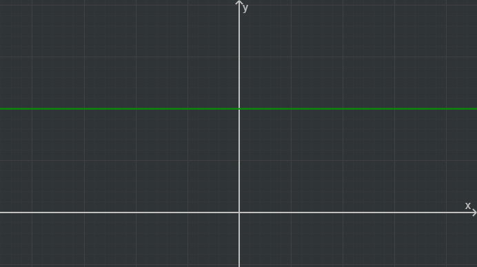

### Funções polinomiais de grau 1

Não são limitadas. São extritamente monótonas, sendo crescentes se $a_1>0$ e decrescentes se $a_1<0$.  
O seu contradomínio é $f(\R)=\R$.  
O seu gráfico é uma reta de declive $a_1$ e ordenada na origem $a_0$, isto é, $y=a_1x+a_0$.  
Tem apenas um zero, no ponto $x=-\frac{a_0}{a_1}$.  
É bijetiva, e, portanto, é invertível.

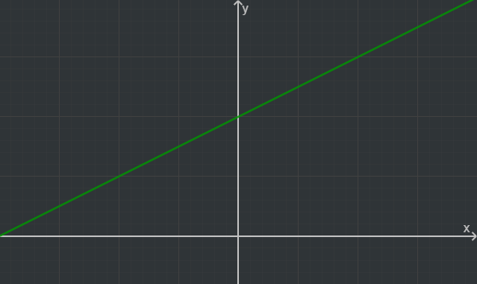

### Funções polinomiais de grau 2

Não são limitadas, nem monótonas.  
O seu contradomínio **nunca** é $\R$, mas é sempre um intervalo não limitado.  
Majorada se $a_2<0$. Minorada se $a_2>0$.  
O seu gráfico é a parábola de equação $y=a_2(x-b)^2+c$, sendo a abcissa do vértice $b=-\frac{a_1}{2a_2}$ e a ordenada do vértice $c=\frac{a^2_1-4a_2a_0}{4a_2}$.

Pode ter:

- 2 zeros se $a_1^2-4a_2a_0>0$
- 1 zero se $a_1^2-4a_2a_0=0$
- 0 zeros se $a_1^2-4a_2a_0<0$

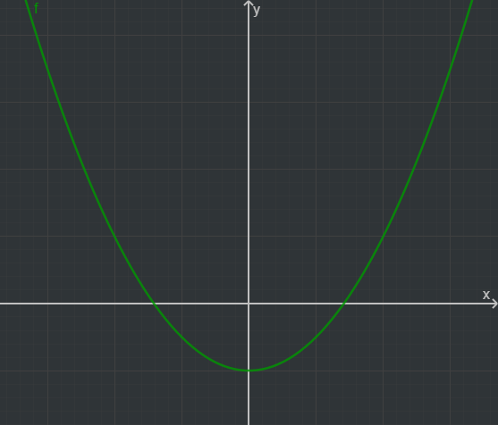

### Funções polinomiais de grau $n$ ímpar

Estes casos são parecidos a $n=1$.  
A função pode ser invertível se admitir uma representação na forma $f(x)=a_n(x-b)^n$ ou não ser invertível.  
É sempre sobrejetiva.  
Quando é invertível, é também monótona.  
Pode ter qualquer número de zeros entre $n$ e 1, mas tem sempre, **pelo menos**, um zero.

### Funções polinomiais de grau $n$ par

Estes casos são parecidos a $n=2$.  
Nunca é monónota nem invertível, visto que nunca é injetiva nem sobrejetiva.  
Pode ter qualquer número de zeros entre $n$ e 0.

## Função racional

:::tip[Definição]
Função cuja expressão de transformação é o quociente de dois polinómios e cujo domínio é exatamente o conjunto dos pontos que não anulam o denominador.
:::

Por outras palavras, uma função $f$ é racional se existem duas funções polinomiais $p_1$ e $p_2$ tais que:

$$
f:(p_2^{-1}(\R\backslash\{0\}))\rightarrow\R\quad,\quad f(x)=\frac{p_1(x)}{p_2(x)}
$$

As funções racionais incluem as funções polinomiais, basta que $p_2(x)=1$.

É de relembrar que funções com expressões equivalentes podem não ser iguais dependendo do seu domínio. Por exemplo, as funções $f$ e $g$ não são iguais,

$$
f:\R \backslash\{-1, 1\}\rightarrow \R\quad,\quad f(x)=\frac{x-1}{x^2-1}\\
g:\R \backslash\{-1\}\rightarrow \R\quad,\quad g(x)=\frac1{x+1}
$$

embora $\frac{x-1}{x^2-1}=\frac{x-1}{(x-1)(x+1)}=\frac 1 {x+1}$.

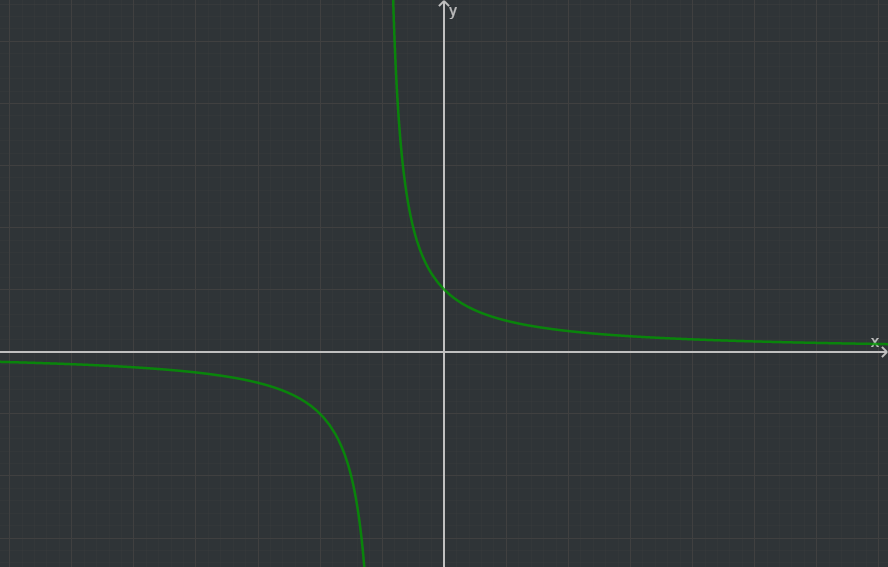

## Função exponencial

:::tip[Definição]
**Função exponencial de base $a$**  
Função $f$ de domínio $\R$ cuja expressão de transformação é da forma $f(x)=a^x$ com $a\in\R^+\backslash\{1\}$
:::

Simbolicamente, $f$ é uma função da forma:

$$
f:\R\rightarrow \R\quad, \quad f(x)=a^x\quad, \quad a\in\R^+\backslash \{1\}
$$

A função exponencial é injetiva e não sobrejetiva, pois nunca toma valores negativos.  
É crescente se $a>1$ e decrescente se $a<1$.  
O seu contradomínio é $f(\R)=\R^+$, e, portanto, nunca tem zeros.  
Quando não se indica a base da função exponencial, assume-se que $a=e$ ($e \approx 2.718$).

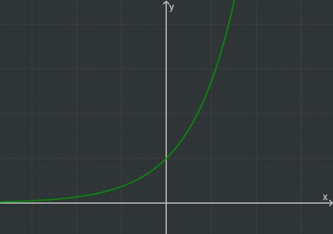

## Função logaritmo

Embora a função exponencial não seja inversível, podemos invertê-la se tornarmos o seu conjunto de chegada $\R^+$.
Assim, obtemos a função logaritmo de base $a$.

:::tip[Definição]
**Função logaritmo de base $a\in\R^+\backslash\{1\}$**  
É a inversa da função exponencial de base $a$ tomando para conjunto de chegadadessa função $\R^+$
:::

Assim, dado $a\in\R^+\backslash\{1\}$ a função logaritmo de base $a$ é a função definida por

$$
\log_a:\R^+\rightarrow\R\quad,\quad\log_a(a^x)=x,\forall_{x\in\R}\quad,\quad a^{\log_ax}=x,\forall_{x\in\R^+}
$$

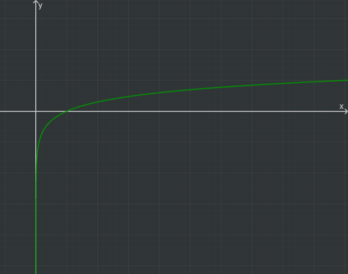

### Propriedades do logaritmo

Atentendo à definição da função logaritmo e às propriedades aritméticas das funções, podemos escrever as seguintes propriedades dos logaritmos, seja $a,b,c\in\R^+$:

- $\log(a\cdot b)=\log a + \log b$
- $\log\frac a b = \log a-\log b$
- $\log a^b=b\log a$
- $\displaystyle\log_ab=\frac{\log_cb}{\log_ca}$

As propriedades continuam válidas para qualquer base diferente de $e$, desde que não seja 1.

## Funções trigonométricas

Definição formal de constantes (na realidade, é pouco útil e estas definições só poderão ser interpretadas após se ter o conhecimento sobre Séries):

- **Constante de Euler:** A constante de Euler, $e$, é o limite da sucessão de termo geral $\displaystyle\sum_{k=0}^n\frac 1 {k!}$.
- **Pi ($\pi$):** É o limite da sucessão de termo geral $\displaystyle \sum_{k=0}^n \frac{2\sqrt 3}{(-3)^k(2k+1)}$

### Funções seno e cosseno

O seno e o cosseno são as únicas funções que satisfazem as quatro condições:

- $\cos(x-y)=\cos x\cos y+\sin x\sin y\quad, \quad \forall x,y\in\R$
- $\sin(x-y)=\sin x \cos y-\sin y\cos x\quad,\quad \forall x,y\in\R$
- $\sin(\frac \pi 2)=1$
- $x-\frac{x^3}6<\sin x<x\quad,\quad\forall_{0<x<\frac\pi 2}$

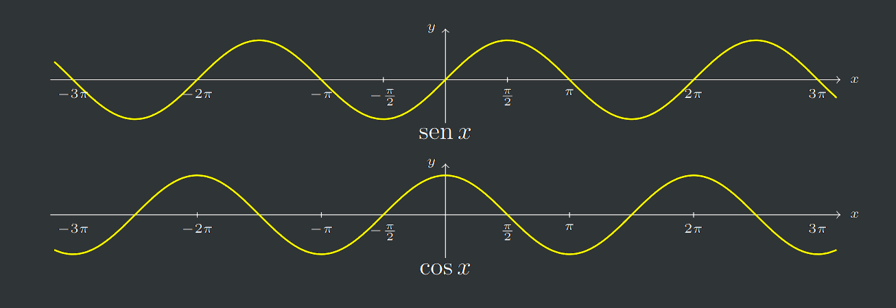

As funções seno e cosseno têm período $2\pi$, ou seja,

$$
\sin(x+2\pi)=\sin x\qquad \cos(x+2\pi)=\cos x, \;\forall_{x\in\R}
$$

### Funções obtidas a partir de seno e cosseno

A partir das definições de seno e cosseno, podemos obter as seguintes funções, atendendo sempre ao domínio:

- Função tangente como quociente entre seno e cosseno
  $\tan(x)=\tg(x)=\frac{\sin x}{\cos x}$
- Função cotangente como quociente entre o cosseno e seno
  $\cotg(x)=\frac{\cos x}{\sin x}=\frac1{\tan x}$
- Função secante como inverso algébrico do cosseno
  $\sec(x)=\frac1{\cos x}$
- Função cossecante como inverso algébrico do seno
  $\csc(x)=\frac1{\sin x}$

## Funções trignométricas inversas

Define-se a função arco seno como sendo a inversa da função seno restrita ao intervalo $[-\frac\pi2,\frac\pi2]$,
a função arco cosseno como sendo a inversa da função cosseno restrita ao intervalo $[0, \pi]$,
a função arco tangente como sendo a inversa da função tangente restrita ao intervalo $]-\frac\pi2,\frac\pi2[$ e
a função arco cotangente como sendo a inversa da função cotangente restrita ao intervalo $]0, \pi[$.

Assim, as funções trigonométricas inversas são:

- $\arcsin:[-1,1]\rightarrow [-\frac\pi2, \frac\pi2]$, definida por

  $$
  \arcsin(\sin x)=x,\forall_{x\in[-\frac\pi2,\frac\pi2]}\quad,\quad
  \sin(\arcsin x)=x, \forall_{x\in[-1,1]}
  $$

- $\arccos:[-1,1]\rightarrow [0, \pi]$, definida por

  $$
  \arccos(\cos x)=x,\forall_{x\in[0,\pi]}\quad,\quad
  \cos(\arccos x)=x, \forall_{x\in[-1,1]}
  $$

- $\arctg:\R\rightarrow ]-\frac\pi2, \frac\pi2[$, definida por

  $$
  \arctg(\tg x)=x,\forall_{x\in]-\frac\pi2,\frac\pi2[}\quad,\quad
  \tg(\arctg x)=x, \forall_{x\in\R}
  $$

- $\arcctg:\R\rightarrow ]0,\pi[$, definida por

  $$
  \arcctg(\cotg x)=x,\forall_{x\in]0,\pi[}\quad,\quad
  \cotg(\arcctg x)=x, \forall_{x\in\R}
  $$

  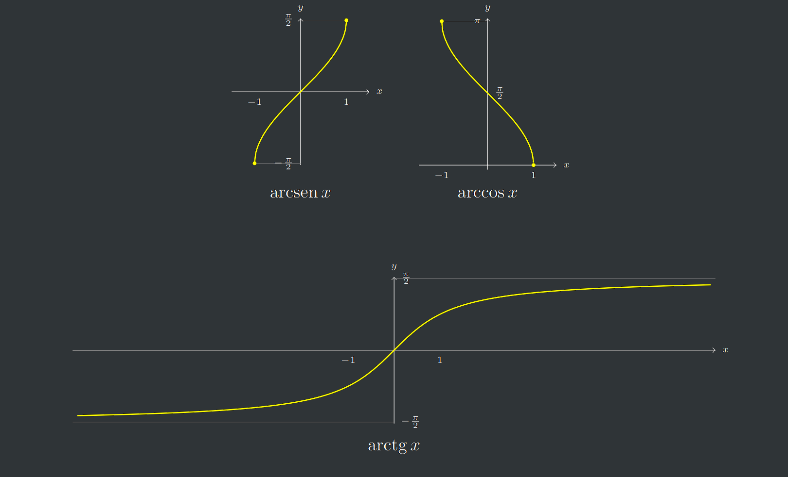

Exemplos estão no PDF da aula 9, páginas 4 a 7.
Exemplos incluem como determinar a inversa de uma função $f$ que contêm funções trigonométricas na sua expressão.

## Funções hiperbólicas elementares

Definem-se as funções seno hiperbólico, cosseno hiperbólico e tangente hiperbólica como sendo as funções de domínio $\R$ definidas por:

$$
\sh x=\frac{e^x-e^{-x}}2\quad,\quad \ch x=\frac{e^x+e^{-x}}2\quad,\quad\th x=\frac{\sh x}{\ch x}=\frac{e^x-e^{-x}}{e^x+e^{-x}}
$$

e, ainda, a função cotangente hiperbólica como sendo a função definida em $\R\backslash \{0\}$ por

$$
\coth x=\frac{\ch x}{\sh x}=\frac{e^x+x^{-x}}{e^x-e^{-x}}
$$

### Seno hiperbólico

Função estritamente crescente, impar e bijetiva.

Para $x>>$ cresce como uma exponencial positiva.

Para $-x>>$ cresce como o simétrico de uma exponencial negativa.

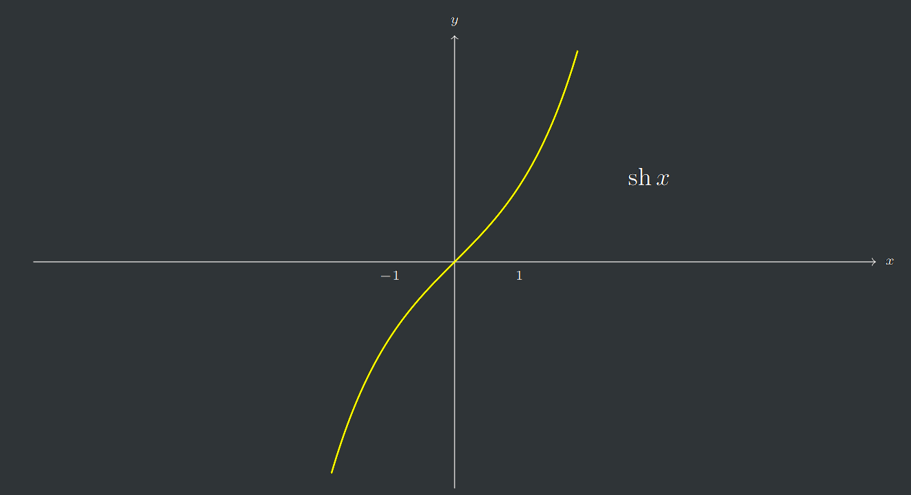

### Cosseno hiperbólico

Função par, estritamente crescente em $\R^+_0$ e estritamente decrescente em $\R^-_0$.

O seu contradomínio é $[1,+\infin[$.

Para $x>>$ cresce como uma exponencial positiva.

Para $-x>>$ cresce como uma exponencial negativa.

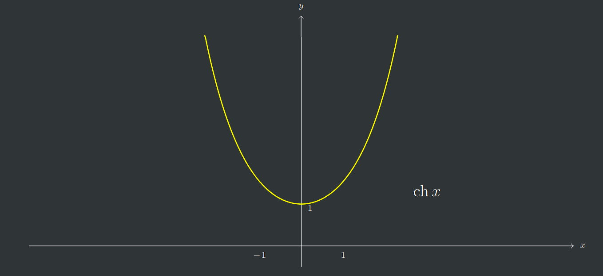

### Tangente hiperbólica

Função ímpar.

Estritamente crescente e limitada.

O contradomínio é $]-1,1[$.

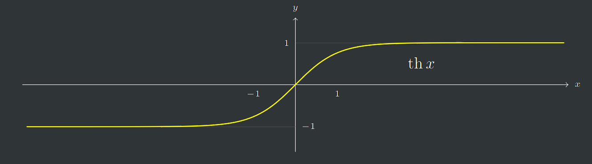

### Cotangente hiperbólica

Função ímpar.

Não limitada.

Domínio $\R\backslash\{0\}$

Decrescente em qualquer intervalo contido no seu domínio, mas não é uma função decrescente pois cresce quando se passa de um negativo para um positivo.

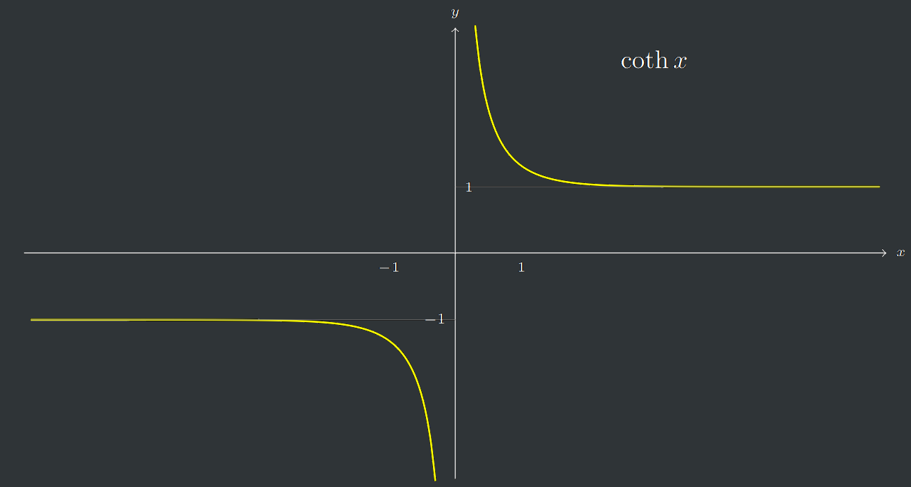

### Propriedades das funções hiperbólicas

- $\ch^2x-\sh^2x=1$
- $\sh(x-y)=\sh x \ch y-\sh y \ch x$
- $\ch(x-y)=\ch x \ch y-\sh x\sh y$

Enquanto as funções trigonométricas podem ser usadas para parametrizar uma circunferência e/ou uma elipse, podendo ser escrita na forma

$$
\begin{cases}
x=\cos \theta\\
y=\sin \theta
\end{cases},\theta\in[0,2\pi[
$$

A mesma parametrização nas funções hiperbólicas traduz uma hipérbole

$$
\begin{cases}
x=\ch \theta\\
y=\sh \theta
\end{cases},\theta\in\R
$$

## Funções hiperbólicas inversas

Definem-se as funções argumento seno hiperbólico, argumento co-seno hiperbólico e argumento tangente hiperbólica como sendo as inversas do seno hiperbólico, da restrição do co-seno hiperbólico a $\R^+_0$ e da tangente hiperbólica, respectivamente. É fácil definir um argumento cotangente hiperbólica mas é uma função que muito raramente é usada.

Assim, definem-se as funções:

- $\arg\sh:\R\rightarrow \R$, definida por

  $$
  \arg\sh(\sh x)=x,\forall_{x\in\R}\quad,\quad
  \sh(\arg\sh x)=x, \forall_{x\in\R}
  $$

- $\arg\ch:[1,+\infin[\rightarrow \R^+_0$, definida por

  $$
  \arg\ch(\ch x)=x,\forall_{x\in\R^+_0}\quad,\quad
  \ch(\arg\ch x)=x, \forall_{x\in[1,+\infin[}
  $$

- $\arg\th:]-1,1[\rightarrow \R$, definida por

  $$
  \arg\th(\th x)=x,\forall_{x\in\R}\quad,\quad
  \th(\arg\th x)=x, \forall_{x\in]-1,1[}
  $$

---

PDFs:

- [Aula 7](https://drive.google.com/file/d/1s_3zvAzj2ynivQ70QdZuEmER943lMGUh/view?usp=sharing)
- [Aula 8](https://drive.google.com/file/d/1b8XR2eoUTqlu8-xZsGbj6QFFTrbipA1J/view?usp=sharing)
- [Aula 9](https://drive.google.com/file/d/1zVWHjEpfGJWwE_DVhxlwSvlmtoX_gEhM/view?usp=sharing)
