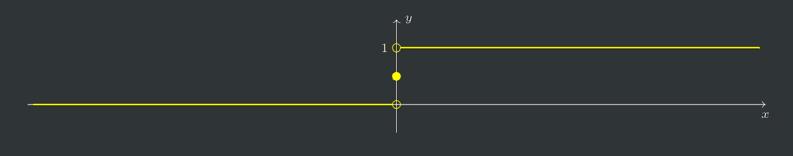

# Continuidade

```toc

```

:::tip[Definição]
**Função contínua num ponto:** Sejam $D_f\subset\R$ um conjunto não vazio, $f : D_f \rightarrow \R$ uma função real de variável real e $a\in D_f$.
Diz-se que $f$ é contínua em $a$ se para qualquer distância $R \in \R^+$ existe uma outra distância $r \in \R^+$ tal que

$$
x\in V_r(a)\cap D_f\Rightarrow f(x)\in V_R(f(a))
$$

:::

A mesma definição pode ser escrita $|x-a|<r\land x\in D_f\Rightarrow |f(x)-f(a)|<R$.

Também pode ser escrita na forma $f(V_r(a)\cap D_f)\subset V_r(f(a))$.

Uma função $f$ é contínua num ponto $a$ do seu domínio se e só se $f\big|_{V_r(a)}$ é contínua em $a$, para algum $r\in\R^+$.

No PDF da aula 9 em anexo, páginas 12 e 13, encontram-se alguns exemplos de continuidade.

## Continuidade Pontual

### Função Heaviside

Esta função modela o comportamento de um interruptor, definida por:

$$
H:\R\rightarrow\R\quad,\quad H(x)=\begin{cases}
1 &\text{se}&x>0\\
\frac 1 2 &\text{se}&x=0\\
0 &\text{se}&x<0\\
\end{cases}
$$



Começa-se por estudar a continuidade em $\R \backslash \{0\}$. Como a função é constante em $x>0$ e $x~<~0$, podemos assumir uma vizinhança de raio menor que o valor absoluto de $x_0$ (isto é, $r < |x_0|$). Desta forma, todos os valores na vizinhança vão ser iguais a $H(x_0)$ (isto é, de valor 1 para $x_0>0$ e valor 0 para $x < 0$). Logo, a função é contínua em $\R\backslash\{0\}$.

Estudando agora a continuidade em $x=\frac 1 2$, podemos concluir que, considerando $R=\frac 1 2$, não existe nenhum ponto de $x\in\R\backslash\{0\}$ tal que $H(x)\in V_R(f(0))$, e portanto, não pode existir nenhum $r\in\R^+$ tal que $x\in V_r(0)\Rightarrow H(x)\in V_R(f(0))$. Concluímos assim que $H$ não é contínua em 0.

### Função de Dirichlet

A função de Dirichlet é definida por:

$$
D:\R\rightarrow\R\quad,\quad D(x)=\begin{cases}
1 &\text{se}&x\in\R\backslash\mathbb Q\\
0 &\text{se}&x\in \mathbb Q\\
\end{cases}
$$

Não é possível desenhar o gráfico desta função, visto que o seu aspeto seria o de duas retas paralelas devido à densidade dos racionais e irracionais em $\R$, mas este é definido por:

$$
\{(x,0):x\in\mathbb Q\}\cup\{(x,1):x\in\R\backslash\mathbb Q\}
$$

Para estudar a continuidade, considera-se um qualquer $x_0\in\R$ e $R=\frac 1 2$. Para qualquer $r\in\R^+$,

$$
f(V_r(x_0))\cap V_R(f(x_0))\ne\empty\quad\text{e}\quad f(V_r(x_0))\cap(\R\backslash V_R(f(x_0)))\ne\empty
$$

e então a função $D$ não é contínua em $x_0$.

Conclui-se assim que a função de Dirichlet é descontínua em todos os pontos de $\R$.

### Função Seno

Para estudar a continuidade da função seno, definida por:

$$
f:\R\rightarrow \R\quad,\quad f(x)=\sin x
$$

podemos considerar um $x_0\in\R$.

A função $f$ é contínua em $x_0$ se for possível, para cada $R\in\R⁺$, determinar um $r\in\R⁺$ tal que $x\in V_r(x_0)\Rightarrow\sin x \in V_R(\sin x_0)$.

Esta implicação é equivalente a:

$$
|\sin x - \sin x_0|<R\Leftrightarrow \bigg|2\sin\frac{x-x_0}2\cos\frac{x+x_0}2\bigg|<R
$$

Como sabemos que $|\cos \alpha|\le 1$, podemos escrever que:

$$
\bigg| 2\sin\frac{x-x_0}2\cos\frac{x+x_0}2\bigg|\le2\bigg|\sin\frac{x-x_0}2\bigg|
$$

E como $|\sin\alpha| \le\alpha$:

$$
\bigg| 2\sin\frac{x-x_0}2\bigg|\le2\bigg|\frac{x-x_0}2\bigg|=|x-x_0|
$$

Então, se assumirmos que $r=R$:

$$
|x-x_0|<r\Rightarrow |\sin x-\sin x_0|<R
$$

podemos concluir que $f$ é contínua em $x_0$ e, consequentemente, a função seno é contínua em $\R$.

## Continuidade segundo Heine

Seja $D_f\subset \R, f:D_f\rightarrow\R$ uma função real de variável real e $x_0\in D_f$, $f$ é contínua em $x_0$ se e só se para qualquer sucessão de termos em $D_f$ e convergente para $x_0$ se tem $f(x_n)\rightarrow f(x_0)$

Pode-se concluir através desta definição que uma sucessão é sempre contínua, assim como qualquer função definida num ponto isolado do seu domínio é contínua nesse ponto.

## Continuidade com operações algébricas

Sejam $D_f,D_g\subset\R, f:D_f\rightarrow \R$ e $g:D_g\rightarrow \R$ duas funções reais de variável real, $\alpha \in \R$ e $x_0\in D_f\cap D_g$. Então, se $f$ e $g$ são contínuas em $x_0$:

- $f\pm g$, $\alpha f$, $f\cdot g$, $|f|$ são contínuas em $x_0$
- Se $n$ ímpar, $\sqrt[n]f$ é contínua em $x_0$
- Se $g(x_0)\ne 0$, $\frac f g$ é contínua em $x_0$
- Se $f(x_0)>0$, $f^g$ é contínua em $x_0$
- Se $f(x_0)\ge 0$ (e $n$ par), $\sqrt[n]f$ é contínua em $x_0$

## Continuidade da composta

Sejam $D_f,D_g\subset\R, f:D_f\rightarrow \R$ e $g:D_g\rightarrow \R$ duas funções reais de variável real e $x_0\in D_f$ tal que $f(x_0)\in D_g$. Então, se $f$ é contínua em $x_0$ e $g$ é contínua em $f(x_0)$, a função composta $g\circ f$ é contínua em $x_0$.

A partir desta definição, pode-se concluir que as funções trigonométricas e hiperbólicas são contínuas no seu domínio, basta recorrer à aplicação do teorema anterior às funções necessárias.

Exemplos da aplicação deste teorema encontram-se no PDF da aula 10 em anexo, página 6.

## Prolongamento contínuo de uma função

**Prolongamento contínuo ($\tilde f$) de uma função:** Seja $D_f\subset\R, f: D_f\rightarrow\R$ uma função real de variável real e $x_0\in\overline{D_f}$, diz-se que $f$ é prolongável por continuidade em $x_0$ se existe uma função $\tilde f$ definida em $D_f\cup\{x_0\}$ que coincide com $f$ em todos os pontos de $D_f$ e é contínua em $x_0$. Chama-se a uma função $\tilde f$ nessas condições, prolongamento contínuo de $f$ em $x_0$.

Daqui podem-se extrair algumas propriedades:

- O prolongamento contínuo de uma função num ponto, se existir, é único.
- Qualquer função continua num ponto $x_0$ tem prolongamento contínuo nesse ponto, sendo este a própria função.
- Considerando $a\in\R\backslash \overline{D_f}$, podem-se definir extensões da função $f$ a $D_f\cup\{a\}$ que são funções contínuas. Esta extensão, no entanto, não é única e não se trata de um prolongamento contínuo em $a$.

:::tip[Definição]
**Definição de limite de uma função num ponto:** Seja $D_f\subset\R,f:D_f\rightarrow \R$ uma função real de variável real e $x_0\in\overline{D_f}$, diz-se que existe limite de $f$ no ponto $x_0$ se existe o prolongamento contínuo de $f$ em $x_0$, isto é, $\tilde f$, dizendo-se, nesse caso, que o limite de $f$ em $x_0$ é $\tilde f(x_0)$.
Ou seja,

$$
\lim_{x\rightarrow x_0}f(x)=\tilde f(x_0)
$$

:::

## Limite num ponto

### Limite num ponto segundo Cauchy

Seja $D_f\subset\R, f:D_f\rightarrow \R$ uma função real de variável real e $x_0 \in\overline{D_f}$. O limite de $f$ no ponto $x_0$ é $b\in\R$ se e só se, para qualquer $R\in\R^+$, existe um $r\in\R⁺$ tal que, para qualquer $x\in D_f$

$$
|x-x_0|<r\Rightarrow |f(x)-b|<R
$$

### Limite num ponto segundo Heine

Seja $D_f\subset\R, f:D_f\rightarrow \R$ uma função real de variável real e $x_0 \in\overline{D_f}$. O limite de $f$ no ponto $x_0$ é $b\in\R$ se e só se, para qualquer sucessão ($x_n$) de termos em $D_f$ e convergente para $x_0$ se tem $f(x_n)\rightarrow b$.

### Unicidade do limite

Seja $D_f\subset\R, f:D_f\rightarrow \R$ uma função real de variável real e $x_0 \in\overline{D_f}$. Se, para alguns, $a,b \in\R$,

$$
\lim_{x\rightarrow x_0} f(x)=a\quad\text{e}\quad\lim_{x\rightarrow x_0} f(x)=b
$$

então, $a=b$.

Um limite, caso exista, é único.

### Calcular limite numa função contínua

Numa função contínua, o limite num ponto pode-se obter determinando o valor da função nesse ponto: $\lim_{x\rightarrow x_0}f(x)=f(x_0)$.

### Propriedades de limites num ponto

- Se $f$ e $g$ são contínuas em $x_0\in D_f\cap D_g$ e $f(x_0)<g(x_0)$ então $f(x)<g(x)$ para qualquer $x\in V_r(x_0)\cap D_f \cap D_g$ para algum $r\in\R^+$.
- Se existem $a,b\in\R$ e $x_0\in \overline{D_f}\cap\overline{D_g}$ tais que $\lim_{x\rightarrow x_0} f(x)=a$ e $\lim_{x\rightarrow x_0} g(x)=b$ e $a < b$, então $f(x)<g(x)$ para qualquer $x\in V_r(x_0)\cap D_f \cap D_g$, para algum $r\in\R^+$.
- Se $x_0 \in \overline {D_f}\cap\overline {D_g}$, $f(x)\le g(x)$ para todo o $x\in V_r(x_0)\cap D_f\cap D_g$ para algum $r\in\R^+$, então, se existirem $a,b, \in \R$ tais que $\lim_{x\rightarrow x_0} f(x)=a$ e $\lim_{x\rightarrow x_0} g(x)=b$, tem-se que $a\le b$.
- A propriedade anterior também se verifica para $f(x) <g(x)$.

## Consequências da definição de limite

### Relação função contínua e limitada

Seja $f$ uma função de domínio $D_f$ com limite $b\in\R$ num ponto $a\in\overline{D_f}$. Então, $f$ é limitada numa vizinhança de $a$, ou seja, existe um $r\in\R^+$ tal que
$f\big|_{D_f\cap V_r(a)}$ é uma função limitada.

Seja $f$ uma função de domínio $D_f$ contínua em $a\in D_f$. Então, $f$ é limitada numa vizinhança de $a$.

### Unicidade do limite

Tal como já vimos, um limite, se existir, é único. Podemos aplicar esta propriedade ao estudo do limite de uma função num ponto:

Considerando a seguinte função

$$
f:\R\backslash\{0\}\rightarrow \R\quad,\quad f(x)=\sin\bigg(\frac 1 x\bigg)
$$

Para provar que esta função não tem limite para $x\rightarrow 0$, podemos recorrer também à definição de Heine.

Seja $(x_n)$ a sucessão de termo geral $x_n=\frac 1 {2n\pi}$. Como $x_n\rightarrow 0$, o limite de $f$ na origem, se existir, terá de ser igual a

$$
f(x_n)=\sin(\frac1 {\frac1{2n\pi}})=\sin(2n\pi)=0\rightarrow 0
$$

No entanto, se considerarmos a sucessão $(y_n)$ de termo geral $\displaystyle y_n=\frac 1{\frac \pi 2 + 2n\pi}$, em que $y_n\rightarrow 0$, o limite de $f$ na origem teria de ser também igual a

$$
f(y_n)=\sin\bigg(\frac \pi 2 + 2n\pi\bigg)=1\rightarrow 1
$$

Como o limite, se existir, é único, e $0\ne 1$, podemos concluir que não existe limite de $f$ para $n\rightarrow~0$.

### Limite da composta

O limite da composta é a composição dos limites, desde que o ponto em questão esteja no fecho do domínio da composta.

Podemos verificar esta afirmação através do seguinte exemplo, considerando a composta $g\circ f$:

$$
f,g,:\R^+\rightarrow \R\quad,\quad f(x)=x^2-x\quad,\quad g(x)=\sqrt x
$$

Facilmente se verifica de que $0\in\overline{D_f}$ e que $\lim_{x\rightarrow 0}f(x)=0$. Do mesmo modo, $0\in\overline {D_g}$ e $\lim_{x\rightarrow 0}g(x)=0$ (atenção que o $0$ aqui referido é o resultado do limite em $f$, e não do $0$ inicial).

No entanto, ao calcular o domínio da composta, chegamos a

$$
D_{g\circ f}=\big\{x\in\R^+:f(x)\in\R^+\big\}=]1,+\infin[
$$

e claramente que $0$ não é aderente a esse domínio.

**Logo, o limite de $0$ em $g\circ f$ não faz sentido.**

## Teorema das funções enquadradas

Sejam $D_{f}, D_{g}, D_{h}\subset \R$, $f:D_f\rightarrow \R$, $g:D_g\rightarrow \R$, $h: D_h\rightarrow\R$ e $a\in\overline\R$ tal que, para algum $r\in\R^+$, $(V_r(a)\backslash\{a\})\subset(D_f\cap D_g\cap D_h)$.

Se, para qualquer, $x\in V_r(a)\backslash\{a\}$,

$$
g(x)\le f(x)\le h(x)
$$

e

$$
\lim_{x\rightarrow a}g(x)=\lim_{x\rightarrow a}h(x)=b\in\overline\R
$$

então

$$
\lim_{x\rightarrow a}f(x)=b
$$

Resumidamente, se num certo ponto, a função $f$ estiver enquadrada entre duas outras funções $g$ e $h$ tal que os limites destas últimas são iguais, $f$ também vai ter esse valor para o limite nesse certo ponto.

### Limite de uma função num ponto relativo a um conjunto

Seja $D_f\in\R$, $f:D_f\rightarrow \R$ uma função real de variável real e $A\subset D_f$. Se $a\in\overline A$, chama-se limite de $f$ em $a$ relativo ao conjunto $A$ ao limite em $a$ da restrição de $f$ a $A$, caso este exista.

$$
\lim_{\substack{x\rightarrow a\\x\in A}}f(x)=\lim_{x\rightarrow a} f\big|_A(x)
$$

O limite de uma função $f$ num ponto $a$ existe se e só se ele existe e tem o mesmo
valor segundo qualquer conjunto contido no domínio de $f$ ao qual $a$ seja aderente.

Um exemplo da aplicação desta propriedade encontra-se no PDF da aula 11 em anexo, página 6.

## Limites laterais

Podem-se definir os limites laterais de uma função à direita e à esquerda de um ponto $a$, como sendo os limites, caso estejam bem definidos,

$$
f(a^+)=\lim_{x\rightarrow a^+} f(x)=\lim_{\substack{x\rightarrow a\\x\in]a,+\infin[}}f(x)\\
f(a^-)=\lim_{x\rightarrow a^-} f(x)=\lim_{\substack{x\rightarrow a\\x\in]-\infin,a[}}f(x)
$$

Um exemplo da aplicação de limites laterais numa função com ramos está disponível no PDF da aula 11 em anexo, página 7.

:::tip[Definição]
**Existência de limites laterais para as monótonas**  
Sejam $a,b\in\R$, $a<b$, e $f:]a,b[\rightarrow \R$ uma função monótona e limitada. Então, $f$ tem limites laterais em todos os pontos de $[a,b]$.
:::

### Continuidade lateral

Diz-se que uma função $f:D_f\rightarrow \R$ é contínua à direita de um ponto $a\in D_f$ se, sendo $A_d=~D_f\cap ]a,a+r[, a\in\overline{A_d}$, para algum $r\in\R^+$, e $f\big|_{A_d}$ tem prolongamento contínuo em $a$, ou seja, existe $f(a^+)$ e [$f(a^+)=f(a)$](color:orange).

Diz-se que uma função $f:D_f\rightarrow \R$ é contínua à esquerda de um ponto $a\in D_f$ se, sendo $A_e=~D_f\cap ]a-r,a[, a\in\overline{A_e}$, para algum $r\in\R^+$, e $f\big|_{A_e}$ tem prolongamento contínuo em $a$, ou seja, existe $f(a^-)$ e [$f(a^-)=f(a)$](color:orange).

Resumidamente, uma função é contínua à direita se [$f(a^+)=f(a)$](color:orange) e é contínua à esquerda se [$f(a^-)=f(a)$](color:orange).

## Limites em $\overline\R$

Há duas situações em que podem surgir limites em $\overline\R$ no estudo das funções:

- O _"ponto"_ em que se está a calcular o limite é $\pm\infin$.
- O valor do limite é $\pm\infin$.

**$\pm\infin$ no fecho de um conjunto em $\overline\R$:**

- Diz-se que $+\infin$ está no fecho de um conjunto $A\subset\R$ se $A$ não é majorado.
- Diz-se que $-\infin$ está no fecho de um conjunto $A\subset\R$ se $A$ não é minorado.

### Limite em $\overline\R$ de uma função segundo Heine

Seja $f : D_f \rightarrow \R$ uma função real de variável real. Se $x_0 \in \overline\R$ está no fecho de $D_f$, diz-se que o limite de $f$ em $x_0$ é $b \in \overline\R$ se, para qualquer sucessão com limite $x_0$ e termos em $D_f$, se tem $\lim f(x_n) = b$.

:::details[Exemplo]

Pretende-se descobrir se a função $f$ é limitada:

$$
f:\R\rightarrow\R\quad,\quad f(x)=1-e^{-x^2}
$$

Pode-se concluir que a função é contínua em $\R$ por ser a soma e composta de funções contínuas. Assim, $f$ tem limite finito em qualquer ponto de $\R$. Isto diz-nos que a função é limitada em qualquer conjunto limitado.

Falta-nos assim verificar se a função é limitada em vizinhanças de $\pm\infin$.

Podemos verificá-lo através do limite da função segundo Heine. Escolhe-se assim uma qualquer sucessão tal que $u_n\rightarrow +\infin$:

$$
f(+\infin)=\lim_{x\rightarrow+\infin}f(x)=f(u_n)\rightarrow 1-e^{-\infin}=1-0=1
$$

Podemos fazer o mesmo para $-\infin$, escolhendo uma qualquer sucessão tal que $u_n\rightarrow -\infin$:

$$
f(-\infin)=\lim_{x\rightarrow-\infin}f(x)=f(u_n)\rightarrow 1-e^{-\infin}=1-0=1
$$

Podemos concluir assim que a função $f$ é limitada em $\R$.

:::

### Vizinhança de infinito

Define-se a vizinhança de raio $R\in\R^+$ de $+\infin$ como sendo o conjunto

$$
V_R(+\infin)=\bigg]\frac1R,+\infin\bigg[
$$

Define-se a vizinhança de raio $R\in\R^+$ de $-\infin$ como sendo o conjunto

$$
V_R(-\infin)=\bigg]-\infin,-\frac1R\bigg[
$$

### Limite num ponto segundo Cauchy, em $\overline\R$

Semelhantemente ao que [já foi definido anteriormente](#limite-num-ponto-segundo-cauchy), define-se agora o limite num ponto segundo Cauchy para $\overline\R$. Assim:

Sejam $D_f\subset\R$, $f:D_f\rightarrow\R$ uma função real de variável real e $x_0\in\overline\R$ no fecho de $D_f$. O limite de $f$ no ponto $x_0$ é $b\in\overline\R$ se e só se para qualquer $R \in R^+$ existe um $r\in\R^+$ tal que, para qualquer $x\in D_f$,

$$
x\in V_r(x_0)\Rightarrow f(x)\in V_R(b)
$$

### Propriedades de limites num ponto, em $\overline\R$

Algumas das [propriedades anteriormente vistas para limites num ponto](#propriedades-de-limites-num-ponto) também se estendem para limites em $\overline\R$:

- Se $x_0 \in \overline {D_f}\cap\overline {D_g}$, $f(x)\le g(x)$ para todo o $x\in V_r(x_0)\cap D_f\cap D_g$ para algum $r\in\R^+$, então, se existirem $a,b, \in \overline\R$ tais que $\lim_{x\rightarrow x_0} f(x)=a$ e $\lim_{x\rightarrow x_0} g(x)=b$, tem-se que $a\le b$.
- A propriedade anterior também se verifica para $f(x) <g(x)$.

### Limite da composta, em $\overline\R$

Sejam $D_f, D_g\subset \R$, $f : D_f\rightarrow\R$ e $g:D_g\rightarrow\R$ tais que $f(D_f)\cap D_g\ne \empty$. Seja, ainda, $a \in~\overline\R$ no fecho de $D_f$ tal que o limite de $f$ em $a$ existe, tem valor $b \in \overline\R$ e $b$ está no fecho de $D_g$. Suponha-se, ainda, que o limite de $g$ em $b$ existe e tem o valor $c\in\overline\R$ e que $a$ está no fecho do domínio de $g\circ f$. Então, existe o limite de $g \circ f$ em $a$ e tem o valor $c$.

Por outras palavras, assumindo que os valores em causa pertencem devidamente aos respetivos domínios:

$$
\lim_{x\rightarrow a}f(x)=b\quad\lim_{x\rightarrow b}g(x)=c\\
\lim_{x\rightarrow a}(g\circ f)(x)=c
$$

### Operações algébricas, em $\overline\R$

Tal [como aconteceu nas sucessões](/cdi-i/limites-sucessoes#operações-algébricas), as [operações algébricas entre funções](/cdi-i/funcoes#operações-algébricas-entre-funções) são facilmente estendidas a $\overline\R$.
Apenas é preciso ter atenção à existência de limite para todas as funções intervenientes e de (não haver) indeterminações.

### Limite em $\overline\R$ de uma função num ponto relativo a um conjunto

Este [teorema anteriormente definido](#limite-de-uma-função-num-ponto-relativo-a-um-conjunto), também se estende para $\overline\R$.

Através desta extensão do teorema, verifica-se imediatamente que os limites em $\pm\infin$ são, por definição, limites laterais.

### Existência de limites laterais para as monótonas, em $\overline\R$

**Existência de limites laterais para as monótonas:** Qualquer função monótona num intervalo, tem limites laterais em todos pontos $a\in\overline\R$ que estejam no fecho desse intervalo.

É de salientar que é possível que os limites laterais sejam infinitos nos extremos desse intervalo.

## Levantamento de indeterminações

Em geral, as técnicas utilizadas para levantar indeterminações nas sucessões podem ser utilizadas no cálculo de limites de funções.

Apresentam-se algumas exceções:

- Todas as técnicas que utilizam, nas sucessões, o cálculo de limites que incluem $u_{n+1}$ e $u_n$ não têm equivalente direto para as funções.
- Surgem as técnicas de fatorização para levantar indeterminações do tipo $\frac 0 0$ quando o ponto onde se calcula o limite é finito.

No documento da aula 12 em anexo, páginas 5 e 6, encontram-se dois exemplos da aplicação das técnicas de fatorização no cálculo de limites em funções.

### Escala de funções

Pode-se também "importar" a escala de sucessões para funções, com atenção de que o fatorial não pode ser utilizado com funções reais de variável real:

$$
\text{Quando }x\rightarrow+\infin:\\
\log^px<<x^q<<a^x<<x^x\quad,\quad p,q\in\N^+,a>1
$$

### Limites notáveis

Podem também ser importados das sucessões alguns limites notáveis, tais como:

$$
\lim_{x\rightarrow 0}\frac{\sin x}{x}=\lim_{x\rightarrow 0}\frac{e^x-1}{x}=\lim_{x\rightarrow 0}\frac{\sh x}{x}=1
$$

Exemplo disponível no PDF da aula 12, página 7.

Outro limite notável que também é valido é:

$$
\lim_{x\rightarrow a}\bigg(1+\frac{\varphi(x)}{\psi(x)}\bigg)^{\psi(x)}=e^b\quad\text{quando}\quad\lim_{x\rightarrow a}|\psi(x)|=+\infin\quad,\quad\lim_{x\rightarrow a}\varphi(x)=b
$$

## Continuidade em conjuntos (continuidade global)

### Teorema do valor intermédio (TVI)

:::tip[Definição]
**Teorema do valor intermédio**  
Se $f$ é uma função contínua num intervalo de números reais, e assume dois valores distintos nesse intervalo, então $f$ assume todos os valores intermédios.
:::

Outra propriedade derivada deste teorema é a seguinte:

- Uma função contínua transforma intervalos em intervalos.

Este teorema tem também uma "espécie" de recíproco:

:::tip[Recíproco]
Sejam $I$ um intervalo e $f : I \rightarrow \R$ uma função **monótona** tal que $f(I)$ é um
intervalo. Então $f$ é contínua.
:::

### Teorema de Bolzano

Este teorema, já conhecido do Ensino Secundário, é bastante parecido ao Teorema do Valor Intermédio.

:::tip[Definição]
**Teorema de Bolzano**  
Sejam $a, b \in \R$, $a < b$, e $f$ uma função contínua num conjunto que contém o intervalo $[a, b]$
então para qualquer $k \in \R$ entre os valores de $f(a)$ e $f(b)$, existe um $c \in [a, b]$ tal que $f(c) = k$.
:::

A maior diferença entre o Teorema de Bolzano e o Teorema do Valor Intermédio é que o de Bolzano não pode ser aplicado diretamente a uma função contínua num intervalo $]a,b[$ e o TVI pode.

### Continuidade da inversa

:::tip[Teorema]
Sejam $I$ um intervalo e $f : I → f(I)$ uma função estritamente monótona e contínua. Então $f$ é invertível e $f^{-1}$ é contínua em $f(I)$.
:::

Através deste teorema, podemos concluir que [o logaritmo, o arco seno, o arco cosseno, o arco tangente, o arco cotangente, o argumento do seno hiperbólico, o argumento do cosseno hiperbólico e o argumento da tangente hiperbólica](color:blue) são todas funções contínuas.

### Teorema de Weierstrass

:::tip[Definição]
**Teorema de Weierstrass**  
Sejam $I$ um intervalo **fechado e limitado** e $f:I\rightarrow\R$ uma função contínua. Então, $f$ tem máximo e mínimo.
:::

Outra forma de escrever este teorema é:

- Uma função contínua transforma [conjuntos compactos](/cdi-i/nocoes-topologicas#conjunto-aberto-conjunto-fechado-conjunto-compacto) em conjuntos compactos.

---

PDFs:

- [Aula 9](https://drive.google.com/file/d/1zVWHjEpfGJWwE_DVhxlwSvlmtoX_gEhM/view?usp=sharing)
- [Aula 10](https://drive.google.com/file/d/1A0fV8-3Dd_EdMjrYYjagD40iNbAu-V8-/view?usp=sharing)
- [Aula 11](https://drive.google.com/file/d/1MED-tYY8LYEWUltEMFiXL82CVT2EGqUO/view?usp=sharing)
- [Aula 12](https://drive.google.com/file/d/1RMh4abzwKv2BbmPFgpzqCeI8OcBN129y/view?usp=sharing)
