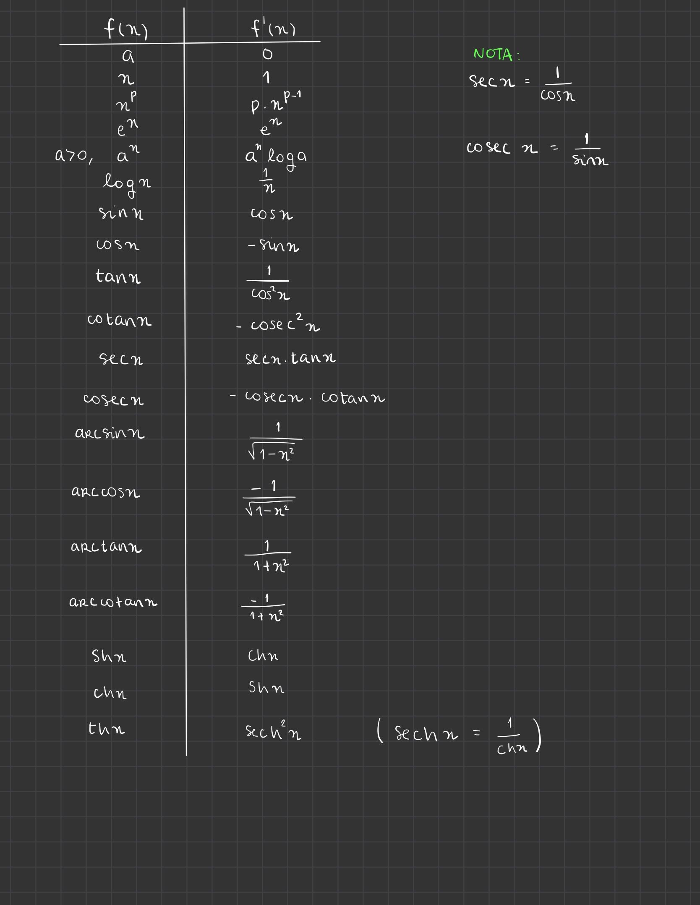
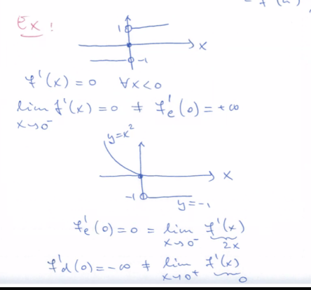
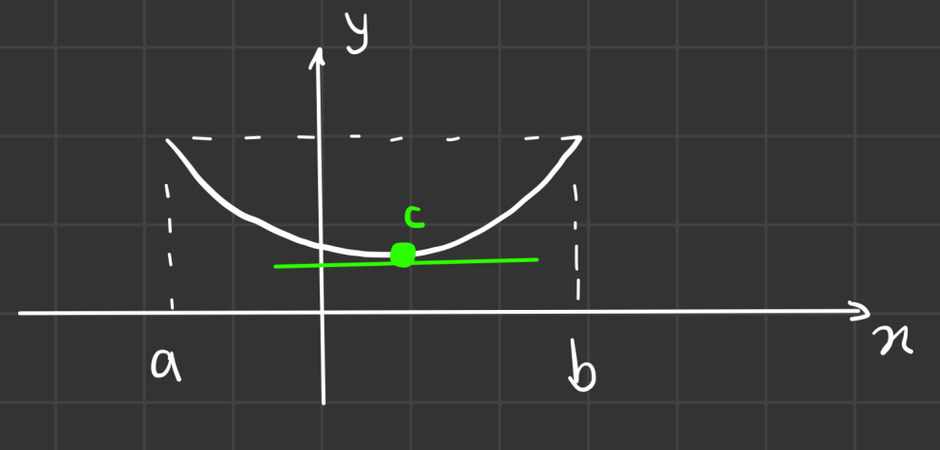

# Diferenciabilidade

```toc

```

## Ponto Fixo de uma Função

:::tip[Definição]

**Ponto fixo de uma função:** Sejam $D_f \subset \R$ e $f: D_f \rightarrow \R$ uma função real de variável real. Diz-se que um ponto $x_0 \in D_f$ é um **ponto fixo de** $f$ se a aplicação de $f$ a esse ponto não o altera, isto é, se $f(x_0) = x_0$.

:::

:::details[Exemplo - TVI para descobrir o ponto fixo de uma função]

Considere-se, agora, uma função $f : [0, 1] \rightarrow [0, 1]$, contínua. Sendo g a função definida por

$$
g : [0, 1] \rightarrow \R , g(x) = f(x) − x,
$$

$g$ é contínua, por ser a diferença de duas funções contínuas,

$$
\begin{array}{c}
g(0) = f(0) ≥ 0 \wedge g(1) = f(1) − 1 ≤ 0.
\end{array}
$$

Então, uma das três afirmações é verdadeira:

- $g(0) = 0$ e, portanto, $f(0) = 0$, logo $f$ tem um ponto fixo em 0;
- $g(1) = 0$ e, portanto, $f(1) = 1$, logo $f$ tem um ponto fixo em 1;
- $g(1) < 0 < g(0)$ e, pelo TVI, o contradomínio de $g, g([0, 1])$, contém o intervalo

$$
[g(1), g(0)] \ni 0,
$$

logo $g$ tem um zero e, nesse ponto, $f$ tem um ponto fixo.  
Como é óbvio, em qualquer um dos casos $f$ tem um ponto fixo.

:::

:::details[Exemplo - Weierstrass para descobrir o ponto fixo de uma função]

Seja, agora,

$$
f : \R \rightarrow \R , f(x) = \frac{e^x - 1}{e^x + 1},
$$

Como $f$ é contínua em $\R$, existe uma vizinhança de cada ponto em $\R$ na qual $f$ é limitada. Como a reunião de infinitos conjuntos limitados não tem que ser, e em geral não é, limitada, não é possível, contudo, garantir, deste modo, que $f$ é limitada.  
Por outro lado, a existência de

$$
f(−\infty) = \lim_{x \rightarrow -\infty} \frac{e^x - 1}{e^x + 1} = -1 \in \R
$$

garante que existe um $R_1 \in \R^+$ tal que $f$ é limitada em $V_{R_1}(- \infty) = ] - \infty, -\frac{1}{R_1} [$.

:::

## Método da Bissecção

Ao utilizar o [TVI](/cdi-i/continuidade-limites#teorema-do-valor-intermédio-tvi), este método permite diminuirmos o intervalo onde pode estar o ponto que pretendermos verificar que pertence ao contra domínio de uma função. Para quem conhece, este método funciona de forma semelhante à [binary search](https://en.wikipedia.org/wiki/Binary_search_algorithm).

Funciona da seguinte maneira:

1. Dividir o intervalo (e.g. $[-1, 1]$) ao meio ($[-1, 0]$ e $[0, 1]$)
2. Ver em que intervalo (ou ambos), aplicando o TVI, se situa o valor que queremos provar que existe pela função $f$.
3. Repetir até ter um intervalo do tamanho desejado.

:::details[Exemplo]

Tomemos a função $g$, e queremos provar que tem um zero:

$$
g:[0, 1]\rightarrow \R\quad,\quad g(x)=e^x-5x^2
$$

Descobrimos os valores de $0$ e $1$ e aplicamos o TVI:

$$
g(0)=1>0\quad g(1)=e-5<0
$$

Logo, $g$ contém um zero no seu domínio, mas conseguimos melhorar o intervalo em que estamos a procurar, aplicando o método da bisseção.

$$
g(0.5)=\sqrt e - \frac 5 4 >0
$$

Logo, pelo TVI, há pelo menos um zero de $g$ em $[0.5, 1]$. Mas podemos continuar a melhorar:

$$
g(0.7)=e^{0.7}-2.45 <0
$$

Logo, há pelo menos um zero de $g$ em $[0.5, 0.7]$.

Podemos repetir este processo até termos um intervalo suficientemente pequeno, de acordo com o que pretendermos.

:::

## Distância de um ponto a um conjunto compacto

Sejam $X\subset\R$ um compacto e $x_0\in\R$. Chama-se distância de $x_0$ a $X$ ao mínimo da função:

$$
d:X\rightarrow \R\quad,\quad d(x)=|x-x_0|
$$

o qual é sempre um número não negativo. A distância de $x_0$ a $X$ é nula se e só se $x_0\in X$.

## Razão incremental

É útil estudar a variação de uma função para ser possível determinar os máximos e mínimos de uma função.

Assim, define-se a razão incremental de $f$ no intervalo $[x,y]$, a partir da noção de taxa média de variação:

$$
r_f(x,y)=\frac{f(x)-f(y)}{x-y}
$$

Sendo $f$ uma função real de variável real, $x,y\in D_f\land x\ne y$.

No entanto, esta razão incremental, como se trata de um valor médio, pode esconder variações locais da função.

Introduz-se assim um novo conceito, em que $y=x_0$ fixo e faz-se o limite da razão incremental quando $x\rightarrow x_0$. Ao valor deste limite chama-se taxa de variação instantânea ou [**derivada de $f$ no ponto $x_0$**](color:orange):

$$
r_{x_0}:V_R(x_0)\rightarrow\R\quad,\quad r_{x_0}(x)=\frac{f(x)-f(x_0)}{x-x_0}
$$

com $R\in\R^+$.

## Derivada de uma função num ponto

Sejam $D_f \subset \R$, $f : D_f \rightarrow  \R$ e $x_0 \in \text{int } D_f$. Chama-se derivada de $f$ no ponto $x_0$ ao limite

$$
f'(x_0)=\lim_{x\rightarrow x_0}\frac{f(x)-f(x_0)}{x-x_0}
$$

caso este exista.

- Se o limite existir e for finito, a função diz-se [**diferenciável**](color:orange) em $x_0$.
- Se o limite existir em $\overline\R$, $f$ diz-se [**derivável**](color:orange) no ponto $x_0$.
- Se o limite não existir, $f$ diz-se [**não derivável**](color:red) no ponto $x_0$.

Chama-se domínio de diferenciabilidade de $f$ ao conjunto $D_{f'}\subset\text{int }D_f$ de todos os pontos onde a derivada de $f$ **existe e é finita**.

:::warning[Atenção]

Atenção que $x_0$ tem de pertencer ao interior do domínio de $f$, isto é, não pode ser um ponto isolado.

:::

Uma função diferenciável num ponto, é também, obviamente, derivável nesse ponto. O contrário (recíproco) não se verifica.

Outra forma de escrever este limite é com:

$$
h=x-x_0\quad f'(x_0)=\lim_{h\rightarrow 0}\frac{f(x_0+h)-f(x_0)}h
$$

:::details[Exemplos de cálculos de derivadas]

[**Exemplo 1**](color:orange)

Como primeiro exemplo, considere-se a função polinomial definida por

$$
f : \R \rightarrow \R , f(x) = a_1 x + a_0,\quad a_1, a_0 \in \R \wedge x_0 \in \R.
$$

A derivada no ponto $x_0$ é o limite

$$
f'(x_0) = \lim_{x\rightarrow x_0} \frac{(a_1 x + a_0) − (a_1 x_0 + a_0)}{x - x_0} = \lim_{x\rightarrow x_0} a_1 = a_1.
$$

Então, o domínio de diferenciabilidade de $f$ é $\R$ e a derivada em cada ponto $x_0$ $\in \R$ é

$$
f'(x_0) = a_1.
$$

Constata-se, assim, que $f$ é uma função contínua e diferenciável em todo o seu domínio.

[**Exemplo 2**](color:orange)

Considere-se, agora, a função g definida por

$$
g : \R \rightarrow \R , g(x) = \sqrt[3]{x}
$$

e $x_0 \in \R$. A derivada no ponto $x_0$ é o limite

$$
g'(x_0) = \lim_{x\rightarrow x_0} \frac{\sqrt[3]{x} − \sqrt[3]{x_0}}{x - x_0} = \lim_{x\rightarrow x_0} \frac{x − x_0}{(x - x_0)(\sqrt[3]{x^2} + \sqrt[3]{x_0 x} + \sqrt[3]{x^2_0})} = \frac{1}{3 \sqrt[3]{x^2_0}},
$$

se $x_0 \neq 0$. No caso de $x_0 = 0$, o limite ainda existe, pois o denominador tem sinal fixo, mas vale $+ \infty$, logo não é finito. Então, o domínio de diferenciabilidade de $g$ é $\R \backslash \{0\}$ e a derivada em cada ponto $x_0 \in \R \backslash \{0\}$ é

$$
g'(x_0) = \frac{1}{3 \sqrt[3]{x^2_0}}.
$$

A função $g$ é uma função contínua e derivável em $\R$, mas só é diferenciável em $R \backslash \{0\}$.

[**Exemplo 3**](color:orange)

Para estudar um caso em que a derivada não existe porque a razão incremental tem dois limites finitos distintos, estuda-se a função definida por

$$
g_2 : \R \rightarrow \R, \quad g_2(x) = |x|
$$

e $x_0 \in \R$. A derivada no ponto $x_0$ é o limite

$$
g'_2(x_0) = \lim_{x\rightarrow x_0} \frac{|x| - |x_0|}{x - x_0} = \lim_{x \rightarrow x_0} \frac{x^2 - x^2_0}{(x - x_0)(|x| + |x_0|)} = \frac{x_0}{|x_0|},
$$

se $x_0 \neq 0$. Neste caso, para $x_0 = 0$ o limite não existe, pois os limites laterais correspondentes têm valores diferentes: o limite à direita vale 1 e o à esquerda vale −1. Então, o domínio de diferenciabilidade de $g_2$ é $\R \backslash \{0\}$ a a derivada em cada ponto $x_0 \in \R \backslash \{0\}$ é

$$
g'_2(x_0) = \frac{x_0}{|x_0|},
$$

ou seja, é 1 se $x_0 > 0$ e −1 se $x_0 < 0$. A função $g_2$ é uma função contínua em $\R$ mas só é diferenciável e derivável em $R \backslash \{0\}$.

[**Exemplo 4**](color:orange)

Por fim, estuda-se uma função que não é contínua, a função de Heaviside, definida por

$$
h : \R \rightarrow \R , \quad h(x) = \begin{cases}
1 \quad \text{ se } x > 0\\
\frac{1}{2} \quad \text{ se } x = 0\\
0 \quad \text{ se } x < 0
\end{cases},
$$

e $x_0 \in \R$. Se $x_0 > 0$, a derivada no ponto $x_0$ é o limite

$$
f'(x_0) = \lim_{x\rightarrow x_0} \frac{1 - 1}{x - x_0} = 0,
$$

já que a função verifica $h(x) = 1$ numa vizinhança de $x_0$.  
De modo em tudo semelhante, se $x_0 < 0$, a derivada também é 0. Se $x_0 = 0$, tem-se

$$
\lim_{x\rightarrow 0^+} \frac{1 - \frac{1}{2}}{x} = + \infty \quad {e} \quad \lim_{x\rightarrow 0^-} \frac{0 - \frac{1}{2}}{x} = + \infty
$$

logo o limite que dá a derivada existe e é $+ \infty$.  
Então, o domínio de diferenciabilidade de $h$ é $\R \backslash \{0\}$ e a derivada em cada ponto $x_0 \in \R \backslash \{0\}$ é

$$
h'(x_0) = 0.
$$

A função $h$ é uma função contínua e diferenciável em $\R \backslash \{0\}$ e é derivável em $\R$, apesar de ser descontínua em 0.

:::

## Reta Tangente ao gráfico de uma função

Sejam $D_f\subset\R$, $f:D_f\rightarrow\R$ e $x_0\in \text{int }D_f$.

- Se existir e for finita a derivada [**(diferenciável)**](color:orange) de $f$ em $x_0$, $f'(x_0)$, chama-se reta tangente ao gráfico de $f$ no ponto $(x_0, f(x_0))$ à reta de equação

$$
y-f(x_0)=f'(x_0)(x-x_0)
$$

- Se a derivada existir mas for infinita [**(derivável, mas infinita)**](color:yellow), a reta tangente define-se como sendo a reta vertical de equação

$$
x=x_0
$$

- Se não existir derivada [**(não derivável)**](color:red), diz-se que não existe reta tangente ao gráfico de $f$ nesse ponto.

## Ponto semi-interior

:::tip

Pontos com propriedades semelhantes às dos pontos interiores, mas só de um dos lados do ponto em causa.

:::

Seja $A\subset\R$ e $x_0\in A$.

- Diz-se que $x_0$ é um ponto semi-interior à **direita**, de $A$, se o intervalo $[x_0,x_0+r[$ estiver contido em $A$, para algum $r\in\R^+$.
- Diz-se que $x_0$ é um ponto semi-interior à **esquerda**, de $A$, se o intervalo $]x_0-r;x_0]$ estiver contido em $A$, para algum $r\in\R^+$.
  :::details[Exemplo]
  Considerando um intervalo $A=[3,5]$. O conjunto dos pontos interiores deste conjunto é $\text{int }A=]3,5[$.
  No entanto, o ponto $x=3$ é um ponto semi-interior à direita, pois $[3,3+r[$ pertence a $A$ para algum $r\in \R^+$.
  Do mesmo modo, o ponto $x=5$ é um ponto semi-interior à esquerda, pois $]5-r, 5]$ pertence a $A$ para algum $r\in \R^+$.
  :::

### Semi-vizinhança

Tal como se falou de pontos semi-interiores, também de pode falar de semi-vizinhanças:

- Chama-se de semi-vizinhança direita de $x_0$, de raio $r\in\R^+$, ao intervalo $[x_0,x_0 + r[$.
- Chama-se de semi-vizinhança esquerda de $x_0$, de raio $r\in\R^+$, ao intervalo $]x_0-r,x_0]$.

## Derivada Lateral num ponto

Com o conceito de pontos semi-interiores, podemos assim definir as derivadas laterais num ponto:

Sejam $D_f\subset\R$, $f:D_f\rightarrow\R$ e $x_0\in D_f$.

- Se $x_0$ é um ponto semi-interior à direita de $D_f$, chama-se derivada à direita de $f$ no ponto $x_0$ ao limite, caso este exista,

$$
f'_d(x_0)=\lim_{x\rightarrow x_0^+}\frac{f(x)-f(x_0)}{x-x_0}
$$

- Se $x_0$ é um ponto semi-interior à esquerda de $D_f$, chama-se derivada à esquerda de $f$ no ponto $x_0$ ao limite, caso este exista,

$$
f'_e(x_0)=\lim_{x\rightarrow x_0^-}\frac{f(x)-f(x_0)}{x-x_0}
$$

:::tip

Para pontos interiores, que também são semi-interiores, a derivada nesse ponto só existe se e só se existirem ambas derivadas laterais nesse ponto e estas tiverem o mesmo valor.

:::

## Propriedades da diferenciabilidade e derivabilidade

- Existem funções que são contínuas e não são deriváveis, por exemplo o módulo.
- Existem funções que são deriváveis e não são contínuas, por exemplo a função de Heaviside.
- Todas as funções estudadas que são diferenciáveis num ponto também são contínuas nesse ponto.
- A noção de diferenciabilidade é mais útil que a de derivabilidade.
- Qualquer função diferenciável num ponto é necessariamente contínua nesse ponto.

:::warning[Continuidade das diferenciáveis]

Sejam $D_f\subset \R, f:D_f\rightarrow\R$ e $x_0\in\text{int }D_f$. Então, se $f$ é diferenciável em $x_0$, $f$ é contínua nesse ponto.  
[O contrário (recíproco) pode não se verificar.](color:red)

:::

## Regras da Derivação

Sejam $D_f,D_g\subset\R$, $f:D_f\rightarrow\R$, $g:D_g\rightarrow\R$, $x_0\in(\text{int }D_f\cap\text{int }D_g)$ e $\alpha \in\R$.

- $(f+g)'(x_0)=f'(x_0)+g'(x_0)$
- $(\alpha f)'(x_0)=\alpha f'(x_0)$
- $(f\cdot g)'(x_0)=f'(x_0)g(x_0)+f(x_0)g'(x_0)$
- Com $f(x_0)\ne 0$ ; $\displaystyle\bigg(\frac gf\bigg)'(x_0)=\frac{f(x_0)g'(x_0)-f'(x_0)g(x_0)}{f^2(x_0)}$
- Com $f(a)>0$ ; $(f^\alpha)'(a)=\alpha f'(a)f^{\alpha-1}(a)$
- Com $f(a)\in\text{int }D_g$ ; $(g\circ f)'(a)=g'(f(a))\cdot f'(a)$, em que $f$ tem de ser diferenciável em $a$ e $g$ tem de ser diferenciável em $f(a)$.

:::details[Tabela com derivadas de funções comuns]



:::

## Regra de derivação do produto de $n$ termos

Sejam $n\in\N_2$, $D_{f_k}\subset\R$, $f_k:D_{f_k}\rightarrow\R$, $k=1,\dots,n$ e

$$
x_0\in\bigcap_{k=1}^n \text{int }D_{f_k}
$$

Então, se $f_k$ é diferenciável em $x_0$, $k=1,\dots,n$, o mesmo se sucede com $\displaystyle f=\prod_{k=1}^nf_k$,

tendo-se

$$
f'(x_0)=\bigg(\prod^n_{k=1}f_k\bigg)'(x_0)=\sum_{k=1}^n\bigg(f'_k(x_0)\prod_{j=1,j\ne k}^n f_j(x_0)\bigg)
$$

Resumidamente, o que a expressão acima simboliza é que, a derivada de um produto com $n$ factores é uma soma de $n$ termos em que em cada um deles se deriva só um dos factores, mantendo os restantes inalterados.

$$
(f\cdot g\cdot h)'(x_0)=f'(x_0)\cdot g(x_0)\cdot h(x_0)+f(x_0)\cdot g'(x_0)\cdot h(x_0)+f(x_0)\cdot g(x_0)\cdot h'(x_0)
$$

## Função Derivada

:::tip[Função derivada de uma função]

Sejam $D_f \subset \R$ e $f : D_f \rightarrow \R$ tais que o domínio de diferenciabilidade de $f$, $D_{f'}$, é não vazio.  
Chama-se função derivada de $f$ à função definida em $D_{f'}$ que a cada $x\in D_{f'}$ faz corresponder a derivada de f nesse ponto.

:::

Após a definição de função derivada, pode-se escrever as regras de derivação com uma notação mais leve, atendendo aos devidos domínios:

- $(f+g)'=f'+g'$
- $(\alpha f)'=\alpha\cdot f'$
- $(f\cdot g)'=f'\cdot g+f\cdot g'$
- $\displaystyle \bigg(\frac g f\bigg)'=\frac{g'\cdot f - g\cdot f'}{f^2}$
- $(f^\alpha)'=\alpha\cdot f'\cdot f^{\alpha-1}$
- $(g\circ f)'=(g'\circ f)\cdot f'$
- $(f^{-1})'=\frac 1{f'\circ f^{-1}}$ (a [definir abaixo](/cdi-i/diferenciabilidade#derivada-da-inversa))

:::tip[Função diferenciável num conjunto]

Sejam $D_f \subset \R$ e $f : D_f \rightarrow \R$. Diz-se que a função $f$ é diferenciável em $A \subset D_f$ se $f$ é diferenciável em $x_0$ para todo o $x_0 \in A$. Nesse caso, $A$ está contido no domínio de diferenciabilidade de $f$.

:::

## Notação alternativa para derivadas

$$
\frac{\mathrm{d}f}{\mathrm{d}x}(x_0)=f'(x_0)
$$

Podemos assim reescrever a derivada da composta, considerando $y=f(x)$ e $z=g(y)$:

$$
\frac{\mathrm{d}z}{\mathrm{d}x}=\frac{\mathrm{d}z}{\mathrm{d}y}\cdot \frac{\mathrm{d}y}{\mathrm{d}x}
$$

:::details[Exemplos de Resoluções de Derivadas]

[**Exemplo 1**](color:orange)

$$
f : \R \rightarrow \R , \quad f(x) = (1 + x^2)^{12}.
$$

O domínio de diferenciabilidade de $f$ é $\R$ e a sua função derivada é

$$
f' : \R \rightarrow \R , \quad f'(x) = 12(1 + x^2)^{11} (1 + x^2)' = 24x(1 + x^2)^{11}.
$$

Neste exemplo usou-se a regra de derivação da potência.

[**Exemplo 2**](color:orange)

Apresenta-se, agora, um exemplo em que é necessário aplicar directamente o teorema da composta. Seja $g$ uma função diferenciável na origem e $f$ a função definida numa vizinhança do ponto 1 por

$$
f(x) = g(x^3 − 2x + 1).
$$

Para calcular $f'(1)$ faz-se

$$
f'(x) = g'(x^3 − 2x + 1)(3x^2 − 2),
$$

para $x$ numa vizinhança de 1, pelo teorema da composta. Então, $f'(1) = g'(0)$.  
O mesmo problema pode ser formalizado usando a notação $\frac{dy}{dx}$. Para tal, definem-se as variáveis $y = x^3 − 2x + 1$ e $z = g(y)$. Como se pretende calcular a derivada no ponto 1, tem-se $x_0 = 1$ e $y_0 = 0$. A cadeia de composição conduz à fórmula

$$
\frac{dz}{dx}(1) = \frac{dz}{dy}(0) \cdot \frac{dy}{dx}(1)
$$

Como se tem

$$
\frac{dz}{dy}(y) = g'(y) \quad \text{e} \quad \frac{dy}{dx}(x) = 3x^2 - 2
$$

obtém-se

$$
\frac{dz}{dx}(1) = g'(0).
$$

Uma das vantagens da noção de função derivada é a de permitir intuitivamente transformar a noção de derivada num ponto, que é pontual numa noção local ou seja definida numa vizinhança do ponto.

:::

## Diferenciabilidade local

:::tip[Teorema da Diferenciabilidade Local]

Sejam $D_f\subset \R$, $f:D_f\rightarrow \R$ e $a\in \text{int }D_f$. Então $f$ é diferenciável em $a$ se e só se existe um $r\in\R^+$ tal que $f\big|_{V_r(a)}$ é diferenciável em $a$.

:::

Este teorema permite-nos transformar a noção de derivada num ponto numa noção local, isto é, que está definida numa vizinhança do ponto.

É de notar que qualquer função que seja diferenciável em todo o seu domínio tem que estar definida num conjunto aberto, visto que apenas se pode verificar a diferenciabilidade local em pontos do interior do domínio.

## Classes de funções

:::tip[Definição de função de classe $C^n$]

Seja $f$ uma função e $A$ um subconjunto aberto do seu domínio.
Diz-se que $f$ é uma função de classe $C^n$ em $A$, e escreve-se $f\in C^n(A)$, se existe a derivada de ordem $n$ de $f$ em todos os pontos de $A$ e a função derivada de ordem $n$ é contínua em $A$.
Convenciona-se que a derivada de ordem 0 de uma função é a própria função.

:::

Resumidamente, uma função se seja diferenciável duas vezes, será de classe $C^2$, se for diferenciável três vezes, será de classe $C^3$, etc. Se não for diferenciável mas for contínua, diz-se uma função de ordem $C^0$.

Assim:

- Uma função de ordem $C^0$ em $A$ é uma função contínua em $A$
- Uma função de ordem $C^1$ em $A$ é uma função diferenciável em $A$ cuja função derivada é contínua em $A$.
- Para um dado aberto $A$, $C^0(A)\supset C^1(A) \supset C^2(A)\supset \dots\supset C^n(A)\supset \dots$
- Se, para um dado aberto $A$, $f$ é de classe $C^n$ em $A$ para qualquer $n\in\N_0$ diz-se que ${f\in C^\infin (A)}$.

## Derivada da Inversa

Apresentam-se duas versões deste teorema - a versão forte, mais correta mas mais difícil de usar, e a versão fraca, mais fácil de aplicar.

:::tip[Derivada da inversa - versão forte]

Seja $f$ uma função estritamente monótona e contínua numa vizinhança de um ponto $a\in\R$ tal que $f$ é diferenciável em $a$ e $f'(a)\ne 0$. Então, $f^{-1}$ existe numa vizinhança de $a$, é diferenciável em $f(a)$ e [${(f^{-1})'(f(a))=\frac 1 {f'(a)}}$](color:orange).

:::

A fórmula para a derivada pode ser apresentada de uma forma mais simples:

$$(f^{-1})'=\frac 1{f'\circ f^{-1}}$$

:::tip[Derivada da inversa - versão fraca]

Seja $f$ uma função de classe $C^1$ numa vizinhança de $a\in\R$ tal que $f'(a)\ne 0$. Então, $f^{-1}$ existe numa vizinhança de $a$, na qual é diferenciável, e [${(f^{-1})'(f(a))=\frac 1 {f'(a)}}$](color:orange).

:::

:::details[Derivadas de Funções Elementares]

- $(e^u)'=u'e^u$
- $\displaystyle(\log u)'=\frac {u'}u$
- $(\sin u)'=u'\cdot \cos u$
- $(\cos u)'=-u'\cdot\sin u$
- $\displaystyle(\tg u)'=\frac {u'}{\cos^2u}$
- $\displaystyle(\cotg u)'=\frac{-u'}{\sin^2 u}$
- $\displaystyle(\arcsin u)'=\frac {u'} {\sqrt{1-u^2}}$
- $\displaystyle (\arccos u)'=\frac{-u'}{\sqrt{1-u^2}}$
- $\displaystyle(\arctg u)'=\frac{u'}{1+u^2}$
- $\displaystyle(\arcctg u)'=\frac{-u'}{1+u^2}$
- $(\sh u)'=u'\ch u$
- $(\ch u)'=u'\sh u$
- $\displaystyle(\th u)'=\frac{u'}{\ch^2u}$
- $\displaystyle(\coth u)'=\frac{-u'}{\sh^2 u}$
- $\displaystyle(\arg\sh u)'=\frac{u'}{\sqrt{1+u^2}}$
- $\displaystyle(\arg\ch u)'=\frac{u'}{\sqrt{u^2-1}}$
- $\displaystyle(\arg\th u)'=\frac{u'}{1-u^2}$

:::

## Introdução ao teorema de Lagrange

Nas 2 primeiras páginas do PDF da aula 15, apresenta-se o estudo de uma função com um comportamento fora do normal, de onde se retira que:

- Uma função pode ser diferenciável em $\R$ mas não ser de classe $C^1$, pois a sua derivada não é contínua.
- Uma derivada de uma função $f$ num ponto pode ser positiva sem que seja crescente em alguma vizinhança desse ponto
- Uma função derivada pode ser positiva num ponto mas trocar de sinal infinitas vezes em qualquer vizinhança desse ponto
- Pode existir $f'_d(a)$ e $f'_e(a)$ sem existir $f'(a^+)$ e $f'(a^-)$ (como no exemplo abaixo)
- Uma função pode ter derivada nula num ponto mas não ter nenhum extremo nesse ponto

:::details[Exemplo]



:::

## Extremo Local de uma função

Sejam $D_f\subset\R$ e $f:D_f\rightarrow \R$ e $x_0\in D_f$.

- $x_0$ diz-se um [maximizante local](color:orange) de $f$ se existe algum $r\in\R^+$ tal que $f(x_0)$ é o [máximo](color:orange) de $f\big|_{V_r(x_0)\cap D_f}$. Nesse caso, $f(x_0)$ diz-se um [máximo local](color:orange) de $f$. Também se diz que $f$ tem um [máximo local](color:orange) em $x_0$.
- $x_0$ diz-se um [minimizante local](color:orange) de $f$ se existe algum $r\in\R^+$ tal que $f(x_0)$ é o [mínimo](color:orange) de $f\big|_ {V_r(x_0)\cap D_f}$. Nesse caso, $f(x_0)$ diz-se um [mínimo local](color:orange) de $f$. Também se diz que $f$ tem um [mínimo local](color:orange) em $x_0$.
- $x_0$ diz-se um [extremante local](color:green) de $f$ se $x_0$ é um [maximizante local](color:orange) ou um [minimizante local](color:orange) de $f$.
- $f(x_0)$ diz-se um [extremo local](color:green) de $f$ se $f(x_0)$ é um [máximo local](color:orange) de $f$ ou um [mínimo local](color:orange) de $f$.

Daqui podem-se tirar algumas conclusões:

- Se $f$ tem um máximo, esse máximo também é um máximo local. O mesmo para o mínimo.
- Existem funções que têm máximo local num ponto interior do seu domínio sem que tenham derivada nula nesse ponto. **A noção de extremo não está dependente da noção de derivada.**
- Uma função pode ter derivada nula num ponto mas não ter nenhum extremo nesse ponto.
- Existem funções com extremos locais que não são limitadas. Mesmo que sejam limitadas, o seu supremo/ínfimo pode não ser um dos seus máximos/mínimos locais.

:::tip[Função regular num intervalo compacto]

Sejam $D_f\subset\R, f:D_f\rightarrow\R \text{ e } a,b \in D_f$ tais que $a<b$. Diz-se que $f$ é uma função regular em $[a, b]$ se $f$ é contínua em $[a,b]$ e diferenciável em $]a,b[$.

:::

## Teorema de Rolle (e aplicações)

:::warning[Teorema de Rolle]

Seja $f$ uma função regular num intervalo $[a,b]$ tal que $f(a)=f(b)$. Então, existe $c\in]a,b[$ tal que $f'(c)=0$.

:::

É fácil compreender este teorema, se se observar o seguinte esquema:



Este teorema garante que existe pelo menos um ponto c, no entanto, se a função for constante, por exemplo, existem infinitos pontos que satifazem esta condição.

Este teorema pode ser usado para algo bastante mais útil: podemos afirmar que, entre dois zeros consecutivos de $f'$, existe, no máximo, um zero de $f$.

:::details[Exemplo do uso desta propriedade]

Considere-se, por exemplo, a função polinomial definida por

$$
f(x) = 2x^3 + 15x^2 + 36x + 12.
$$

Dado que se trata de uma função polinomial do terceiro grau, sabe-se que tem no máximo três zeros, e que tem pelo menos um. Não se sabe, no entanto, se há um, dois ou três e onde os zeros estão colocados.  
No entanto, é fácil determinar a derivada de $f$, que é a função polinomial definida por

$$
f'(x) = 6x^2 + 30x + 36 = 6(x^2 + 5x + 6)
$$

Recorrendo à factorização do polinómio do segundo grau conclui-se que $f'$ tem exactamente dois zeros, nos pontos −2 e −3. Como $f(- \infty) = −\infty , f(−3) < 0 , f(−2) < 0 \text{ e } f(+\infty) = +\infty$ , a aplicação do Teorema de Rolle diz que existem:

- no máximo, um zero no intervalo $] − \infty, −3[$;
- no máximo, um zero no intervalo $] − 3, −2[$;
- no máximo, um zero no intervalo $] − 2, +\infty[$.  
  Usando, agora, o TVI em conjunto com o Teorema de Rolle verifica-se que, para uma função que tem no máximo um zero num intervalo, esse zero existe se e só se a função troca de sinal nos extremos do intervalo. Conclui-se, então, que não existe nenhum zero nos dois primeiros intervalos pelo que a função só tem um zero e ele se encontra no intervalo $] − 2, + \infty[$.

Como é evidente que $f(0) > 0$, pode até afirmar-se que o único zero de $f$ se encontra no intervalo $] − 2, 0[$, usando exactamente o mesmo raciocínio. Se fosse necessário mais precisão na colocação do zero poder-se-ia aplicar o método da bissecção, já apresentado, para diminuir o comprimento do intervalo onde ele se encontra.  
Verificou-se, assim, que o Teorema de Rolle pode revelar-se uma ferramenta crucial na determinação do número de zeros de uma função, bem como na localização desses zeros.

:::

## Teorema de Darboux

:::warning[Teorema de Darboux]

Seja $f$ uma função regular num intervalo $[a,b]$ tal que existem as derivadas laterais $f'_d(a)=k_1 \text{ e } f'_e(b)=k_2$ com $k_1,k_2\in\R$ e $k_1\ne k_2$. Então, para qualquer $k$ entre $k_1$ e $k_2$ existe um ponto $c\in ]a,b[$ tal que $f'(c)=k$.

(A demonstração encontra-se no PDF da aula 15, página 7)

:::

Deste teorema, pode concluir-se que:

- O Teorema de Darboux é parecido ao Teorema do Valor Intermédio, mas para a derivada e sem exigir continuidade desta (no entanto, exige continuidade da função original).
- Qualquer derivada, mesmo que não contínua, tem a propriedade do valor intermédio.
- Qualquer derivada monótona num intervalo é contínua nesse intervalo.

## Teorema de Lagrange

:::warning[Teorema de Lagrange]

Seja $f$ uma função regular num intervalo $[a,b]$. Então, existe um $c\in]a,b[$ tal que $\displaystyle f'(c)=\frac{f(b)-f(a)}{b-a}$.


:::

### Fórmula dos acréscimos finitos

Podemos reescrever o Teorema de Lagrange da seguinte forma:

$$
f'(c)=\frac{f(b)-f(a)}{b-a}\Leftrightarrow f'(c)(b-a)=f(b)-f(a)\Leftrightarrow\\\Leftrightarrow
-f(a)=-f(b)-f'(c)(a-b)\Leftrightarrow f(a)=f(b)+f'(c)(a-b)
$$

Substituindo $a$ por $x$ e $b$ por $x_0$:

$$
f(x)=f(x_0)+f'(c)(x-x_0)
$$

Se considerarmos um $x$ muito próximo de $x_0$, isto é, um $\Delta x=x-x_0$ muito pequeno e que a derivada de $f$ varia com suficiente lentidão para $f'(c)\approx f'(x_0)$. Então:

$$
f(x_0+\Delta x)\approx f(x_0)+f'(x_0)\Delta x
$$

:::details[Exemplo]

Pode-se usar esta fórmula para, por exemplo, calcular o valor **aproximado** de $\sqrt {102}$.

Arranja-se assim uma função $f(x)=\sqrt x$ e divide-se $102=100+2$, isto é, $x_0=100$ e $\Delta x = 2$.

Então:

$$
f(x_0)=f(100)=\sqrt{100}=10\\
f'(x)=(\sqrt x)'=\frac 1 {2\sqrt x}\\
f'(x_0)=f'(100)=\frac 1 {2\sqrt {100}}=\frac 1 {20}
$$

Aplicando assim a Fórmula dos Acréscimos Finitos:

$$
f(x_0+\Delta x)\approx f(x_0)+f'(x_0)\Delta x\\
\sqrt {102}\approx 10 + \frac 1 {20}\times 2=10.1
$$

O que é uma aproximação bastante boa, visto que o valor de $\sqrt{102}\approx 10,099504938$.

:::

### Consequências do Teorema de Lagrange

- Se a derivada de uma função existe e é nula num **intervalo aberto** (não se aplica a pontos), essa função é constante nesse intervalo.
- Se duas funções têm a mesma derivada num intervalo, então a diferença entre elas é uma constante, nesse intervalo.
- Se $f'(x)\ge 0$ num **intervalo** (relembra-se o exemplo nas duas primeiras páginas do PDF em anexo, que mostra que isto não é válido para pontos), então $f$ é crescente nesse intervalo.
  Se $f'(x)\le 0$ num **intervalo**, então $f$ é decrescente nesse intervalo.
- Se $f$ é contínua em $[a,a+r[$ e diferenciável em $]a,a+r[$ para algum $r\in\R^+$, e, para além disso, existe $f'(a^+)$, então existe $f'_d(a)$.
  No entanto, pode existir $f'_d(a)$ sem existir $f'(a^+)$.
  O mesmo se aplica para a derivada lateral à esquerda.
- Se $f$ é contínua num intevalo $]a,b[\ni c$ e diferenciável em $]a,b[\backslash\{c\}$, se existir o limite de $f'$ quando $x\rightarrow c$ por valores $x \ne c$ então $f$ é diferenciável em $c$ e $f'$ é contínua em $c$.
- Se $f$ é diferenciável numa vizinhança de $x_0$ e
  $$
  \lim_{x\rightarrow x_0}\frac{f'(x)}{(x-x_0)^n}=0
  $$
  então,
  $$
  \lim_{x\rightarrow x_0}\frac{f(x)-f(x_0)}{(x-x_0)^{n+1}}=0
  $$

:::details[Exemplos - Aplicação do Teorema de Lagrange]

[**Exemplo 1**](color:orange)

Considere-se, então a função

$$
f : \R \rightarrow \R , f(x) = x e^x.
$$

O domínio de diferenciabilidade de $f$ também é $\R$ e a sua derivada pode ser calculada por aplicação das regras de derivação, vindo

$$
f': \R \rightarrow \R , \quad f'(x) = e^x + x e^x = (x + 1) e^x.
$$

Então, a derivada é não negativa no intervalo $[−1, +\infty[$ e, pelo Teorema de Lagrange (TL), $f$ é crescente nesse intervalo. Por outro lado $f'$ é não positiva no
intervalo $] − \infty, −1]$ pelo que $f$ é decrescente nesse intervalo. Conclui-se, portanto que, como $f$ é contínua em −1, tem um mínimo nesse ponto.

[**Exemplo 2**](color:orange)

Como segundo exemplo, utiliza-se o TL para provar que, para qualquer $x > 0$ se tem que

$$
e^x > 1 + x.
$$

Quando se pretende utilizar o TL para algo deste tipo, o essencial é escolher bem qual a função e qual o intervalo a que se vai aplicar o teorema. Se estas escolhas forem bem feitas, o teorema faz, geralmente, o resto do trabalho, de modo eficiente.  
No caso em estudo, o mais natural é aplicar o teorema à função definida por $h(x) = e^x$ no intervalo $[0, x]$. Assim, irão aparecer na expressão que se obtém, $e^x$ e 1, da função calculada nos extremos do intervalo, e $x − 0$, do denominador da expressão dada pelo TL.  
Seja, então, $x > 0$ e $h$ a função definida no intervalo $[0, x]$ por $h(x) = e^x$. $h$ é uma função regular no intervalo $[0, x]$ pelo que o teorema de Lagrange permite
afirmar que existe um $c \in ]0, x[$ tal que

$$
e^c = \frac{e^x − e^0}{x-0} \leftrightarrow \quad \text{e} \quad e^c = \frac{e^x −1}{x}.
$$

Como, para $c\in \R^+, e^c > 1$ vem

$$
\frac{e^x −1}{x} > 1 \leftrightarrow e^x > x + 1,
$$

pois $x > 0$.

:::

---

PDFs:

- [Aula 13](https://drive.google.com/file/d/1TWX_XYOygf9peO-7WkxZ76HafuFoHXMi/view?usp=sharing)
- [Aula 14](https://drive.google.com/file/d/1EtCGcHuxw8koxihwRrRKAIuhR0ZA1L5i/view?usp=sharing)
- [Aula 15](https://drive.google.com/file/d/1Kd4N_azjjIwNHMqcB96HZzpD0gNzklHh/view?usp=sharing)
