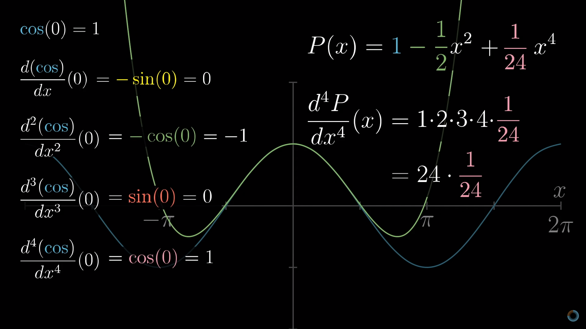
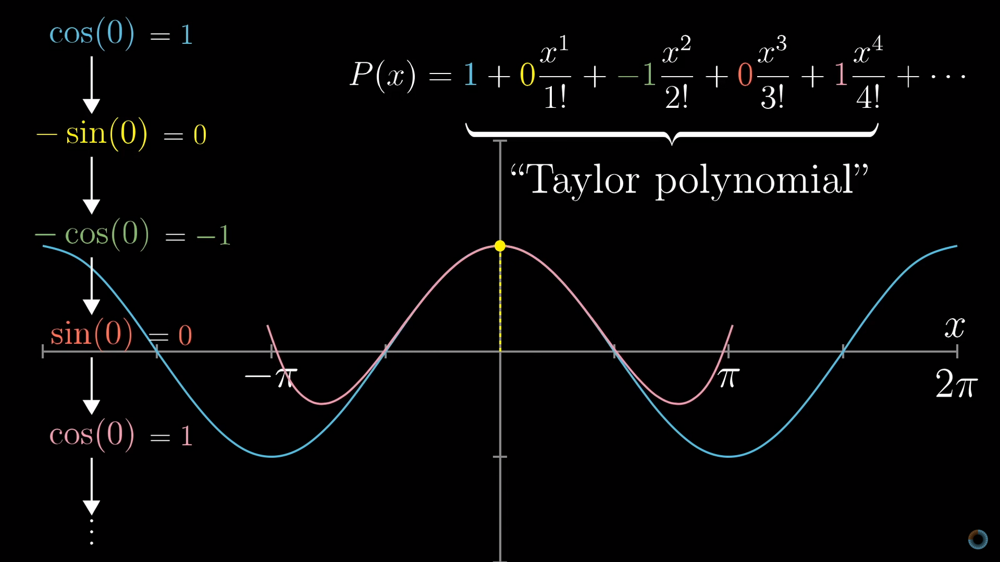

# Fórmula de Taylor

```toc

```

É recomendada a visualização do seguinte vídeo, como suporte aos resumos:

::youtube{#3d6DsjIBzJ4}

## Derivadas de Ordem Superior

Conceito já introduzido nas [classes de funções](/cdi-i/diferenciabilidade#classes-de-funções).

No entanto, este conceito pode ser definido por recorrência:

💡 Se $f$ é diferenciável em $A\subset D_f$, para qualquer $x\in A$,

$$
\displaystyle\begin{cases}
f^{(1)}(x)=f'(x)\\
f^{(n+1)}(x)=[f^{(n)}(x)]'
\end{cases}
$$

se $f^{(k)}$ é diferenciável em $A$, para qualquer $k=1,\dots,n$.

Como exemplo desta definição, estuda-se a função polinomiar definida por

$$
f(x)=x^4+3x^2+18x+1\\
f'(x)=4x^3+6x+18=f^{(1)}(x)\\
f''(x)=12x^2+6=f^{(2)}(x)\\
f^{(3)}(x)=24x\\
f^{(4)}(x)=24\\
f^{(n)}(x)=0,\forall n\in\N,n>4
$$

👉 Para qualquer função polinomial de grau $n\in\N_0$ que têm todas as derivadas definidas em $\R$, tem-se $f^{(k)}(x)=0$ para qualquer $k>n$ e qualquer $x\in\R$.

## Determinação de derivadas de ordem $n$

As derivadas de ordem $n$ de algumas funções são intuitivamente obtidas (para $n\in\N_0$):

- [$f(x)=e^{ax}$](color:orange) então [$f^{(n)}(x)=a^ne^{ax}$](color:yellow)
- [$f(x)=\sin(ax)$](color:orange) então [$f^{(n)}(x)=a^n\sin(\frac{n\pi}2+ax)$](color:yellow)

A demonstração por indução da derivada de ordem $n$ da função exponencial encontra-se no PDF da aula 17, páginas 1 e 2.

## Fórmula de Leibnitz

**Fórmula de Leibnitz para a derivada de ordem $n$ do produto**

Sejam $f$ e $g$ duas funções com derivada até à ordem $n$ numa vizinhança do ponto $x_0$. Então, o produto $f\cdot g$ é $n$ vezes diferenciável numa vizinhança de $x_0$ e:

$$
(f\cdot g)^{(n)}(x_0)=\sum_{k=0}^n\bigg[\smartcolor{orange}{\begin{pmatrix}n\\k
\end{pmatrix}}\smartcolor{green}{f^{(n-k)}(x_0)}\smartcolor{pink}{g^{(k)}(x_0)}\bigg]
$$

$$
\smartcolor{orange}{\begin{pmatrix}n\\k
\end{pmatrix}}={^n}C_k=\frac{n!}{(n-k)!\cdot k!}
$$

Então, se por exemplo, considerarmos a função $h(x)=x^2e^{ax}$, temos:

$$
f(x)=e^{ax}\quad g(x)=x^2\\
\smartcolor{green}{f^{(n)}(x)=a^ne^{ax}}\\
\smartcolor{pink}{g^{(0)}(x)=g(x)=x^2\quad g^{(1)}(x)=g'(x)=2x\quad g^{(2)}(x)=g''(x)=2}\\
\tag{a}g^{(k)}(x)=0, \forall k>2
$$

Logo, pela Fórmula de Leibnitz, obtém-se o seguinte resultado para a derivada de ordem $n$ de $h$, visto que apenas os três primeiros termos são não nulos, por $(a)$.

$$
\big(x^2e^{ax}\big)^{(n)}=\smartcolor{orange}{\begin{pmatrix}n\\0
\end{pmatrix}}\smartcolor{green}{f^{(n)}(x)}\smartcolor{pink}{g(x)}+\smartcolor{orange}{\begin{pmatrix}n\\1
\end{pmatrix}}\smartcolor{green}{f^{(n-1)}(x)}\smartcolor{pink}{g'(x)}+\smartcolor{orange}{\begin{pmatrix}n\\2
\end{pmatrix}}\smartcolor{green}{f^{(n-2)}(x)}\smartcolor{pink}{g''(x)}=\\=
\smartcolor{orange}{1}\cdot\smartcolor{green}{a^ne^{ax}}\smartcolor{pink}{x^2}+\smartcolor{orange}{n}\smartcolor{green}{a^{n-1}e^{ax}}\cdot\smartcolor{pink}{2x}+\smartcolor{orange}{\frac{n(n-1)}{\cancel{2!}}}\smartcolor{green}{a^{(n-2)}e^{ax}}\cdot\smartcolor{pink}{\cancel2}
$$

## Contacto de ordem $n$ entre duas funções

- O polinómio aproxima a função suficientemente bem para que o quociente entre a diferença entre eles e $x-x_0$, que é um infinitésimo, ainda tende para $0$ quando $x\to x_0$.

Considerando um polinómio, em $x-x_0$, de ordem $n$

$$
P_{x_0,n}(x)=a_0+a_1(x-x_0)+a_2(x-x_0)^2+a_3(x-x_0)^3+\dots+a_n(x-x_0)^n
$$

Isto corresponde a dizer que

- $f(x_0)=a_0$ (contacto de ordem 0)
- $f'(x_0)=a_1$ (contacto de ordem 1)
- $f''(x_0)=2\cdot a_2$ (contacto de ordem 2)
- $f^{(3)}(x_0)=3\cdot 2\cdot a_3$ (contacto de ordem 3)
- $f^{(n)}(x_0)=n!\cdot a_n$ (contacto de ordem $n$)

Assim, obtemos uma expressão para os coeficientes da função polinomial que tem contacto de ordem $n$ com a função $f$:

$$
a_k=\frac{f^{(k)}(x_0)}{k!}\quad k=0,1,\dots,n
$$

## Polinómio de Taylor

Juntado os coeficientes obtidos acima, podemos obter o polinómio de Taylor:

Seja $f$ uma função com derivadas até à ordem $n$ numa vizinhança de $x_0\in\R$. Chama-se polinómio de Taylor de ordem $n$ da função $f$, relativo ao ponto $x_0$, ou em torno do ponto $x_0$ ao polinómio

$$
P_{f,x_0,n}(x)=\sum_{k=0}^na_k(x-x_0)^k
$$

onde

$$
a_k=\frac{f^{(k)}(x_0)}{k!}\quad k=0,1,\dots,n
$$




O polinómio de Taylor de ordem $n$, relativo a $x_0$, existe para qualquer função de ordem $C^{n-1}(V_r(x_0))$ que tenha derivada de ordem $n$ em $x_0$ e que esse polinómio é único.

:::details[Exemplo]

Podemos aproximar a função seno, junto da origem, construindo um polinómio de Taylor de ordem 4. Seja então $f(x)=\sin x$, $x_0=0$ e $n=4$.

$$
f^{(k)}(0)=\sin\bigg(\frac{k\pi}2\bigg)\implies\\
f(0)=0\\
f'(0)=1\\
f''(0)=0\\
f^{(3)}(0)=-1\\
f^{(4)}(0)=0
$$

Usando a fórmula para o polinómio de Taylor:

$$
a_0=0,a_1=1,a_2=0,a_3=-\frac 16,a_4=0
$$

Então, $\displaystyle P_4(x)=x-\frac{x^3}6$.

👉 Podem-se tirar duas conclusões ao analisar este exemplo:

- A construção do polinómio é uma tarefa mecânica, muito simples.
- Sem a indicação da ordem do polinómio, ser-se-ia levado a acreditar que se tratava de um polinómio de terceira ordem, visto que os polinómios de terceira e quarta ordem coincidem, pois ambos têm grau 3.

:::

## Teorema/Fórmula de Taylor

Sejam $n\in\N^+$, $x_0\in\R$ e $f$ uma função de classe $C^{(n-1)}(V_r(x_0))$, para algum $r\in\R^+$, com derivada de ordem $n$ em $V_r(x_0)$.

Então, $f(x)=P_n(x)+R_n(x)$ onde $P_n(x)$ é o polinómio de Taylor de ordem $n$ da função $f$ em torno do ponto $x_0$ e $R_n(x)$ satisfaz

$$
lim_{x\to x_0}\frac{R_n(x)}{(x-x_0)^n}=0
$$

Chama-se à função $R_n$, resto de ordem $n$ da fórmula de Taylor para a função $f$ no ponto $x_0$.

Simplificando, quando se aproxima uma função através de um polinómio de Taylor, existe um resto, $R_n(x)$, que corresponde à diferença entre o valor real da função e o valor aproximado pelo polinómio de Taylor.

:::warning
Quando $x_0=0$, frequentemente chama-se fórmula, resto e polinómio de **MacLaurin** em vez de fórmula, resto e polinómio de Taylor.
:::

## Restos

Tal como indicado acima, existe um resto associado ao Teorema de Taylor. Existem várias maneiras de calcular este resto, dependendo do problema em questão:

### Resto de Lagrange

Sejam $n\in\N ^+$, $x_0\in\R$ e $f$ uma função de classe $C^{(n)}(V_r(x_0))$, para algum $r\in\R^+$, tal que $f^{(n)}$ é diferenciável em $V_r(x)$. Então, o resto de ordem $n$ da fórmula de Taylor é dado por:

$$
R_n(x)=\frac{f^{(n+1)}(c)}{(n+1)!}\cdot (x-x_0)^{n+1}
$$

para algum $c$ tal que $|c-x_0|<|x-x_0|$.

### Resto de Peano

Sejam $n\in\N ^+$, $x_0\in\R$ e $f$ uma função de classe $C^{(n)}(V_r(x_0))$, para algum $r\in\R^+$, tal que $f^{(n)}$ é diferenciável em $V_r(x)$. Então, o resto de ordem $n$ da fórmula de Taylor é dado por:

$$
R_n(x)=\bigg(\frac{f^{(n+1)}(x_0)}{(n+1)!}+\alpha_n(x)\bigg)(x-x_0)^{n+1}
$$

onde $\displaystyle\lim_{x\to x_0}\alpha_n(x)=0$.

:::warning
O $\alpha_n(x)$ é algo que vai mesmo ficar no resultado final, não dá para descobrir, apenas sabemos que tende para zero em $x_0$.
:::

Para calcular limites, usa-se maioritariamente o Resto de Peano. Para outros casos, usa-se o Resto de Lagrange.

### Resto de Cauchy

:::danger[🚫]
Raramente se usa este resto.
:::

Sejam $n\in\N ^+$, $x_0\in\R$ e $f$ uma função de classe $C^{(n)}(V_r(x_0))$, para algum $r\in\R^+$, tal que $f^{(n)}$ é diferenciável em $V_r(x)$. Então, o resto de ordem $n$ da fórmula de Taylor é dado por:

$$
R_n(x)=\frac{f^{(n+1)}(c)}{n!}\cdot (x-c)^{n}(x-a)
$$

para algum $c$ tal que $|c-x_0|<|x-x_0|$.

:::details[Exemplo]

Para escrever a fórmula de MacLaurin para $f(x)=\sh(ax)$, com resto de ordem 4, começa-se por determinar o polinómio de MacLaurin de ordem 4 para $f$.

$$
\big(\sh(ax)\big)^{(n)}=\begin{cases}
a^n\sh(ax)&\text{se }n\text{ é par}\\
a^n\ch(ax)&\text{se }n\text{ é ímpar}
\end{cases}
$$

Aplicando a fórmula dos coeficientes do polinómio de Taylor:

$$
a_0=0\quad,\quad a_1=a\quad, \quad a_2=0\quad,\quad a_3=\frac{a^3}6\quad,\quad a_4=0\\
P_4(x)=ax+\frac{a^3}6x^3
$$

De seguida, calcula-se o resto de Lagrange. Por definição:

$$
f^{(5)}(c)=a^5\ch(ac)\\
R_4(x)=\frac{a^5\ch(ac)}{120}x^5\quad,\quad |c|<|x|
$$

Logo, como $f(x)=P_n(x)+R_n(x)$:

$$
f(x)=ax+\frac{a^3}6x^3+\frac{a^5\ch(ac)}{120}x^5\quad,\quad x\in\R,|c|<|x|
$$

::youtube{#fA8x8lF6bG4}

Como podemos observar, a aproximação da função perto de $x_0=0$ é bastante boa, até porque $R(x)$ é praticamente zero.

:::

### Majorar o erro

Seguindo o exemplo anterior, podemos majorar o erro, isto é, descobrir o valor máximo do resto numa vizinhança de $x_0$.

Escolhemos, por exemplo, $V_{\frac 12}(0)$ e $a=2$:

$$
\epsilon=|f(x)-P_4(x)|=|R_4(x)|=\bigg|\frac{32\ch(2c)}{120}x^5\bigg|
$$

Como $|c|<|x|<\frac 12$, e $\ch(2x)$ é crescente em $\R^+$ e $\ch(2\cdot\frac 12)<\frac 74$, pode-se majorar o erro por:

$$
\epsilon<\frac 7{480}=\frac{32\times\frac 74}{120}\times\bigg(\frac 12\bigg)^5
$$

Assim, uma das grandes utilidades do **Resto de Lagrange** é[ majorar o erro cometido ao aproximar a função pelo polinómio.](color:orange)

### Cálculo de limites

Para calcular limites, usa-se normalmente o Resto de Peano.

Considerando o seguinte limite:

$$
\lim_{x\to 0}\frac{6\sh(2x)-12x-8x^3}{x^5}
$$

Facilmente se conclui que se trata de uma indeterminação. No entanto, seria complicado de levantar esta indeterminação pela Regra de Cauchy, porque se teria de a aplicar cinco vezes. Assim, pode-se recorrer ao Resto de Peano.

Assim, usado a Fórmula de MacLaurin:

$$
\sh(2x)=2x+\frac86x^3+\bigg(\frac{32}{120}+\alpha_4(x)\bigg)x^5\quad,\quad \lim_{x\to0}\alpha_4(x)=0
$$

Então:

$$
\lim_{x\to 0}\frac{6\sh(2x)-12x-8x^3}{x^5}=\lim_{x\to 0}=\frac{12x+8x^3+6(\frac 4{15}+\alpha_4(x))x^5-12x-8x^3}{x^5}\\=
\lim_{x\to 0}\bigg(\frac85+6\alpha_4(x)\bigg)=\frac85
$$

Assim, uma das grandes utilidades do **Resto de Peano** é o [cálculo de limites.](color:orange)

## Teorema de Taylor para os extremos

Tal como já foi referido anteriormente, o conjunto dos extremantes locais (de uma função diferenciável em todo o seu domínio) está sempre contido no conjunto dos zeros da sua derivada. A estes pontos (pontos onde a primeira derivada é nula), chamam-se pontos de estacionariedade da função, ou, pontos críticos da função.

Podemos usar o seguinte Teorema para verificar se uma função tem um extremo num ponto:

Seja $f$ uma função de classe $C^n$, $n\ge 1$ numa vizinhança de um ponto $x_0\in\R$ tal que

$$
f'(x_0)=f''(x_0)=\dots=f^{(n-1)}(x_0)=0\quad f^{(n)}(x_0)\ne 0
$$

Então, pode-se concluir o seguinte:

- Se $n$ é par:
  - Se $f^{(n)}(x_0)>0$, $x_0$ é minimizante local
  - Se $f^{(n)}(x_0)<0$, $x_0$ é maximizante local
- Se $n$ é ímpar:
  - Se $f^{(n)}(x_0)>0$, $f$ é crescente numa vizinhança de $x_0$
  - Se $f^{(n)}(x_0)<0$, $f$ é decrescente numa vizinhança de $x_0$

**Nada se pode concluir no caso em que uma função tem as derivadas todas nulas num ponto.**

👉 A demonstração do teorema encontra-se no PDF da aula 18, páginas 5 a 7.

::youtube{#QgDYPD3A80g}

## Concavidade

Pode definir-se formalmente a concavidade de uma função do seguinte modo:

Seja $f$ uma função diferenciável num ponto $x_0\in\R$. Diz-se que:

- $f$ é convexa em $x_0$ se $f(x)-f(x_0)-f'(x_0)(x-x_0)\ge0$ nalguma vizinhança de $x_0$. Também se diz, nesse caso, que o gráfico de $f$ tem a concavidade virada para cima.
- $f$ é côncava em $x_0$ se $f(x)-f(x_0)-f'(x_0)(x-x_0)\le0$ nalguma vizinhança de $x_0$. Também se diz, nesse caso, que o gráfico de $f$ tem a concavidade virada para baixo.
- $f$ tem um ponto de inflexão em $x_0$ se $f(x)-f(x_0)-f'(x_0)(x-x_0)\le0$ numa das semi-vizinhanças laterais de $x_0$ e $f(x)-f(x_0)-f'(x_0)(x-x_0)\ge0$ na outra.

[Pela definição, não é necessário ter a segunda derivada para calcular a concavidade.](color:yellow)

### Teorema de Taylor para as concavidades

Seja $f$ uma função de classe $C^n$, $n\ge 2$ numa vizinhança de um ponto $x_0\in\R$, tal que

$$
f''(x_0)=\dots=f^{(n-1)}(x_0)=0\quad f^{(n)}(x_0)\ne 0
$$

Então:

- Se $n$ é par
  - Se $f^{(n)}(x_0)>0$, $f$ é convexa em $x_0$
  - Se $f^{(n)}(x_0)<0$, $f$ é côncava em $x_0$
- Se $n$ é ímpar, $f$ tem um ponto de inflexão em $x_0$

::youtube{#kHdRwzxIk8c}

---

PDFs:

- [Aula 16](https://drive.google.com/file/d/1UqqOcCUyPbVq081faqbpWMOo8ExIBiIQ/view?usp=sharing)
- [Aula 17](https://drive.google.com/file/d/1fRxLQZmQAKjswKgHCTo_BsDj7VFRhPuX/view?usp=sharing)
- [Aula 18](https://drive.google.com/file/d/1EmMHnZdpABcwg8jaNCM2S9cF_sSKtYkV/view?usp=sharing)
