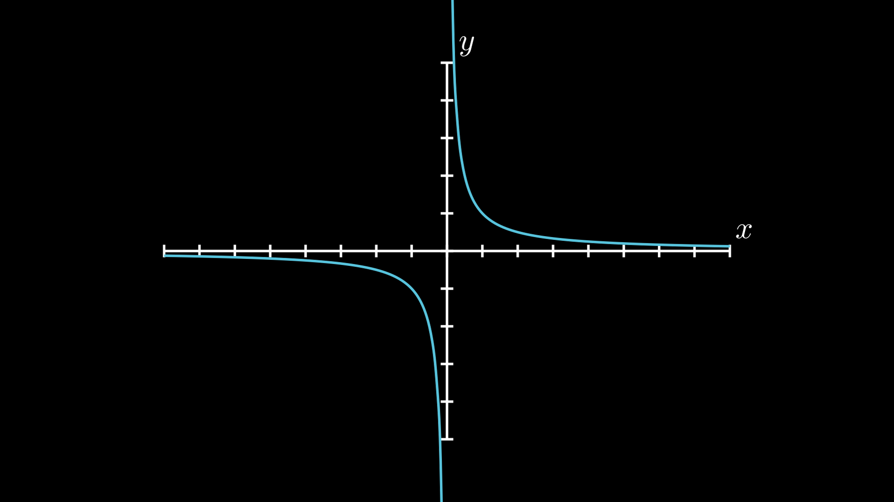
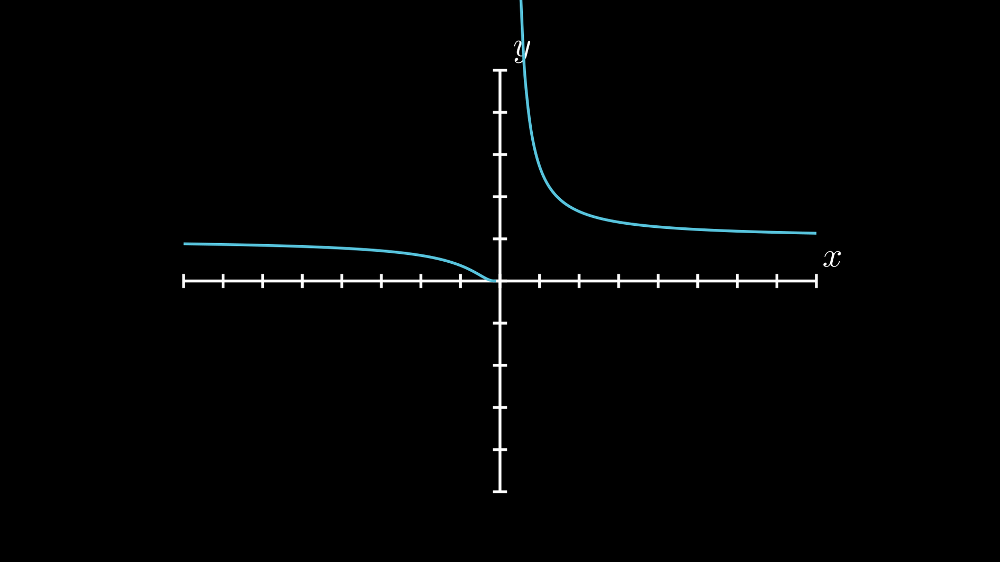

# Estudo Gráfico de Funções

```toc

```

## Assíntotas

### Assíntotas Verticais

Diz-se que a reta de equação $x=x_0$ é uma assíntota:

- vertical [à esquerda](color:orange) para $f$ se $f$ está definida em $]x_0 − r, x_0[$, para algum $r\in\R^+$, e $f(x_0^-)=\pm \infin.$
- vertical [à direita](color:orange) para $f$ se $f$ está definida em $]x_0, x_0+r[$, para algum $r\in\R^+$, e $f(x_0^+)=~\pm \infin.$
- [bi-lateral](color:green) para $f$ se é simultaneamente uma [assíntota à esquerda](color:orange) e uma [assíntota à direita](color:orange).

👉 Só é preciso estudar a existência de assíntotas verticais nos pontos em que a função não é contínua.

Podem existir infinitas assíntotas verticais numa função, tal como é o caso da função $f(x)=\tg x.$

:::details[Exemplos]

[**Exemplo 1**](color:orange)

Função $f:\R\backslash \{0\}\to \R\quad,\quad f(x)=\frac 1x$

Tem uma assintota bi-lateral de equação $x=0$.



[**Exemplo 2**](color:orange)

$$
g:\R\to\R\quad,\quad g(x)=\begin{cases}
e^{\frac 1x} &\text{se }x\ne 0\\
0&\text{se }x=0
\end{cases}
$$

Tem uma assintota à direita de equação $x=0$. É de salientar que esta função está definida na origem, sendo mesmo contínua à esquerda. Mesmo assim, tem uma assintota neste ponto.



:::

### Assintotas Não Verticais

Seja $f$ uma função que está definida em $V_r(+\infin)$, para algum $r\in\R^+$.

Diz-se que a reta ${y=m_+x+b_+}$ é uma [assintota não vertical](color:orange) [à direita](color:yellow) de $f$ se

$$
\lim_{x\to+\infin}\frac{f(x)}x=m_+\in\R\quad,\quad\lim_{x\to+\infin}\big[f(x)-mx\big]=b_+\in\R
$$

Também se diz, nesse caso, que a reta descreve o comportamento assintótico de $f$ quando ${x\to+\infin}$.

Define-se de modo equivalente uma [assintota não vertical](color:orange) [à esquerda](color:green) de $f$, ${y=m_{-}x+b_{-}}$.

👉 Caso $m$ ou $b$ não pertençam a $\R$, não existe [assintota não vertical](color:orange) (no "lado" que estiverem a verificar).

Pela unicidade do limite, existe **no máximo**, uma [assintota não vertical](color:orange) [à esquerda](color:green) e uma [assintota não vertical](color:orange) [à direita](color:yellow).

### Assintotas Não Retilíneas

:::warning
Este tipo de assintotas é conhecimento extra que não será avaliado.
:::

A explicação de como determinar assintotas não retilíneas (não verticais) encontra-se nas páginas 3 e 4 do PDF da aula 19. Entre outros, exemplos destas assintotas são assintotas quadráticas e assintotas exponenciais.

## Paridade de funções

:::tip[Conjunto Simétrico]
Diz-se que $C\subset\R$ é um conjunto simétrico se ${x\in C \implies -x\in C}$.
:::

Seja $D_f\subset\R$ um conjunto simétrico e $f: D_f\to \R$ uma função definida em $D_f$. Diz-se que

- $f$ é uma [função par](color:orange) se $f(-x)=f(x)$ para todo o $x\in D_f$. Também se diz, nesse caso, que $f$ é simétrica em relação ao eixo $x=0$.
- $f$ é uma [função ímpar](color:yellow) se $f(-x)=-f(x)$ para todo o $x\in D_f$. Também se diz, nesse caso, que $f$ é simétrica em relação à origem.
- $f$ é uma [função simétrica](color:green) se $f$ é [par](color:orange) ou $f$ é [ímpar](color:yellow).

### Simetria em relação a $x_0$

Também é possível estudar a simetria num eixo sem ser $x=0$ ou num ponto sem ser a origem.

:::tip[Conjunto simétrico em relação a $x_0$]
Diz-se que $C\subset\R$ é um conjunto simétrico a $x_0$ se $x\in C \implies 2x_0-x\in C$.
:::

Uma função definida num conjunto $D_f$ simétrico em relação a $x_0$ é [simétrica em relação ao eixo $x=x_0$](color:orange) se $f(2x_0-x)=f(x)$ para qualquer $x\in D_f$.

Uma função definida num conjunto $D_f$ simétrico em relação a $x_0$ é [simétrica em relação ao ponto $(x_0,y_0)$](color:orange) se $f(2x_0-x)=2y_0-f(x)$.

:::details[Exemplo]

Tenhamos

$$
f :] − \infty, 0] \cup [2, +\infty[\to \R , f(x) = \sqrt{x^2 - 2x}.
$$

É fácil verificar que, sendo $D_f =] − \infty, 0] \cup [2, +\infty[$,

$$
x \in D_f \implies 2 − x \in D_f
$$

e que $f(2 − x) = f(x)$ ou, mais simplesmente que a função $g$ definida por

$$
g(x) = f(x + 1) = \sqrt{x^2 - 1}
$$

é uma função par de domínio $\R \backslash ] − 1, 1[.$  
Se, por exemplo, se calcular $f(2^+)$ tem-se, de imediato e sem mais cálculos, que $f(0^−) = f(2^+)$. Esta simplificação não é muito interessante, mas supondo que se pretende determinar as derivadas laterais nos ponto 0 e 2, o que tem que ser feito pela definição, o resultado já é mais interessante. Tem-se

$$
f'_d(2) = \lim_{x\to 2^+} \frac{f(x) − f(2)}{x - 2} = \lim_{x \to 2^+} \frac{\sqrt{x(x-2)}}{x-2} = \lim_{x \to 2^+} \sqrt{\frac{x}{x-2}} = +\infty.
$$

Para calcular $f'_e$ usando a definição ter-se-ia que fazer algo semelhante mas tendo cuidado com o passar $x$ para dentro da raiz que daria origem ao aparecimento de um sinal negativo no exterior da raiz,

$$
f'_e(0) = \lim_{x\to 0^-} \frac{f(x) - f(0)}{x - 0} = \lim_{x \to 0^-} \frac{\sqrt{x(x-2)}}{x} = \lim_{x \to 0^-} - \sqrt{\frac{x-2}{x}} = - \infty.
$$

Usando a simetria, como a derivada de uma função par é ímpar, ter-se-ia,
simplesmente,

$$
f'_e(0) = −f'_d(2) = −\infty.
$$

:::

## Periodicidade

:::tip[Conjunto Periódico]

Sejam $C\subset\R$ e $T\in\R^+$. Diz-se que $C$ é um conjunto periódico de período $T$ se ${x\in C\implies x+T\in C}$.

Também se diz que $C$ admite período $T$. Diz-se que $C$ é um conjunto periódico se ele admite algum período positivo.

Chama-se período principal de $C$ ao ínfimo do conjunto ${\{T\in\R^+:C \text{ admite o período }T\}}$. Por outras palavras, **o período principal de $C$ é o período mínimo positivo que o conjunto admite.**

Se $C$ admite período $T$, então $C$ admite período $kT, k\in\N^+$, logo o **período não é único**.

:::

:::tip[Função periódica]

Sejam $D_f$ um conjunto periódico e $f:D_f\to\R$. Diz-se que $f$ admite o período $T$ se $D_f$ admite o período $T$ e $f(x+T)=f(x)$, para qualquer $x\in D_f$.

Diz-se que uma função $f$ é periódica se $f$ admite um período positivo.

Define-se o período principal positivo de uma função não constante e periódica como sendo o ínfimo do conjunto ${\{T\in\R^+: f\text{ admite o período }T\}}$.

👉 Uma grande vantagem das funções periódicas é que basta saber o seu comportamento num intervalo qualquer da forma $[x_0,x_0+T]$ e sabe-se o seu comportamento em qualquer ponto de $\R$.

:::

## Estudo Completo de uma Função

O estudo completo de uma função consiste nos seguintes passos:

1. Domínio, simetria e periodicidade. Neste ponto podem ainda incluir-se as interseções com os eixos. Caso haja simetria ou periodicidade, esse facto deverá afetar o estudo seguinte, simplificando-o.
2. Continuidade e assíntotas. Aqui deve incluir-se o estudo da existência e prolongamento contínuo aos pontos de $\overline{D_F}\backslash D_F$. Caso exista prolongamento contínuo em algum desses pontos o restante estudo deve incidir sobre esse prolongamento.
3. Diferenciabilidade, monotonia e extremos.
4. Diferenciabilidade da derivada, concavidade e inflexões. Aqui é útil incluir a determinação do declive da tangente nos pontos de inflexão.
5. Gráfico e contradomínio. Aqui é útil começar por elaborar um quadro resumo de todo
   o conhecimento obtido sobre a função.

Das páginas 8-10 da Aula 19 encontra-se o estudo completo da função

$$
\log\bigg|\frac{1-x}{1+x}\bigg|,
$$

[que é bastante importante ver.](color:orange)

---

PDFs:

- [Aula 19](https://drive.google.com/file/d/12HKX5sQFxU4-WclJRzI9b02uSc6xu4xZ/view?usp=sharing)
