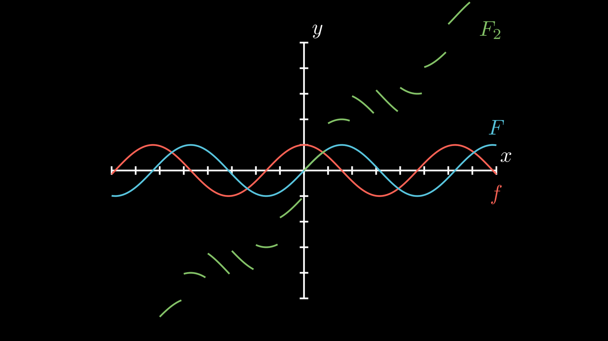

# Primitivação (e Técnicas)

```toc

```

## Primitivas

:::warning

Em geral, não é possível primitivar uma função. No entanto, continua a haver muitas funções contínuas para o qual a operação é possível, que iremos estudar.

:::

Seja $D_f\subset\R$ um aberto e $f:D_f\to\R$. Diz-se que $F$ é uma primitiva de $f$ se $F'(x)=f(x)$, para qualquer $x\in D_f$.

Nesse caso, escreve-se $F=\text Pf$ ou, também, $F(x)=\int f(x) \text dx$ e diz-se que $f$ é uma função primitivável.

Qualquer função contínua num conjunto **aberto** é primitivável.

👉 Uma primitiva não é única. É fácil de obter uma função com a mesma primitiva de $f$.
Assim, $\text P f$ deve ser visto como retornando uma função qualquer, de entre um número infinito de funções, as quais têm a mesma derivada.

Frequentemente, a primitiva é determinada por reconhecimento da derivada. Isto implica que se deve **saber muito bem as derivadas das várias funções**.

Usam-se várias "técnicas" para determinar a primitiva de uma função, explicadas abaixo.

### Propriedades da Primitivação

- $\text P(\alpha f)=\alpha (\text Pf), \alpha\in\R$, para qualquer função primitivável $f$.
- $\text P(f +g )=\text Pf + \text P g$

## Fórmula de Primitivação da Potência

Se $u$ é uma funlão diferenciável em todo o seu domínio tal que $u^\alpha$ é diferenciável em todo o domínio de $u$, então:

$$
P(u'u^\alpha)=\begin{cases}
\frac{u^{\alpha+1}}{\alpha+1}&\text{se }\alpha\ne -1\\
\log |u|&\text{se }\alpha= -1\\
\end{cases}
$$

Esta fórmula resume-se a identificar a função $u$, a função $u'$ e a constante $\alpha$.

:::details[Aplicação da Fórmula]

$$
\def\P{\text P} \P(x^{31})=\P(1\cdot x^{31})=\frac{x^{32}}{32}
$$

$$
\def\P{\text P}
\P(x(x^2+1)^{10})=\frac 12\P\big((2x)(x^2+1)^{10}\big)=\frac12\P(u'u^{10})=\frac12\cdot\frac{u^{11}}{11}=\frac{(1+x^2)^{11}}{22}
$$

$$
\def\P{\text P}
\P(\tg x)=\P\bigg(\frac{\sin x}{\cos x}\bigg)=-\P\bigg[(-\sin x)(\cos x)^{-1}\bigg]=-\log|\cos x|
$$

:::

## Primitivação de Exponenciais

Por vezes não necessitamos de nenhuma "técnica", apenas de reconhecer a derivada.

$$
(e^u)'=u'e^u\quad\longleftrightarrow\quad \text P(u'e^u)=e^u
$$

Abaixo encontram-se mais alguns exemplos com exponenciais, que têm a particularidade de a sua derivada ser esta mesma.

:::details[Aplicação da Fórmula]

$$
\def\P{\text P}
\P5^x=\frac 1{\log 5}\P\big[(\log 5)5^x\big]=\frac{5^x}{\log 5}\\\text{ou}\\
\P 5^x=\frac 1{\log 5}\P\big[(\log 5)e^{x\log 5}\big]=\frac{e^{x\log5}}{\log 5}=\frac{5^x}{\log 5}
$$

$$
\def\P{\text P}
\P(e^{x+e^x})=\P(e^xe^{e^x})=e^{e^x}
$$

:::

## Quase unicidade da primitiva num intervalo

:::tip[Definição]

Seja $f$ uma função definida num intervalo aberto e $F$ e $G$ duas primitivas de $f$. Então, $F-G$ é uma função constante, nesse intervalo.

:::

No entanto, isto já não é verdade caso a função esteja definina num **conjunto aberto que não é um intervalo**. Por exemplo:

$$
f:\R\backslash \Z\to\R\quad,\quad f(x)=\cos x
$$

Facilmente vemos que a seguinte função, primitiva de $f$, é limitada:

$$
F:\R\backslash\Z\to\R\quad,\quad F(x)=\sin x
$$

No entanto, a seguinte função, também primitiva de $f$, não é limitada:

$$
F_2:\R\backslash\Z\to\R\quad,\quad F_2(x)=\sin x+k\text{ se }x\in]k,k+1[,k\in\Z
$$



Conclui-se, assim, que uma função pode ter uma primitiva limitada e outra não limitada, cuja diferença não é, nem de longe nem de perto, uma constante.

:::details[Vários exemplos de cálculos de derivadas]

[Identificação da Derivada](color:orange)

$$
\def\P{\text P}
(\cos u)'=-u'\sin u\quad\longleftrightarrow\quad\P(u'\sin u)=-\cos u\\
\P\sin x=\P\big((1)\cdot(\sin x)\big)=-\cos x
$$

$$
\def\P{\text P}
(\sin u)'=u'\cos u\quad\longleftrightarrow\quad\P(u'\cos u)=\sin u\\
\P\big[x\cdot\cos( x^2+1)\big]=\frac12\P\big[(2x)\cdot\cos(x^2+1)\big]=\frac12\sin (x^2+1)
$$

[Fórmula de Primitivação da Potência](color:orange)

$$
\def\P{\text P}

\P\big((\sin x)\cdot\cos^2x\big)=-\P\big[(-\sin x)\cdot(\cos x)^2\big]=-\frac{(\cos x)^3}3=-\frac13\cos^3x
$$

$$
\def\P{\text P}
\P\frac{e^x}{e^x+1}=\P\big[(e^x)(e^x+1)^{-1}\big]=\log|e^x+1|
$$

[Propriedade da Primitiva da Soma](color:orange)

$$
\def\P{\text P}
\P\cos^3x=\P(\cos x \cdot\cos^2x)=\P\big[\cos x\cdot(1-\sin^2x)\big]=\\=\P\cos x - \P(\cos x \sin^2 x)=
\sin x-\frac{\sin^3x}3
$$

(atenção que abaixo usa-se a fórmula de bisseção do seno)

$$
\def\P{\text P}
\P\sin^2x=\P\frac{1-\cos(2x)}2=\P\frac12-\frac12\P\cos(2x)=\P\frac12-\frac14\P\big[2\cos(2x)\big]=\\
=\frac12x-\frac14\sin(2x)
$$

$$
\def\P{\text P}
(\tg u)'=\frac{u'}{\cos ^2u}\quad\longleftrightarrow\quad\P\frac{u'}{\cos^2 u}=\tg u\\
\P\tg ^4x=\P(\tg ^2x\cdot\tg^2x)=\P\bigg[\tg^2x\bigg(\frac 1{cos^2x}-1\bigg)\bigg]=\\
=\P\bigg[\bigg(\frac1{cos^2x}\bigg)\tg^2x\bigg]-\P(\tg^2x)=\P\bigg[\bigg(\frac1{cos^2x}\bigg)\tg^2x\bigg]-\P\bigg(\frac1{cos^2x}-1\bigg)=\\=
\frac{\tg^3x}{3}-\tg x+x
$$

$$
\def\P{\text P}
(\arcsin u)'=\frac{u'}{\sqrt{ 1-u^2}}\quad\longleftrightarrow\quad\P\frac{u'}{\sqrt{1-u^2}}=\arcsin u\\
\P\frac{1-x}{\sqrt{1-x^2}}=\P\frac{1}{\sqrt{1-x^2}}+\frac12 \P\bigg[(-2x)\cdot(1-x^2)^{-\frac12}\bigg]=\\=
\arcsin x+\frac12\cdot\frac{(1-x^2)^{\frac12}}{\frac12}=\arcsin x+\sqrt{1-x^2}
$$

$$
\def\P{\text P}
(\arctg u)'=\frac{u'}{ 1+u^2}\quad\longleftrightarrow\quad\P\frac{u'}{1+u^2}\arctg u\\
\P\frac{x+2}{x^2+1}=
\frac12\P\bigg[(2x)(1+x^2)^{-1}\bigg]+\P\frac2{x^2+1}=\frac12\cdot\log(1+x^2)+2\arctg x
$$

:::

## Fórmula de Primitivação por Partes

Sejam $u$ e $v$ diferenciáveis num conjunto aberto $C$ tais que a função $u\cdot v'$ é primitivável. Então, ${u'\cdot v}$ é uma função primitivável e $\def\P{\text P} \P(\smartcolor{orange}{u'}\cdot \smartcolor{blue}v)=u\cdot v-\P(\smartcolor{green}{u\cdot v'})$.

A escolha das funções $u'$ e $v$ deve ser, se possível, respeitando as condições:

- A função $\smartcolor{orange}{u'}$ deve ser facilmente primitivável
- A função $\smartcolor{blue}{v}$ tem que ser diferenciável e é conveniente que a sua derivada conduza a uma expressão mais simples
- A função $\smartcolor{green}{u\cdot v'}$ deve ser facilmente primitivável

:::details[Exemplos]

[**Exemplo 1**](color:orange)

$$
P(2x\log(x+1))=(x^2\log(x+1))-P\bigg(x^2\cdot\frac1{x+1}\bigg)=\\
=(x^2\log(x+1))-P\bigg(x-1+\frac1{x+1}\bigg)=\\=x^2\log(x+1)-\frac{x^2}2+x-\log(x+1)=\\=
(x^2-1)\log(x+1)-\frac12(x-1)^2+\frac14\\
\text{Aqui, usa-se a divisão de polinómios: }\frac{x^2}{x+1}=x-1+\frac1{x+1}
$$

[**Exemplo 2 (importante)**](color:orange)

$$
P(e^{2x}\cos(3x))=\bigg(\frac12e^{2x}\cos(3x)\bigg)-P\bigg(\frac12e^{2x}(-3\sin(3x))\bigg)=\\
=\frac12e^{2x}\cos(3x)+\frac32P(e^{2x}\sin(3x))=\\=
\frac12e^{2x}\cos(3x)+\frac32\bigg[\frac12 e^{2x}\sin(3x)-P\bigg(\frac12 e^{2x}3\cos(3x)\bigg)\bigg]=\\
=\frac{1}{2} \mathrm{e}^{2 x} \cos (3 x)+\frac{3}{4} \mathrm{e}^{2 x} \operatorname{sen}(3 x)-\frac{9}{4} \mathrm{P}\left(\mathrm{e}^{2 x} \cos (3 x)\right)
$$

Considerando $F(x)=\mathrm{P}\left(\mathrm{e}^{2 x} \cos (3 x)\right)$:

$$
F(x)=\frac{1}{2} \mathrm{e}^{2 x} \cos (3 x)+\frac{3}{4} \mathrm{e}^{2 x} \operatorname{sen}(3 x)-\frac{9}{4} F(x)\Leftrightarrow \\\Leftrightarrow \frac{13}{4} F(x)=\frac{1}{2} \mathrm{e}^{2 x} \cos (3 x)+\frac{3}{4} \mathrm{e}^{2 x} \operatorname{sen}(3 x) \Leftrightarrow \\\Leftrightarrow F(x)=\frac{\mathrm{e}^{2 x}}{13}(2 \cos (3 x)+3 \operatorname{sen}(3 x))
$$

:::

## Primitivas por Recorrência

[Podem encontrar exemplos de primitivas por recorrência nas páginas 2 e 3 do PDF da aula 22.](color:orange)

## Primitivas de uma Função Racional

Para utilizar esta técnica, é necessário que a função racional seja uma [**função racional própria**](color:orange), isto é, que o grau do numerador seja inferior ao grau do denominador.

Caso não se verifique, efetua-se a divisão inteira, de forma a obter o seguinte:

$$
\frac{P(x)}{Q(x)}=Q_1(x)+\frac{R(x)}{Q(x)}
$$

A fração $\frac{R(x)}{Q(x)}$ já é [própria](color:orange), e $Q_1(x)$ é um polinómio, sendo assim fácil de primitivar.

:::details[Exemplo]


A igualdade abaixo pode ser verificada através do quociente polinomial acima.

$$
\frac{x^3+2x^2+1}{x+1}=x^2+x-1+\frac2{x+1}
$$

$$
P\bigg(\frac{x^3+2x^2+1}{x+1}\bigg)=P x^2+P x-P(1)+P\frac2{x+1}=\frac{x^3}3+\frac{x^2}2-x+2\log|x+1|
$$

:::

Abaixo estão os passos para efetuar a primitivação de uma **função racional $\frac{P(x)}{Q(x)}$**:

- Se o grau de $P$ é maior ou igual que o grau de $Q$, efetuar a divisão inteira para transformar numa **função racional própria**:

  $$
  Q_1(x)+\frac{P_1(x)}{Q(x)}
  $$

  Senão, usar a função racional como está:

  $$
  \frac{P_1(x)}{Q(x)}
  $$

- Fatorizar os fatores de $Q(x)$ na forma

  $$
  (x-\alpha)^m\quad\text{ou}\quad\bigg((x-p)^2+q^2)\bigg)^m
  $$

  👉 A segunda notação é usada para descrever **pares** de fatores complexos (imaginários), em que $p$ é a parte real e $q$ a parte imaginária. Abaixo está um exemplo.
  Na prática, não irá ser necessário utilizar esta segunda notação em CDI-I.

  :::details[Exemplo]

  $$
  x^2+4x+5=0\iff x=-2\pm i\\
  x^2+4x+5=\big(x-(-2))^2+1^2\big)
  $$

  $$
  x^4+8x^3+26x^2+40x+25\iff x=-2\pm i\\
  x^4+8x^3+26x^2+40x+25=\big(x-(-2))^2+1^2\big)^2\\
  \text{Neste caso temos dois pares de fatores }-2\pm i
  $$

  :::

- Decompor os fatores em frações simples, determinando os coeficientes da decomposição, quer pelo mótodo dos coeficientes indeterminados, quer usando métodos expeditos.
- Primitivar cada uma das frações simples obtidas, podendo-se recorrer a outras regras aprendidas anteriormente.

### Decomposição em Frações Simples

:::tip

Nos exemplos abaixo usa-se $?$ em vez de escolher um valor para $P(x)$ para simplificar os exemplos.

:::

Para cada raiz **diferente** (isto é, de multiplicidade 1) da função $Q(x)$ "separa-se" da seguinte maneira:

$$
\frac{?}{(x-a)(x-b)\dots}=\frac{A}{x-a}+\frac{B}{x-b}+\dots
$$

Para cada raiz real de multiplicidade $m$ acrescentam-se $m$ frações simples da forma:

$$
\frac{A_1}{x-\alpha}+\frac{A_2}{(x-\alpha)^2}+\frac{A_3}{(x-\alpha)^3}+\dots+\frac{A_m}{(x-\alpha)^m}
$$

Para cada par de raizes complexas conjungadas $p\pm qi$ com multiplicidade $m$ adicionam-se $m$ frações da forma [(irrelevante em CDI-I)](color:orange):

$$
\frac{B_{1} x+C_{1}}{(x-p)^{2}+q^{2}}+\frac{B_{2} x+C_{2}}{\left((x-p)^{2}+q^{2}\right)^{2}}+\cdots+\frac{B_{m} x+C_{m}}{\left((x-p)^{2}+q^{2}\right)^{m}}
$$

:::details[Exemplos]

$$
x^3-x^2=x^2(x-1)\\
\frac{?}{x^3-x^2}=\frac A{x-1}+\frac B{x}+\frac C{x^2}
$$

Como $0$ é uma raiz de multiplicidade $2$ (aparece duas vezes na forma fatorizada), escreve-se como $\frac B{x}+\frac C{x^2}$ na decomposição em frações simples.

---

$$
x^5+2x^3+x=x(x^4+2x^2+1)=x(x^2+1)^2\\
\text{As raizes são: }0 \text{ e} \pm i\\
\tag{raiz complexa}((x-0)^2+1^2)^2=(x^2+1)^2
$$

$$
\frac{?}{x^5+2x^3+x}=\frac{A}x+\frac{Bx+C}{x^2+1}+\frac{Dx+E}{(x^2+1)^2}
$$

Na realidade, não é necessário descobrir o valor das raízes complexas, apenas é necessário saber fatorizar o polinómio. Isto simplifica bastante os cálculos.

:::

### Determinar os coeficientes da decomposição

Após decompor a função racional em funções simples, necessitamos de descobrir o valor dos coeficientes de decomposição ($A, B, C,\dots)$.

Para chegarmos a valores para os coeficientes, necessitamos de [**reduzir todos os denominadores ao denominador do termo da esquerda**](color:orange), para transformarmos a igualdade numa identidade polinomial.

Por exemplo:

$$
\begin{aligned}
\frac{1}{x^2+7x+12}&=\frac{A}{x+3}+\frac{B}{x+4}\\

\frac{1}{(x+3)(x+4)}&=\frac{A}{x+3}+\frac{B}{x+4}\\

1&=\frac{A(x+3)(x+4)}{x+3}+\frac{B(x+3)(x+4)}{x+4}\\

1&=A(x+4)+B(x+3)
\end{aligned}
$$

Após obtermos a identidade polinomial, usamos os dois métodos abaixo, por ordem, para obtermos os valores dos coeficientes:

- Métodos Expeditos

  Neste método, substitui-se $x$ por cada uma das raizes reais, de forma a obter alguns (ou todos) os coeficientes.

  Continuando com o exemplo anterior, no qual as raízes de $Q(x)$ são $-4$ e $-3$.

  $$
  x=-4\implies 1=A(-4+4)+B(-4+3)\implies 1=-B\implies B=-1\\
  x=-3\implies 1=A(-3+4)+B(-3+3)\implies 1=A
  $$

  Logo, no exemplo assim, $A=1$ e $B=-1$.

  Podemos confirmar que os cálculos estão corretos pois a seguinte igualdade é verdadeira:

  $$
  \frac{1}{x^2+7x+12}=\frac{1}{x+3}+\frac{-1}{x+4}
  $$

  ⬇️ Caso este método não seja suficiente para determinar todos os coeficientes, passa-se para o método seguinte.

- Método dos Coeficientes Indeterminados

  Usualmente já se conhecem os valores de alguns dos coeficientes, sendo este método utilizado para descobrir os restantes (usualmente quando há raízes de multiplicidade superior a 1).

  Assim, para os coeficientes que restam, escolhe-se uma das potências de $x$ associadas a esse coeficiente.

  Para simplificar os cálculos, normalmente **começa-se pela maior potência** ou pelo termo costante, se tal for possível.

  Tomando como **exemplo** a identidade polinomial,

  $$
  3x+1=Ax^2+Bx(x-1)+C(x-1)
  $$

  em que já se sabe que $A=4$ e $C=-1$ (pelos métodos expeditos).

  As potências $x^2$ e $x$ estão associadas ao coeficiente por determinar, o coeficiente $B$, pois ${Bx(x-1)=B(x^2-x)}$.

  Logo, escolhendo apenas os termos em $x^2$:

  $$
  \boxed{0x^2}+3x+1=A\boxed{x^2}+B(\boxed{x^2}+x)+C(\boxed{0x^2}+x-1)\\
  (x^2)\longrightarrow 0=A+B\iff B=-A\iff B=-4
  $$

:::details[Exemplos]

$$
2x+1=A(x^2+1)+(Bx+C)x
$$

Em que sabemos, pelos métodos expeditos, que $A=1$.

$$
(x^2)\longrightarrow 0=A+B\implies B=-1\\
(x)\longrightarrow C=2
$$

---

$$
\begin{aligned}x+1&=A(x^2+1)^2+(Bx+C)x(x^2+1)+(Dx+E)x\\
&=A(x^4+2x^2+1)+B(x^4+x^2)+C(x^3+x)+Dx^2+Ex\end{aligned}
$$

Em que sabemos, pelos métodos expeditos, que $A=1$

$$
\begin{aligned}
(x^4)&\longrightarrow&&0=A+B\implies B=-1\\
(x^3)&\longrightarrow&&0=C\\
(x^2)&\longrightarrow&&0=2A+B+D\implies D=-1\\
(x)&\longrightarrow&&1=C+E\implies E=1

\end{aligned}
$$

:::

### Finalizar a primitiva de uma função racional

Após transformarmos a função racional em várias funções simples, podemos usar as regras da primitivação para separarmos em várias primitivas. Aqui vai depender de caso para caso, mas no geral, vão-se obter primitivas simples de calcular, pelo menos comparada com a função original.

Tomando novamente o primeiro exemplo:

$$
\frac{1}{x^2+7x+12}=\frac{1}{x+3}+\frac{-1}{x+4}\\
$$

$$
\def\P{\text P}
\begin{aligned}
\P\bigg(\frac{1}{x^2+7x+12}\bigg)
&=\P\bigg(\frac{1}{x+3}+\frac{-1}{x+4}\bigg)\\
&=\P\bigg(\frac{1}{x+3}\bigg)-\P\bigg(\frac{1}{x+4}\bigg)\\
&=\log|x+3|-\log|x+4|\\
&=\log\bigg|\frac{x+3}{x+4}\bigg|
\end{aligned}
$$

:::danger[AVISO]

A aula 22 tem imensos exemplos, da página 6-12, que se recomenda ver também.

:::

## Primitivação por Substituição

:::warning

Trata-se de um método geral de primitivação, que deve ser usado apenas quando os outros métodos não funcionam.

:::

### Fórmula da primitivação por substituição - versão 1

Sejam $I,J\subset \R$ dois intervalos abertos e $\varphi:J\to I$ uma função bijetiva e diferenciável com derivada não nula em $J$. Seja, ainda, $f:I\to\R$ uma função em $I$. Então, se $(f\circ \varphi)\cdot \varphi'$ é uma função primitável em $J$, $f$ é primitável em $I$ e

$$
P(f)=\bigg[P\bigg((f\circ\varphi)\cdot\varphi'\bigg)\bigg]\circ\varphi^{-1}
$$

👉 Esta notação fica mais fácil de compreender com o exemplo abaixo.

### Fórmula da primitivação por substituição - versão 2

Sejam $I,J\subset \R$ dois intervalos abertos e $\varphi:J\to I$ uma função bijetiva e diferenciável. Seja, ainda, $f:I\to\R$ uma função primitável em $I$. Então, $(f\circ \varphi)\cdot \varphi'$ é uma função primitável em $J$ e

$$
P(f)=\bigg[P\bigg((f\circ\varphi)\cdot\varphi'\bigg)\bigg]\circ\varphi^{-1}
$$

[Esta fórmula tem um resultado semelhante, mas com condições levemente diferentes (nomeadamente elimina a restrição de a derivada de $\varphi$ não se anular).](color:green)

:::details[Exemplo]

$$
P\bigg(\frac 1{\sqrt x +1}\bigg)
$$

Utiliza-se uma mudança de variável $x=\varphi(t)=t^2$, com $t>0$, para haver injetividade.

$$
P\bigg(\frac 1 {\sqrt{t^2}+1}\cdot (2t)\bigg)=P\bigg(\frac{2t}{t+1}\bigg)\tag {1}
$$

Pela divisão inteira:

$$

P\bigg(\frac{2t}{t+1}\bigg)=P\bigg(2-\frac{2}{t+1}\bigg)=2t-2\log|t+1|
$$

Como $t=\varphi^{-1}(x)=\sqrt x$:

$$
P\bigg(\frac 1 {\sqrt x + 1}\bigg)=2\sqrt x - 2\log(\sqrt x + 1)\tag 2
$$

💡 Pode-se assim observar melhor a fórmula da primitivação por substituição mais facilmente. No passo (1), foi calculado $\def\P{\text P}
\P((f\circ \varphi)\cdot\varphi')$, com uma mudança de variável. Se seguida, no passo (2), foi feita normalmente a mudança de variável, correspondente à composta por $\varphi^{-1}$ na fórmula original.

:::

### Notação do Integral

Visto que se faz mudanças de variável, é usual utilizar a notação de integral, que indica qual é a a variável que se está a considerar.

Reescrevendo assim o exemplo acima, sendo $\def\d{\mathop{}\!\mathrm d}\d x=\varphi'(t)\d t=2t\d t$,

$$
\def\d{\mathop{}\!\mathrm d}
\int\frac{1}{\sqrt x + 1} \d x=\int\frac{ 1}{\sqrt{t^2}+1}\cdot(2t)\d t=\int 2-\frac{2}{t+1}\d t=2t-2\log|t+1|=\\=2\sqrt x-2\log(\sqrt x + 1)
$$

Isto acontece porque:

$$
\def\d{\mathop{}\!\mathrm d}
\varphi'=\frac{\d x}{\d t}\\
\d x = \frac{\d x}{\d t}\cdot \d t\iff \d x=\varphi ' (t)\d t
$$

### Substituições Clássicas

Abaixo seguem-se algumas substituições "clássicas", isto é, algumas técnicas que são normalmente utilizadas. Neste caso, com raízes em que o radicando corresponde a uma função quadrática de $x$.

$$
\def\d{\mathop{}\!\mathrm d}
\int\sqrt{a^2-b^2(x-c)^2}\d x
\\
\text{Usa-se }x=c+\frac ab \sin t\quad, \quad t\in\bigg]-\frac \pi2,\frac\pi 2\bigg[
$$

$$
\def\d{\mathop{}\!\mathrm d}
\int\sqrt{a^2+b^2(x-c)^2}\d x
\\
\text{Usa-se }x=c+\frac ab \sh t\quad, \quad t\in\R\\
\text{OU}\\
\text{Usa-se }x=c+\frac ab \tg t\quad, \quad t\in\bigg]-\frac \pi2,\frac\pi 2\bigg[
$$

A escolha da substituição que contém o seno hiperbólico requer o conhecimento da fórmula da bisseção do seno hiperbólico.

$$
\def\d{\mathop{}\!\mathrm d}
\int\sqrt{b^2(x-c)^2-a^2}\d x
\\
\text{Usa-se }x=c+\frac ab \ch t\quad, \quad t\in\R^+\\
\text{ou}\\
\text{Usa-se }x=c+\frac a{b \cos t}\quad, \quad t\in]0,\pi[
$$

A escolha da substituição que contém o cosseno hiperbólico requer o conhecimento da fórmula da bisseção do cosseno hiperbólico.

### Primitivas de raízes de polinomio do segundo grau

É, ainda, possível determinar primitivas de raízes de polinómios do segundo grau usando substituições meramente racionais e que transformam a primitiva dada numa primitiva de uma função racional.

Se $\alpha$ for uma raiz de $ax^2+bx+c$, pode-se determinar

$$
\def\d{\mathop{}\!\mathrm d}
\int\sqrt{ax ^2+bx+c}\d x
$$

Fazendo a substituição definida por $\sqrt{ax^2+bx+c}=(x-\alpha)t$, a qual transforma a primitiva numa primitiva de uma função racional.

Caso o polinómio não tenha raízes, pode-se aplicar uma das seguintes substituições:

$$
\sqrt{ax^2+bx+c}=\sqrt a x+ t\quad,\quad \text{se }a>0\\\text{ou}\\
\sqrt{ax^2+bx+c}=\sqrt c +xt\quad,\quad \text{se }c>0
$$

:::details[Exemplos]

[Os exemplos abaixo estão explicados em mais detalhe das páginas 5-11 do PDF da aula 23](color:yellow)

[**Exemplo 1**](color:orange)

$$
\def\d{\mathop{}\!\mathrm d}
\int\sqrt{\frac{x+1}x}\d x
$$

Considerando o seguinte (atendento às condições da fórmula):

$$
t^2=\frac{x+1}x\quad t>0
$$

Resolvendo em ordem a $x$:

$$
xt^2=1+x\iff x=\frac{1}{t^2-1}\quad t>0
$$

Diferenciando os membros:

$$
\def\d{\mathop{}\!\mathrm d}
\d x = \frac{-2t}{(t^2-1)^2}\d t
$$

E, finalmente, substituindo na primitiva:

$$
\def\d{\mathop{}\!\mathrm d}
\int\sqrt{\frac{x+1}x}\d x=\int \sqrt{1+\frac{1}{\frac{1}{t^2-1}}}\cdot \frac{-2t}{(t^2-1)^2}\d t=\int\sqrt{t^2}\cdot\frac{-2t^2}{(t^2-1)^2}\d t=\\=\int\frac{-2t^2}{(t^2-1)^2}\d t
$$

Aplicando agora a Primitivação de Funções Racionais (cálculos completos no PDF):

$$
\frac{-2t^2}{(t^2-1)^2}=-\frac 12\cdot\frac1{t-1}-\frac12\cdot\frac1{(t-1)^2}+\frac12\cdot\frac1{t+1}-\frac12\cdot\frac1{(t+1)^2}
$$

Finalizando as contas:

$$
\def\d{\mathop{}\!\mathrm d}
\int\sqrt{\frac{x+1}x}\d x=\int-\frac 12\cdot\frac1{t-1}-\frac12\cdot\frac1{(t-1)^2}+\frac12\cdot\frac1{t+1}-\frac12\cdot\frac1{(t+1)^2}\d t=\\
=-\frac12\log|t-1|+\frac12\frac{1}{t-1}+\frac12\log|t+1|+\frac12\frac1{t+1}=\frac12\log\bigg|\frac{t+1}{t-1}\bigg|+\frac{t}{t^2-1}
$$

Substituindo $t=\sqrt{\frac{x+1}x}$ e após simplificar:

$$
\def\d{\mathop{}\!\mathrm d}
\int\sqrt{\frac{x+1}x}\d x=\frac12\log(|2x+1|+2\sqrt{x^2+x})+\frac{|x|}x\cdot\sqrt{x^2+x}
$$

[**Exemplo 2**](color:orange)

No caso abaixo, pertende-se obter uma função racional por substituição, e, por isso, faz-se a substituição por $x=t^m$ onde $m$ é o [**mínimo múltiplo comum**](color:green) dos índices das raízes, com $t>0$, se $m$ é par, para ter injetividade.

$$
\def\d{\mathop{}\!\mathrm d}
\int\frac{1+\sqrt x}{4-\sqrt[3]x}\d x
$$

Neste caso, como o mínimo múltiplo comum entre 2 e 3 é 6, faz-se $x=t^6,t>0$:

$$
\def\d{\mathop{}\!\mathrm d}
\d x=6t^5\d t
$$

Então:

$$
\def\d{\mathop{}\!\mathrm d}
\int\frac{1+\sqrt x}{4-\sqrt[3]x}\d x=\int\frac{1+\sqrt {t^6}}{4-\sqrt[3]{t^6}}\cdot 6t^5\d t=\int\frac{1+t^3}{4-t^2}\cdot 6t^5\d t
$$

A partir daqui é só efetuar a Primitivação de Funções Racionais!

[**Exemplo 3 - substituição clássica**](color:orange)

$$
\def\d{\mathop{}\!\mathrm d}
\int\sqrt{9-4x^2}\d x
$$

Utilizando a substituição:

$$
x=\frac 32 \sin t\quad, \quad t\in\bigg]-\frac \pi2,\frac\pi 2\bigg[\\
\def\d{\mathop{}\!\mathrm d}
\d x=\bigg(\frac 32\cos t\bigg)\d t
$$

Logo:

$$
\def\d{\mathop{}\!\mathrm d}
\int\sqrt{9-4x^2}\d x
=\int\sqrt{9-9\sin^2t}\bigg(\frac 32\cos t\bigg)\d t
=\int\frac 92\sqrt{\cos^2 t}\cos t \d t
=\\=\frac92\int\cos ^2t\d t
$$

Pois $t\in]-\frac\pi 2,\frac\pi2[$

$$
\def\d{\mathop{}\!\mathrm d}
\frac92\int\cos ^2t\d t
=\frac 94\int1+\cos(2t)\d t=\frac94\bigg(t+\frac 12\sin (2t)\bigg)
=\\=\frac94\bigg[\arcsin\bigg(\frac{2x}3\bigg)-\frac12\sin\bigg(2\arcsin\bigg(\frac{2x}3\bigg)\bigg)\bigg]
=\\=\frac94\bigg[\arcsin\bigg(\frac{2x}3\bigg)-\frac{2x}3\sqrt{1-\frac{4x^2}9}\bigg]
$$

Pois $\sin(2\arcsin(u))=2u\sqrt{1-u^2}$.

[**Exemplo 4 - Primitivas de raízes de polinómio do segundo grau**](color:orange)

Utilizando, novamente, o mesmo exemplo:

$$
\def\d{\mathop{}\!\mathrm d}
\int\sqrt{9-4x^2}\d x
$$

Como $\alpha =\frac32$ é uma raiz de $9-4x^2$, utilizando a fórmula $\sqrt{ax^2+bx+c}=(x-\alpha)t$:

$$
\begin{aligned}
\sqrt{9-4x^2}&=t(3-2x)\\
\sqrt{(3-2x)(3+2x)}&=t(3-2x)\\
(3-2x)(3+2x)&=t^2(3-2x)^2\\
3+2x&=t^2(3-2x)\\
3+2x&=3t^2-2xt^2\\
2x+2xt^2&=3t^2-3\\
x(2+2t^2)&=3t^2-3\\
x&=\frac{3t^2-3}{2t^2+2}
\end{aligned}
$$

$$
\def\d{\mathop{}\!\mathrm d}
\d x=\frac{6t}{(t^2+1)^2}\d t
$$

Substituindo na expressão inicial:

$$
\def\d{\mathop{}\!\mathrm d}
\int\sqrt{9-4x^2}\d x
=\int t\bigg(3-\frac{3t^2-3}{t^2+1}\bigg)\frac{6t}{(t^2+1)^2}\d t
$$

E agora é só finalizar pela Primitivação de Funções Racionais.

[**Exemplo 5**](color:orange)

Existe outro caso em que a função a primitivar já tem o aspeto $(f \circ \varphi ^{-1})\cdot(\varphi^{-1})'$.

$$
\def\d{\mathop{}\!\mathrm d}
\int\frac{\log x + \log^2x}{x(\log^2x-1)}\d x
$$

Onde $\log x= t$ e $\def\d{\mathop{}\!\mathrm d}
\frac 1x\d x=\d t$.

Substituindo na primitiva:

$$
\def\d{\mathop{}\!\mathrm d}
\int\frac{\log x + \log^2x}{\log^2x-1}\cdot\frac1x\d x
=\int\frac{t+t^2}{t^2-1}\d t
$$

E agora é só finalizar pela Primitivação de Funções Racionais.

[**Exemplo 6**](color:orange)

Caso se pretenda primitivar uma função racional de senos e cossenos, isto é, uma fração em que quer o numerador quer o denominador são combinações lineares de potências do seno e do cosseno, a substituição definida por

$$
\tg \frac x 2=t
$$

transforma a primitiva numa primitiva de função racional pois resulta em

$$
\sin x=\frac{2t}{1+t^2}\quad\text{e}\quad\cos x=\frac{1-t^2}{1+t^2}
$$

e conduz a

$$
\def\d{\mathop{}\!\mathrm d}
\d x=\frac2{1+t^2}\d t
$$

pois

$$
\tg \frac x 2=t\iff \frac x2=\arctg t\iff x=2\arctg t
$$

:::

---

PDFs:

- [Aula 20](https://drive.google.com/file/d/1YCX92Yyf53FyidZIzcivdrxNgsY08AyH/view?usp=sharing)
- [Aula 21](https://drive.google.com/file/d/1zu-PidnVQQvZnpGOpqbbGZSfrHdMflVL/view?usp=sharing)
- [Aula 22](https://drive.google.com/file/d/1-QlI_SejcorVi5yatAH_uFvr1DrlNV_S/view?usp=sharing)
- [Aula 23](https://drive.google.com/file/d/1XGFMOReHgEDMgX9yIdZqD2bHeXyzrMUT/view?usp=sharing)
