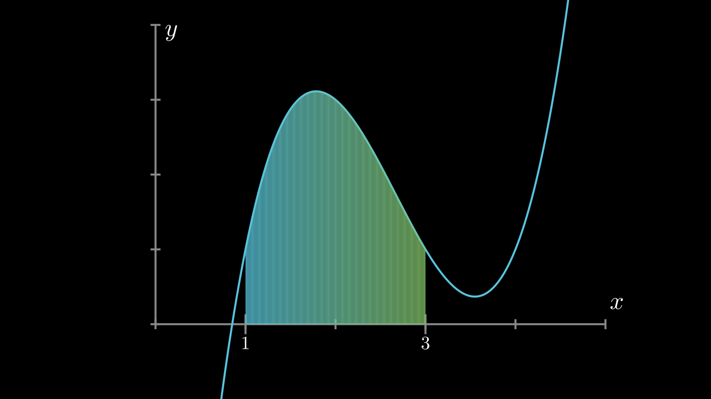
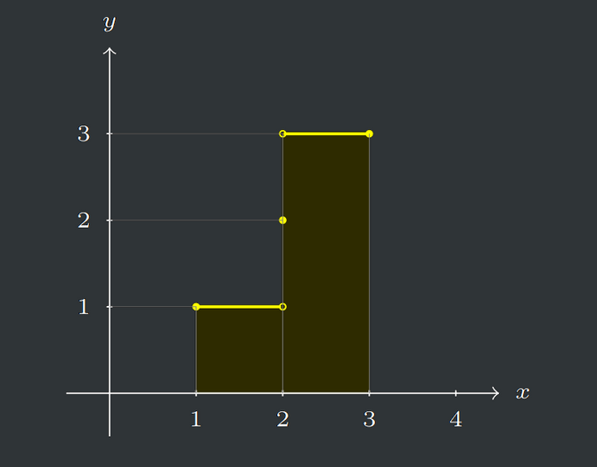
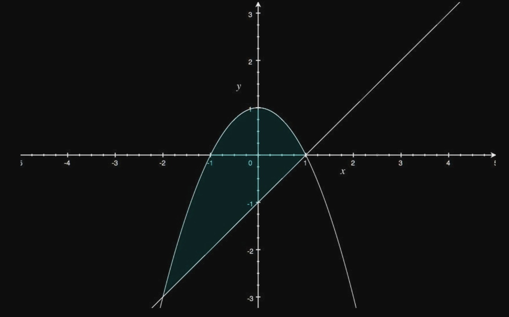
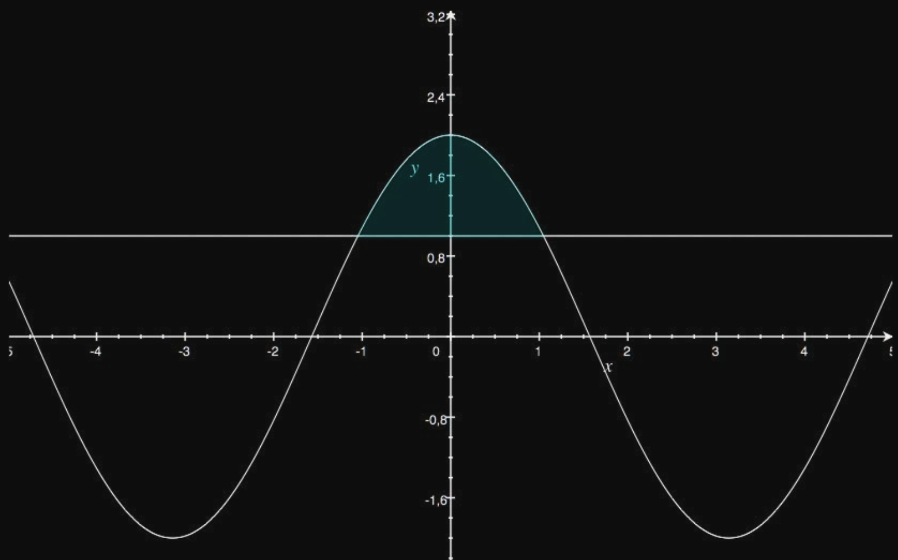
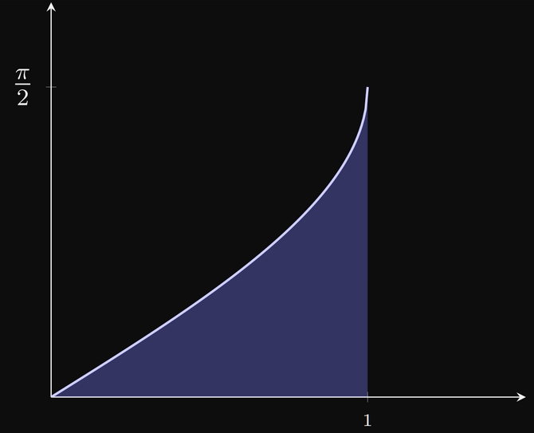
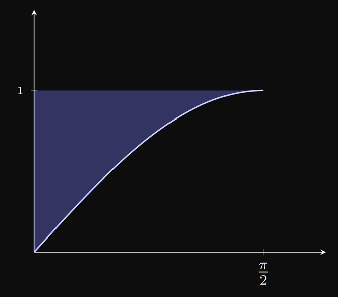

# Integral de Riemann

```toc

```

::youtube{#rfG8ce4nNh0}

Suponha-se que $f$ é uma função contínua que só toma valores positivos. O gráfico de $f$ pode ser qualquer coisa como:



Definindo a função como restrita ao intervalo $[1,3]$, pretende-se que o integral de $f$ em $[1,3]$ dê o valor da área sombreada, isto é, a área da região compreendida entre o eixo das abcissas e o gráfico da função, quando $x\in[1,3]$.

O problema em definir esta área é como encontrar com rigor o seu valor. Para isso, divide-se a área em [**retângulos**](color:orange), que têm uma área fácil de calcular.

Pode-se escolher retângulos acima da área, ou abaixo, mas sempre do mesmo tamanho.

Pode verificar-se o seguinte:

- Em geral, não se obtém exatamente a figura, mas uma região que a aproxima.
- Quanto menor for a base dos retângulos, melhor é a aproximação.
- Podem-se escolher retângulos de duas formas:
  - [Terem alturas tão grandes quanto possível, sem sair fora da região em causa](color:orange). Obtém-se uma área total [**menor**](color:orange) que a área que se pretende definir.
  - [Terem alturas tão pequenas quanto possível, contendo a região toda](color:green). Obtém-se uma área total [**maior**](color:green) que a área que se pretende definir.
- A base de cada retângulo (e o número de retângulos) pode ser definida através dos vértices desse retângulo que se encontram sobre o eixo das abcissas.
- A altura de cada retângulo é definida pelos valores que a função toma (tendo enconta as duas formas de escolher os retângulos, mencionadas acima).

Chega-se assim à ideia de escolher um conjunto finito de pontos do intervalo $[a,b]$, os quais serão os vértices dos retângulos, e definir a altura de cada retângulo como sendo o [**maior**](color:green) ou [**menor**](color:orange) valor que a função toma no intervalo correspondente à base do retângulo.

## Partição de um Intervalo

Chama-se partição de um intervalo compacto $[a,b]$, $a<b$, a qualquer conjunto finito de pontos do interior desse intervalo distintos uns dos outros.

Chama-se, naturalmente, cardinal dessa partição ao número de pontos que a formam.

Sendo $n\in\N^+$ e $x_1<x_2<\dots <x_{n-1}$ os pontos que formam a partição, chama-se diâmetro dessa partição ao mínimo do conjunto $\{r_k\in\R^+:r_k=x_k-x_{k-1},k=1,\dots,n\}$, onde $x_0=a$ e $x_n=b$. Por outras palavras, **é o diâmetro da partição é a distância mínima entre dois pontos consecutivos**.

Chama-se partição nula à partição vazia, ou seja, com 0 elementos.

Pode-se decompor o intervalo $[a,b]$ na forma:

$$
[a,b]=[a,x_1]\cup[x_1,x_2]\cup\dots\cup[x_{n-2},x_{n-1}]\cup[x_{n-1},b]
$$

Uma partição com $n-1$ pontos decompõe o intervalo em $n$ intervalos.

### Soma inferior e soma superior referente a uma partição

Seja $f$ uma função limitada num intervalo compacto $[a,b]$, $a<b$. Para cada partição $d\subset]a,b[$,

$$d=\{x_1,x_2,\dots,x_{n-1}\},\quad a=x_0<x_{k-1}<x_k<x_n=b,\quad k=2,\dots,n-1$$

Define-se [**soma superior de $f$ relativa a $d$**](color:orange) por:

$$S_d(f)=\sum_{k=1}^n\bigg[\sup_{[x_{k-1},x_k]}f(x)\cdot(x_k-x_{k-1})\bigg]$$

Por palavras mais simples, a [**soma superior de $f$ relativa a $d$**](color:yellow) é a soma de todos os "retângulos" de base $x_{k-1}$ a $x_k$, com altura correspondente ao maior valor que a função toma nesse intervalo.

Define-se [**soma inferior de $f$ relativa a $d$**](color:orange) por:

$$s_d(f)=\sum_{k=1}^n\bigg[\inf_{[x_{k-1},x_k]}f(x)\cdot(x_k-x_{k-1})\bigg]$$

Pela definição anterior, $s_d(f)\le S_d(f)$.

No caso da partição nula, o diâmetro é o comprimento do intervalo, isto é, $b-a$.

### Partição mais fina

Dadas duas partições, $d_1$ e $d_2$ de um mesmo intervalo compacto $[a,b]$, $a<b$, diz-se que $d_1$ é mais fina que $d_2$ se $d_2\subset d_1$.

Pode-se pensar que uma partição mais fina $d_1$ tem sempre os mesmos pontos que $d_ 2$, mas ainda pode ter mais alguns, sendo assim o deu diâmetro menor.

Isto resulta no seguinte, considerando $d_1$ mais fina que $d_2$:

- $S_{d_1}(f)\le S_{d_2}(f)$
- $s_{d_1}(f)\ge s_{d_2}(f)$
- $s_{d_2}(f)\le s_{d_1}(f)\le S_{d_1}(f)\le S_{d_2}(f)$

Pode-se ter que nem $d_1$ é mais fina que $d_2$ nem $d_2$ é mais fina que $d_1$.
Pode-se, no entanto, definir uma partição $d_3$ que contenha os pontos de $d_1$ e de $d_2$, e irá ser mais fina que $d_1$ e que $d_2$. Este conceito é definido abaixo como [**partição sobreposta**](color:green).

### Partição sobreposta

Sejam $d_1$ e $d_2$ duas partições de um mesmo intervalo compacto $[a,b]$, $a<b$.

Chama-se [**partição sobreposta a $d_1$ e $d_2$**](color:green) à partição definida por $d_3=d_1\cup d_2$.

A [**partição sobreposta a $d_1$ e $d_2$**](color:green) é mais fina do que $d_1$ e $d_2$.

Por esta definição, podemos concluir que para _quaisquer_ duas partições do mesmo intervalo compacto, $d_1$ e $d_2$, é verdade que:

- $s_{d_1}(f)\le S_{d_2}(f)$
- o conjunto de todas as somas inferiores é majorado por qualquer soma superior, logo tem supremo
- o conjunto de todas as somas superiores é minorado por qualquer soma inferior, logo tem ínfimo

## Integral Superior e Integral Inferior

Seja $f$ uma função limitada num intervalo compacto $[a,b]$, $a<b$.

Chama-se integral superior de $f$ em $[a,b]$ ao número

$$
\def\d{\mathop{}\!\mathrm d}
\overline{\int_a^b}f(x)\d x=\inf\Big\{S_d(f): d\text{ é uma partição de }[a,b]\Big\}
$$

Chama-se integral inferior de $f$ em $[a,b]$ ao número

$$
\def\d{\mathop{}\!\mathrm d}
\underline{\int_a^b}f(x)\d x=\sup\Big\{s_d(f): d\text{ é uma partição de }[a,b]\Big\}
$$

Logo:

$$
\def\d{\mathop{}\!\mathrm d}
\underline{\int_a^b}f(x)\d x\le\overline{\int_a^b}f(x)\d x
$$

## Integral de uma função

Seja $f$ uma função limitada num intervalo compacto $[a,b]$, $a<b$.

Diz-se que a função é integrável se

$$
\def\d{\mathop{}\!\mathrm d}
\underline{\int_a^b}f(x)\d x=\overline{\int_a^b}f(x)\d x
$$

chamando-se, nesse caso, integral de $f$ em $[a,b]$ ao valor comum dos integrais superior e inferior,

$$
\def\d{\mathop{}\!\mathrm d}
\int_a^b f(x)\d x=\underline{\int_a^b}f(x)\d x=\overline{\int_a^b}f(x)\d x
$$

:::details[Exemplo]

Considerando a seguinte função:

$$
f(x)=\begin{cases}
3&\text{se}&x\in]2,3]\\
2&\text{se}&x=2\\
1&\text{se}&x\in[1,2[\\
\end{cases}
$$

Graficamente, a função e o seu integral são representados por



Graficamente conseguimos obter o valor de 4 para o integral $(1\times1+1\times3)$.

Considerando uma partição qualquer do intervalo $[1,3]$, $d$.

Caso $2\notin d$, considera-se a partição mais fina $d\cup \{2\}$. Tem-se também de condiderar partições que tenham pelo menos um ponto inferior a 2 e um ponto superior a 2.

Logo, $d$ é uma partição de $[1,3]$ constituída pelos pontos

$$
x_1,\dots,x_p=2,\dots,x_{n-1}\quad,\quad x_{k-1}<x_k,k=1,\dots,n-1
$$

em que $x_0=1$, $x_p=2$ e $x_n=3$.

Então, a soma superior associada a $d$ é

$$
S_{d}(f)=\textcolor{e76f51}{\sum_{k=1}^{p-1} \sup _{\left[x_{k-1}, x_{k}\right]} f(x)\left(x_{k}-x_{k-1}\right)}+\textcolor{F29040}{\sup _{\left[x_{p-1}, x_{p}\right]} f(x)\left(x_{p}-x_{p-1}\right) \\\quad}+\textcolor{e2b33c}{\sup _{\left[x_{p}, x_{p+1}\right]} f(x)\left(x_{p+1}-x_{p}\right)}+\textcolor{4dab9a}{\sum_{k=p+2}^{n} \sup _{\left[x_{k-1}, x_{k}\right]} f(x)\left(x_{k}-x_{k-1}\right)}
$$

Como em $[1,2[$, o supremo é 1, em $[x_{p-1}, 2]$ é 2, em $[2, x_{p+1}]$ é 3 e em $]2,3]$ é 3, tem-se que:

$$
\begin{aligned}
S_d(f)&=\textcolor{e76f51}{1\cdot(x_{p-1}-x_0)}+\textcolor{F29040}{2(2-x_{p-1})}+\textcolor{e2b33c}{3(x_{p+1}-2)}+\textcolor{4dab9a}{3(x_n-x_{p+1})}\\
&=(x_{p-1}-x_0)+2(2-x_{p-1})+3(x_n-2)\\
&=(x_{p-1}-1)+2(2-x_{p-1})+3(3-2)\\
&=6-x_{p-1}
\end{aligned}
$$

Pela definição de integral superior, como $x_{p-1}<2$, o ínfimo de $S_d(f)$ é 4:

$$
\def\d{\mathop{}\!\mathrm d}
\overline{\int_a^b}f(x)\d x=6-2=4
$$

Para as somas inferiores associadas a $d$:

$$
s_{d}(f)=\textcolor{e76f51}{\sum_{k=1}^{p-1} \inf _{\left[x_{k-1}, x_{k}\right]} f(x)\left(x_{k}-x_{k-1}\right)}+\textcolor{F29040}{\inf_{\left[x_{p-1}, x_{p}\right]} f(x)\left(x_{p}-x_{p-1}\right) \\\quad}+\textcolor{e2b33c}{\inf_{\left[x_{p}, x_{p+1}\right]} f(x)\left(x_{p+1}-x_{p}\right)}+\textcolor{4dab9a}{\sum_{k=p+2}^{n} \inf_{\left[x_{k-1}, x_{k}\right]} f(x)\left(x_{k}-x_{k-1}\right)}
$$

Como em $[1,2[$, o ínfimo é 1, em $[x_{p-1}, 2]$ é 1, em $[2, x_{p+1}]$ é 2 e em $]2,3]$ é 3, tem-se que:

$$
\begin{aligned}
s_d(f)&=\textcolor{e76f51}{1\cdot(x_{p-1}-x_0)}+\textcolor{F29040}{1\cdot(2-x_{p-1})}+\textcolor{e2b33c}{2(x_{p+1}-2)}+\textcolor{4dab9a}{3(x_n-x_{p+1})}\\
&=(2-x_0)+2(x_{p+1}-2)+3(x_n-x_{p+1})\\
&=(2-1)+2(x_{p+1}-2)+3(3-x_{p+1})\\
&=6-x_{p+1}
\end{aligned}
$$

Pela definição de integral inferior, como $x_{p+1}>2$, o supremo de $s_d(f)$ é 4:

$$
\def\d{\mathop{}\!\mathrm d}
\underline{\int_a^b}f(x)\d x=6-2=4
$$

Então:

$$
\def\d{\mathop{}\!\mathrm d}
\int_a^b f(x)\d x=\underline{\int_a^b}f(x)\d x=\overline{\int_a^b}f(x)\d x=4
$$

:::

## Monotonia do integral

Sejam $f$ e $g$ duas funções definidas e integráveis num intervalo compacto $[a,b]$, $a<b$, tais que

$$
f(x)\le g(x)\quad,\quad \forall_{x\in[a,b]}
$$

Então,

$$
\def\d{\mathop{}\!\mathrm d}
\int_a^b f(x)\d x\le
\int_a^b g(x)\d x
$$

É definida uma versão forte para a monotonia do integral mais abaixo.

## Teorema da média para funções integráveis

Seja $f$ uma função limitada e integrável num intervalo compacto $[a,b]$, $a<b$.

Então, existe um $\lambda\in[\inf f([a,b]), \sup f([a,b])]$ tal que

$$
\def\d{\mathop{}\!\mathrm d}
\int_a^b f(x)\d x =\lambda(b-a)
$$

Chama-se ao real $\lambda$ a média da função $f$ no intervalo $[a,b]$.

O $\lambda$ corresponde ao valor que uma função constante teria de ter no intervalo $[a,b]$ para ter exatamente o mesmo integral que $f$, isto é, uma função constante em que a sua integral iria definir um retângulo de lados $b-a$ e $\lambda$.

A demonstração deste teorema encontra-se no PDF em anexo, página 10.

## Teorema da média para funções contínuas

Este teorema é igual ao teorema acima, mas definido através do TVI.

Seja $f$ uma função contínua num intervalo compacto $[a,b]$, $a<b$. Então existe $c\in]a,b[$ tal que

$$
\def\d{\mathop{}\!\mathrm d}
\int_a^b f(x)\d x =(b-a)\cdot f(c)
$$

## Aditividade do integral - Versão fraca

Seja $f$ uma função contínua num intervalo compacto $[a,b]$. Então, para quaisquer ${x_1,x_2,x_3\in[a,b]}$, $x_1<x_2<x_3$, $f$ é integrável nos intervalos $[x_1,x_2]$ e $[x_2, x_3]$ e tem-se

$$
\def\d{\mathop{}\!\mathrm d}
\int_{x_1}^{x_3} f(x)\d x =\int_{x_1}^{x_2} f(x)\d x+\int_{x_2}^{x_3} f(x)\d x
$$

A partir disto, obtém-se as seguintes propriedades:

Seja $f$ uma função integrável no intervalo compacto $[a,b]$, $a<b$.

$$
\def\d{\mathop{}\!\mathrm d}
\int_{b}^{a} f(x)\d x =-\int_{a}^{b} f(x)\d x
$$

$$
\def\d{\mathop{}\!\mathrm d}
\int_{c}^{c} f(x)\d x =0\quad,\quad c\in[a,b]
$$

$$
\text{Existe}\quad\def\d{\mathop{}\!\mathrm d}
\int_{x_1}^{x_2} f(x)\d x\quad,\quad x_1,x_2\in[a,b]
$$

## Integral indefinido de uma função

Seja $f$ uma função integrável em qualquer subintervalo de um intervalo compacto $[a,b]$, $a<b$. Chama-se integral indefinido de $f$ com origem em $x_0\in[a,b]$ à função definida por

$$
\def\d{\mathop{}\!\mathrm d}
F_{x_0}(x)=\int_{x_0}^{x} f(t)\d t
$$

:::tip[Continuidade do integral indefinido]

Se uma função é integrável num intervalo compacto $[a,b]$, o integral indefinido, com qualquer origem no intervalo, é sempre uma função contínua em $[a,b]$.

:::

É definida uma versão forte para o integral indefinido de uma função mais abaixo.

## Teorema Fundamental do Cálculo

Seja $f\in C^0([a,b])$, $a<b$. Então, para qualquer $x_0\in[a,b]$ o integral indefinido de $f$ com origem em $x_0$, $F_{x_0}$, é uma função diferenciável em $]a,b[$ e

$$
F'_{x_0}(x)=f(x)\quad,\quad \forall _{x\in]a,b[}
$$

A demonstração deste teorema encontra-se no PDF da aula 24, página 13.

### Regra de Barrow

📖 É um corolário do Teorema Fundamental do Cálculo e **permite calcular explicitamente integrais**.

Seja $f$ uma função contínua no intervalo compacto $[a,b]$, $a<b$ que admite $F$ como primitiva, em $]a,b[$. Então,

$$
\def\d{\mathop{}\!\mathrm d}
\int_{a}^{b} f(x)\d x=
F(b)-F(a)
$$

A demonstração deste corolário encontra-se no PDF da aula 24, página 13.

# Integrabilidade

## Critério de integrabilidade

Seja $f$ uma função limitada num intervalo compacto $[a,b]$, $a<b$.

Então, $f$ é integrável em $[a,b]$ se e só se, para qualquer $\delta>0$, existe uma partição $d$ no intervalo $[a,b]$ tal que $S_d(f)-s_d(f)<\delta$.

Também podemos expressar esta definição por $S_{d_n}(f)-s_{d_n}(f)\to0$

Por outras palavras, $f$ é integrável em $[a,b]$ se as somas superiores e inferiores de $d$ forem infinitamente próximas.

Este critério de integrabilidade não é propriamente útil, mas será usado para definir os critérios mais práticos e fáceis de aplicar abaixo.

## Integrabilidade das contínuas

Seja $f$ uma função contínua num intervalo compacto $[a,b]$, $a<b$. Então, $f$ é integrável em $[a,b]$.

### Integrabilidade das seccionalmente contínuas

:::tip[Função seccionalmente contínua]

Uma função diz-se seccionalmente contínua num conjunto se ela é contínua em todo o conjunto exceto num número finito de pontos e em qualquer desses pontos tem limites laterais finitos.

:::

Uma função seccionalmente contínua pode ser escrita como a soma de uma função contínua com uma função constante num número finito de intervalos.

Seja $f$ uma função seccionalmente contínua num intervalo compacto $[a,b]$, $a<b$. Então, $f$ é integrável em $[a,b]$.

Resumindo, qualquer função seccionalmente contínua (o que inclui funções contínuas) em $[a,b]$ é integrável em $[a,b]$.

## Integrabilidade das monótonas

Seja $f$ uma função monótona definida num intervalo compacto $[a,b]$, $a<b$. Então, $f$ é integrável em $[a,b]$.

## Conjunto com medida de Lebesgue nula

Diz-se que um conjunto $C\subset\R$ tem [**medida de Lebesgue nula**](color:orange) se existe uma família de intervalos cuja reunião contém $C$ e a soma de todos os comprimentos dessa família é arbitrariamente pequena.

[**Exemplos:**](color:orange)

- Se $C\subset\R$ for um conjunto finito, $C$ tem medida de Lebesgue nula.
  Tendo $C$, $N$ elementos, basta considerar a família composta pelas $N$ vizinhanças de raio ${r=\frac{\delta}{N+1}}$.
- Se $C=\{u_n:n\in\N^+\}$ for o conjunto de termos de uma sucessão, $C$ tem medida de Lebesgue nula.
  Basta considerar, para cada $u_n$, o intervalo $I_n=]u_n-\frac\delta{2^{n+2}},u_n+\frac\delta{2^{n+3}}[$
- Se $C\in\R$ for um conjunto tal que $]x_1,x_2[\subset C$, para alguns $x_1,x_2\in C$, $x_1<x_2$, então $C$ **não** tem medida de Lebesgue nula.

A reunião contável de conjuntos com medida de Lebesgue nula é um conjunto com medida de Lebesgue nula.

Muito informalmente, podemos dizer que qualquer [conjunto contável](/cdi-i/nocoes-topologicas#conjunto-numeravel-e-contavel) tem medida de Lebesgue nula (mas nem todos os conjuntos com medida de Lebesgue nula são contáveis).

💡 Qualquer propriedade que seja válida em todos os pontos de um conjunto exceto num conjunto de pontos com medida de Lebesgue nula, é válida em quase todos os pontos, e escreve-se [**q.t.p.**](color:green).

## Operações com integrais

### Linearidade do operador de integração

Sejam $f$ e $g$ duas funções integráveis num dado intervalo compacto $[a,b]$, $a<b$ e $\alpha,\beta\in\R$.

Então, $\alpha f+\beta g$ é integrável em $[a,b]$ e

$$
\def\d{\mathop{}\!\mathrm d}
\int^b_a(\alpha f+\beta g)(x)\d x=\alpha\int^b_af(x)\d x+\beta\int^b_ag(x)\d x
$$

### Integrabilidade do módulo

Seja $f$ uma função integrável num intervalo compacto $[a,b]$, $a<b$. Então $|f|$ é integrável em $[a,b]$ e

$$
\def\d{\mathop{}\!\mathrm d}
\bigg|\int^b_af(x)\d x\bigg|\le \int ^b_a|f(x)|\d x
$$

### Aditividade do integral no intervalo

Seja $f$ uma função integrável num intervalo compacto $[a,b]$, $a<b$, e $a<c<b$. Então, $f$ é integrável em $[a,c]$ e $[c,b]$ e

$$
\def\d{\mathop{}\!\mathrm d}
\int^b_af(x)\d x=\int^c_af(x)\d x+\int^b_cf(x)\d x
$$

# Integral indefinido - Versão forte

Seja $f$ uma função integrável num intervalo compacto $[a,b]$, $a<b$.

Chama-se integral indefinido de $f$ com origem em $x_0\in[a,b]$ à função

$$
\def\d{\mathop{}\!\mathrm d}
F(x)=\int^x_{x_0}f(t)\d t
$$

Tem-se, ainda, que $F$ é uma função contínua em $[a,b]$ e para quaisquer $x_0,y_0\in[a,b]$,

$$
F_{x_0}-F_{y_0}
$$

é uma função constante.

# Monotonia do integral - Versão forte

Sejam $f$ e $g$ funções integráveis num intervalo $I$, tais que

$$
f(x)\le g(x)\quad,\quad\text{q.t.p.}
$$

Então,

$$
\def\d{\mathop{}\!\mathrm d}
\int_If(x)\d x\le\int_Ig(x)\d x
$$

# Teorema Fundamental do Cálculo para funções seccionalmente contínuas

Seja $f$ uma função seccionalmente contínua num intervalo $I$ não degenerado (intervalo degenerado é um intervalo que só contém um único valor).

Então, o intergral indefinido de $f$ com origem em $x_0\in\overline I$,

$$
\def\d{\mathop{}\!\mathrm d}
F_{x_0}:\overline I\to\R\quad,\quad F_{x_0}(x)=\int^x_{x_0}f(t)\d t
$$

é uma função com derivadas laterais em qualquer ponto do seu domínio, tal que

$$
F'_d(x)=f(x^+)\quad\text{e}\quad F'_e(x)=f(x^-)
$$

em qualquer ponto $x\in\overline I$ onde tenham sentido os limites de $f$.

## Regra de Barrow para funções seccionalmente contínuas

Seja $f$ uma função seccionalmente contínua no intervalo não degenerado $I$ e $F$ uma função contínua no fecho de $I$ cuja derivada coincide com $f$ em qualquer ponto do interior de $I$ onde $f$ é contínua. Então,

$$
\def\d{\mathop{}\!\mathrm d}
\int^b_af(x)\d x=\Big[F(x)\Big]^b_a=F(b)-F(a)
$$

# Regra de Leibnitz - versão simples

Sejam $\varphi,\psi$: $]a,b[\to[c,d]$ duas funções diferenciáveis e $f$ uma função contínua em $[c,d]$.

Então, a função definida em $]a,b[$ por

$$
\def\d{\mathop{}\!\mathrm d}
F(x)=\int^{\psi(x)}_{\varphi(x)}f(t)\d t
$$

É diferenciável em qualquer ponto $x_0\in]a,b[$ e tem-se:

$$
F'(x)=(f\circ\psi)(x_0)\cdot\psi'(x_0)-(f\circ\varphi)(x_0)\cdot\varphi'(x_0)
$$

Resumidamente, esta regra permite-nos [derivar funções definidas por integrais](color:yellow).

[**Exemplos:**](color:orange) Esta regra foi utilizada em alguns exercícios da [ficha 9](https://www.notion.so/Ficha-Semana-9-Aula-Pr-tica-Online-8-83c34315b6564a5596d54bc6963aa2c8), e os exemplos de aplicação podem ser encontrados no documento "Resolução (Prof).pdf", no exercício 4 d) (página 23), exercício 5 (página 24) e exercício 6 a) (páginas 25 e 26).

# Aplicações do Integral

Abaixo redefinem-se alguns conceitos já conhecidos da primitivação, mas agora aplicados à integração.

## Integração por Partes

Sejam $u$ e $v$ funções contínuas num intervalo compacto $[a,b]$, $a<b$, tais que $u'$ e $v'$ são funções seccionalmente contínuas nesse intervalo. Então, $u'\cdot v$ e $u\cdot v'$ são integráveis em $[a,b]$ e

$$
\def\d{\mathop{}\!\mathrm d}
\int^b_au'(x)v(x)\d x=\bigg[u(x)\cdot v(x)\bigg]^b_a-\int^b_au(x)v'(x)\d x
$$

A fórmula da integração por partes é igual à da primitivação, mas tem a vantagem de se simplificar mais, por estamos a calcular valores numéricos e não expressões.

Algumas observações sobre a fórmula da integração por partes:

- É usual, quando na presença de uma função seccionalmente contínua, calcular separadamente o integral em cada um dos intervalos onde a função é contínua.
- A fórmula de integração por partes é mais conveniente que a fórmula de primitivação por partes pois ao invés de o segundo integral surgir adicionado a uma função, ele surge adicionado a um número (que até pode ser 0).

:::details[Exemplo]

$$
\def\d{\mathop{}\!\mathrm d}
\int^1_0\arcsin x \d x
$$

$$
u'=1\to u=x\quad,\quad v=\arcsin x\to v'=\frac 1{\sqrt{1-x^2}}
$$

Aplicando a integração por partes:

$$
\int_{0}^{1} \operatorname{arcsen} x \mathrm{~d} x=[x \operatorname{arcsen} x]_{0}^{1}-\int_{0}^{1} \frac{x}{\sqrt{1-x^{2}}} \mathrm{~d} x=\\=\operatorname{arcsen}(1)-\int_{0}^{1} \frac{x}{\sqrt{1-x^{2}}} \mathrm{~d} x
$$

Aplicando a fórmula da potência:

$$
\int_{0}^{1} \operatorname{arcsen} x \mathrm{~d} x=\frac{\pi}{2}+\frac{1}{2} \int_{0}^{1} \frac{-2 x}{\sqrt{1-x^{2}}} \mathrm{~d} x=\frac{\pi}{2}+\frac{1}{2}\left[\frac{\left(1-x^{2}\right)^{\frac{1}{2}}}{\frac{1}{2}}\right]_{0}^{1}=\frac{\pi}{2}-1
$$

:::

## Integração por Substituição

Seja $f$ uma função seccionalmente contínua num intervalo compacto $[a,b]$, $a<b$ e $\varphi$ uma função regular num intervalo compacto $[t_0,t_1]$, $t_0<t_1$, tal que $\varphi(t_0)=a$ e $\varphi(t_1)=b$ e $(f\circ\varphi)\cdot\varphi'$ é seccionalmente contínua em $[a,b]$. Então,

$$
\def\d{\mathop{}\!\mathrm d}
\int^b_af(x)\d x=\int^{t_1}_{t_0}f(\varphi(t))\cdot\varphi'(t)\d t
$$

A fórmula da integração por substituição é bastante superior à da Primitivação por substituição, pelo simples facto de não ser ter de desfazer a substiuição. A outra diferença é que a integração por substituição não necessita de injetividade.

Algumas observações sobre a fórmula de integração por substituição:

- A integração por partes é bastante melhor do que a primitivação por partes, pois:
  - Não se impõe que $\varphi$ seja injetiva
  - Não é necessário desfazer a substituição. Altera-se a variável de integração, mudam-se os extremos, mas obtém-se uma integral com exatamente o mesmo valor.
- A integração por substituição é o modo preferencial de mexer nos extremos do integral sem alterar o seu valor.

:::details[Exemplos]

$$
\def\d{\mathop{}\!\mathrm d}
\int^{\sqrt 2}_0\sqrt{4-x^2}\d x
$$

Escolhe-se $x=2\sin t$ para efetuar a substituição: $\def\d{\mathop{}\!\mathrm d}\d x=2\cos t\d t$

$$
2\sin\Big(\frac\pi4\Big)=\sqrt2\quad\text e \quad 2\sin(0)=0
$$

$$
\def\d{\mathop{}\!\mathrm d}
\int^{\sqrt 2}_0\sqrt{4-x^2}\d x
=\int^{\frac\pi4}_0\sqrt{4-4\sin^2t}\cdot (2\cos t)\d t
=4\int^{\frac\pi4}_0\sqrt{\cos^2t}\cdot \cos t\d t
$$

Como no intervalo de integração, $\cos x>0$, tem-se que $\sqrt{\cos^2x}=\cos x$:

$$
\def\d{\mathop{}\!\mathrm d}
4\int^{\frac\pi4}_0\sqrt{\cos^2t}\cdot \cos t\d t
=4\int^{\frac\pi4}_0\cos^2 t\d t
=4\int^{\frac\pi4}_0\frac{1+\cos(2t)}{2} \d t
$$

Como a primitiva de $\frac{1+\cos(2t)}{2}$ é $\frac t 2+\frac{\sin(2t)}4$:

$$
\def\d{\mathop{}\!\mathrm d}
\int^{\sqrt 2}_0\sqrt{4-x^2}\d x
=4\Bigg[\frac t2+\frac{\sin(2t)}4\Bigg]^{\frac\pi4}_0=4\bigg(\frac\pi8+\frac14\bigg)
=\frac\pi2+1
$$

---

Seja $f$ uma função **ímpar** contínua em $[-a,a]$, com $a>0$.

$$
\def\d{\mathop{}\!\mathrm d}
\int^a_{-a}f(x)\d x
$$

$$
\def\d{\mathop{}\!\mathrm d}
\int^a_{-a}f(x)\d x
=\int^0_{-a}f(x)\d x+\int^a_0f(x)\d x
$$

Utiliza-se a substituição $x=-t$, ficando com $\def\d{\mathop{}\!\mathrm d}
\d x= -\d t$.

Fazendo a substituição nos extremos:

$$
x=a\longleftrightarrow t=-a\quad,\quad x=0\longleftrightarrow t=0
$$

$$
\def\d{\mathop{}\!\mathrm d}
\int^a_{-a}f(x)\d x
=\int^0_a f(-t)(-1)\d t+\int^a_0 f(x)\d x
=\int^a_0f(-t)\d t+\int^a_0f(x)\d x
$$

Como a função é **ímpar**, $f(-t)=-f(t)$:

$$
\def\d{\mathop{}\!\mathrm d}
\int^a_{-a}f(x)\d x
=-\int^a_0f(t)\d t+\int^a_0f(x)\d x
$$

Logo, como os dois integrais são idênticos (a variável é "muda"):

$$
\def\d{\mathop{}\!\mathrm d}
\int^a_{-a}f(x)\d x=0
$$

Também podemos resolver este mesmo integral pela [Regra de Leibnitz](color:orange):

$$
\def\d{\mathop{}\!\mathrm d}
F(a)=\int^a_{-a}f(x)\d x
$$

Deriva-se assim a função:

$$
F'(a)=f(a)\cdot 1-f(-a)\cdot(-1)=f(a)+f(-a)=f(a)-f(a)=0
$$

Logo, é uma função constante, e como é ímpar, $F(0)=0$

$$
\lim _{x\rightarrow 0}\frac{\int^{x}_{0} e^{t^{2}} -1\ \mathrm{d} t}{x\sin x}
$$

Pela Regra de Cauchy:

$$
\lim _{x\rightarrow 0}\frac{\left(\int\nolimits ^{x}_{0} e^{t^{2}} -1\ \mathrm{d} t\right) '}{( x\sin x) '} =\lim _{x\rightarrow 0}\frac{e^{x^{2}} -1}{\sin x+x\cos x} =\lim _{x\rightarrow 0}\left(\frac{e^{x2} -1}{x^{2}} \cdot \frac{x}{\frac{\sin x}{x} +\cos x}\right)=0
$$

Logo,

$$\lim _{x\rightarrow 0}\frac{\int^{x}_{0} e^{t^{2}} -1\ \mathrm{d} t}{x\sin x}=0$$

---

Podemos estudar a monotonia da seguinte função, através da Regra de Leibnitz:

$$
f( x) =\int ^{x}_{0}\sin\left( \pi t^{2}\right) \ \mathrm{d} t
$$

Efetuando a derivação:

$$
f'( x) =\sin\left( \pi x^{2}\right)
$$

Assim, a função é crescente em:

- $[\sqrt{2n\pi},\sqrt{2n\pi+\pi}]$, $n\in\N^+$
- $[-\sqrt{2n\pi+\pi}, -\sqrt{2n\pi}]$, $n\in\N^+$
- $[-\sqrt \pi, \sqrt \pi]$

E decrescente em:

- $[\sqrt{2n\pi-\pi}, \sqrt{2n\pi}]$, $n\in\N^+$
- $[-\sqrt{2n\pi},-\sqrt{2n\pi-\pi}]$, $n\in\N^+$

---

Pode-se usar a Regra de Leibnitz para resolver a equação funcional integral, onde $f$ é uma função de classe $C^1(\R)$:

$$
f^{2}( x) =\int ^{x}_{0} 2e^{t} f( t) \ \mathrm{d} t
$$

Se as funções forem idênticas, o mesmo se sucede com as suas derivadas, logo:

$$
2f( x) f'( x) =2e^{x} f( x) \Leftrightarrow 2f( x)\left( f'( x) -e^{x}\right) =0
$$

Portanto, temos duas soluções:

- $f(x)=0$
- $f(x)=C+e^x$

:::

# Aplicações Geométricas da Noção de Integral

## Área de uma região do plano

Seja $R$ a região do plano definida por

$$
R=\left\{( x,y) :\mathbb{R}^{2} :f( x) < y< g( x) \land a< x< b\right\}
$$

onde $f$ e $g$ são duas funções seccionalmente contínuas em $[a,b]$ tais que $f(x)<g(x)$ para qualquer $x\in[a,b]$.

Chama-se área de $R$ ao valor do integral

$$
A_{R} =\int ^{b}_{a} g( x) -f( x) \ \mathrm{d} x
$$

Para encontrarmos a área de uma região do plano, fazemos a [**integral da diferença entre a função que delimita a área por cima e a função que delimita a área por baixo**](color:orange).

Caso as funções não cumpram a condição $f(x)<g(x)$ em todo o intervalo, divide-se o intervalo para obtermos sempre a condição $f(x)<g(x)$ ou $g(x)<f(x)$.

A maior partes das vezes, podemos aproveitar noções geométricas já conhecidas (área do círculo, retângulo, etc) e simetrias/repetições para partes da área que se pretendem calcular, diminuindo a complexidade dos cálculos.

:::details[Exemplos]

Considera-se a região definida por $x-1<y<1-x^2$



Não é dada qualquer limitação para $x$, mas para a condição fazer sentido,

$$
x-1< 1-x^{2} \Leftrightarrow ( x-1)( x+2) < 0\Leftrightarrow -2< x< 1
$$

Assim, a área da região é dada por:

$$
\begin{aligned}A & =\int ^{1}_{-2}\left( 1-x^{2}\right) -( x-1) \ \mathrm{d} x\\ & =\int ^{1}_{-2} -x^{2} -x+2\ \mathrm{d} x\\ & =\left[ -\frac{x^{3}}{3} -\frac{x^{2}}{2} +2x\right]^{1}_{-2}\\ & =\left( -\frac{1}{3} -\frac{1}{2} +2\right) -\left(\frac{8}{3} -\frac{4}{2} -2\right)\\ & =\frac{47}{6}\end{aligned}
$$

---

Considera-se a região definida por $1<y<2\cos x\quad,\quad0<x<2\pi$.


Apesar de parecer ser dada a variação de $x$, a condição $1<2\cos x$ não se verifica em todo o intervalo. Logo:

$$1< 2\cos x\Leftrightarrow \cos x >\frac{1}{2} \Leftrightarrow x\in \left[ 0,\frac{\pi }{3}\right] \cup \left[\frac{5\pi }{3} ,2\pi \right]$$

Devido à periodicidade da função cosseno, podemos considerar o intervalo $-\frac\pi3<x<\frac\pi3$:



Assim, a área da região é dada por:

$$
\begin{aligned}
A & =\int ^{\frac{\pi }{3}}_{-\frac{\pi }{3}} 2\cos x-1\ \mathrm{d} x\\
 & =2\int ^{\frac{\pi }{3}}_{0} 2\cos x-1\ \mathrm{d} x\\
 & =2\Big[ 2\sin x-x\Big]^{\frac{\pi }{3}}_{0}\\
 & =2\left(\sqrt{3} -\frac{\pi }{3}\right)\\
 & =2\sqrt{3} -\frac{2\pi }{3}
\end{aligned}
$$

:::

### Permutação dos eixos das ordenadas e abcissas

Ao calcular áreas, podemos usar um raciocínio geométrico para simplificar o problema.

Tomemos como exemplo a região definida por $0<y<\arcsin x\quad,\quad0<x<1$:



Podia-se calcular $A=\int ^{1}_{0}\arcsin x\ \mathrm{d} x$, mas existe outra maneira mais imediata, que consiste em permutar os eixos:



Então, a área pode ser calculada por:

$$
A=\int ^{\frac{\pi }{2}}_{0} 1-\sin x\ \mathrm{d} x=\Big[ x+\cos x\Big]^{\frac{\pi }{2}}_{0} =\frac{\pi }{2} -1
$$

Esta solução é muito menos trabalhosa do que calcular o integral de $\arcsin x$.

## Linha no plano

Chama-se [**linha no plano**](color:orange) ao gráfico no plano de uma função contínua definida num intervalo compacto $[a,b]$, $a<b$.

:::tip[Comprimento de uma linha no plano]

Sendo $f$ a função que define a linha,
$L=\int ^{b}_{a}\sqrt{1+( f'( x))^{2}} \ \mathrm{d} x$

:::

### Representação paramétrica da linha

Uma linha no plano também de pode representar como

$$
\begin{cases}x=f_{1}( t)\\y=f_{2}( t)\end{cases} \quad ,\quad t\in [ a,b]
$$

A representação anterior (não paramétrica) pode ser escrita como uma representação paramétrica em que $f_1(t)=t$ e $f_2(t)=f(t)$.

:::tip[Comprimento de uma linha paramétrica no plano]

Sendo $f_1$ e $f_2$ as funções que definem a linha,
$L=\int ^{b}_{a}\sqrt{( f'_{1}( t))^{2} +( f'_{2}( t))^{2}} \ \mathrm{d} t$

:::

## Volume de um sólido de revolução

Caso se queira calcular o volume de um sólido de revolução (obtido pela rotação de amplitude $2\pi$ em torno do eixo das abcissas do gráfico de uma função contínua e positiva $f$ definida em $[a,b]$), pode-se usar a seguinte fórmula:

$$
V=\pi \int ^{b}_{a} f^{2}( x) \ \mathrm{d} x
$$

Caso se tenha um sólido obtido pela revolução de uma região contida entre duas funções contínuas e positivas, $f$ e $g$,

$$
f(x)<y<g(x)\quad,\quad a<x<b
$$

o volume do sólido de revolução é

$$
V=\pi \int ^{b}_{a} g^{2}( x) -f^{2}( x) \ \mathrm{d} x
$$

---

PDFs:

- [Aula 24](https://drive.google.com/file/d/1PWBTnSP6AToKhoem0yHq6VAJoSmrCXWu/view?usp=sharing)
- [Aula 25](https://drive.google.com/file/d/1laN8Q2l9MEst0Vu2Sc_s1V1mzSvAq37d/view?usp=sharing)
- [Aula 26](https://drive.google.com/file/d/1n6FdSU-YlmhSfAEWOamzA_eAvbBkU9aZ/view?usp=sharing)
