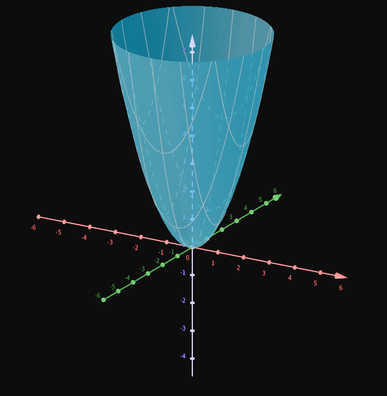
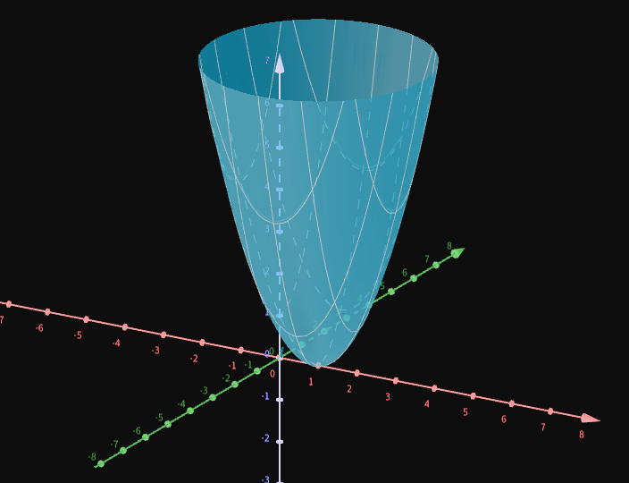
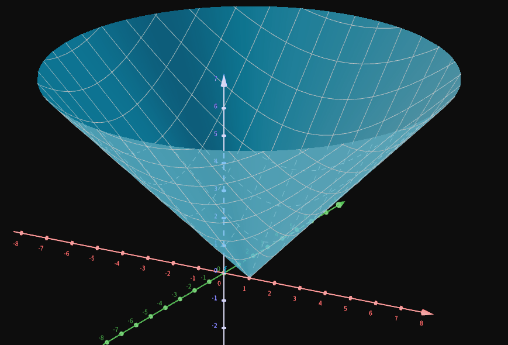

# Transição para dimensões > 1

```toc

```

## O que é CDI 2?

Basicamente é CDI 1 mas em dimensões superiores a 1.  
O nosso objetivo nesta UC vai ser migrar o conhecimento de 1 dimensão para 2, 3, etc dimensões.

### Recordando de CDI 1


- Números: `+`, `-`, `*`, `:`
- Sucessões: convergentes, divergentes, séries
- Funções: continuidade, diferenciabilidade e integrabilidade

No entanto, em CDI 2:

- Há noções e/ou resultados que migram para dim > 1.
- Outros não
- _Surpresas_ - e.g. [ponto de sela](./0006-conjunto-de-nivel.md#ponto-de-sela)


## Diferenciabilidade

Em CDI, o que conhecíamos que se $f$ é diferenciável em $a$ $\Leftrightarrow$ existe $\displaystyle \lim_{h\to 0}\frac{f(a+h)-f(a)}{h}$ (ou seja, $f'(a)$)

No entanto, isto não está definido para $dim > 1$ (por causa do quociente), logo esta noção tem de ser reformulada para migrar para $dim > 1$.  
Por exemplo, o quociente $\frac{1}{(1,1)}$ não está definido.

Temos, então, de reformular a noção de derivada para a migrar para $dim > 1$.

$$
\begin{aligned}
f'( a) =\lim _{h\rightarrow 0}\frac{f( a+h) -f( a)}{h} & \Leftrightarrow 0=\lim _{h\rightarrow 0}\left(\frac{f( a+h) -f( a)}{h} -\frac{h}{h} f'( a)\right)\\
 & \Leftrightarrow 0=\lim _{h\rightarrow 0}\frac{\overbrace{f( a+h) -f( a) -f'( a) h}^{o( h)}}{h}
\end{aligned}
$$

Chegamos assim a uma nova definição de derivada:

$$
f\ \text{é diferenciável em } a\Leftrightarrow f( a+h) -f( a) -hf'( a) =o( h) ,\ h\rightarrow 0
$$

ou seja,

$$
f( x) =o( x) ,\ x\rightarrow a\Leftrightarrow \lim _{x\rightarrow a}\frac{f( x)}{x} =0
$$

:::tip
$o(h)$ lê-se "ó pequeno de $h$"
:::

Outra análise que podemos fazer, é pegar em

$$
f( a+h) -f( a) -hf'( a) =o( h) \Leftrightarrow f( a+h) -f( a) =f'( a) h+o( h) ,\ h\rightarrow 0
$$

e chegar à conclusão que a variação da função, quando passa de $a$ para $a+h$, é a menor de $o(h)$, dada pela derivada.  
Como é que é dada pela variável? $f$ e $a$ estão fixos, $h$ é a variável.
Então, $f'(a)h$ é uma transformação linear[^trans-lin] em $h$.

[^trans-lin]: Para relembrar transformações lineares, recomenda-se este [vídeo de Álgebra Linear do Khan Academy](https://youtu.be/4PCktDZJH8E).

Com esta reformulação, a derivada já migra para $dim > 1$.  
Então, agora a definição de derivada é a **existência desta transformação linear**.
De facto, sempre foi, mas em $dim = 1$ era mais relevante a interpretação geométrica da derivada.

## Distância

Distância de $x$ a $y$, $d(x,y)$, é em CDI 1, $d(x,y)= |x-y|$

O que vai ser a distância em $dim > 1$?

Para duas dimensões:


$$
p(x_1,y_1),\quad q(x_2,y_2),\quad d(p,q) = \sqrt{(x_1-x_2)^2+(y_1-y_2)^2}
$$

Para três dimensões:


$$
p(x_1,y_1, z_1),\quad q(x_2,y_2,z_2),\quad d(p,q) = \sqrt{(x_1-x_2)^2+(y_1-y_2)^2+(z_1-z_2)^2}
$$

Para $N$ dimensões:

$$
d(x,y)=\sqrt{\sum_{i=1}^{N}(x_i-y_i)^2}
$$

## Esboçar gráficos (exemplos)

1. $\displaystyle f(x,y)=x^2+y^2=\left(\sqrt{(x-0)^2+(y-0)^2}\right)^2=\left(d((x,y), (0,0))\right)^2$, isto é, o quadrado da distância do ponto à origem.



2. $\displaystyle g( x,y) =\sqrt{x^{2} +y^{2}} =\sqrt{( x+0)^{2} +( y+0)^{2}} =d(( x,y) ,( 0,0))$, isto é, a distância do ponto à origem.


3. $\displaystyle h( x,y) =x^{2} -2x+1+y^{2} =( x-1)^{2} +( y+0)^{2} =\left(\sqrt{( x-1)^{2} +( y+0)^{2}}\right)^{2} =( d(( x,y) ,( 1,0)))^{2}$,
   isto é, o quadrado da distância do ponto a (1,0).



4. $\displaystyle \overline{h}( x,y) =\sqrt{x^{2} -2x+1+y^{2}} =\sqrt{( x-1)^{2} +( y+0)^{2}} =\sqrt{( x-1)^{2} +( y+0)^{2}} =d(( x,y) ,( 1,0))$,
   isto é, distância do ponto a (1,0).



5. $$
   \begin{aligned}
   i( x,y) & =x^{2} -2x+y^{2} -2y=x^{2} -2x+1+y^{2} -2y+1-2=( x-1)^{2} +( y-1)^{2} -2=\\
    & =\left(\sqrt{( x-1)^{2} +( y-1)^{2}}\right)^{2} -2=( d(( x,y) ,( 1,1)))^{2} -2
   \end{aligned}
   $$
   isto é, a subtração de 2 ao quadrado da distância do ponto a (1,1).


---

Slides:

- [Aula 1](https://drive.google.com/file/d/1-PQoedSZUIQkEpnLRblelnB1t2rfqpe-/view?usp=sharing)
