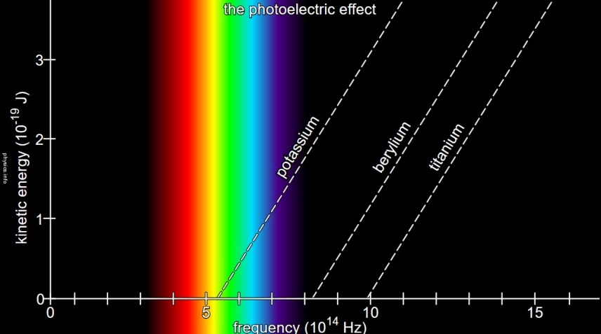

# Efeito Fotoelétrico

A luz é constituída por fotões, cada fotão transporta energia $E = hv$ \
em que $h$ é a constante de Planck ( $6,626 \times 10^{-34} J \ s $ ) e \
 $\ v$ é a
frequência da onda incidente (unidade de medida $s^{-1}$ ou $Hz$).

A energia de um fotão pode ser ainda obtida a partir do seu comprimento de onda $\lambda$, \
uma vez que qualquer onda luminosa satisfaz $v \lambda = c$, em que $c = 3 \times 10^9 \ m \ s^{-1}$ corresponde à velocidade da luz no vácuo.

A intensidade luminosa é determinada pelo número de fotões. Nomeadamente, a energia dum feixe luminoso corresponde ao produto da energia de cada fotão pelo número de fotões: \
$ E = n \cdot E_{fotão} $

Para cada metal existe uma energia mínima $W_0$ necessária para
libertar os eletrões.

Assim concluimos que $W_0 = hv_0$ e que existe uma frequência miníma $v_0$ para libertar eletrões.

Se um fotão com frequência $v > v_0$ interagir com um eletrão este
adquire energia cinética \
$K = hv - W_o = h(v-v_0)$

Como podemos reparar pelo gráfico o declive das retas é igual e tem o valor da Constante de Planck ($h$).\
Isto porque podemos reescrever a fórmula dada anteriormente da seguinte maneira
$\cfrac{E}{v} = h$\
O ponto em que a recta corta o eixo das abcissas é $v_0$\
Também podemos escrever a fórmula da seguinte maneira:
$K = hv - \varphi \ $onde $\varphi = hv_0$

---

Slides:

- [Slides Módulo 0](https://drive.google.com/file/d/1JuNjc2WjDD-1Jqhx8IRCJPZmO2x_LYvJ/view?usp=sharing)
