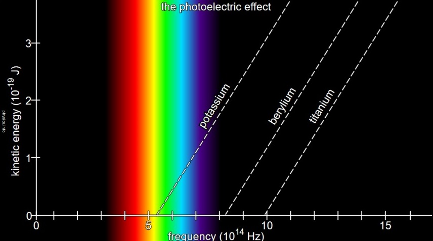

# Campo

Um campo ($\phi$) é uma zona do espaço em que em cada ponto está definida uma quantidade.

Essa quantidade pode ser escalar ou vetorial.

Por exemplo, o campo gravítico é um campo vetorial:

$$
\vec\phi (\vec r) = -G\cfrac{M}{r^2} \vec e_r
$$

## Operadores

### Campos Escalares

Para saber como um campo escalar varia com a posição temos de calcular o seu [Gradiente](../cdi-ii/diferenciabilidade#gradiente-de-uma-função)

$$
\vec\bigtriangledown \phi(\vec r) = \cfrac{\partial \phi}{\partial x_1}\vec e_1 + \cfrac{\partial \phi}{\partial x_2}\vec e_2 + \cfrac{\partial \phi}{\partial x_3}\vec e_3 = \sum\limits_{i =1}^{3} \dfrac {\partial \phi}{\partial x_i}\vec e_i
$$

Geometricamente a maior variação de $\phi$ ocorre quando $\vec\bigtriangledown \phi$ é paralelo a $\vec dl$, para $|\vec dl|$ fixo.

$$
d \phi = \sum\limits_{i =1}^{3} \dfrac {\partial \phi}{\partial x_i} dx_i = \vec\bigtriangledown \phi \cdot d \vec l = |\vec\bigtriangledown \phi| \ |d \vec l|\ cos(\vec\bigtriangledown \phi,d \vec l)
$$

$\vec\bigtriangledown \phi$ aponta na direção da máxima variação de $\phi$;\
O módulo de $\vec\bigtriangledown \phi$ fornece a taxa de variação ao longo
desta direção.

### Campos Vetoriais

O operador $\vec \bigtriangledown$ funciona como um vetor.

Se a quantidade ($\vec\phi(\vec r) $) for um vetor podemos realizar 2 operações com o gradiente ($ \vec\bigtriangledown$)

#### Divergência (Produto Escalar)

$\vec\bigtriangledown \cdot \phi(\vec r)$\
 O resultado será 1 número.

#### Rotacional (Produto Externo)

$\vec\bigtriangledown \times \phi(\vec r)$\
 O resultado será 1 (pseudo-)vetor, isto porque para 2 vetores $\vec a$ e $\vec b$, o rotacional de $\vec a \times \vec b$ vai ser igual ao rotacional de $- \vec a \times - \vec b$

## Exemplo de Campos

### Campo Uniforme

Para $\phi _i$ constantes

$\phi(\vec r) = \sum\limits_{i =1}^{3}  \phi_i  \vec e_i$

$\vec\bigtriangledown \cdot \phi(\vec r) = 0$

$\vec\bigtriangledown \times \phi(\vec r) = 0$

### Campo Radial

Com $A$ constante

$\phi(\vec r) = \sum\limits_{i =1}^{3}  Ax_i  \vec e_i$

$\vec\bigtriangledown \cdot \phi(\vec r) = 3A$

$\vec\bigtriangledown \times \phi(\vec r) = 0$

### Campo Rotacional

Com $\phi _1(\vec r) = \cfrac{x_2}{x_3},\ \phi _2(\vec r) = -\cfrac{x_1}{x_3},\ \phi _3(\vec r) = 0$

$\phi(\vec r) = \sum\limits_{i =1}^{3}  \phi_i (\vec r)  \vec e_i$

$\vec\bigtriangledown \cdot \phi(\vec r) = 0$

$\vec\bigtriangledown \times \phi(\vec r) = - \cfrac{x_1\vec e_1 + x_2\vec e_2+  x_3\vec e_3 }{x_3 ^2}$

## Linhas de Campo

Uma linha de campo é uma curva tal que em cada ponto o
campo é tangente à curva.\
 Dirigem-se de + $\rightarrow$ -.
As linhas de campo não se podem cruzar.

## Conceitos a Relembrar (CDI-II)

- [Gradiente](../cdi-ii/diferenciabilidade#gradiente-de-uma-função)
- [Coordenadas Esféricas](../cdi-ii/integracao-mudanca-var#coordenadas-esféricas)
- [Coordenadas Cilíndricas](../cdi-ii/integracao-mudanca-var#coordenadas-cilíndricas)
- [Divergência](../cdi-ii/fluxo-teorema-divergencia#divergência-de-um-campo-vetorial)
- [Rotacional](../cdi-ii/rotacional-teorema-stokes#rotacional)
- [Teorema de Stonks](../cdi-ii/rotacional-teorema-stokes#teorema-de-stokes)

## Função $\delta$ de Dirac

A função de Dirac é uma função que em que é nula em todo o seu domínio exceto num único ponto em que tem o valor infinito.

$$

\delta (x-a) =
    \begin{cases}
      0,  se \ x \neq a\\
      \infty , se\ x = a
    \end{cases}
$$

$$
\int^\infty_{-\infty} \delta (x-a) dx = 1
$$

### Teorema de Helmholtz

Como podemos reparar pelo gráfico o declive das retas é igual e tem o valor da Constante de Planck ($h$).\
Isto porque podemos reescrever a fórmula dada anteriormente da seguinte maneira
$\cfrac{E}{v} = h$\
O ponto em que a recta corta o eixo das abcissas é $v_0$\
Também podemos escrever a fórmula da seguinte maneira:
$K = hv - \varphi \ $onde $\varphi = hv_0$
