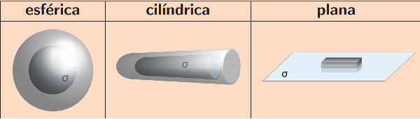

# Eletrostática e Fluxo

```toc

```

:::warning[Exercícios]
No final da página encontram-se resoluções mais pormenorizadas dos exercícios feitos em aula
:::

## Eletrostática

Supomos que temos uma distribuição de cargas.


Para calcularmos o valor do campo em cada ponto do espaço precisamos de uma carga de prova.

Uma carga de prova é uma carga independente do campo e que pode ser escolhida pelo leitor.

As cargas que criam o campo são as fontes do campo.

A carga de prova sofre a força criada pelas cargas que se encontram na fonte do campo.

A posição das fontes (em função do tempo) é conhecida.

:::tip[Princípio da Sobreposição]

A interação entre duas cargas não é afetada pela presença das outras cargas.\
A força exercida numa carga é igual à soma de todas as forças exercidas nela.

$$
\vec F_{total} = \sum\limits_{i =1}^{n} \vec F_i
$$

:::

Tanto as fontes como as cargas estão sempre em movimento e o campo depende da posição, da velocidade e acelaração de todas as cargas.\
Além disso, o campo propaga-se à velocidade da luz ($c = 3 \times 10^8\ m/s$)

:::warning[Eletroestática]
Nesta parte da matéria assumimos que todas as fontes estão estacionárias,\
 no entanto a carga de prova pode se encontrar em movimento.
:::

### Lei de Coulomb


A força $\vec F$ na carga de prova $Q$ criada pela carga de fonte $q$ (em repouso) a uma distância $\Delta r$ é dada por

$$
\vec F = \cfrac{1}{4\pi \epsilon_0}\ \cfrac{q \ Q}{|\vec r - \vec r \ '|^2}\ \vec e_r
$$

$Q$ e$\ q$ - Cargas - unidades SI - Coulomb ($C$)\
$\epsilon_0$- permitividade elétrica do espaço livre - $8.85 \times 10^{-12} \ C^2 \ N ^{-1} \ m^{-2} $ \
$\vec e_r = \cfrac{(\vec r - \vec r \ ')}{|\vec r -\vec r \ '|}$

:::danger[Sinal]
Esta força só é atrativa se as cargas tiverem sinais diferentes.
:::

Juntando a Lei de Coulomb e o Principío da Sobreposição:

$$
\vec F = \cfrac{Q}{4\pi \epsilon_0}\ \sum\limits_{i =1}^{n} \cfrac{q_i}{|\vec r - \vec r_i'|^2}\ \vec e_{r_i} = Q \vec E (\vec r)
$$

### Campo Elétrico

Assim o Campo Elétrico $\vec E (\vec r)$ gerado pelas fontes é:

$$
\vec E(\vec r) = \cfrac{1}{4\pi \epsilon_0}\ \sum\limits_{i =1}^{n} \cfrac{q_i}{|\vec r - \vec r_i'|^2}\ \vec e_{r_i}
$$

:::tip[Propriedades do Campo Elétrico (Eletrostático)]

- O Campo elétrico $\vec E (\vec r)$ é uma grandeza vetorial
- Depende da posição da carga de prova $Q$
- Depende da posição e da carga das fontes
- Fisicamente representa a força por unidade de carga que seria exercida na\
  carga de prova $Q$ se fosse colocada num ponto $P$

:::


## Fluxo


O fluxo $\phi_E$ do campo elétrico $\vec E$ através de uma superfície $S$ é definido por:

$$
\phi_E \equiv \int_S \vec E\ d\vec S
$$

:::tip[Propriedades]

- O fluxo $\phi_E$ do campo elétrico $\vec E$ através de uma superfície $S$ "mede" o número de linhas de campo que cruzam a superfície.
- Só consideramos a componente de $\vec E$ segundo a direção perpendicular ao elemento de superfície de $dS$.
- A intensidade do campo é proporcional à densidade das linhas de campo.
- Se o fluxo atravessa uma superfície fechada de um lado ao outro o fluxo total é nulo.
  No entanto, se as linhas de campo atravessam a superfície na mesma direção (sempre para
  fora ou sempre para dentro) há um fluxo não nulo e isso só acontece quando há cargas dentro da superfície.
  Esta é a essência da Lei de Gauss.

:::

### Lei de Gauss

Imaginemos que temos uma carga $q$ na origem e uma esfera de
raio $R$ centrada nela.

$$
	\oint \vec E \ d \vec S = \cfrac{q}{4\pi \epsilon_0} \oint \cfrac{\vec e_r}{r^2} \ (r^2 sin(\theta)\  d\theta \  d \phi\  \vec e_r) = \cfrac{q}{\epsilon_0}
$$

Podemos reparar que o fluxo total não depende do raio da esfera e é proporiconal à carga.\
Isto é verdade para todas as superfíces fechadas e não precisa de estar centrada na carga.

Se forem $N$ cargas $q_i$ o Princípio da Sobreposiçao permite escrever $ \vec E =$ $\sum\limits_{i=1}^{N}$ $ \vec E_i $ e

$$
 \oint \vec E \ d \vec S = \sum\limits_{i=1}^{N} \oint \vec E_i \ d\vec S = \cfrac{Q_{inc}}{\epsilon_0}
$$

onde $Q_{inc} = \sum\limits_{i=1}^{N} q_i$ é a carga contida na superfície.

:::tip[Lei de Gauss (Equação Integral)]

$$
\oint \vec E \cdot d \vec S = \cfrac{Q_{inc}}{\epsilon_0}
$$

:::

A Lei de Gauss existe porque o campo varia como $\cfrac{1}{r^2}$

Para $\rho$ (densidade de carga)

$$
Q_{inc} = \int_V \rho \ dV
$$

$$
\oint \vec E \ d \vec S = \cfrac{Q_{inc}}{\epsilon_0} = \int_V \vec  \nabla \cdot \vec E \ dV = \int_V \cfrac{\rho}{\epsilon_0} \ dV
$$

$$
\int_V (\vec \nabla \cdot \vec E - \cfrac{\rho}{\epsilon_0}) \ dV = 0
$$

Esta equação é válida para qualquer volume $V$.\
Logo o integrando tem de ser sempre nulo.

:::tip[Lei de Gauss (Equação Diferencial)]

$$
\vec \nabla \cdot \vec E = \cfrac{\rho}{\epsilon_0}
$$

:::

### Campo de uma Esfera Uniformemente Carregada

Para usar a Lei de Gauss devemos procurar usar para nossa vantajem a simetria do sistema.

Se tivermos uma superfície esférica de raio $R$ com uma densidade superfícial de carga $\sigma$ uniforme,\
 como será o campo no exterior da esfera?


Imaginemos que o campo aponta para fora e para cima,
se rodarmos a nossa esfera e a colocarmos de cabeça para baixo,
agora esta aponta para fora e para baixo, no entanto, o campo manteve-se igual,
podemos concluir assim que podemos rodar a bola como quisermos e todas essas rotações são possíveis e todas as direções em que esta aponta são válidas.
Concluímos assim que o Campo criado por esta esfera é [radial](./fundamentos#campo-radial) , segundo $\vec e_r$

Que forma de Lei de Gauss devemos usar para calcular o campo?

Através da Lei de Gauss na versão integral.


Consideremos uma superfície esférica
$S$ de raio $r > R$ centrada na esfera carregada.\
Uma superfície desse tipo designa-se por superfície gaussiana.\
 Para essa superfície em cada ponto o vector unitário normal à superfície é $\vec n = \vec e_r$

Assim

$$
 \oint_S \vec E \cdot  d \vec S = \int_S  |\vec E| \ dS
$$

Como o campo $\vec E$ tem a mesma intensidade em todos os pontos da superfície $S$ devido à simetria do sistema.

$$
\int_S  |\vec E| \ dS = |\vec E| 4 \pi r^2
$$

Assim pela Lei de Gauss

$$
 |\vec E| 4 \pi r^2 = \cfrac{Q_{inc}}{\epsilon_0} \implies |\vec E| = \cfrac{Q_{inc}}{4 \pi r^2  \epsilon_0} \implies \vec E = \cfrac{Q_{inc}}{4 \pi \epsilon_0} \cfrac{\vec e_r}{r^2}
$$

O campo fora da esfera é igual ao de uma carga pontual igual
à da esfera centrada na origem.

Além das superfícies esféricas, as superfíces cilíndricas e superfícies planas apresentam simetrias.



:::warning[Pormenores]

A lei de Gauss é sempre verdade, mas nem sempre é útil.
Se a densidade não fosse uniforme, ou se a superfície gaussiana não fosse uma esfera centrada na distribuição de carga, ou simplesmente se a superfície gaussiana não fosse
uma esfera, a Lei de Gauss continuaria a ser verdadeira,
mas isso não permitiria calcular o campo $\vec E$ porque
não poderíamos puxar $|\vec E|$ para fora do integral!

A simetria é essencial para uma aplicação com sucesso da
Lei de Gauss.

:::

Para Cilindros este processo é semelhante (a sua explicação será omitida, poderão encontrar a explicação nos slides no final deste resumo)

O campo criado por um cilindro é radial perpendicularmente ao eixo do cilindro.

E provamos que

$$
\vec E = \cfrac{k r^2}{3\epsilon_0}\vec e_p
$$

### Rotacional do Campo Eletrostático

O rotacional do campo eletrostático $\vec E$ deve ser zero.

Pelo que ficou dito sobre o [potencial escalar](./fundamentos#potencial-escalar),
podemos concluir que no caminho de $A \rightarrow B$

$$
\oint \vec E \cdot d \vec l = 0
$$

$$
\int_A^B \vec E \cdot d \vec l = V(B) -V(A)
$$

$$
\vec \nabla \times \vec E = 0 \implies \cfrac{\delta E_i}{\delta x_j} =  \cfrac{\delta E_j}{\delta x_i}
$$

Onde $V$ é uma função escalar

Slides:

- [Slides Módulo 2](https://drive.google.com/file/d/1g24-Be9s2j9LaQyaibxGor4YToR5jFqi/view?usp=sharing)

- [Resolução mais Detelhada](https://drive.google.com/file/d/1lj2dFVGepDHGlc_xPwfTN20CqQ3wG4E_/view?usp=sharing)
