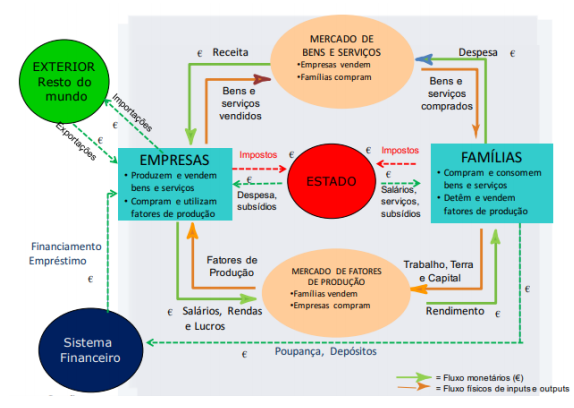
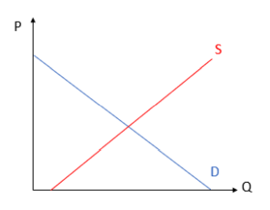
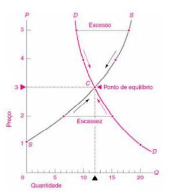
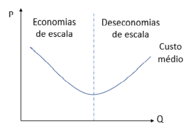

# Ambiente Económico

```toc

```

A economia subdivide-se em duas grandes áreas:

- **Macroeconomia**: Estuda o desempenho global da economia através de indicadores agregados.

- **Microeconomia**: Estuda o comportamento económico de entidades individuais como os mercados, as empresas e as famílias.

Como o próprio nome indica a **Macroeconomia** retrata o grande cenário - o Estado, a Economia Nacional
e as relações económicas internacionais - recorrendo a indicadores, como o PIB, a Taxa de Desemprego, a Inflação, etc.
A **Microeconomia** foca-se no pequeno, no detalhe, nos individuos e nas suas ações, nas empresas e no seu processamento produtivo.

## Macroeconomia

Como foi referido, a macroeconomia é o estudo, medida e observação de uma economia regional ou nacional como um todo individual. Este todo é composto por diversas pequenas partes que podem ser identificadas de acordo com o seguinte diagrama:



A macroeconomia recorre a diversos indicadores aos quais é dado o nome de variáveis macroeconómicas, são eles:

- **Produção Nacional**: Valor dos bens e serviços produzidos por todas as empresas.

- **Valor Acrescentado Bruto (VAB)**: Valor do rendimento gerado pelas empresas, ou seja, do que se produziu menos aquilo que se gastou.

:::tip[Fórmula]

**VAB**

VAB = Valor da produção - Valor dos consumos de bens e serviços

$$
\sum \text{salários} + \text{juros} + \text{lucros} + \text{rendas} + \text{Impostos diretos}
$$

:::

- **Produto Interno Bruto (PIB)**: Soma do VAB de todos os agentes económicos residentes num país.
  Conjunto de todos os bens e serviços produzidos dentro das fronteiras de uma região ou país.

- **Produto Nacional Bruto (PNB)**: Soma do VAB de todos os agentes económicos nacionais a operar dentro ou fora do país.

- **Despesa Interna**: Gastos das unidades institucionais realizados no interior da sua fronteira económica em relação à produção interna.
  :::tip[Fórmula]

  **Despesa Interna**

  Despesa interna = Consumo privado + Gastos do estado + Investimentos + Exportações - Importações
  :::

- **Produtividade do Trabalho**: Rácio entre o PIB e o número de horas efetivamente trabalhadas.
  Trata-se de um indicador de competitividade económica, pois elimina-se as diferenças na distribuição de população empregada a tempo completo e parcial.

- **Taxa de Desemprego**: Percentagem de população ativa em situação de desemprego involuntário.

- **Taxa de Inflação**: Taxa de variação de preços medido pelo índice de preços do consumidor (IPC).

- **Taxa de Juro**: Taxa de renumeração de um empréstimo ou de um depósito.

- **Política Monetária**: Atuações das autoridades de política monetária sobre a oferta e a procura da moeda influenciando
  as taxas de juro e, consequentemente, o comportamento de investidores e consumidores e, assim, a economia real, o desemprego e a inflação.

## Taxa de Inflação

A inflação pode ser definida como o aumento generalizado dos preços.
Quando há inflação (positiva) o mesmo valor em euros, compra no futuro menos bens do que no presente.
Na realidade, a inflação não é algo completamente mau.
É saúdavel para uma economia ter uma determinada taxa de inflação.
No entanto, quando esta atinge níveis extremamente elevados torna-se algo problemático.

:::info[Exemplo]

A taxa de Inflação no ano 2019 em Portugal = 0,34% Ou seja um refrigerante que custava em 2018 1,72€, no fim de 2019 valerá
$1,72 \times (1+0,0034) = 1,73$ €

Nesse mesmo ano, a taxa de inflação na Venezuela foi de 9585,9%. O refrigerante passaria a custar $1,72 \times (1+95,859) = 166,60$ €

Ou seja, se tivesse uma moeda de 2€ guardada, ao fim de um ano,
ainda seria capaz de comparar o refrigerante em Portugal (situação saudável),
mas não seria capaz de comprar o refrigerante na Venezuela (situação pouco saudável).
:::

Para calcular a taxa de inflação recorre-se ao Índice de Preços no Consumidor (IPC).
Trata-se de um indicador que mede a evolução conjunta e simultânea dos preços de um cabaz de bens
e serviços representativos da estrutura de consumo da população residente em Portugal.

:::tip[Índice de Preços do Consumidor]

$$
IPC = \frac{\sum  Q_{anterior}\ P_{atual}}{\sum  Q_{anterior} P_{anterior}}
$$

Podemos então definir matematicamente o índice entre o ano $x$ e o ano $y$ como:

$$
I^P_{x/y} = \frac{\text{Custo de um cabaz de bens no ano } x}{\text{Custo de um cabaz de bens no ano } y}
$$

A taxa de inflação média entre estes anos será:

$$
i_m = \sqrt[n]{I^P_{x/y}} - 1
$$

em que $n = \text{número de anos}$

:::

A **Deflação** é o processo inverso à inflação, ou seja, uma diminuição do índice de preços do consumidor, associada a uma queda de preços.
Apesar de, intuitivamente pensarmos que se trata de uma coisa boa (comprar mais com a mesma quantidade de dinheiro),
a deflação está associada a períodos de recessão nacional.

$$
\text{Taxa de Variação Real} = \frac {1 +\text{taxa nominal}} {\text{1 + taxa de inflação}} -1
$$

## Microeconomia

A microeconomia trata de assuntos menores que a macroeconomia. O mercado é um dos tópicos relevantes nesta área.

- **Mercado**: Conjunto dos que pretendem comprar (procura/demand) e dos que pretende vender (oferta/supply).
  Resultam o preço do produto e a quantidade transacionada. Existem vários fatores que influenciam a procura e a oferta.

A procura de bens pode ser definida pela curva azul do gráfico a baixo.


- $P \to$ Preço do Mercado
- $Q \to$ Quantidade Procurada
- $D \to$ Curva de Procura

Apesar de estar invertido, a variável $P$ é independente e a $Q$ é dependente de $P$,
ou seja, segundo esta curva, o aumento do preço implica uma diminuição da procura.

## Fatores que Determinam a Procura

- **Preço**: Normalmente, quando o preço aumenta, a quantidade procurada diminui, com a excepção dos bens de luxo.
  A variação da quantidade de procura depende da elasticidade da procura relativamente ao preço.

  :::info[Exemplo]
  O preço da Placas Gráficas subiu em 5€ no último ano:

  
  :::

- **Bens Substitutos**: São bens que oferecem o mesmo, mas de empresas diferentes, por exemplo, Coca-Cola VS Pepsi.
  Neste caso, quando o preço do substituto aumenta, a procura do outro aumenta, e vice-versa.

  - Quando o preço aumenta, a quantidade procurada desse bem retrai-se em proporção maior que a da subida do preço.

  :::info[Exemplo]
  
  :::

- **Bens Complementares**: São bens que não são funcionais sem um outro bem, é necessário comprar um segundo item para conjugar o primero.
  Neste caso, quando o preço do complementar aumenta, a procura diminui e vice-versa.

  :::info[Exemplo]

  Um bom exemplo deste tipo de bens são as impressoras e os computadores ou os jogos e as consolas.  
  Se o _Preço_ da impressora _diminui_ $\rightarrow$ _Procura_ dos cartuxos _aumenta_ (ao mesmo preço)

  :::

- **Rendimento**: O efeito do rendimento do consumidor nos bens difere consoante o tipo de bem.
  No caso dos **Bens Normais**, quando o rendimento aumenta, a procura aumenta, um exemplo são as viagens de avião.
  No caso dos **Bens Inferiores**, a procura diminui com o aumento do rendimento, um exemplo são os produtos
  resultantes de pirataria ou os produtos de "marca branca".

- **Gastos/Preferências/Moda/Cultura**: Este fator depende do tipo de consumidor.
  Alguns preferem uma determinada marca ou uma determinada cor e outros simplesmente adquirem alguns bens
  por estarem na moda - estar na moda aumenta a procura de um bem.

- **Expetativa**: Este fator está relacionado com a expetativa dos preços futuros.
  Por exemplo, a procura aumenta por volta de outubro uma vez que, se conhece que os preços vão subir em breve,
  outros deixam de comprar, porque sabem que depois do Natal vêm os saldos.

Como foi possível observar, a única deslocação sobre a curva dá-se quando há uma alteração do preço.
As variações dos demais fatores resultam numa alteração na ordenada na origem.
Como foi referido, a variação da quantidade de procura depende da **Elasticidade** da procura relativamente ao preço.

## Elasticidade

:::tip[Definição]

**Elasticidade Procura-Preço (Ed)**: Medida de sensibilidade da quantidade procurada face à variação do preço.
Esta é dada pelo quociente entre duas variações proporcionais:

$$
E= \left|\frac {\Delta \% \text{Procura}} {\Delta \% \text{Preço}}\right|
$$

ou seja

$$
E= \frac {\left|\frac{Q_f-Q_i}{Q_i}\right| }{\left|\frac{P_f-P_i}{P_i}\right| }
$$

:::

Esta, depende:

- Das preferências
- Do tipo de bens/grau de necessidade
- Do peso no orçamento
- Da presença de substitutos
- Do horizonte temporal
- Dos determinantes da própria procura

A elasticidade pode ser caracterizada consoante o seu valor:

$E=1 \Rightarrow \text{Unitária} \rightsquigarrow$ Quando o preço aumenta, a receita das vendas mantém-se. Uma variação do preço implica uma variação praticamente proporcional na quantidade de procura.

$E>1 \Rightarrow \text{Elástica} \rightsquigarrow$ Quando o preço aumenta, a receita das vendas diminui. Uma pequena variação do preço faz com que a procura varie muito.

$E<1 \Rightarrow \text{Rígida Inelástica} \rightsquigarrow$ Quando o preço aumenta, a receita das vendas $R = p \times Q$ aumenta. Uma pequena variação do preço implica uma variação quase nula na quantidade de procura.


## Fatores que Determinam a Oferta

A procura de bens pode ser definida pela curva vermelha do gráfico abaixo.
De acordo com a curva do **Demand(D)**, quando a quantidade de procura aumenta, o preço aumenta também.

:::info[Exemplo]

Com a pandemia o preço das mascáras aumentou bastante porque, o **Demand** era maior.



- $D \rightsquigarrow$ demand
- $S \rightsquigarrow$ oferta

:::

O custo dos fatores produtivos, o progresso tecnológico e a expetativa de preços futuros são fatores influenciados da oferta.
Novamente, o único fator que provoca uma deslocação sobre a curva é o preço, os demais provocam uma alteração da ordenada na origem.

**O Custo do Mercado Ocorre na Interseção das Curvas de Procura e de Oferta.**

:::tip

Quando uma das curvas se desloca para a direita dizemos que houve uma expansão do mercado.
Em contrapartida, uma deslocação para a esquerda implica uma contração do mercado.



Define-se como preço de equilíbrio, o preço referente à interseção das curvas de procura e oferta.
Este ponto marca a região de equilíbrio entre excesso e a escassez.

**Nota:** Basta uma das curvas variar, para o ponto de equilibrio se deslocar.

:::

O progresso tecnológico influencia os mercados da seguinte maneira:

- Desloca a curva de oferta para a direita (aumenta a quantidade, diminui o preço)
- Dá origem a um novo equilíbrio do mercado, com maior quantidade transacionada e o preço mais baixo

## Tipos de Economias

### Economias de Escala

A longo prazo os custos das empresas podem crescer:

- Proporcionalmente à quantidade (rendimentos à escala constante)
- Mais do que proporção (rendimentos decrescentes à escala/deseconomia de escala)
- Menos do que a proporção (rendimentos crescentes à escala ou economias de escala)



Economias de escala ocorrem quando se aumenta a escala da produção e com isso se consegue a diminuição dos custos médios.
Estão associadas a mercados de monopólio.

Deseconomias de escala ocorrem quando a produção diminui, logo diminuirão os custos de produção.

### Economias de Gama

Economias semelhantes são possíveis com uma gama de produtos mais alargada.
O custo de produção ou distribuição de dois ou mais produtos em conjunto é mais baixo do que o custo de produção separado.

:::info[Exemplo]
A venda e produção de hambúrgueres e batatas fritas.
:::

### Economias de Experiência

Economias de Aprendizagem (custo unitário ou médio de produção decrescente com a quantidade produzida no passado).
Há acumulação de experiência e **know-how**.

## Estruturas de Mercado

A forma como uma empresa age depende do tipo de mercado onde ela se insere.
A estrutura de mercado associada, frequentemente, aos tipos de custos mencionados,
determina a margem (diferença entre o preço e o custo) que a empresa pode praticar - **Poder de Mercado**.
Se houver economias de escala permanentes, por exemplo, o mercado tenderá a ser só de uma empresa.
As diferentes estruturas de mercado são as seguintes:


- Empresas de concorrência perfeita são **prince-taker** $\rightarrow$ não tem influência sobre o preço do mercado.

## O Papel do Estado

A intervenção do estado é necessária em duas situações:

1. **Corrigir Falhas de Mercado** $\rightsquigarrow$ quando o mercado falha na afetação eficiente de recursos, por exemplo.

   - Corrigir externalidades, isto é, quando as ações de um agente prejudicam ou beneficiam terceiros
   - Regular a atividade de determinados setores que são monópolios naturais (p.ex.: água) $\rightsquigarrow$ Oligopólios
   - Fornecer bens que o setor privado não está interessado em produzir (ex: defesa nacional)

2. **Promover a Equidade** $\rightsquigarrow$ correção de desigualdades sociais inaceitáveis, por exemplo.
   - Proceder à redistribuição do rendimento, através de taxas de imposto mais elevadas para rendimentos mais elevados, atribuição de subsídio de desemprego, etc
   - Estabilizar a economia, desenvolvendo para tal as políticas adequadas

:::tip

Assim, as empresas tomam decisões com base:

- No enquadramento legal e macroeconómico
- No comportamento dos consumidores
- Nos determinantes da oferta (concorrência)
- Em função de medidas públicas específicas

:::
