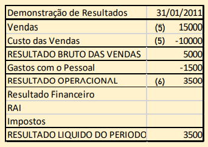
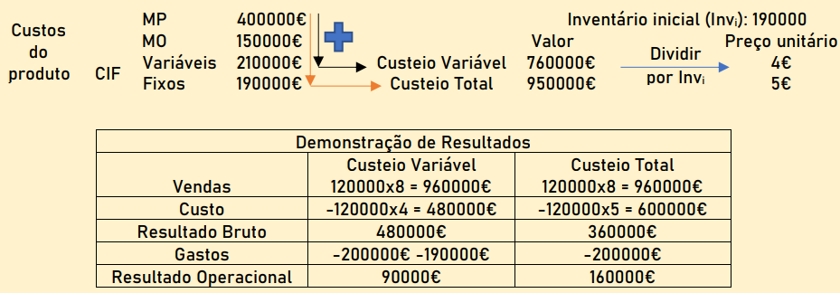

# A Informação Financeira

```toc

```

## Contabilidade

Processo formal de identificar, medir e comunicar a informação sobre o património e resultados da empresa para os decisores e outros agentes.

- **Contabilidade Geral** $\rightsquigarrow$ Financeira/Externa

  - Gera informação para os elementos externos à empresa
  - Segue as normas internacionais de contabilidade

- **Contabilidade Analítica** $\rightsquigarrow$ Gestão/Interna

  - Gera informação específica e desagregada para apoiar a gestão
  - Apura resultados por produtos, regiões, etc
  - É a base para orçamentação e análise de custos

- **Contabilidade Pessoal**

  - Tenho uma casa (150.000€)
  - Tenho um carro (10.000€)
  - Tenho depósitos bancários (2.000€)
  - Tenho uma nota no bolso (50€)
  - Devo ao banco por um empréstimo (100.000€)

:::info[Exemplo de Contabilidade Pessoal]

**Património Ativo**: ${\text{casa} + \text{carro} + \text{depósitos} + \text{nota}} = 162.050€$

**Património Passivo**: Empréstimo

**Património Liquido**: ${\text{Ativo} - \text{Passivo}} = 62.050€$

:::

**Património**: Bens, direitos e obrigações.

**Património Ativo**: Bens e direitos $\rightsquigarrow$ Valor do que tenho mais do que me devem.

**Património Passivo**: Obrigações $\rightsquigarrow$ Valor do que devo.

**Património Liquido**: Bens e direitos.

- **Contabilidade Empresarial**
  - 5 sócios criam uma empresa de consultadoria, investindo nela 50.000€
  - A empresa compra, a pronto, portáteis no valor de 3.000€
  - A empresa presta serviço de consultadoria e recebe um pagamento de um cliente: 5.000€
  - A empresa pede financiamento ao banco no valor de 3.000€
  - A empresa paga renda de aluguer de escritório no valor de 1.000€

:::info[Exemplo de Contabilidade Empresarial]

**Património Ativo**: ${\text{depósitos bancários} + \text{bens investidos}} = 58.000€$

**Património Passivo**: ${\text{dividas ao banco}} = 3.000€$

**Património Liquido ou capital próprio**: ${\text{Ativo} - \text{Passivo}} = 55.000€$

:::

## O Balanço e a Demonstração de Resultados

O balanço é uma fotografia num dado momento da situação patrimonial da empresa. Conta com 3 grandes rúbricas, que depois podem ser distinguidos em subpartes:

- **Ativo**: Bens e direitos que a empresa possui ou tem direito a receber:

  - **Ativos Fixos Tangíveis**: Edifícios, equipamentos,...
  - **Ativos Fixos Intagíveis**: Marcas, patentes,...
  - **Inventários**: Produtos fabricados, em vias de fabricação ou matéria prima
  - **Valores Monetários**: Dinheiro, depósitos e titúlos financeiros
  - Dívidas de clientes

- **Passivo**: Responsabilidades da empresa perante terceiros

- **Capital próprio**: Capital realizado e lucros do período ou de períodos anteriores retidos na empresa. (não distribuido aos sócios ou acionistas)
  - **Capital Subscrito**: Dinheiro investido formalmente pelos sócios para suportar as necessidades financeiras da empresa

:::tip

Se ativo > passivo $\rightsquigarrow$ Capital próprio > 0

Se ativo < passivo $\rightsquigarrow$ Capital próprio < 0 - Falência técnica

:::

O balanço é feito segundo o diagrama seguinte:


Uma vez que isto é um balanço, a soma do dinheiro do lado esquerdo deve ser igual à soma do dinheiro no lado direito.
Cada alteração em elementos do **Balanço** é causada por uma transação.
Cada transação implica sempre no mínimo, dois registos, ou seja, qualquer variação no ativo deverá ser equilibrada
por uma variação no capital próprio ou no passivo ou, então, com um balanço simétrico no próprio ativo e vice-versa.

Isto leva-nos à equação fundamental da contabilidade:

$$
\Delta\text{ativo} = \Delta\text{passivo} + \Delta\text{capital próprio}
$$

O capital próprio traduz o valor contabilístico da empresa num determinado momento:\
o valor que os proprietários receberiam se cessassem a atividade, liquidando todo o ativo e passivo,
e se os valores de balanço correspondessem exatamente aos valores de mercado.

:::info[Exemplo]

Normalmente, os balanços são feitos ano a ano, por exemplo:

Dia 31/12: lucro de 1000€ (resultado liquido)

Dia 01/01: Passo para o resultado transitado:

- Se for prejuízo ficam parados;
- Se for lucro, é distribuído pelos sócios como dividendos ou vai para a reserva da empresa.

:::

Cada alteração em elementos de Balanço é causada por uma transação. Cada transação implica sempre pelo menos < registos: o sistema de transações chama-se **Dupla Entrada**.

- **Início da Atividade** $\rightsquigarrow$ Capital (subscrito): Dinheiro investido formalmente pelos sócios para suportar as necessidades financeiras da empresa.

- **Resultado Líquido**: $\rightsquigarrow$ Lucro, prejuízo ou resultado nulo: Fluxo financeiro anual que corresponde à diferença entre rendimentos e gastos.

- **Património Líquido a cada Momento** $\rightsquigarrow$ capital próprio: Os resultados líquidos não distribuidos (ou seja, os que não são usados para pagar dívidas ou dar aos sócios) ficam no capital próprio como reservas.

O balanço contabilistico e a demonstração de resultados pode ser feita segundo diferentes óticas:

- **Ótica de Caixa**: Permite ver o dinheiro que uma empresa tem num determinado momento, a liquidez

- **Ótica de Exercício**: Permite ver se a empresa é rentável


A demonstração de resultados é o resultado líquido do período que encontramos no lado direito do Balanço,
no capital próprio, é, essencialmente, um mapa que exprime para um dado período diferença entre os fluxos de rendimentos.

Existem diversos tipos de resultados na demonstração dos mesmos:

- **Resultado Operacinal (RO)**: Dependem somente da atividade produtiva no período em análise.

  RO = Rendimentos Operacionais - Gastos Operacionais

- **Resultado Antes do Imposto (RAI)**: Resultado operacional deduzido dos gastos de financiamentos líquido.

  RAI = RO - Gastos de Financiamento líquidos

- **Resultado Líquido do Período (RL)**: Resultada da dedução do imposto sobre o resultado antes de impostos ao RAI.

:::info[Exemplo]

Em janeiro de 2020, a Rita, o Tomás e o Rui, após terminarem o curso de Eng. Eletrótecnica,
criaram e iniciaram a atividade de uma empresa de computadores. Nesse mês ocorreram os seguintes factos:

- Para iniciar a atividade, cada um dos três sócios participou com um capital de 10.000€, totalmente realizado em dinheiro.
- Contração de empréstimo bancário de médio longo prazo no montante de 100.000€.
- Aquisição de uma loja pelo montante de 80.000€. Pagamento efetuado no ato da escritura (a 01/01/2020).
- Compra de diversos equipamentos e acessórios laboratoriais para posterior comercialização.
  O valor da compra foi de 20.000€ e as condições de pagamento acordadas com o fornecedor foram: a 90 dias da data da fatura.
- Durante o 1.º mês a empresa faturou 15.000€, com pagamento a 60 dias. O material vendido teve um custo de aquisição de 10.000€.
- Pagou-se no final do mês ordenados e outros encargos com o pessoal no montante de 1.500€

Balança dos Resultados:


Demonstração de Resultados:



1. **Capital Próprio**: Capital subscrito: $+ 3 \times 10.000€$ (Valor pago para formar a empresa);

   **Ativo**: Depósitos à ordem e caixa: + 3 $\times$ 10.000€ (Quanto vale a empresa ao ser formada);

2. **Ativo**: +100.000€ (Recebido em empréstimo);

   **Passivo**: +100.000€ (Obrigação de pagar o empréstimo);

3. **Ativo**: Aquisição de um espaço próprio $\rightsquigarrow$ Ativo Fixo Tangíveis: +80.000€;

   Pagamento da loja à vista $\rightsquigarrow$ Depósito à ordem e caixa: -80.000€;

4. **Ativo**: Aquisição de material $\rightsquigarrow$ Inventário +20.000€;

   **Passivo**: Obrigação de pagar aos fornecedores num prazo de 90 dias $\rightsquigarrow$ Fornecedores: +20.000;

5. **Passivo**: Demonstração de Resultados: Resultados Líquidos: Vendas no valor de 15.000€,
   a ser pago em 60 dias, de um material que custou 10.000€ $\rightsquigarrow$ Resultado Bruto das vendas: 5000€;

   **Ativo**: Perda de inventário $\rightsquigarrow$ Inventário: -10.000€
   Direito de receber dinheiro dos clientes $\rightsquigarrow$ Clientes: +15.000;

6. **Ativo**: Pagamento dos ordenados $\rightsquigarrow$ Depósitos à ordem e caixa: -1500€;

   **Passivo**: Demonstração de resultados: Gastos com o pessoal: -1500€;

Notar como cada balanço num lado da tabela implica um mesmo balanço do outro lado da tabela

:::

Os investimentos em ativos não correntes não são registados na demonstração de resultados como gastos quando ocorrem os pagamentos,
mas o seu valor é fracionado consoante o tipo de ativo, sendo em cada ano levado a gasto somente essa fração.

- **Depreciação**: Corresponde à quebra de valor dos bens do ativo fixo tangível;

- **Amortização**: Corresponde à quebra de valor dos bens do ativo fixo intangível;

- **Depreciações e Amortizações do Exercício**: Quebra do valor das propriedades de investimento, dos ativos biológicos
  não consumíveis e dos ativos fixos tangíveis e intangíveis durante um período contabilístico.
  São consideradas um gasto na Demonstração de resultados;

- **Depreciações e Amortizações Acumuladas**: Valores acumulados das depreciações e amortizações à data do Balanço
  (que é igual à soma das depreciações e amortizações das D.R. até essa data).
  Subtraídas aos valores de aquisição, produção ou reavaliação desses ativos dão origem aos valores dos ativos que aparecem registados no Balanço em cada Período.

:::tip

As depreciações e amortizações são um gasto que não dá origem a pagamentos,
mas têm um impacto fiscal → mais gastos, menos resultados antes de impostos, menos impostos.

:::

## Análise de Rácios Financeiros

**Rácios**: indicadores de gestão que exprimem uma relação entre elementos dos documentos contabilísticos
(Balanço, Demonstração de Resultados) e a partir dos quais é possível tirar ilações sobre a situação da empresa
(Solidez Financeira e níveis de desempenho económico e financeiro).

### Principais Orientadores de Solidez Financeira

- Quanto maior o capital próprio e menor o passivo (melhor ainda se o passivo for não corrente)
- Quanto maior for o somatório do capital próprio com o passivo não corrente, relativamente ao ativo corrente
- Quanto maior a rentabilidade do capital total em relação ao juro a pagar pelo capital alheio

## Tipos de Rácios Financeiros:

1. **Rácios de Rentabilidade**: Indicam a rentabilidade do capital próprio, ativo ou vendas.

   $$
   \text{Rentabilidade do Capital Próprio}=\frac {\text{Resultado Líquido}} {\text{Capital Próprio}}
   $$

   $$
   \text{Rentabilidade das Vendas}=\frac {\text{Resultado Operacional}} {\text{Vendas}}
   $$

2. **Rácios de Atividade ou Funcionamento**: Indicam o grau de utilização dos recursos da empresa.

$$
\text{Prazo médio de recebimentos (dias)}=\frac {\text{Clientes}} {\text{Vendas}} \times 365(\text{dias})
$$

$$
\text{Prazo médio de pagamentos (em dias)}=\frac {\text{Fornecedores}} {\text{Compras}} \times 365
$$

3. **Rácio de Solvabilidade/Endividamento**: Indicam a capacidade da empresa de sastifazer os compromissos financeiros de médio e longo prazo.

   - **Solvabilidade**: Capacidade da empresa para responder aos seus compromissos a médio e a longo prazo:

   $$
   \text{Solvabilidade Total ou Autonomia financeira}=\frac {\text{Capital Próprio}} {\text{Capital Ativo}}
   $$

   - Uma boa solvabilidade total corresponde a valores acima de 1/3

   $$
   \text{Solvabilidade Reduzida}=\frac {\text{Capital Próprio}} {\text{Passivo}}
   $$

   - Uma boa solvabilidade reduzida corresponde a valores acima de 1/2.

4. **Rácio de Liquidez**: Indicam a capacidade de a empresa satisfazer os compromissos financeiros de curto prazo.

   - **Liquidez**: Capacidade de a empresa solver os seus compromissos de curto prazo através do fundo de maneio (Ativo corrente – Passivo corrente).

   Podemos avaliar o grau de liquidez da empresa, que é em função de:

   - Política de crédito a clientes (+clientes $\rightsquigarrow$ + risco)
   - Político de inventários (+ inventários produtos $\rightsquigarrow$ + risco)
   - Política de aprovisionamento (+ inventário matérias-primas $\rightsquigarrow$ + risco)

   $$
   \begin{aligned}
   \text{Liquidez geral}&=\frac {\text{Ativo corrente}} {\text{Passivo corrente}}\\
   \\
   &= \frac {\text{Caixa de depósitos à ordem + clientes + Inventários}} {\text{Passivo Corrente}}\\
   \\
   \text{Liquidez Reduzida}&=\frac {\text{Ativo corrente - Inventário}} {\text{Passivo Corrente}}\\
   \\
   &= \frac {\text{Caixa e depósitos à ordem + clientes}} {\text{Passivo Corrente}}
   \end{aligned}
   $$

### Limitações dos Rácios Financeiros:

- Os rácios devem ser comparados com dados de outras empresas com atividade semelhante
- Devem ser comparados, dentro da mesma empresa, ao longo do tempo
- Podem variar em função do país ou práticas contabilísticas
- Atualmente, há cada vez mais consciência de que o lucro não pode ser o objetivo exclusivo das empresas

:::info[Exemplo]

De acordo com o balanço feito à empresa da Rita, do Tomás e do Rui anteriormente:


Qual é o rácio de liquidez reduzida e o rácio de solvabilidade total? Trata-se de uma boa solvabilidade total?

$$
\begin{aligned}
\text{Liquidez geral \%}&=\frac {\text{Ativo corrente} - \text{Inventário}} {\text{Passivo corrente}}\%\\
\\
&=\frac {10000 + 15000 + 48500 - 10000} {20000} = 317,5\%\\
\\
\text{Solvabilidade Total}&=\frac {\text{Capital Próprio}} {\text{Capital Ativo}}\\
\\
&= \frac {33500} {153500} = 0,22 < 1/3
\end{aligned}
$$

Tem uma má solubilidade total uma vez que o valor é inferior a 1/3.
:::

## Noções Básicas de Custeio

**Custeio**: Atribuição de custo a um objeto de custo (qualquer entidade para a qual e deseje uma medida separada de custo)

- **Direto**: Valores diretamente observados;
- **Indireto**: Segundo taxas predeterminadas custo/unidade. - Orçamentam-se os custos indiretos no período; - Estima-se
  o número de horas/máquina do período; - Estima-se o número de horas/homem no período; - Estima-se o custo de mão de obra direta.

**Objeto de Custo**: Qualquer entidade para qual se deseje uma medida separada de custo. Por exemplo: produtos, serviços, projetos, departamentos, etc

$$
\text {Custos totais} = \text {Custos indiretos de fabricos + Mão de obra direta + Matéria prima}
$$

$$
\text {Custo unitário de fabrico} = \frac {\text{Custos totais de fabrico}} {\text{Quantidade produzida}}
$$

### Custeio de Produto e Custeios de Período

- **Produto**: Custos que valorizam a produção só são lançadas no DR quando a mercadoria é vendida.
- **Período**: No ano em que ocorrem aparecem logo na DR.

### Empresa Comercial

- Compra e vende;
- Custo do produto fácil de obter, depende do custo de aquisição.


### Empresa Industrial - Custeio Total

- Mais difícil de ver o custo do produto.

- **Custeio Total**: A empresa valoriza a produção como o total dos CIF (custos indiretos de fabrico).
  Os CIF vão todos para o custo das vendas na DR $\rightsquigarrow$ só são contabilizados quando há uma venda.


:::tip

$$
\textstyle
{\text {Custo das vendas}} =
\frac {\text{M.O.B} + \text{M.P} + \text{CIFvariáveis} + \text{CIF fixos}} {\text {Unidades produzidas}} \times {\text {Unidades vendidas}}
$$

:::

### Empresa Industrial - Custeio Variável

- **Custeio Variável**: A empresa valoriza a produção a produção apenas com os CIF variáveis
  (a parte fixa integra os custos do período $\rightsquigarrow$ vai sempre para a DR; a parte variável só entra na DR quando há uma renda).


:::tip

$$
\textstyle
{\text {Custo das vendas}} = \frac {\text{M.O.B} + \text{M.P} + \text{CIFvariáveis}} {\text {Unidades produzidas}} \times {\text {Unidades vendidas}}
$$

:::

- Os inventários no custeio variável não entram com os custos indiretos de fabrico fixos;
- O RO e os resultados líquidos do período estão deduzidos de todos os custos indiretos de fabrico fixos do exercício,
  independentemente de parte dos produtos continuarem em inventário (não terem sido vendidos);
- Há diferença nos dois métodos só se houver variação de inventários.

:::info[Exemplo]

A empresa Phyta-Kola, empresa especializada na venda de fita-cola, iniciou as suas atividades em janeiro de 2020.
Durante o ano produziu 190000 unidades do seu produto gastando 400000€ em matéria-prima (MP),
150000€ em mão de obra (MO) e 400000€ em custos indiretos de fabrico (CIF), 52,5% dos quais variáveis.
Além disso, a empresa gastou 200000€ com administração, depreciações, etc.
A empresa vendeu neste mesmo ano 120000 unidades por 8€ cada. Usando cada um dos métodos de custeio,
calcule o custo fabril por unidade produzida, o resultado operacional de 2020.



:::

## Análise Custo-Volume-Resultado

Tendo já estabelecido os tipos de custeio, podemos perceber graficamente as zonas que correspondem a um prejuízo ou lucro da empresa.
Isto pode ser feito através da reta decorrente do produto do preço de venda unitários (P) pela quantidade produzida
e vendida (Q) e da reta do total dos custos fixos (CF) somado pela multiplicação do custo variável unitário ($cv_u$)
com a mesma quantidade produzida e vendida (Q).

- **Ponto Crítico**: Ponto em que uma empresa deixa de estar no prejuízo e passa a estar no lucro (ou seja, passa a ser rentável).
  Corresponde a uma receita e a uma quantidade crítica (Rc e Qc).
  Trata-se de um ponto em que o nível de atividade corresponde a um lucro zero.

  

- **Custos Fixos**: Gastos em que a empresa incorre independentemente da quantidade produzida (ex: Gastos de instalação).
- **Custos Variáveis**: Variam proporcionalmente com a quantidade produzida (ex: custos de matéria-prima).

O lucro pode ser matematicamente definido por:

$$
\text{Lucro} = p \times Q - CV -CF
$$

De acordo com a análise gráfica, podemos chegar a uma expressão para a quantidade crítica:

$$
Qc = \frac {CF} {mCu} = \frac {CF} {p-CVu} = \frac {\text {Total dos custos fixos}} {\text {margem de contribuição unitária}}
$$

Em que mCu significa margem de contribuição unitária.
Logicamente:

$$
Rc = p \times Qc = \frac {CF} {mCu \%}
$$

$$
mCu = p - CVu
$$

:::tip[Relembrar]

$Q =$ Quantidades produzidas e vendidas;

$Qc =$ Quantidade crítica a partir da qual há lucro;

$p =$ preço de venda unitário;

$CVu =$ Custo variável unitário (constante);

$mCu =$ margem de contribuição unitária;

$CF =$ Total dos custos fixos;

$CV =$ Total dos custos variáveis.

:::

:::info[Exemplo]

O Rodrigo Coimbra é proprietário de uma empresa especializada na produção de colunas de destilação.
Em 2020, a empresa do Rodrigo produziu 5000 destiladores cujo preço de mercado é 1000€/unidade.
Para esta produção, o custo anual total foi de 5 mi€, representando os custos variáveis anuais 60% deste valor.
Quantos destiladores precisará ele de vender para ter lucro?

Dados:

- $Q = 5000$
- $p = 1000€$
- $CT = =5000000€$

---

$$
CVT = 0,6 \times CT = 3000000€
$$

$$
CVu = 0,6 \times p = 600€
$$

$$
CF = CT - CVT = 5000000 − 3000000 = 2000000€
$$

$$
Qc = \frac {CF} {P - CVu} = \frac {2000000} {1000 − 600} = 500 {\text { Unidades}}
$$

:::
