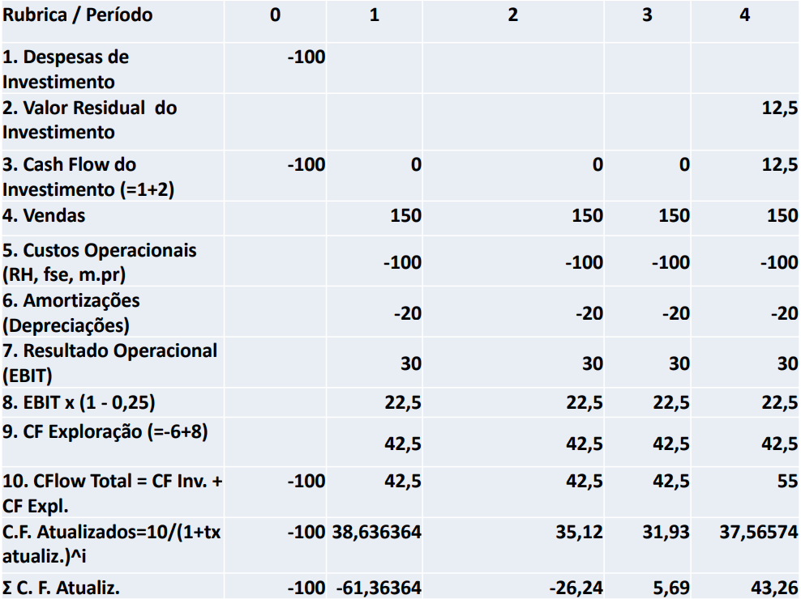
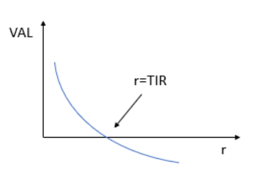

# Análise de Projetos de Investimento

```toc

```

**Investimento**: Aplicação atual de recursos, com o objetivo de obter benefícios futuros. Estes benefícios podem corresponder a:

- **Fluxos financeiros**: Dinheiro (cash-flows).

- **Investimentos sociais**: Estradas, educação, saúde.

- Aplicações em **ativos financeiros** (compra de ações) ou reais (ex: apartamentos).

Na análise de projetos procura-se avaliar genericamente uma afetação de recursos (R),
feita inicialmente, é capaz de vir a gerar uma sucessão de benefícios líquidos (B) que excedem esse investimento inicial.

Concentrando num domínio puramente financeiro R e B representam dinheiro, fluxos
financeiros negativos e positivos (CF- ou CF+). Sendo que CF são _Cash Flows_.

Idealmente, estaremos mais interessados em investir em projetos em que a soma dos CF- seja inferior à soma dos CF+.
O problema é que esta análise é dependente do tempo e, com o tempo,o dinheiro está sujeito a determinados fatores como,
por exemplo, a _inflação_ e os _juros_.
Para sabermos lidar com estes fatores, de modo a comparar CF em diferentes momentos precisamos de aprender alguns princípios do Cálculo Financeiro.

## Cálculo Financeiro

**Juro**: Renumeração cobrada pelo empréstimo de dinheiro (ou outro item), existem dois tipos de juro.

- [**Juros Simples**](color:blue): A taxa de juros é aplicada sobre o valor inicial de forma linear em todos os períodos, ou seja, não considera que o valor sobre o qual incidem juros muda ao longo do tempo.

$$
jC_0 + C_0 = (1 + j)C_0
$$

Em que j é a taxa de juro anual e o $C_0$ é o capital inicial.

- [**Juros Compostos**](color:green): Juros corrigíveis de cada período são somados ao capital para o cálculo de juros nos períodos seguintes. Neste caso, o valor da dívida é sempre corrigido e a taxa de juros é sempre calculada sobre esse novo valor.

$$
C_n = C_0(1 + j)^n
$$

Em que **n** é o número de anos.

No caso destes juros pode ocorrer o processo de _capitalização_, que permite chegar de forma inversa à noção de _atualização_,
em que se faz o cálculo do valor atual (VA) ou presente de dinheiro a receber no futuro,
sendo a respetiva taxa designada por [**taxa de atualização**](color:pink).

$$
VA = \frac{C_n}{(1 + r)^n}
$$

Em que $C_n$ é o valor a receber daqui a x anos e **r** a taxa de juros.

## Inflação e Taxas Reais

É preciso ter noção que a taxa de juro pode ir variando ao longo dos anos,
não sendo necessariamente constante, um dos fatores que pode causar essa alteração é a **inflação**.
As taxas de inflação podem incorporar a noção de inflação ou não.

- [**Taxa de juro nominal (jn)**](color:orange): Usa-se em avaliação de projetos a preços **correntes**, não é corrigida tendo em conta o efeito da inflação.

- [**Taxa de juro real (jr)**](color:yellow): Taxa nominal expurgada do efeito da inflação.Usa-se em avaliação de projetos a preços **constantes**

$$
jr = \frac{1 + j_n}{1 + i} - 1 \approx j_n - i
$$

## Taxas de Juro Nominais e Efetivas

É também possivel trabalhar com períodos infra-anuais, usando na atualização uma taxa de juro equivalente,
isto é, uma taxa efetiva que aplicada ao mesmo capital inicial conduz ao mesmo capital final.

$$
(1 + j_k)^k = 1 + j_a
$$

[**TAN**](color:blue): Eventuais pagamentos ou recebimentos infra-anuais são calculados de forma proporcional,
mas não equivalente do ponto de vista financeiro.

:::info[Exemplo]

Quando TAN = 12%

$$
J_m = \frac{12\%}{12} = 1\%
$$

A taxa mensal equivalente à taxa anual efetiva (TAE) é:

$$
j_m = (1 + j_a)^1/12
$$

:::

[**TAEG**](color:green): Taxa anual efetiva global, inclui encargos como seguros de vida e taxas adicionais associados ao empréstimo.

**Equivalências das taxas de juro**. Duas taxas de juro referidas a períodos diferentes de capitalização
são equivalentes quando aplicadas ao mesmo capital, produzem o mesmo resultado no mesmo período de tempo. É dada por:

$$
(1 + j_k)^k = 1 + j_a
$$

Em que $j_k$ é a taxa do sub-periodo k e k é o número de subperíodos do periodo.

## Anuaidades e Perpetuidades

Numa situação em que os valores dos cash-flows se repetem ao longo do tempo,
estamos perante anuidades e perpetuidades que se distinguem pelo facto de a sequência de cash-flows
ser limitada no tempo ou ser infinita, respetivamente.

_Anuidade_ é uma designação que pode ser utilizada quer a frequência de cash-flows seja anual ou não.
Numa situação em que se obtém um empréstimo num período e temos rendas ou pagamentos constantes (Anuidades),
durante $n$ períodos com uma taxa de atualização, o cálculo do valor atual (VA) de todos os cash-flows dá-se por:

$$
\sum \frac{A_t}{(1 + r)^t}, t = 1,...,n
$$

Trata-se de um progressão geométrica que pode ser descrita na forma:

$$
VA = A\frac{(1 + r)^n - 1}{(1 + r)^n \times r} = Af(r,n)
$$

Em que $f(r,n)$ é o fator de anuidade e $n$ é a perpetuidade.

Quando $n = \infty$ estamos perante o valor atual de uma perpetuidade:

$$
f(r, \infty) = A \times \frac{1}{r}
$$

Estes casos excluem os casos de rendas crescentes. Tendo em conta rendas crescentes a uma taxa g < r, temos a anuidade:

$$
VA = A \times \left(\frac{1}{r - g} - \frac{(1+g)^n}{(1 + r)^n \times (r -g)}\right)
$$

E a perpetuidade:

$$
VA = A \times \frac{1}{r - g}
$$

:::info[Exemplo]

A Teresa possui um aqueduto que gerará 2 milhões de euros de fluxos de tesouraria durante o ano de 2020. Os custos de operação do aqueduto são negligenciáveis e a sua durabilidade muito grande. Infelizmente, o preço da água transportada tem diminuído e prevê-se que os fluxos de tesouraria diminuam 4% ao ano. A taxa de atualização é de 10%. Qual é o valor atual dos fluxos de tesouraria do aqueduto se se assumir que os fluxos de tesouraria durarão para sempre?

Usando a fórmula de cima:

$$
2000000 \left(\frac{1}{0,1 + 0,04}\right) = 14285714,29€
$$

:::

## Análise de Rentabilidade de Projetos de Investimento

**Investimento**: Sequência de fluxos financeiros (cash-flows) distribuidos por diversos periodos. O primeiro cash-flow normalmente é negativo:

- **Despesas de investimento**: Terrenos, edíficios, equipamentos licenças e patentes ou,
  até em fundo de maneio, como a constituição e reforço de stocks de matérias primas ou mercadorias.
- **No final de vida do projeto**: O valor destas despesas que seja recuperável dará origem ao valor residual do investimento.

**Valor residual do investimento**: Gerado pela venda de um imobilizado no final do tempo de vida do projeto.

$$
\begin{aligned}
VR &= \text{Valor do mercado n} -\\
& \quad \quad- (\text{Valor do mercado n} - \text{Valor contabilistico}) \times \text{Taxa de imposto}
\end{aligned}
$$

O **valor de mercado** é o valor esperado de venda do ativo no ano **n** e o valor contabilístico é:

$$
\text{Valor contabilistico} = \text{Valor de compra} - \text{Amortizações acumuladas}
$$

Os cash-flows durante a fase de exploração (passada a fase inicial de investimento) serão habitualmente positivos se o projeto for lucrativo.

$$
\text{CF exploração} = RAJI \times (1 - \text{Taxa de imposto}) - \text{Amortizações e depreciações}
$$

Em que RAJI corresponde ao resultado antes de juros e impostos, ou seja, o mesmo que EBIT, resultados operacionais.

:::info[Exemplo]

1. A empresa MGM investiu 100 mil € numa nova máquina para os próximos 4 anos;
2. Esta é depreciável em 5 anos, findos os quais pode ainda ser vendida por 10 mil € (valor de mercado no ano 5);
3. Sabe-se que as vendas anuais adicionais serão de 150 mil € durante todo o projeto;
4. Os custos operacionais anuais adicionais com pessoal, fornecimentos e
   serviços externos e matéria prima serão de 100 mil €, acrescidos dos custos com amortizações (depreciações), 20%;
5. A taxa de imposto a pagar pela empresa é de 25%.



$$
VR = VM -(VM - VC)t = 10 - (10 - 20) \times 0,25 = 12,5
$$

$$
VC = \frac{100}{5}
$$

:::

Quando o $RAJI < 0$:

- Projeto/Empresa não lucrativa, então o imposto não existe $t = 0$

- Projeto implementado por uma empresa lucrativa, então tem-se em conta o imposto, que será negativo.

Na avaliação de projetos de investimentos estamos confrontados com a necessidade de
comparar fluxos financeiros aplicados numa fase inicial, com fluxos gerados nos anos seguintes. Para isso usamos os seguintes indicadores:

### Taxa de atualização

Exprime o custo de oportunidade do capital, ou seja,
o rendimento que o investidor pretende tendo em conta o risco do investimento.
São em geral nominais, aplicados a cash-flows a preços correntes.
Quando os cash-flows são reais ou a preços constantes, utilizam-se taxas de atualização reais.
A determinação das taxas de atualização devem ter em conta o risco associado ao investimento.

A taxa de atualização de um projeto financiado exclusivamente por capital próprio deve corresponder à soma de:

- Rendimentos esperados de ativos sem risco;
- Um prémio de risco inerente à atividade económica em causa e o risco financeiro associado ao grau de endividamento da empresa.

Quando houver financiamento com capital alheio:

- A taxa de atualização deve incorporar a taxa de juro da divida líquida de impostos.
- A taxa de atualização deve ser igual ao custo médio ponderado do capital,
  sendo a ponderação dada pelas percentagens dos dois tipos de capital, calculados ao valor de mercado.

### Custo médio ponderado do capital (CMPC ou WACC)

$$
\text{Taxa de atualização com financiamento misto} = r_CP \times CP\% + r_D \times (1 -t) \times D\%
$$

- $r_CP$ é igual ao custo do capital próprio.
- $CP\%$ é a percentagem de capital próprio.
- $r_D$ é o custo de capital alheio líquido de um imposto.
- $D\%$ é a percentagem de capital alheio.

$$
CMPC = \frac{C_\text{alheio}}{CP + C_{alheio}} \times r_D \times (1 - t) + \frac{CP}{CP + C_{alheio}} \times r_CP
$$

- $r_D$ é o custo médio da dívida.
- $t$ é igual à taxa de imposto.
- $r_CP$ é a renumeração requerida pelos acionistas.

:::details[Exemplo]

**A empresa MGM tem um Capital Social composto por 10 000 ações, com um valor nominal 1 € cada.**
**O valor do capital próprio em balanço é de 70 000 € e cada ação está cotada em 10 €.**
**O financiamento com recurso a terceiros é constituído por um empréstimo bancário no valor de 50 000 €**
**e 5 000 obrigações com um valor nominal de 1 € e cotação de 0.8.**

1. **Qual o valor de capital próprio relevante para cálculo do CMPC (Custo Médio Ponderado do Capital)?**

   O que importa não é o valor contabilístico (70 000 €), nem o valor do capital social realizado $10 000 \times 1 = 10 000 €$,
   mas o valor de mercado pelo qual seria possível comprar a empresa $10 000 \times 10  = 100 000 €$.

2. **Qual o valor da dívida relevante para cálculo do CMPC (Custo Médio Ponderado do Capital)?**

   O que importa não é o valor contabilístico (do balanço), que seria de 55 000 € $50000 + 5 000 \times 1 €$,
   mas sim o valor de mercado que é igual a 54 000 € $50 000 + 0.8  \times 5 000€$.

3. **Qual o valor das percentagens de capital próprio e alheio para cálculo do CMPC (Custo Médio Ponderado do Capital)?**

   $$
   V= CP + D = 100000 € + 54000 € = 154000€
   $$

   $$
   CP\% = \frac{CP}{V} = \frac{100000€}{154000€} = 65\%
   $$

   $$
   D\% = 100 - 65 = 35\%
   $$

4. **Se a taxa de impostos sobre lucros for de 25%, o custo médio da dívida (rD) for de 5%**
   **e a remuneração requerida pelos acionistas (rCP) for igual à dos títulos do Estado de**
   **curto prazo (1.5%) + o prémio de risco de 6.5%, qual será o CMPC?**

   $$
   CMPC = r_CP \times CP% + r_D \times (1 - t) \times D% = 8% \times 65% + 5% \times 35% \times (1 - 25%) = 6,5%
   $$

:::

### Valor Atual Liquido (VAL)

Soma de todos os CF do projeto devidamente atualizados.

$$
VAL(r) = \sum \frac{CF_K}{(1 + r)^K}
$$

Em que $CF = \text{cash-flow}$ e $r$ a taxa de atualização

Se VAL(r) > 0, o projeto é rentável à taxa de atualização.
Entre dois projetos A e B, se $\operatorname{VAL}_A > \operatorname{VAL}_B$ então $P_A$ melhor que o $P_B$.

:::info[Exemplo]

O João comprou 100 ações da empresa MGM, tendo pagado 7€ por ação na expectativa de receber
dividendos de $1€ \times 100$ nos anos 1 e 2, e de vender os títulos no ano 3 por 10€ cada.
Sabendo que ações de empresas com idêntico grau de risco oferecem uma rentabilidade anual de 5%,
calcule o VAL e diga se aconselha o investimento.

$$
\operatorname{VAL}(5\%) = -\frac{700}{(1 + 0,05)^0} + \frac{100}{(1 + 0,05)^1} + \frac{100}{(1 + 0,05)^2} + \frac{1000}{(1 + 0,05)^3} = 349,78€
$$

O VAL é positivo, o investimento é rentável.

:::

### Taxa Interna de Rentabilidade (TIR)

É a taxa $r*$de atualização para a qual o $\operatorname{VAL} = 0$, o seu cálculo resulta de um processo iterativo.
Aceitar um projeto com $\operatorname{VAL}(r) > 0$ significa aceitá-lo quando $\operatorname{TIR} > R$.

Problemas no cálculo e utilização da TIR:

- Pode existir mais do que uma TIR. É o caso, por exemplo,
  da existência de cash-flows negativos intermédios ou finais (investimentos não convencionais).
- Não existir TIR.
- A TIR é inadequada para projetos mutuamente exclusivos, isto é, em que só podemos fazer um deles.



### Periodo de Recuperação do Investimento (PRI)

Tempo necessário para que os cash-flows atualizados gerados pelo projeto igualem o capital investido inicialmente.

$$
\sum = \frac{CF_K}{(1 + r)^K} = 0
$$

$$
PB = \text{Ano anterior a mudança de sinal no }CF_{\text{acumulado}} - \frac{\text{útimo }CF_{\text{acumulado negativo}}}{CF_\text{atualizado no primeiro positivo}}
$$

### Indice de Rentabilidade (IR)

$$
IR = \frac{\operatorname{VAL} + \text{Inventário Inicial}}{Inventário Inicial} = \frac{\operatorname{VA}}{\text{Inventário Inicial}}
$$

Um projeto considera-se aceitável quando $\operatorname{IR} > 1$. Tal como a TIR, este indicador peca na análise de projetos mutuamente exclusivos.
