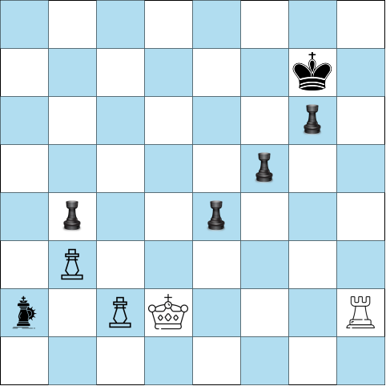

# Procura Adversária e Jogos

```toc

```

Até agora, abordámos apenas cenários em que um agente se encontra sozinho a tentar
resolver um problema, desde Arad-Bucareste até colorir o mapa australiano. O próximo passo
será procurar aprender abordagens que funcionem em [**sistemas multi-agente**](color:orange) - tentar prever
o impacto das ações de outros agentes, **imprevisíveis**, por forma a tentar fazer a melhor
escolha possível do nosso lado.

## Jogos

Por norma, vamos olhar para problemas completamente observáveis de dois jogadores, os
[**_zero-sum games_**](color:green): uma jogada que é boa para um agente será má para
o outro - se tentarmos quantificar o impacto de uma jogada para cada um dos agentes,
esta apresentará valores simétricos para cada um deles.

:::info[Caracterização de jogos zero-sum]

A definição clássica nomeia os dois agentes como [**MIN**](color:red) e [**MAX**](color:green),
onde MAX joga sempre primeiro e ambos os agentes procuram sempre a [**melhor jogada que podem
realizar a seguir**](color:green). Idealmente, os agentes atuam sob a perspetiva de pontuação,
por forma a conseguir quantificar (de forma mais ou menos precisa) o desempenho de cada um:
no final de cada jogo, cada um dos agentes recebe bonificações ou penalizações consoante
o seu desempenho durante o mesmo.

O jogo em si tem várias componentes-base:

- Um estado inicial, $S_0$, que corresponde à configuração inicial do mesmo.
- Uma função, $\op{player}(s: state)$, que especifica o jogador que vai jogar no estado em questão.
- Uma função, $\op{action}(s: state)$, que retorna todas as **jogadas possíveis** para o estado em questão.
- Uma função, $\op{result}(s: state, a:action)$, que, tal como abordado em secções anteriores,
  corresponde ao **modelo de transição** do jogo, que define o estado resultante de
  realizar uma jogada $a$ sob um estado $s$.
- No lugar do $\op{goal\_test}$, abordado anteriormente, vamos ter uma função $\op{terminal\_test}$
  (que funciona de forma praticamente igual): retorna _true_ caso o jogo esteja num [**estado
  terminal**](color:red), e _false_ caso contrário.
- Por fim, uma função $\op{utility}(s: state, p:player)$, que especifica a pontuação atribuída
  a um jogador $p$ caso o jogo termine num estado terminal $s$.

Voltamos, aqui, a ter associada a noção de [**espaço de estados**](color:orange), que resulta numa
árvore onde cada nó corresponde a um estado e os arcos correspondem a jogadas. A procura
da **melhor jogada** funcionará, tal como referido em secções anteriores, através de
travessias por essa mesma árvore (e, claro, tal como nessas secções, vamos ver formas
de tornar esta procura mais eficiente).

Abaixo encontra-se um exemplo do que corresponderia a dois níveis distintos da árvore,
devidamente identificados com MIN e MAX:

:::details[Exemplo - Árvore de Procura, Jogo do Galo]


Note-se, claro, que o estado mais à esquerda é considerado [**estado terminal**](color:yellow) para o jogo
do galo, estando devidamente etiquetado com o valor da respetiva função de utilidade
para o jogador MAX, X. Idealmente, o jogador MIN, O, teria função de utilidade associada com valor
simétrico (apesar de em alguns jogos, como o xadrez, tal não ser necessariamente o caso).

:::

## Escolhas Ótimas - Algoritmo Minimax

Um dos algoritmos clássicos de procura em jogos é o [**Minimax**](color:green).

Considerando jogos com dois agentes, o funcionamento do algoritmo Minimax é relativamente
simples: cada agente vai sempre escolher a jogada que maximiza o [**valor minimax**](color:green),
que corresponde ao **melhor valor para a função de utilidade contra as melhores jogadas do
adversário**: assumimos, portanto, que o adversário escolhe sempre a melhor jogada possível
(diferindo aqui de cenários reais, onde as pessoas nem sempre executam jogadas previsíveis).
Este valor pode ser calculado através da seguinte função:

$$
\op{minimax(s)} = \begin{cases}
  \op{utility(s, MAX)} & \text{se} \op{terminal\_test(s)} \\
  \max_{a \in \op{actions(s)}} \op{minimax(result(s, a))} & \text{se} \op{player(s)} = \op{MAX} \\
  \min_{a \in \op{actions(s)}} \op{minimax(result(s, a))} & \text{se} \op{player(s)} = \op{MIN}
\end{cases}
$$

Colocando por palavras, temos que MIN vai sempre tentar escolher a jogada que [**minimiza**](color:red)
as hipóteses de MAX ganhar. Assim sendo, de entre todas as jogadas que MIN idealmente fará,
MAX vai tentar [**maximizar**](color:green) as suas próprias hipóteses de ganhar, escolhendo a jogada com
maior valor minimax. O exemplo abaixo poderá ajudar a clarificar este conceito:


O algoritmo faz, portanto, uma **procura em profundidade** (para obter os valores dos estados
terminais e propagá-los para cima), acabando por ter de explorar toda a árvore
de jogo na mesma - já vamos ver que é um pormenor desagradável da implementação _naive_ do
algoritmo, podendo modificá-lo por forma a melhor a sua eficiência. Tratando-se basicamente
de uma $DFS$, partilha também as suas complexidades temporal e espacial: a **complexidade temporal**
é $O(b^d)$ e a **espacial** é linear, $O(bd)$ (podendo ainda ser melhorada para $O(d)$,
caso os sucessores sejam gerados um a um). É completo, claro, e tal como referido acima
só garante otimalidade contra adversários ótimos: em cenários reais, haverá obviamente
o fator de imprevisibilidade que retira a otimalidade ao algoritmo.

:::tip[Generalização para $n$ jogadores]

Podemos generalizar o funcionamento do algoritmo para $n$ agentes. Para tal,
vamos guardar um **vetor de valores Minimax**, em vez de um valor só, e cada jogador
vai, idealmente, escolher a jogada que mais o beneficia de entre todas as possíveis,
mantendo, claro, guardados também os valores que cada jogada terá para os outros agentes:
havendo uma quantidade arbitrária de jogadores, cada um deles acaba por não se preocupar
tanto com "estragar o jogo ao outro" como com "preocupar-se com o próprio jogo". As
estratégias ótimas podem, naturalmente, traduzir-se em alianças informais entre vários
jogadores.

:::details[Minimax - Exemplo Multi-Agente]


Note-se que $C$ escolhe, no seu nó mais à esquerda, $(1, 2, 6)$, visto que, entre os seus filhos, é essa a jogada
que maximiza $X_C$. Vamos aplicando lógicas semelhantes sucessivamente (para todos os nós
da árvore), chegando eventualmente à conclusão que $(1, 2, 6)$ é a jogada ótima para $A$,
considerando, claro, que todos os outros agentes também jogam de forma ótima.

:::

### Procura com Cortes

Como podem ter notado com o exemplo para o Minimax de 2 agentes acima, existem situações
em que não precisamos de olhar para todos os "filhos" de um nó para obter toda a informação
que precisamos - por vezes, podemos inferir se a jogada que estamos a ver é relevante
ou não mais cedo, conseguindo assim reduzir com segurança o número de estados que temos
de analisar. Uma das formas de verificar isso mesmo é, claro, [**cortando**](color:green)
ramos da árvore, e vamos abordar os cortes $\op{\alpha - \beta}$ para esse efeito.

Vamos ter, aqui, que a nossa $DFS$ vai manter um par de valores, $\op{\alpha}$ e $\op{\beta}$,
correspondendo, respetivamente, ao **valor da melhor escolha encontrada até agora para MAX** e ao
**valor da melhor escolha encontrada até agora para MIN**.

Procuremos olhar primeiro para o exemplo abaixo:

:::details[Exemplo - Alpha-Beta Pruning]


Note-se que chegámos exatamente à mesma **jogada ótima** a que tínhamos chegado segundo
o Minimax clássico - fizemo-lo, contudo, de forma mais eficiente, cortando ramos irrelevantes!

:::

A abordagem seguindo cortes $\alpha$ e $\beta$ corresponde, na prática, a uma alteração simples
ao pseudo-código original do algoritmo Minimax: agora, caso nós já saibamos (porque já vimos)
que temos mais acima na árvore uma opção melhor do que aquela que estamos a analisar agora,
então a escolha ótima nunca recairá sobre o nó onde nos encontrámos, pelo que podemos
simplesmente cortá-lo e avançar para o próximo.

Note-se que aplicar este tipo de cortes [**não afeta a completude nem a otimalidade**](color:red)
do algoritmo: continua a ser completo, e a ser ótimo apenas considerando adversários ótimos.
Mais, a sua eficiência tem uma _range_ de melhoria, podendo ir desde ser completamente irrelevante
até uma melhoria exponencial de $O(b^d)$ para $O(b^{\frac{d}{2}})$!

:::info[Cortes - Melhoria de Desempenho]

A ordenação [**ótima**](color:green) de nós é a ordenada segundo os valores que queremos
visitar primeiro, claro - no caso do MIN, de forma [**crescente**](color:green), e [**decrescente**](color:red)
no caso do MAX, por forma a poder cortar logo todos os outros nós.
Note-se, contudo, que na prática só nos é completamente útil
caso saibamos de antemão que está assim ordenada, já que caso contrário podemos ter na mesma
de verificar todos os nós até ao fim. A imagem abaixo pode tornar esta ideia mais clara:


Caso consigamos **sempre** cortar o resto da sub-árvore assim que analisamos o primeiro nó
(estamos, aí, na presença da [**ordenação ótima**](color:orange)), vamos verificar que
o algoritmo corre em tempo $b^{\frac{d}{2}}$: podem encontrar uma prova mais completa
da complexidade temporal do melhor caso dos cortes $\alpha$-$\beta$
[aqui](http://www.cs.utsa.edu/~bylander/cs5233/a-b-analysis.pdf). Podemos, com a ordenação ótima,
atingir [**o dobro da profundidade**](color:green) na procura no mesmo período de tempo!

:::

É natural que, sem saber de antemão a ordenação dos valores dos nós que temos em mãos,
queiramos ainda assim escolher os nós por uma [**ordem ideal**](color:orange), ou vá,
uma ordem que se aproxime tanto do ideal quanto possível. Mais ainda, podemos não querer
ter de navegar até às folhas da árvore de procura para saber os valores Minimax dos nós
mais acima, aceitando estimativas que sejam relativamente próximas do valor real.
Aqui entra, uma ideia nova: a de uma [**tabela de transposições**](color:orange), que nos vai
ajudar a combater nós diferentes a representar estados equivalentes.

O objetivo passará, então, por guardar cada estado com o respetivo valor Minimax numa
**_hash table_**, a nossa [**tabela de transposições**](color:yellow).
Verificamos, antes de o tentar guardar, se ele já lá existe, claro: se já lá existir,
escusamos de voltar a analisar tudo o que está para baixo dele, visto que já
temos o respetivo valor Minimax. Conseguimos, através desta técnica, **duplicar** a
profundidade de procura no mesmo intervalo de tempo. Temos, contudo, um catch: para espaços
de estado enormes, vamos ter de manter uma quantidade igualmente enorme de entradas na tabela.
Existem duas estratégias clássicas, propostas por Claude Shannon, para combater este problema,
mas que na cadeira não são abordadas em detalhe (uma primeira que propõe olhar apenas para jogadas
até uma certa profundidade na árvore, e uma segunda que propõe ignorar jogadas que "não pareçam
promissoras").

### Procura $\alpha$-$\beta$ heurística

Existem, claro, outras maneiras de realizar procura com cortes $\alpha$-$\beta$ sem ir
necessariamente até às folhas da árvore de procura: podemos reutilizar a ideia de funções
de avaliação, que estimem a função de utilidade de um dado nó! Vamos procurar _cortar_ a nossa
árvore de procura a uma profundidade arbitrária, atribuir aos "novos nós-folha" os valores
correspondentes à respetiva função de avaliação e de seguida propagar para cima tal
como fazíamos anteriormente. Os nossos valores minimax serão, então, dados por:

$$
\op{h-minimax(s, d)} = \begin{cases}
  \op{eval(s, MAX)} & \text{se} \op{is-cutoff(s, d)} \\
  \max_{a \in \op{actions(s)}} \op{h-minimax(result(s, a), d + 1)} & \text{se} \op{player(s)} = \op{MAX} \\
  \min_{a \in \op{actions(s)}} \op{h-minimax(result(s, a), d + 1)} & \text{se} \op{player(s)} = \op{MIN}
\end{cases}
$$

É, contudo, relevante colocar o dedo na ferida: como é que vamos ter aqui boas heurísticas?
Bem, em primeiro lugar é relevante notar que vamos ter sempre de ter, para [**nós terminais**](color:red):

$$
\op{eval(s, p)} = \op{utility(s, p)}.
$$

Mais ainda, uma função de avaliação deverá, claro, ter valores próximos dos reais, por forma
a não levar o jogador a fazer jogadas descabidas. [**Deve ser simples e eficiente de calcular**](color:green),
já que caso contrário mais valia fazer apenas a procura até ao fim. Dado este último ponto, uma abordagem possível é
tratar a função de avaliação como uma função matemática: uma soma linear de características da
configuração atual do jogo (devidamente pesadas). Podemos pensar, no caso do jogo do galo,
nas várias posições onde podemos colocar uma peça nossa, e pesar cada jogada de acordo com o quão
perto ficamos de vencer.

$$
\op{eval(s)} = \sum_{i=1}^n \op{weight(i)} \op{feature_i(s)}
$$

Temos, contudo, que esta forma de olhar para a função de avaliação peca por considerar todas
as _features_ do jogo como independentes: considera, no xadrez, que ter dois bispos é apenas
equivalente a duas vezes o valor de um bispo, quando na verdade ter dois bispos (principalmente
em momentos mais avançados no jogo) tem uma grande importância contextual. Abordagens mais
recentes têm, portanto, acabado por afastar-se desta noção linear da função de avaliação.

:::tip[Utilizar a função de avaliação na procura com cortes]

As alterações à procura $\alpha$-$\beta$ são poucas e relativamente simples: pegando
nas diferenças entre valores $\op{minimax}$ e valores $\op{h-minimax}$, vamos usar aqui
**testes limite**, que decidem se um estado é "final" caso esteja numa profundidade igual
ou superior ao limite imposto, em vez dos **testes terminais** introduzidos inicialmente.
Temos ainda, claro, que ao chegar ao limite vamos retornar o valor da função de avaliação,
ao invés de retornar o valor da função de utilidade. Funciona, de resto, de forma
praticamente semelhante.

:::

Esta abordagem tem, contudo, [**falhas**](color:red): por considerar apenas o estado atual, podemos estar
a perder informação extremamente relevante sobre jogadas imediatamente posteriores às impostas
pelo limite: devemos, portanto, aplicar a função de avaliação apenas a [**estados quiescentes**](color:orange),
isto é, estados que [**estão em "repouso"**](color:orange) - estados em que não há nenhuma jogada
pendente que fosse alterar o valor da função de avaliação brutalmente. Podemos pensar, por exemplo,
que um estado aquiescente seria o estado precisamente anterior ao da captura de uma rainha por
parte de um dos jogadores, e que um estado quiescente seria um estado em que não há ataques
"obrigatórios"/que causem alterações demasiado grandes à função de avaliação a seguir.
Quando estamos na presença de estados aquiescentes que se encontrem no limite, avançamos na
árvore de procura por esse estado até encontrar um estado quiescente, parando aí e fazendo a propagação
do valor da função de avaliação para cima - dizemos que estamos na presença de uma
[**procura quiescente**](color:green), nesta situação.

Para além do problema da aquiescência, alia-se ainda o [**problema do horizonte**](color:yellow):
jogadas atuais podem "atirar problemas para um futuro longínquo": eles continuam lá,
nós é que vamos deixar de os ver por momentos. Esta falha pode levar a problemas graves:
visto que por norma não vamos até ao fim da árvore de procura, o limite pode estar "para cá"
desse horizonte, limitando a nossa perceção sobre o que será uma jogada boa e má.
Este problema surge, geralmente, quando temos uma jogada que é "muito melhor que as outras":
para o resolver, registamos a jogada em mãos como [**jogada singular**](color:purple), e aumentamos o
limite da procura só para ela, por forma a tentar ver para lá do horizonte.

:::details[Exemplo - Problema do Horizonte (Xadrez)]

Encontra-se abaixo o exemplo de uma situação que ilustra este problema: conseguimos,
empiricamente, perceber, que o bispo preto está condenado a ser capturado pelo jogador
branco. Contudo, uma jogada que a árvore de procura pode encontrar que é "momentaneamente
melhor" é mover um dos seus peões por forma a fazer cheque ao rei. É, contudo, um esforço
inglório, já que a rei vai só capturar esse peão e não resolvemos o problema do bispo,
pelo que perdemos um peão sem qualquer ganho.



:::

### Cortes progressivos

Para além de cortes $\alpha$-$\beta$ e cortes-limite, temos ainda uma terceira forma de cortar
a nossa árvore de procura: através de [**cortes progressivos**](color:orange). Ao contrário
dos cortes $\alpha$-$\beta$, onde temos a garantia do que estamos a cortar ser irrelevante
para o valor da função de avaliação de um nó, aqui vamos procurar "prever" que assim é,
sem qualquer garantia de tal ser o caso. Temos duas maneiras principais de os fazer:

- [**Procura em Banda/Beam Search**](color:green) - consideramos, para cada nível, as
  $n$ melhores jogadas (segundo a função de avaliação associada). Não há garantias de
  que não estamos a cortar ramos que nos levassem à jogada ótima.
- [**Corte Probabilístico/ProbCut**](color:green) - cortamos não só os ramos que estão
  garantidamente fora da "janela $(\alpha, \beta)$, como também os que **provavelmente**
  estão: usamos a "experiência de procuras anteriores" para determinar a probabilidade
  de um dado valor a uma dada profundidade estar ou não fora da janela $(\alpha, \beta)$.

## Jogos Estocásticos

Os jogos estocásticos são os que introduzem o elemento [**sorte**](color:green): para além
de haver a imprevisibilidade dos movimentos do adversário, existe também a possibilidade
da ação que queremos fazer não corresponder à que de facto acontece. É como se no xadrez,
para além de ter a dificuldade de fazer a jogada que nos leve para mais próximo da vitória,
ainda tenhamos que lançar um dado para ver que conjunto de jogadas é que podemos fazer
em cada ronda. Cada nó vai ter, assim de estar associado a uma probabilidade, para além
da própria "qualidade da jogada": vamos querer combinações que incluam jogadas prováveis e
jogadas boas, por forma a tentar ter as melhores previsões possíveis (que nos levem a boas
jogadas). A complexidade temporal destes problemas é, aqui, $O(b^d n^d)$, onde $n$ corresponde
ao número de lançamentos distintos de dados que realizamos: conseguimos, portanto, atingir profundidades
muito menor no mesmo intervalo de tempo.

---

Adicionamos que esta secção corresponde ao quinto capítulo do livro que acompanha a cadeira
(_Adversarial Search and Games_).
