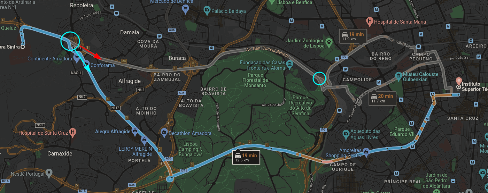

# Procura Local

```toc

```

Tal como referido na secção dos CSPs, a procura local é uma abordagem de procura que
parte de uma configuração inicial completa, procurando encontrar uma configuração
completa e **consistente** - de um modo mais geral, e procurando abstrairmo-nos do contexto
dos CSPs, procuramos um [**estado objetivo**](color:orange), realizando transições sucessivas
entre "estados vizinhos". Tem, claro, [**ganhos**](color:green) quanto à sua
[**complexidade espacial**](color:green), em comparação com a procura sistemática habitual: em vez
de termos de guardar uma árvore de procura, vamos apenas guardando uma configuração
do problema que se vai alterando com o passar do tempo. Contudo, e como
_there's no such thing as a free lunch_, estes ganhos em memória traduzem-se na
[**incapacidade de saber o caminho**](color:red) que leva uma configuração "vazia"
do problema a uma solução - esta forma de procura é, portanto, **ideal para cenários
onde o caminho é irrelevante**, onde apenas queremos saber se existe uma solução possível
(e, se sim, qual). Correm também o risco de ficar facilmente presas em ciclos,
não sendo, portanto, [**completas**](color:red) nem [**ótimas**](color:red) com implementações
normais.

A ausência de otimalidade é relativamente simples de compreender: se um estado tiver um
dado valor objetivo $n$ e todos os seus vizinhos tiverem valores objetivo inferiores a $n$
(considerando, claro, que o objetivo é maximizar esse valor), o algoritmo fica sem saber para
onde ir, parando ali, mesmo que eventualmente exista outro estado com valor objetivo maior.
O gráfico abaixo ilustra de forma clara este problema: através da procura local, conseguimos
encontrar de forma rápida [**máximos locais**](color:orange), mas não é garantido que
encontremos o [**máximo global**](color:red), a configuração ótima pretendida:


Note-se como, olhando para o estado atual, e considerando que a cada momento temos apenas
dois vizinhos (o estado "à esquerda" e o "à direita"), vamos acabar sempre por ir para a direita,
efetivamente afastando-nos do estado ótimo. Assim que chegamos ao máximo local, os respetivos estados
à esquerda e à direita têm ambos valores objetivo menores, pelo que a procura suspende aí,
num **máximo local** que não é o **máximo global**.

Em relação a cenários práticos onde a procura local possa ser utilizada como aliada da
procura global, pensemos, por exemplo, num cenário de GPS, onde uma procura global
conseguiu encontrar o caminho mais curto entre duas localidades. O motorista começou a sua viagem,
e a meio ocorre um acidente que corta uma das estradas que o caminho mais curto utilizava - aqui,
a procura local pode ser particularmente útil, já que, partindo de um estado inicial completo,
bastará, em princípio, alterar pouco a rota em vez de ter de realizar uma nova procura global.



Na imagem acima, podemos ver dois pontos onde a rota se podia alterar facilmente - se houvesse
um acidente ao pé do Alegro Alfragide, o GPS deveria recalcular a melhor rota. Em vez de
fazer uma procura global de novo para o fazer, pode escolher estados "vizinhos", tal como a rota
demarcada com a seta vermelha!

## Procura Hill Climbing/Local Gananciosa

Funciona tal e qual foi referido mais acima: uma procura que escolhe sempre o estado
com [**maior valor objetivo**](color:green) de entre os seus vizinhos, terminando quando
nenhum deles tem valor melhor que o dele próprio. O nome vem precisamente da forma
como se comporta: esta abordagem procura sempre "trepar a colina mais inclinada que consegue ver",
considerando, claro, que só consegue ver o que está imediatamente à sua frente.

```bash
function hill_climbing(problem)
  current_state = problem.initial_state
  while true do
    # se houver mais que um vizinho com valor objetivo máximo,
    # a escolha é feita de forma aleatória
    neighbor = current_state.get_highest_valued_neighbor()
    if neighbor.value <= current_state.value then
      return current_state
    current_state = neighbor
  done
```

Note-se, mais uma vez, como a procura _hill climbing_ sofre o problema de poder parar em máximos
locais, ignorando outros máximos que existam (possivelmente com valor maior do que aquele onde está):


[\*](color:yellow) Voltando a pegar na questão da completude, o nosso estado final
[**pode até não corresponder a uma solução admissível**](color:red), caso apenas o máximo global corresponda a uma solução admissível: no exemplo das $8$
rainhas ilustrado abaixo, chegamos a uma situação onde qualquer movimento que façamos
leva a que mais rainhas se ataquem (no momento imediatamente seguinte), pelo que a
procura termina, e terminámos sem uma solução consistente!


Uma estratégia para contornar o problema dos máximos locais nesta procura
consiste em alterar ligeiramente o pseudo-código do mesmo: passar de
`if neighbor.value <= current_state.value then` para `if neighbor.value < current_state.value then`,
podendo, assim, "atravessar planaltos". Surgem, contudo, outros problemas: podemos
facilmente entrar em ciclos (combatidos colocando um limite no número de _sideways moves_,
por exemplo), e, claro, continua sem haver garantia de encontrar a solução pretendida.

### Variações - Hill Climbing

Sendo _hill climbing_ uma das abordagens clássicas para procura local, surgiram, inevitavelmente,
várias maneiras de a tentar melhorar.

:::info[Stochastic Hill Climbing]

Em vez de escolher sempre o estado com maior valor objetivo
de entre os vizinhos com valor objetivo maior que o seu, vamos, aqui, escolher um estado
de [**forma aleatória**](color:yellow) de entre esse mesmo grupo de vizinhos - deixa de ser uma escolha
_gananciosa_, já que não vamos sempre escolher o estado com maior valor objetivo, passando
a ser estocástica (ligada à sorte, portanto).

:::

:::tip[First-Choice Hill Climbing]

Em vez de gerar todos os sucessores de uma vez e escolher o vizinho entre o conjunto
de todos os vizinhos com valor objetivo maior que o próprio, vamos, aqui, gerar os
sucessores de forma aleatória, um de cada vez, e escolher [**o primeiro**](color:green)
com valor objetivo maior que o que já temos. Poupa, claro, tempo de processamento
(visto que, por norma, há uma grande quantidade de sucessores que nunca é gerada),
sendo, portanto, ideal para espaços de estados onde cada um tem uma quantidade relativamente
grande de vizinhos.

:::

Note-se que nenhuma das abordagens referidas até agora resolve o problema do algoritmo
poder parar em máximos locais.

Ora, uma maneira interessante de contornar este problema seria, por exemplo, a
[**aleatoriedade**](color:orange): visto que vamos sempre iniciar a procura com uma
configuração inicial aleatória, se o fizermos vezes suficientes é bastante provável
que cheguemos à solução pretendida. Houve estudos realizados para o problema das $8$ rainhas,
precisamente para tentar perceber se esta abordagem valeria ou não a pena. Descobriu-se que,
em média, partindo de uma configuração inicial arbitrária:

- se _hill climbing_ for encontrar uma solução, fá-lo-á em cerca de $4$ passos;
- se for ficar preso num ciclo, tal acontecerá em cerca de $3$ passos.

Podemos, assim, "parar a procura" (tanto artificialmente como ao chegar a uma
solução) bastante rápido, pelo que vale a pena repetir a procura várias vezes, com
configurações iniciais distintas, por forma a tentar obter a solução pretendida.

Tem-se que esta variante, a [**random-restart hill climbing**](color:orange), é completa
para uma probabilidade próxima de $1$ - quanto mais vezes for repetida, maior a probabilidade
de encontrar a solução. Considerando $p$ como a probabilidade de sucesso de cada procura,
vamos (em princípio) precisar de cerca de [$\frac{1}{p}$ tentativas](/pe/va-discretas#distribuição-geométrica) para encontrar a solução.
Considerando, por exemplo, o problema das $8$ rainhas que converge para solução (ou fracasso)
bastante rápido, esta abordagem parece excelente: apesar de não garantir, em teoria,
completude, na prática é raríssimo que, com um número suficiente de tentativas, não encontremos
a solução.

## Simulated Annealing

Na área da metalurgia, _annealing_ corresponde ao processo de endurecer um metal, colocando-o
primeiro a temperaturas muito altas, procurando de seguida arrefecê-lo gradualmente.
O método descrito abaixo, _simulated annealing_, acaba por corresponder a uma implementação de uma metáfora semelhante
no contexto da procura local (bem, igual, só que diferente). Pensemos num cenário em que
queremos que uma bola chegue ao fundo de um "vale" com aspeto parabólico, vale esse
com paredes particularmente pegajosas (às quais a bola pode facilmente prender-se):


Se abanarmos vezes suficientes o vale, mesmo que a bola vá ficando presa em "mínimos locais"
(leia-se, fique pegada às paredes do vale) sucessivos, eventualmente vamos conseguir fazer com que
chegue lá abaixo. A procura por _simulated annealing_ baseia-se nisso mesmo: em tentar
fazer com que os estados saiam de máximos/mínimos locais, [**"abanando-os"**](color:yellow).
"Abanar" os estados consiste, aqui, em escolher (por vezes) estados com valor objetivo
pior do que o que temos atualmente, por forma a procurar sair de máximos/mínimos locais
em direção ao global. Esta escolha é feita da seguinte maneira:

- se gerarmos um vizinho com valor objetivo maior que o que temos atualmente, escolhemo-lo,
  _no questions asked_;
- caso geremos um vizinho com valor objetivo menor que o que temos atualmente, existe a
  **possibilidade** de o escolhermos na mesma: temos, contudo, de ter cuidado para não nos
  afastarmos demasiado dos extremos locais que já encontrámos, ficando ainda mais longe de
  encontrar extremos globais, pelo que a probabilidade (sempre menor que $1$) de escolher
  estes vizinhos diminui à medida que o movimento se aproxima cada vez mais dos extremos globais -
  isto é, se nos estivermos a aproximar "do que queremos", não faz tanto sentido ir noutra direção
  como fazia inicialmente, quando estávamos longe e qualquer abanão podia surtir efeitos positivos.

## Local Beam Search

<!-- TODO: adicionar exemplo -->

A procura local surge, de uma forma geral, como alternativa à procura global, principalmente
no que à memória diz respeito. Ora, mas passar de memória exponencial para constante ainda
é um salto relativamente grande: não haverá um meio termo que nos beneficie mais?
Bem, é a partir deste pensamento que surge a [**procura local em banda**](color:orange), um **compromisso
intermédio** entre as duas abordagens.

Optamos, aqui, por gerar $k$ estados iniciais, todos eles aleatórios. Se algum deles for
estado-objetivo, paramos. Caso contrário, vamos ver todos os vizinhos dos $k$ estados,
e escolhemos os $k$[\*](color:yellow) melhores estados, entre todos os vizinhos que gerámos. Este
processo é realizado iterativamente até que encontremos um estado-objetivo.

[\*](color:yellow) Note-se que caso um dos estados, seja ele $K$, gere $\frac{k}{2}$ vizinhos
fantásticos e todos os outros, para todos os outros estados, sejam medíocres, não vamos
apenas escolher $1$ vizinho por estado: vamos escolher os $\frac{k}{2}$ vizinhos de $K$,
e depois outros $\frac{k}{2}$ vizinhos entre o resto dos medíocres.

:::info[Procura Local em Banda Estocástica]

Podemos, eventualmente, chegar a situações em que os $k$ estados que temos em mãos
são pouco diversos - tal pode acontecer, por exemplo, num espaço de estados relativamente
pequeno (e/ou denso), em que facilmente conseguimos ficar "presos" a um conjunto parco de bons estados.
Para nos ajudar a combater este problema, existe a variante [**estocástica**](color:orange)
da procura local em banda, onde em vez de escolhermos sempre os $k$ melhores vizinhos
dos estados atuais, escolhemos $k$ vizinhos de forma estocástica - vamos aqui, considerar
que quanto "melhor" for o vizinho, maior a probabilidade de ser escolhido, contudo
sem qualquer garantia de tal acontecer. A médio-longo prazo, esta abordagem permite
uma maior diversidade no conjunto de estados que vamos explorando!

:::

## Algoritmos Genéticos

Correspondem a algoritmos baseados na procura em banda estocástica, referida acima,
e na ideia da "seleção natural" associada à [genética](color:green). Começamos com uma população
inicial, com $k$ estados (ou **indivíduos**). Estes indivíduos vão eventualmente reproduzir-se,
por forma a dar continuidade à espécie (leia-se, vamos gerar os estados vizinhos), e
eventualmente vamos gerando indivíduos "melhores", tal como dita a teoria da evolução - as
mutações positivas mantêm-se, da mesma maneira que vamos sempre procurar estados que estejam a
"ir na direção certa". Esta noção de estados melhores e piores pode ser quantificada
segundo uma função, a [_fitness function_](color:orange), onde os melhores estados recebem os valores mais altos: _the fittest individuals stay alive_.
Vamos cruzando estados pais, mantendo propriedades iguais entre os mesmos,
procurando ainda verificar se certas alterações levam ou não a resultados melhores,
em busca do "indivíduo perfeito": a solução pretendida, o estado que corresponde a uma
solução.

Este tipo de algoritmos pode, ainda, variar considerando várias componentes:

- O tamanho da população pode, claro, ser infinitamente variável;
- A representação de um estado é também arbitrária: tanto podemos ter _strings_ sobre alfabetos $\{0, 1\}$,
  como qualquer alfabeto numérico, entre outros;
- A quantidade de "pais" - acima foram referidos dois pais, mas podemos ter um (sendo essa
  abordagem a procura em banda estocástica clássica) ou mesmo mais que dois pais;
- O próprio processo de seleção, que não tem necessariamente de ter uma relação direta
  com a _fitness function_ (podendo ser mais aleatório), entre outras.

Tomemos novamente o exemplo das $8$ rainhas, contando com $4$ configurações iniciais.
Aqui, cada estado corresponde a uma _string_ com comprimento $8$, onde cada dígito
corresponde à linha onde a rainha da coluna em questão está colocada. O valor da
_fitness function_ associado a cada estado corresponde ao [**número de pares de rainhas
que não se atacam**](color:orange), onde, claro, valores maiores correspondem a
estados melhores, visto que, no fim, queremos que nenhum par se ataque.


Podemos ver que foram escolhidos, de forma aleatória, dois pares de estados para cruzamento.
Escolhemos ainda que partes da _string_ se vão cruzar, escolha
esta igualmente aleatória. Cruzamos, então, os estados, gerando quatro novos estados.
Por fim, podemos (ou não) aplicar [**mutações**](color:orange) aos estados gerados, adicionando-lhes,
assim, mais uma camada de aleatoriedade.

O livro que acompanha a cadeira inclui esta passagem, bastante interessante no que toca a este tema:

> The theory of genetic algorithms explains how this works using the idea of a **schema**, which
> is a substring in which some of the positions can be left unspecified. For example, the
> schema 246**\*** describes all 8-queens states in which the first three queens are in
> positions 2, 4, and 6, respectively. Strings that match the schema (such as 24613578) are
> called instances of the schema. It can be shown that if the average fitness of the instances of
> a schema is above the mean, then the number of instances of the schema will grow over
> time.
> Clearly, this effect is unlikely to be significant if adjacent bits are totally unrelated to each
> other, because then there will be few contiguous blocks that provide a consistent benefit.
> Genetic algorithms work best when schemas correspond to meaningful components of a
> solution. For example, if the string is a representation of an antenna, then the schemas may
> represent components of the antenna, such as reflectors and deflectors. A good component
> is likely to be good in a variety of different designs. This suggests that successful use of
> genetic algorithms requires careful engineering of the representation.

Como recurso adicional, a seguinte _playlist_ cobre esta secção da matéria:

::youtube{#9zfeTw-uFCw}

## Procura Local em Espaços Contínuos

:::warning[Página em construção]

O conteúdo será adicionado assim que possível.

:::

## Procura com Ações Não Determinísticas

Em cenários reais, as nossas ações podem ter mais do que um resultado possível: se um indivíduo
particularmente descoordenado tentar rematar uma bola de futebol, por exemplo, a bola
pode não ir exatamente para onde ele quer (apesar de haver a possibilidade de tal
acontecer). Esta é, claro, a ideia-base por detrás do não determinismo, questão sobre
a qual nos vamos debruçar de seguida.

Podemos tentar ilustrar esta ideia através do exemplo do aspirador que utilizámos na
[secção dos agentes](/ia/agentes): considerando um estado inicial, em que o aspirador
está na posição $A$ e essa mesma posição está suja, a ação "aspirar" pode nem sempre
resultar na mesma transição:

- O aspirador pode avariar-se de repente, e não aspiramos nada;
- Podemos aspirar, sem querer, a posição $B$ (para além de $A$).

Vamos, portanto, ter de [**adaptar a nossa noção de modelo de transição**](color:orange),
passando esta a retornar um **conjunto de estados** que podem
resultar de aplicar uma ação $a$ a um estado $s$. Tratam-se, portanto, de [**cenários
não determinísticos**](color:red).

:::tip[Como realizar procuras em cenários não determinísticos]

Surge então uma questão pertinente - em cenários onde não é possível prever com exatidão
o resultado de uma dada ação, como é que é suposto fazermos procuras corretas?
Bem, sabemos sempre que, partindo de qualquer estado, podemos construir o conjunto das
ações realizáveis a partir dele. Mais ainda, sabemos que, se a ação $a$ é realizável,
então terá um conjunto de estados resultantes de realizar a ação $a$ partindo de um estado $s$.
Começa aqui a formar-se uma ideia quase cíclica: partimos de estados, temos um conjunto
de ações que podemos tomar, e realizando essas ações podemos ir parar a um conjunto
de outros estados, ideia esta que não parece nova (e de facto não é - temos, contudo, de precaver _outcomes_ diferentes para uma mesma ação). Esta ideia traduz-se, na prática, numa [**árvore AND-OR**](color:orange):
uma árvore com dois tipos de nós, onde:

- os nós OR correspondem a ações: a ação "aspirar", por exemplo, corresponde a um nó OR válido;
- os nós AND correspondem a estados.

A lógica por detrás destas árvores é, então, simples de entender: partindo de nós AND,
vemos que ações podemos executar a partir deles, e geramos os nós correspondentes (que vão
ser seus filhos) - os nós OR. Posteriormente, verificamos os estados resultantes de aplicar
a ação em OR ao pai AND, e daí resultam os filhos de OR: os tais estados resultantes,
um conjunto de nós AND. A árvore correspondente ao cenário do aspirador podia,
então, ser representada da seguinte forma:


Neste tipo de árvores, [**todas as folhas são objetivos**](color:green). Mais ainda,
caso encontremos um estado repetido seguindo um dado caminho, podemos dizer que
[**entrámos em ciclo**](color:red), retornando _failure_.

Existem, contudo, cenários onde temos de utilizar ciclos para atingir a solução pretendida:
caso apenas nos falte uma posição por limpar, por exemplo, e a nossa tentativa de aspirar
essa posição falhar, vamos inevitavelmente entrar em ciclo. A solução passa, nestas
circunstâncias, por tentar repetidamente aspirar, até finalmente conseguir! Depreende-se,
então, que ciclos causados "aleatoriamente" são aceitáveis, como o do exemplo ainda agora
referido, e que qualquer outro tipo deve ser rejeitado.

:::

## Procura em Ambientes Parcialmente Observáveis

Na vida real, nem sempre vamos conhecer por completo o nosso meio envolvente - tal
como referido no início da secção de resumos de IA, este tipo de ambiente diz-se [**parcialmente
observável**](color:orange). Vamos, portanto, debruçar-nos sobre estratégias que procurem
remover alguma da camada de incerteza que vai estar associada a este tipo de cenários, estratégias
essas que assentam na ideia da **ausência de sensores**: se o nosso agente não precisar
de saber exatamente qual é o ambiente que o envolve, consegue trabalhar melhor em cenários mais
complicados.

A nossa procura vai tratar, em vez de um conjunto de estados palpáveis/completamente observáveis,
de um [**conjunto de crenças**](color:orange) do agente. Tem um conjunto de componentes diferente
do que foi visto até agora:

- Um conjunto de estados, o **espaço de crenças**: contém todos os subconjuntos de estados
  físicos do problema original;
- Um **estado inicial** - por norma, encontra-se inicialmente [**cheio**](color:orange),
  já que, na pior das hipóteses, não temos qualquer informação sobre o que nos rodeia
  (tendo, portanto, de considerar qualquer cenário como possível). Na prática, costumamos
  ter algumas pistas quanto ao estado inicial;
- Um **conjunto de ações**, que corresponde ao conjunto de todas as ações
  que podemos fazer partindo de qualquer um dos estados do espaço de crenças;
- Um **modelo de transição**, que difere entre as versões determinista e não-determinista. Num
  problema $P$, para uma dada crença $b$, a versão determinista dita que a crença $b'$,
  resultante de aplicar uma qualquer ação $a$ será dada por:

  $$
  b' = \op{result(b, a)} = \{s': s' = s \in b \cap s' \in \op{result_P(s, a)}\}
  $$

  Por outro lado, a versão não-determinista dita que:

  $$
  \begin{aligned}
  b' = \op{result(b, a)} &= \{s': s' = s \in b \cap s' \in \op{ results_P(s, a)} \cup b\} \\
  &= \bigcup_{s \in b} \op{results_P(s, a)}
  \end{aligned}
  $$

  O modelo de transição tem três etapas: inicialmente, a fase da [**previsão**](color:orange),
  onde vai calcular as crenças resultantes da ação que vai tomar. De seguida, caso esteja num
  ambiente parcialmente observável, utiliza os seus sensores e a informação obtida
  para atualizar o seu espaço de crenças.

- O **teste objetivo**, que aqui tem um senão: só é [**garantido**](color:green) que estamos
  no objetivo se todo o nosso espaço de crenças assim o afirmar - isto é, se todos os estados
  do nosso espaço de crenças satisfizerem o objetivo; caso contrário, **possivelmente**
  alcançámos o objetivo, sem qualquer garantia.


Abaixo, ilustra-se ainda o exemplo do modelo de transição num cenário em que o nosso agente
tem sensores: aqui, vai conseguir olhar para o meio que o envolve e remover algumas crenças
que afinal não têm cabimento.


Podemos, claro, aplicar a procura AND-OR a este tipo de cenários:


## Procura Online - Ambientes Desconhecidos

Quando não conhecemos o ambiente que nos envolve, e existem penalizações (sejam elas
artificiais ou naturais) por tempos de computação demasiado longos, pode fazer sentido
[**intervalar a procura com ações**](color:green), em vez de seguir sempre a mesma linha de procura
até agora abordada: observamos o ambiente atual e o que sabemos sobre ele,
calculamos a próxima ação a tomar por forma a atingir mais rapidamente o objetivo, e executamos
essa mesma ação. Pensemos num caso mais extremo: queremos fugir de um labirinto, e temos
uma quantidade limitada de tempo para o fazer. Nem sempre vamos ter tempo para parar
e pensar, até porque muitas vezes não temos informação útil com que raciocinar: devemos,
nessas circunstâncias, procurar navegar o desconhecido, por forma a recolher informação.
Estamos, claro, bastante vulneráveis a encontrar becos sem saída, já que esta navegação
consegue assemelhar-se, de vez em quando, a uma procura às cegas.

Note-se que esta abordagem tem particular utilidade no âmbito da exploração - é bastante
provável que um agente, procurando às cegas, chegue ao fim tendo procurado a vasta maioria
do ambiente que o envolve. Quanto à _velocidade_ a que chega ao objetivo, contudo, é obviamente pior:
uma procura pensada, em que conhecemos o ambiente e podemos prever o resultado das nossas
ações tem todo um outro nível de "curadoria" que nos permite chegar mais eficientemente ao
objetivo.

Abordámos, sem saber, um tipo de procura (local) cega mais acima: _hill climbing_, se pensarmos
bem, mantém apenas informação sobre os seus vizinhos diretos, e não tem noção do meio
que o envolve sem ser o que imediatamente o rodeia. Podemos, contudo, adicionar [**memória**](color:orange)
a _hill climbing_, por forma a tornar esta procura mais inteligente:
guardamos uma estimativa de quanto custa chegar ao objetivo, partindo de cada estado que já foi visitado.
Note-se, claro, que inicialmente cada nó tem uma heurística arbitrária:


O agente, aqui, utiliza o que sabe sobre a sua envolvência e, enquanto explora, vai guardando
a nova informação sobre o ambiente que o rodeia. Assim que se apercebe que pode seguir
um caminho melhor que o anterior, escolhe-o. A esta procura, _hill climbing_ com memória,
dá-se também o nome de [**_Learning Real-Time $A^*$_**](color:orange), $LRTA^*$. Dizemos que
$LRTA^*$ opera segundo o princípio de [**otimismo sob incerteza**](color:green): ao contrário
da versão clássica de _hill climbing_, aqui o agente é encorajado a explorar o ambiente que o rodeia.

---

Adicionamos que esta secção corresponde ao quarto capítulo do livro que acompanha a cadeira
(_Search in Complex Environments_).
