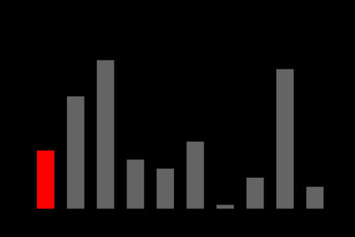
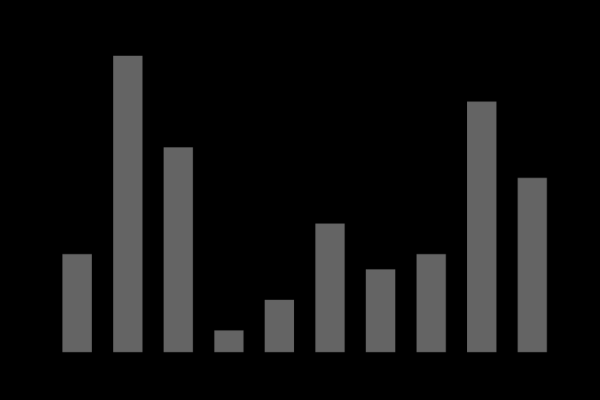

# Algoritmos Elementares de Ordenação

```toc

```

## Características de Algoritmos

### Porquê estudá-los?

- Razões de ordem prática
  - Fáceis de codificar e por vezes suficientes
  - Rápidos/eficientes para problemas de dimensão média e por
    vezes os melhores em certas situações
- Razões pedagógicas
  - Bom exemplo para aprender terminologia e contexto dos
    problemas a codificar e por vezes suficiente
  - Alguns são fáceis de generalizar para algoritmos mais eficientes
    ou para melhorar o desempenho de outros algoritmos

### Algoritmo Estável

- Um algoritmo de ordenação é dito estável se preserva a
  ordem relativa dos items com chaves repetidas
  - ex: ordenar lista de alunos, já previamente ordenada por nome,
    por ano de graduação
- Algoritmos elementares são normalmente estáveis, mas
  poucos algoritmos avançados o são

### Algoritmo Interno

- Um algoritmo de ordenação é dito interno se o conjunto
  de todos os dados a ordenar couber em memória RAM;
  caso contrário é dito externo
- Distinção muito importante:
  - ordenação interna pode aceder a qualquer dado com um custo
    muito pequeno
  - ordenação externa tem de aceder aos dados de forma
    sequencial (ou em blocos)
- Vamos estudar apenas algoritmos de ordenação interna

### Abstrações Úteis?

- Items ordenados por uma “chave”
- Características específicas de cada item ou chave
- No entanto cada algoritmo tem comportamento igual :\
  Logo, vamos usar abstrações!!

  `embed:assets/0009-abs.c`

## Implementação

- Função sort() implementa o algoritmo de ordenação
- Devolve tabela de int ordenada, entre as posições `l` e `r`

  `void sort(int a[], int left, int right);`

  `embed:assets/0009-rand.c`

## Selection Sort



Começa por procurar o menor valor do vetor e troca-o com o valor a[0]. \
Continua a procurar o próximo menor valor e troca-o com os sucessivos itens do vetor a.\
Termina quando já só existe um valor.

A troca consiste em trocar a posição do elemento menor com a primeira posição do vetor que não se encontra ordenado.

`embed:assets/0009-sel_sort.c`

Tempo de Execução:

- Complexidade: $N^2/2$
- Trocas: $N$
- Pior Caso: $O(N^2)$
- Melhor Caso: $\Omega(N^2)$
- Não é Estável

Mas é possível ser estável.

## Insertion Sort


É equivalente ao receber uma nova carta e colocá-la na posição correta do baralho.

Percorre o vetor e guarda o elemento na posição em que à sua esquerda esteja um menor e à sua direita esteja um maior.

`embed:assets/0009-ins_sort.c`

Tempo de Execução:

- Trocas: $N^2$
- Pior Caso: $O(N^2)$
- Melhor Caso: $\Omega(N)$
- É Estável

## Bubble Sort (Borbulhamento)



Pega no primeiro elemento, e vai andando no vetor até encontrar um maior, se encontrar um maior movimenta o maior até encontrar um outro ainda maior ou até chegar ao final do vetor.

`embed:assets/0009-bubble_sort.c`

Tempo de Execução:

- Trocas: $N^2/2$
- Pior Caso: $O(N^2)$
- Melhor Caso: $\Omega(N)$
- É Estável

## Comparação

- Tabelas com poucos elementos fora de ordem
  - Insertion e Bubble Sort são quase lineares
  - os melhores algoritmos de ordenação podem ser quadráticos
- Contexto onde elementos são grandes e chaves
  pequenas
  - Selection Sort é linear no número de dados
  - dados com tamanho palavras
  - custo comparação: 1; custo troca:
  - comparações e custo de trocas
  - termo domina: custo proporcional ao tempo necessário para mover os dados
- Alternativa: uso de ponteiros

- Bubble/Insertion Sort são lentos: trocas ocorrem apenas
  entre items adjacentes
  - se o menor item está no final da tabela, serão precisos
    passos para o colocar na posição correcta
- Shellsort:
  - acelerar o algoritmo permitindo trocas entre elementos que
    estão afastados
  - bubble/insertion sort, mas com elementos distanciados de h

## Shell Sort


Divide o vetor em sub-vetores que depois são ordenados com um outro algoritmo de ordenação.

Depende do h, h é o número de sub-vetores que existem, quantos maior for o h, menor é o tamanho dos sub-vetores.
São vários insertion sorts.

A sequência óptima ainda não foi descoberta `Cabe ao aluno descobrir \s`

`embed:assets/0009-shell.c`

Tempo de Execução:

- Complexidade: Depende dos valores de h
- Não É Estável

Nesta aula e na aula anterior encontram - se alguns exercicios que podem ajudar para perceber melhor este algoritmos.

- [Demonstração visual dos algoritmos](https://gonque.github.io/sorting-algos/)

Slides:

- [Aula 9](https://drive.google.com/file/d/1aPyWzECPVzi0p_BKgIsZJhZkni0EdCDv/view?usp=sharing)
