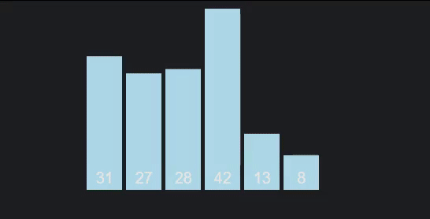
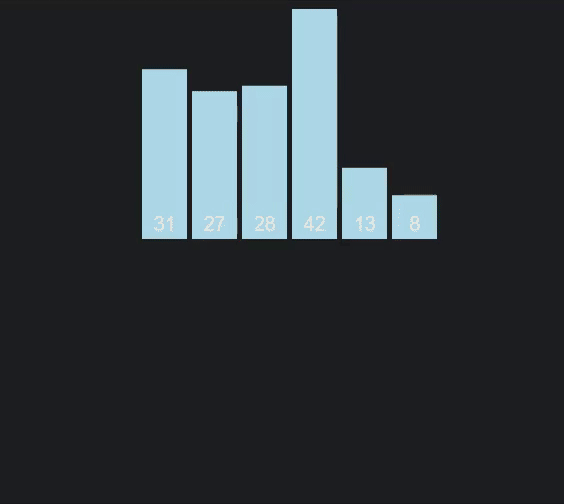

# Algoritmos Eficientes de Ordenação

```toc

```

Entramos agora numa secção com alguns algoritmos de ordenação mais avançados, algoritmos estes que estarão, de uma maneira ou de outra, presentes na nossa carreira profissional.

## Quick Sort

A par do _merge sort_, o mais "comum" de entre os algoritmos desta secção. Bastante popular devido ao quão fácil é implementá-lo, a par de um caso médio de complexidade relativamente bom. A `stdlib` em C oferece uma [implementação nativa, `qsort()`](https://linux.die.net/man/3/qsort), mas [**atenção**](color:red): a docência de IAED costuma proibir o seu uso em contexto de projetos, pelo que se a quiserem usar devem consultar o enunciado dos mesmos e/ou contactar a docência.



É o primeiro algoritmo que vamos estudar que segue a metodologia [**"dividir para conquistar"**](color:orange), _divide and conquer_: a ideia chave passa por realizar partições sucessivas dos dados, e ordenar cada partição independente e recursivamente (das mais pequenas para as maiores). As partições em si são feitas ao escolher um **pivô**, um elemento à nossa escolha do vetor, e dividindo o vetor em duas partes: a parte da esquerda, com elementos com chave menor que a do pivô, e a da direita com elementos que possuem chave maior que ele. Estas partições são, claro, criadas recursivamente. Quando chegamos ao fim da recursão, fazemos _backtracking_, ordenando as partições. **Por norma**, o algoritmo de ordenação auxiliar utilizado para ordenar as partições é o _insertion sort_.

```c
void quick_sort(Item a[], int left, int right) {
    int i;
    if (right <= left) {
        return;
    }
    i = partition(a, left, right);
    quick_sort(a, left, i - 1);
    quick_sort(a, i + 1, right);
}

int partition(Item a[], int left, int right) {
    int i = left - 1, j = right;
    Item v = a[right];
    while (i < j) {
        while (less(a[++i], v))
            ;
        while (less(v, a[--j])) {
            if (j == left) {
                break;
            }
        }
        if (i < j) {
            exch(a[i], a[j]);
        }
    }
    exch(a[i], a[right]);
    return i;
}
```

Pode ser difícil entender o funcionamento do algoritmo só por palavras, pelo que o vídeo abaixo pode ajuda a clarificar algumas dúvidas:

::youtube{#XE4VP_8Y0BU}

O algoritmo realiza $2n\log{n}$ trocas, possuindo complexidade temporal no pior caso quadrática. A complexidade espacial do algoritmo é também quadrática, pelo que para vetores muito grandes pode não ser ideal utilizar o _quick sort_. **Não é um algoritmo estável**.

## Merge Sort

O outro algoritmo desta secção baseado na metodologia _divide and conquer_.



O objetivo aqui passa por _partir_ sucessivamente em metade o vetor de elementos a ordenar, até obtermos vetores com apenas um elemento. Ao chegar a vetores com um só elemento, fazemos _merges_ sucessivos entre dois vetores "vizinhos", de modo a gerar um vetor ordenado a partir de dois outros vetores ordenados - podemos fazê-lo, já que o _caso base_ da recursão, vetores com um só elemento, estão ordenados por natureza. O _gif_ acima pode ser bastante útil a entender o procedimento do algoritmo.

```c
void merge_sort(Item a[], int left, int right) {
    int m = (right + left) / 2;
    if (right <= left) {
        return;
    }
    merge_sort(a, left, m);
    merge_sort(a, m + 1, right);
    merge(a, left, m, right);
}

Item aux[maxN];

void merge(Item a[], int left, int m, int right) {
    int i, j, k;
    for (i = m + 1; i > left; i--) {
        aux[i - 1] = a[i - 1];
    }
    for (j = m; j < right; j++) {
        aux[right + m - j] = a[j + 1];
    }
    for (k = left; k <= right; k++) {
        if (less(aux[j], aux[i]) || i == m + 1) {
            a[k] = aux[j--];
        } else {
            a[k] = aux[i++];
        }
    }
}
```

Este é o primeiro algoritmo de ordenação de vetores que vimos até agora com [**pior caso sub-quadrático**](color:green): a sua complexidade temporal é $O(n\log{n})$ (e também $\Omega(n\log{n})$).

## Heap Sort (Enquadramento)

O _heap sort_ utiliza a noção de _heap_, ou **amontoado**. A raiz desta estrutura deve conter sempre o menor/maior elemento do vetor (consoante queiramos uma _min_ ou _max heap_). Considerando o caso em que o **maior** elemento do vetor é a raiz, podemos definir _heap_ tal que:

$$
\forall_{1 \leq i \leq n}, \qquad A[\op{pai}(i)] \geq A[i]
$$

Temos, portanto, que neste caso particular nenhum elemento pode ter chave maior que a do seu pai.


A explicação deste algoritmo por palavras não é muito fácil, pelo que preferimos recorrer ao _gif_ abaixo para ajudar à explicação:


Inicialmente, construímos a **max heap**, que segue o tal princípio de que cada elemento tem chave menor igual à do pai. De seguida, retiramos a raiz do amontoado e colocamo-lo no fim do vetor - esse elemento encontra-se **ordenado**. Vamos ao último elemento do vetor, dizemos que essa é a nova raiz, e fazemos _fix down_ da _heap_, de modo a que o maior elemento do amontoado volte a estar presente na raiz. Fazemos este processo sucessivamente até que o amontoado tenha apenas um elemento, estando então ordenado.

```c
void heap_sort(Item a[], int l, int r) {
    build_heap(a, l, r);
    while (r - l > 0) {
        exch(a[l], a[r]);
        fix_down(a, l, --r, l);
    }
}

void build_heap(Item a[], int l, int r) {
    int k, heapsize = r - l + 1;
    for (k = heapsize / 2 - 1; k >= l; k--) {
        fix_down(a, l, r, l + k);
    }
}

void fix_down(Item a[], int l, int r, int k) {
    int ileft, iright, largest = k;
    ileft = l + left(k - l);
    iright = l + right(k - l);
    if (ileft <= r && less(a[largest], a[ileft])) {
        largest = ileft;
    }
    if (iright <= r && less(a[largest], a[iright])) {
        largest = iright;
    }
    if (largest != k) {
        exch(a[k], a[largest]);
        fix_down(a, l, r, largest);
    }
}

int parent(int k) {
    return ((k + 1) / 2) - 1;
}

int left(int k) {
    return 2 * k + 1;
}

int right(int k) {
    return 2 * (k + 1);
}
```

A construção do amontoado é realizada em tempo sub-quadrático, $O(n \log{n})$ (pode ainda ser provado que é realizada em tempo linear). A _colocação das chaves_ segue a mesma complexidade no pior caso, tal como o **próprio algoritmo**: o _heap sort_ tem complexidade temporal $O(n\log{n})$. **Não é estável**.

---

Mais uma vez, e tal como no final da última página, recomendo consultar a [demonstração visual dos algoritmos](https://gonque.github.io/sorting-algos) referidos nesta página.
