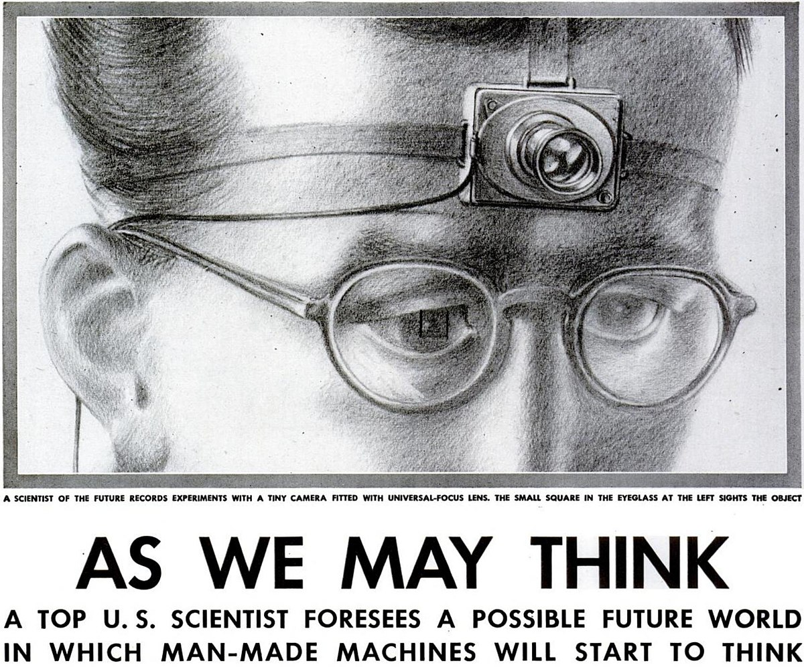

# História da IPM

```toc

```

## Os primórdios

As Interfaces Pessoa-Máquina surgiram após as Interfaces Homem-Máquina (IHM).

Nessa altura, uma boa interface significava apenas ser mais rápido, já que o computador era usado para ações monótonas e repetidas. Só mais tarde, o Homem percebeu que havia a **necessidade de boas interfaces**, algo que precedeu os computadores: devido à Revolução Industrial, passaram a existir mecanismos (tais como botões, interruptores, alavancas, entre outras) para controlar grandes máquinas, partindo daí a proliferação de ferramentas e dispositivos. Existia, na altura, alguma programação rudimentar e unidades de controlo.

### Jacquard Machine (1801-03)

- Tecelagem automática
- Cartões perfurados
  - codificavam os padrões de tecelagem
  - considerados uma forma de programação
- Revolução na UX
  - Apenas um operador
  - Muito mais eficiente e eficaz

### Tabulating Machines (1890s)

- Computador eletro-mecânico
- Desenvolvida pela IBM
- Contagem de pârametros/padrões
  - máquina mais rápida que os humanos
- Utilizada no Censos 1890 (USA) algo que levaria 13 anos manualmente.

## Computação pré-1950s

Até então, existiram os **Computadores Eletrónicos** (1940) e os **Computadores Mecânicos** (1948).

- Utilizadores acomodavam os computadores
- Recursos escassos com interfaces consideradas supérfluas
- Computação com processamento por lotes
  - extremamente lento: o feedback podia demorar horas ou dias
- Não havia noção de utilizadores: eram peritos.

O progresso nos Computadores Eletro-mecânicos levou-nos aos Computadores Digitais.

### Vannevar Bush (1890-1974)

A 2ª Guerra Mundial gerou muitos dados e surgiu a dúvida do que fazer com eles...
Durante a mesma, **Vannevar Bush** foi o diretor do Office of Scientific Research and Development (1941), depois NSF (1941-1947) e do Projeto Manhattan (1942-1946).
O seu ensaio _**"As we may think"**_, de 1945, influenciou gerações de engenheiros através das suas ideias "fora da caixa" (tais como uma super secretária com reconhecimento de fala, uma câmera miniatura com foco universal, ou até mesmo ver os nossos pensamentos) são lembradas até hoje.



Bush ficará na história devido aos seus ideais:

- Aumentar a capacidade cognitiva ao invés da física - aceder melhor à nossa memória
- Usar computação para expandir a mente humana.

### Grace Hopper (1906-1992)

- Almirante na Marina Americana
- Criou o primeiro compilador em 1950
- Trouxe a programação ao alto nível
- Permitiu alargar a base de utilizadores a cientistas e engenheiros

### J. C. R. Licklider

- Background em psicologia (como as pessoas interagem com computadores)
- "Man-Computer Symbiosis" (1960)
- Os computadores existem para aumentar a cognição

### Alguns mecânismos

- Joysticks (1908, 1920s)
  - usados em aviões em 1908
  - o primeiro Joystick elétrico _Mirick_ foi criado em 1926 por C.B.Mirick
    - é quase um rato
- Trackball (1942)
  - era do tamanho de uma bola de bowling
  - radar
  - o ecrã 2d não era tão importante uma vez que eram usadas interfaces geoespaciais
- Light Guns / Pens (1950s)
  - input de uma caneta começou em 1940
- Sketchpad (1963)
  - criado por Ivan Sotherland
  - no trackpad, a caneta torna as linhas perpendiculares
  - era possível aumentar o tamanho
  - recebe input e faz correções
- Ecrãs Táteis (1965)
- Rato (1964-67)
- Keyset (1954)
  - teclado de acordes desenhado para não tirar a mão do rato

Alguns mais estranhos...

- Knee Operating Pointing Devices (1960s)
- Glove Keyboard (1960)

### Dispositivo de Introdução Absoluto e Relativo

Os **absolutos** têm como exemplo o ecrã tátil - Mapeamento 1:1 entre o espaço de entrada e saída.

Os **relativos** têm como exemplos o rato, trackpad e joystick - O dispositivo de entrada controla a posição relativa da saída.

### The Mother of all Demos (1968)

- Teve como ideia poder apontar para interagir
- Foi uma demo ao vivo
- Componentes básicas de um computador moderno:
  - Janelas
  - Rato
  - Linha de comandos
  - Hypertexto
  - Processador de texto
  - Video chamada
  - Edição colaborativa

## O Computador Pessoal - Evolução

- Ecrã Tátil Comercial (1972)

- Ecrã Sensível à Força (1976-78)
- Dynabook (1972) por Alan Kay

  - Trabalhou no Xerox Alto, Small Talk
  - Thin Light Stylus and Wireless
  - "If you can have what you wanted, what would you have?"

- Apple I (1976)

  - Não tinha ecrã
  - Tinha teclado

- Apple II (1977)

  - Tinha ecrã
  - Não tinha rato

- Commodore PET (1977)

  - Tinha teclado e shortcut no lado esquerdo

- PERQ-1 (1980)

  - Tinha rato
  - Criado pela Carnegie Mellon

- Xerox Star (1981)

  - Steve Jobs inspirou-se muito no Xerox Star

- Rato ótico (1981)

- VPL Dataglove (1982)

  - Luvas VR e AR

- Ecrã Tátil Multitoque (1984-85)

  - Permitia a interação até 3 dedos no ecrã

- Tablet com caneta sem fios (1984)

- Machintosh (1984)

  - Usa muitas ideias da Xerox

- GEM on Atari ST (1985)

- Amiga Workbench (1985)

- Windows 1.01 (1985)

- Tablets GRiDPad (1989)
  - Interface gráfica apelativa
  - Não havia adesão aos tablets até muito mais tarde

Diferentes Sistemas Operativos tinham metáforas diferentes, tal como o MacOs e o Windows.

- Rato com scroll surgiu muito tempo depois
- Windows 95 criou muitas metáforas
- Apple usa ideias de neXTSTEP 3.3, adquirido por eles

### Long Nose of Innovation de Bill Buxton

> "Any technology that is going to have significant impact in the next 10 years is at least 10 years old." - Bill Buxton

### Príncipio Básicos de Inovação

- Design para as pessoas
- Geração de ideias
- Prototipagem
- Avaliação
- Iteração
