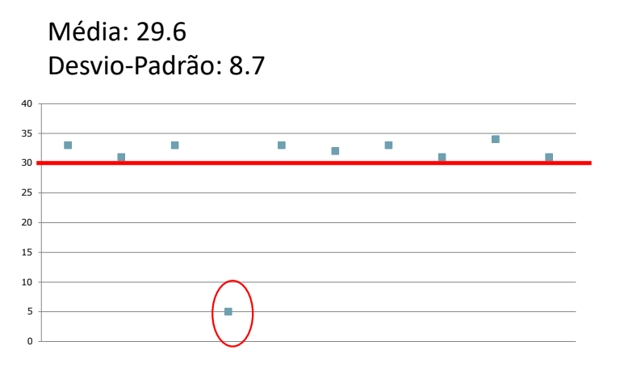

# Análise Quantitativa

```toc

```

## Análise Estatística


Quando estamos a trabalahr para uma empresa, esta não se importa com a amostra, contudo temos que saber se a amostra é representativa da população ou não. Temos que perceber qual é a probabilidade de a amostra ser característica da população.

Para tal temos que avaliar as variáveis.

### Variáveis

Antes de fazermos inferências sobre os dados é essencial examinar as variáveis. Mas porquê? Se recrutamos _e-athletes_ e pessoas sem grande experiência para testar um jogo de vídeo, é normal que os _e-athletes_ tenham mais sucesso do que as outras pessoas, caso contrário há algum _bug_ no nosso jogo.

Assim, avaliar as variáveis ajudam a:

- Identificar potenciais erros;
- Detetar padrões;
- Garantir que as conclusões estão corretas;
- Gerar e testar hipóteses;
- Evitar problemas mais tarde.

Podemos considerar variáveis dependentes ou independentes, como já tínhamos visto na aula passada. [Variáveis dependentes](color:pink) são por exemplo o [tempo, erros, SUS](color:orange); enquanto [variáveis independentes](color:pink) são por exemplo [cor, layout, idade, etc](color:orange).

### Escalas de Medida

Existem três tipos de **escalas de medida**:

1. **Nominal**

   - Cor;
   - Marca;
   - Nome

2. **Ordinal** (a relação entre os pontos não é comparável)

   - Leve, médio pesado;
   - Satisfeito, neutro, insastisfeito

3. **Contínua** (mais usado em IPM)

   - Idade;
   - Altura;
   - Peso;
   - Tempo;
   - Erros

### Mensagens importantes

- Utilizamos análise estatística é importante para generalizar resultados a partir de uma amostra.

:::tip[Segundo bake-off]
Para o vídeo do segundo bake-off **não é necessário** pôr a nossa análise estatística mas **é recomendado**, contudo não afeta minimamente a nota.
:::

- Utilizamos estatística descritiva pois é o primeiro passo para examinar dados

- Tipos de variáveis e dados representam as independentes/dependentes e nominais/ordinais/contínuas.

## Estatística Descritiva

Para estatística descritiva são importantes algumas fórmulas.

- Média:

  $$
  \bar{x} = \tfrac{\sum x_i}{n}
  $$

- Soma dos quadrados das diferenças

  $$
  SQ = \sum (x_i - \bar{x})^{2}
  $$

- Variância

  $$
  s^{2} = \tfrac{SQ}{n - 1}
  $$

- Desvio-padrão
  $$
  s = \sqrt{s^2}
  $$

### Desvio-padrão

O desvio-padrão é muito importante para conseguirmos identificar se há uma variação muito grande entre os resultados dos nossos participantes, conseguimos identificar se há algum _**outlier**_.

:::warning[Segundo bake-off]
Para o segundo bake-off, vai ser tomado em conta o _**outlier**_, ou seja a pessoa que está muito fora da média num sentido negativo. Contudo, o _**outlier**_ apenas representa uma pessoa que a meio do teste se distraiu e começou a fazer outras coisas, ou seja, só em casos muito excessivos. Se houver algum caso destes, o grupo **será descontado na nota final**.
:::


### Mediana vs. Média

A mediana é calculada após ordenarmos tdos os valores e encontrarmos o valor que está no meio, é muito útil ao compararmos a mediana e a média, pois, se houver uma diferença entre os dois, então há algo invulgar no nosso projeto.

### Quartis

Os quartis ajudam a segmentar a população. Por exemplo se contivermos uma amostra com os valores

$$
1, 1, 1, 2, 2, 2, 2, 3, 4, 4, 8, 9, 9, 12, 15
$$

sabemos que 25% corresponde ao primeiro 2, 50% corresponde ao 3 e 75% dos valores corresponde ao primeiro 9. Resumidamente dividimos os valores da nossa amostra em 4 e vemos a que valor corresponde.

### Moda

A moda corresponde ao valor mais comum, ou seja, o valor mais repetido dentro da nossa amostra. É mais útil quando estamos a tratar de valores nominais, por exemplo, em resposta à pergunta **"Qual o teu clube favorito?"**


### O quê? Quando?

- [Variáveis Nominais](color:pink): moda

  _"Quantos preferem A, B ou C?"_

- [Variáveis Ordinais](color:pink): mediana, moda, quartis

  _"Nível de satisfação, de 1 a 5."_

- [Variáveis Contínuas](color:pink): média, desvio-padrão, mediana, quartis

  _"Tempo médio para fazer a tarefa."_

## Inferência estatística

Ao completarmos uma iteração do nosso projeto temos que verificar se a nossa solução cumpre os objetivos, ou seha se os nossos critérios de usabilidade são atingidos.

:::info[Exemplo]

**Ao acabarmos uma projeto pretendemos verificar se a nossa solução possibilita o nosso participante a terminar uma tarefa em menos do que 30 segundos**

Ao fazemos testes com 10 utilizadores, reparamos que a média é **29,6**, o que tecnicamente está dentro do nosso objetivo, visto que 29,6 é menor que 30. Contudo, ao avaliarmos o desvio-padrão reparamos que toda a gente está entre os 30/35 segundos tirando uma pessoa que conseguiu completar a tarefa em 5 segundos!


:::

Se recorrermos ao mesmo teste mas em vez de 10 utilizadores tivermos 20 utilizadores, já será mais difícil ter uma média perto de 30 segundos se só houver um outlier. Porém se houver mais do que um, então já será mais complicado de ser obter uma média correta.

Isto prova, exatamente, que as amostras nem sempre são viáveis por causa dos outliers, haverá sempre pelo menos um. Assim, temos que comparar a nossa média com os dados que obtivemos.

Então quais são os testes mais viáveis que podemos utilizar?

**Há vários**:

- Teste t-student;
- Intervalos de Confiança;
- Qui-Quadrado;
- Coeficiente de correlação $$r$$ de Pearson

## Testes de Hipótese

Existe um certo procedimento ao qual devemos recorrer de modo a que os nosso testes corram da melhor forma possível.

O primeiro passo refere-se à [Escolha da amostra representativa](color:pink), isto é, temos que escolher um grupo de pessoas que possam representar o nosso público-alvo, como vimos na útima aula. Este grupo tem que ser relevante para o nosso produto.

O segundo passo refere-se à [Formulação da hipótese nula ($$H_0$$)](color:pink). A hipótese nula retrata um caso onde não haja diferenças nenhumas, nada muda, por exemplo a mudança de menus não afeta o desempenho. Após a hipótese nula temos que avaliar a **hipótese experimental, $$H_1$$**, ou seja, diz o que queremos verificar, por exemplo, os novos menus melhoram o desempenho.

### Procedimento- Grau de Confiança

$$\alpha = $$ Probabilidade de parecer que $$H_1$$ se verifica, mas afinal estarmos errados

Por outras palavras, representa a probabilidade de apanharmos o nosso utilizador fora do vulgar, o **outlier**.

Assim, podemos classificar o **Grau de Confiança** como:

$$
1- \alpha
$$

:::info[Exemplo]
Se tivermos $$\alpha = 0,05$$ então sabemos que temos um grau de confiança de 95%, que é bastante aceitável.

Por outro lado se tivermos um $$\alpha = 0,01$$, sabemos que temos um grau de confiança de 99%, ou seja, temos um grau de confiança ainda melhor.
:::

O terceiro passo refere-se à [Realização dos testes](color:pink), ou seja, à recolha de dados. Ao realizarmos os testes temos que ter em cuidado o nosso número de amostras, visto que maiores amostras conferem melhores resultados. É importante relembrar Nielsen quando este disse que o melhor número de participantes é 20, pois quanto mais pessoas houver, mais _outliers_ haverá.

O último passo refere-se à [Aplicação de tratamento estatśtico](color:pink). Ao fazer o nosso teste estatístico vamos aferir se podemos rejeitar $$H_0$$ e aceitar $$H_1$$. Mas, qual é o melhor teste para aplicarmos?

### Quatro testes diferentes

:::warning
Os testes que vão ser apresentados foram escolhidos aleatoriamente, não são os melhores testes e há muitos mais
:::

- Intervalos de confiança:
  Comparar uma **média** com **valor objetivo**; Variáveis contínuas

- Qui-quadrado:
  Comparar **frequência esperadas** e **observadas**; Variáveis normais

- Coeficientes de correlação $$r$$ de Pearson:
  Relação entre **variáveis dependentes**

- [T-student para médias](color:orange)

## T-student

:::details[William Sealy Gosset e T-student]
William Sealy Gosset era um trabalhador para a Guiness que trabalhava para averiguar qual o melhor campo de cultivo através de testes A/B (mas com cerveja). Em 1908, este queria publicar um artigo sobre o seu estudo mas não queria que o seu nome estivesse associado ao mesmo, então, publicou sobre o pseudónimo Student. Daí nasceu o **T-student** e o seu nome.
:::

O t-student pode ser usado com variáveis contínuas, como tempo, erros, altura, etc; ou para comparar duas médias, nomeadamente menus vs. atalhos, códigos-base vs. a nossa implementação entre outros.

:::tip[Segundo bake-off]
Para o vídeo do segundo bake-off **não é necessário** pôr o nosso resultado do T-student mas **é recomendado**, contudo não afeta minimamente a nota.
:::

### O t-student para médias

As médias são todas iguais. Isto significa que se rejeitarmos $$H_0$$ podemos dizer que são diferente com uma confiança de $$1 - \alpha$$.

Existe uma série de pressupostos para o t-test:

- Há uma distribuição normal?
- Temos pelo menos 20 _samples_?
- O que estamos a medir está bem distribuido?
- Há uma variância similar?
- ...

Atenção que existe uma excepção para _samples_ que estejam bem distribuidas, se quisermos algo funcional, não queremos que o resultado esteja bem espalhado, queremos que existe uma _flatline_ no 100.

O t-test é especialmente útil, pois conseguimos ver a olho todos os parâmetros.
