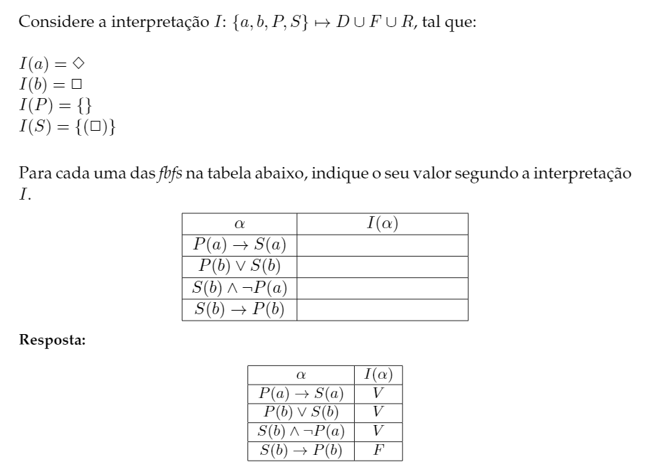

# Lógica de Primeira Ordem - Sistema Semântico/Correção e Completude

:::danger[AVISO]

Esta secção não tem resumos feitos, se alguém quiser contribuir podem fazer um PR!

:::

Abaixo está um e-mail do prof. Quintas com explicação geral de um dos exercícios desta matéria que pode sair em exame:

:::details[Explicação Ex. Exame]

O exercício em questão é:

> E a explicação dada pelo prof é:
>
> Uma conceptualização é algo necessário quando queremos avaliar
> proposições em LPO em relação ao mundo real (ou qualquer outro
> mundo imaginário, como o mundo de quadrados e losangos que
> aparece no exercício). Uma conceptualização não é nada mais
> do que uma tripla de conjuntos $(D, F, R)$, em que:
>
> - $D$ é o universo de discurso, ou seja o conjunto de todas as
>   entidades sobre as quais vais construir afirmações (neste
>   exercício vamos fazer afirmações sobre um losango e um quadrado);
>
> - $F$ é o conjunto de funções que podemos aplicar a estas entidades,
>   sendo uma função um mapeamento de uma ou mais entidades para uma
>   ou mais entidades (ou seja, uma função é algo que transforma entidades,
>   estilo se estiveres a falar de alunos de LP, uma função poderia ser
>   o que associa cada aluno à sua nota nas aulas práticas, neste
>   exercício não consideramos nenhuma função por isso é o conjunto vazio);
>
> - $R$ é o conjunto de relações que existem entre as entidades de $D$,
>   normalmente definidas por conjuntos de grupos para os quais estas
>   relações se verificam (no caso do exercício tens duas relações,
>   uma que será sempre falsa, correspondente por isso ao conjunto vazio,
>   e outra relação que será verdadeiro para o quadrado e por omissão
>   será falsa para o losango).
>
> A partir desta conceptualização, constrói-se uma interpretação para
> os elementos da LPO que estamos a usar aqui, em que o símbolo $a$
> representa o nosso losango, o símbolo $b$ representa o nosso quadrado,
> $P$ representa a relação que é sempre falsa e o símbolo $S$ representa
> a relação que é verdadeira para o quadrado e falsa para o losango
> (por omissão, mais uma vez).
>
> Agora, o teu trabalho é, a partir desta informação e do teu conhecimento
> sobre as tabelas de verdade dos vários operadores da LPO determinar as
> interpretações das frases que são apresentadas. Usando a primeira como
> exemplo, sabemos que a relação $P$ é sempre falsa, logo $P(a)$ será falso.
> Sabemos também que a relação representada por $S$ é verdadeira apenas para
> um quadrado. Como neste caso a representa o nosso losango, $S(a)$ será falso.
> Pela tabela de verdade da implificação (que por esta fase espero que saibas
> mais que de cor que só é falsa quando o antecedente é verdadeiro e o consequente
> falso) podes então concluir que a interpretação desta fbf é verdadeira
> (bastava até notar que o antecedente é falso para tirar esta conclusão).
>
> As restantes entradas na tabela terão um raciocínio semelhante, simplesmente
> usando outras relações e operadores.

:::

[Slides](https://drive.google.com/file/d/1u6jYJBKLZ4lIjBxyLQP1g0nSSThib2eu/view?usp=sharing)
