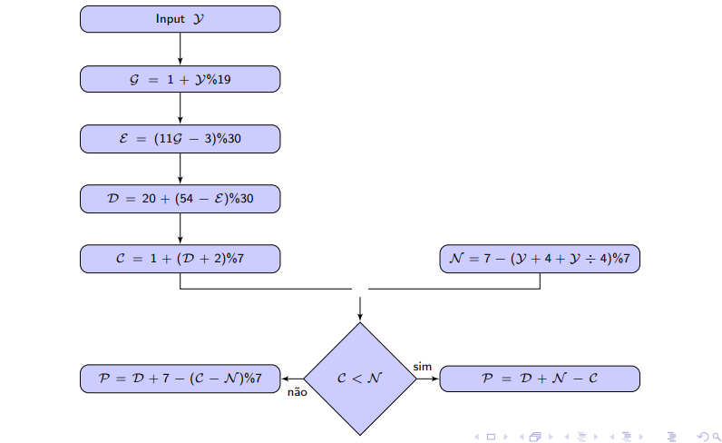
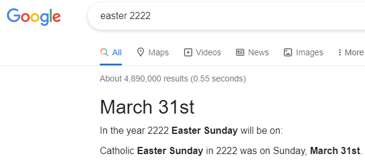

# Páscoa

```toc

```

A `Páscoa` é celebrada no **primeiro** domingo após a 1ª Lua Cheia, a contar do equinócio da Primavera (que é **sempre** dia `21 de março`).  
Se a Lua Cheia calhar num domingo, a Páscoa será no domingo seguinte.

:::warning[AVISO]
Segundo o professor José Félix, a questão do teste sobre o calendário terá uma parte teórica, onde os alunos terão de mostrar que sabem mais do que apenas aplicar as fórmulas.
:::

## Ciclo de Méton


O `Ciclo de Méton`, descrito em cima, é um ciclo de **19 anos** que simula o verdadeiro comportamento da Lua. Um ano pode ter 12 ou 13 ciclos lunares.  
Cada mês/ciclo lunar começa e acaba com uma Lua Nova.

Algumas características do `Ciclo de Méton`:

- Meses embolísticos - meses adicionados para corrigir a aproximação (os meses **13**);
- _Saltus lunae_ - Um dia que é retirado ao ano **XIX**, ficando com 3 meses de 29 dias seguidos (também para corrigir a aproximação);
- Não contempla anos bissextos (a soma dos 19 totais dá $19 \cdot 365$) pelo que a longo prazo este ciclo estaria desajustado. Isto foi corrigido pela forma gregoriana como veremos à frente.
- O primeiro mês tem sempre **30** dias (mês onde o ciclo lunar começa em dezembro e acaba em janeiro);
- O mês Pascal tem sempre **29** dias;
- O ano **III** começa dia 1 de janeiro.

### Número de Ouro do Calendário

Para um dado ano $\lambda$, o seu respetivo ano do `Ciclo de Méton` é o `Número de Ouro`.  
Seja $G$ o `Número de Ouro` do ano $\lambda$,

$$G = 1 + \lambda\%19$$

:::details[Lógica da Fórmula]

- $G$ varia entre **1**-**19**;
- O ano 1 a.C. teve `Número de Ouro` **1**
  :::

---

## Matriz Lunar


Na `Matriz Lunar` estão representados os dias de cada ano do `Ciclo de Méton` que são Lua Nova.  
Por exemplo, 2 de fevereiro é Lua Nova no ano **XI** do `Ciclo de Méton`.

:::tip[NOTA]
As Luas Cheias são **13** dias depois das Luas Novas
:::

Com a `Matriz Lunar` conseguimos determinar as datas limite da Páscoa.

:::details[Datas Limite da Páscoa]

1. **Primerio Dia**

Será quando a Lua Cheia calha o mais cedo possível, a partir do início da Primavera.  
Vendo a `Matriz Lunar`, o `Número de Ouro` **XVI** tem uma Lua Nova dia `8 de março`, exatamente **13** dias antes do equinócio da Primavera.

Nos anos com `Número de Ouro` **XVI**, onde há Lua Cheia no equinócio, se esta calhar a um sábado, a Páscoa será logo no dia `22 de março`, a **primeira data possível para a Pásoca**.

2. **Último dia**

Será nos anos onde a Lua Cheia ocorre mesmo antes do dia do equinócio de Primavera.  
Olhando para a `Matriz Lunar`, conclui-se que será nos anos com `Número de Ouro` **VIII**, que têm uma Lua Cheia no dia `19 de março`.  
Recorrendo à tabela mais uma vez, repara-se que a Lua Cheia seguinte será dia `18 de abril` (já que há uma Lua Nova dia `5 de abril`).

Nestes anos, se a Lua Cheia calhar num domingo, a Páscoa será no domingo seguinte (+7 dias), ou seja, no dia `25 de abril`, a **última data possível para a Pásoca**.
:::

---

### Sequência dos Números de Ouro

Seja $G_n$ o n-ésimo `Número de Ouro` representado na `Matriz Lunar`,

$$
G_1 = 3\\
G_n = (G_{n-1}+8)\%19
$$

:::details[Exemplos]

1. n=2

$$
G_2 = (G_1+8)\%19\\
= (3+8) = 11 \checkmark
$$

:::

---

## Cálculo da Páscoa

### Epacta

Há quantos dias foi a última Lua Nova, relativamente ao dia `1 de janeiro`.

A `Epacta` é um número de **0**-**29**, que pode ser dado por:

$$
E = (8 +11(G -1))\% 30\\
G \rightarrow \text{número de ouro}
$$

:::details[Lógica da Fórmula]

- A `Epacta` pode ser vista como o "atraso" dos anos lunares, em relação aos anos solares (anos de 365 dias, anos bissextos serão contemplados depois);
- Aumenta 11 dias por ano (diferença entre ano solar e lunar);
- Anos com meses embolísticos ocorrem sempre quando os anos lunares estam atrasados $d \geq 30$ dias, em comparação com anos solares. Estes anos adicionam **30** dias ao calendário lunar, que diminuem o atraso (`Epacta`);  
  \*(Exemplo no fim)
- Epacta do `Número de Ouro` **I** é 8, onde já é aplicada a correção em relação ao _saltus lunae_ (ano **XIX** tem menos 1 dia que os restantes).

Logo,

$$E = (8 +11(G -1))\% 30$$

\*Exemplo:

Sabe-se que a `Epacta` do ano **III** é $0$, logo será $11$ e $22$ nos anos **IV** e **V**. Como o ano **V** é um ano com mês embolístico, a `Epacta`/**atraso face aos anos solares** do próximo ano vai ser menor (-30).

$$
E_{VI} = 11 + 11 + 11 - 30\\
=3
$$

Esta relação é mantida para todos os `Números de Ouro`.

:::

#### Teorema 1 - Simplificação da Fórmula

É possível calcular a `epacta` somente através de:

$$
E = (11G -3)\% 30
$$

:::details[Demonstração]

$$
E = (8 +11(G -1))\% 30\\
E=(8+11G-11)\% 30\\
E=(11G-3)\%30
$$

QED
:::

---

#### Teorema 2 - Unicidade da Epacta

Existe um **único** valor da `Epacta` para cada ano do `Ciclo de Méton`.

---

### Lua Cheia Pascal

O dia, **a partir de 21 de março**, da Lua Cheia que determina o domingo de Páscoa pode ser dado por:

$$
R = \begin{cases} 44 - E,\qquad E < 24 \\ 74-E,\qquad E \geq 24 \end{cases}
$$

Note-se que há casos onde $R>31$, e março tem **apenas** 31 dias. Isto acontece, pois os dias de abril são considerados dias de março, ou seja, 1 de abril é dia 32 de março e 10 de abril é dia 41 de março, por exemplo.

:::details[Lógica da Fórmula]

Uma propriedade interessante é que a soma da `Epacta`, de um ano $\lambda$ ,com o dia do mês de março $(R)$ onde calha a `Lua Cheia Pascal`, contando os dias de abril como continuação do mês de março, é:

- $44, \quad$ entre 21 e 44 de março (13 de abril)
- $74, \quad$ entre 45 e 49 de março (18 de abril, última data possível para a Lua Cheia Pascal)


**NOTA:** As Luas Cheias são **13** dias depois da Lua Nova. Conseguimos obter todas as Luas Cheias, de cada `Número de Ouro`, através da [Tabela das Luas Novas](#matriz-lunar).

Desta forma, é simples chegar à fórmula apresentada.

:::

#### Teorema 3 - Simplificação da fórmula

$$
R = 20 + (54-E)\% 30\\
E \rightarrow \text{Epacta}
$$

:::details[Demonstração]

1. Se $E \geq 24$:

$$
R = 74 - E\\
=20 + 54 - E\\
= 20 + (54-E)\% 30
$$

2. Se $E < 24$:

$$
R = 44 - E\\
=20 + 24 - E\\
= 20 + (24-E)\% 30\\
= 20 + (54-E)\% 30
$$

:::

---

### Exemplo - Páscoa Juliana

Agora que já sabemos a data da Lua Cheia Pascal, basta determinar quando é o primeiro domingo que vem depois desta. O número de dias que falta para domingo é determinado pelo número calêndrico de um dia e pelo número dominical do ano, nomeadamente, pela quantidade $N-C$.



:::details[Exemplo]

Calcular o dia da Páscoa para o ano `1901`.

1. **Número Dominical** ($N$)

$$
N = 7 - (1901 + 4  + (1901\div 4))\% 7\\
= 7 - (2380)\% 7 = 7
$$

2. [Número de Ouro](#numero-de-ouro-do-calendario) ($G$)

$$
G = 1 + (1901)\%19=1+1=2
$$

3. [Epacta](#epacta) ($E$)

$$
E = (11G-3)\%30 \\
= (11(2)-3)\%30 = 19
$$

4. Dia da [Lua Cheia Pascal](#teorema-3-simplificacao-da-formula) ($R$)

$$
R = 20 + (54 - E)\%30\\
= 20 +5 = 25
$$

5. **Número Calêndrico** da Lua Cheia Pascal ($C$)

$$
C = 1 + (R+2)\%7\\
= 1 + 6 = 7
$$

6. **Dia da Páscoa**

Como $N \leq C$,

$$
P = R + 7 - (C-N)\%7\\
=25 +7 -0 = 32
$$

Dia "`32 de março`", ou seja, dia `1 de abril`.

:::tip[NOTA IMPORTANTE]
Se $N>C$,

$$P= D + N - C$$

:::

---

## Páscoa Gregoriana

A Reforma Gregoriana trouxe novas regras com consequências no Cálculo da Páscoa.

- Foram retirados 10 dias ao Calendário no ano 1582
- A partir do ano 1600, de 100 em 100 anos deixou e haver ano bissexto, voltando a acontecer de 400 em 400 anos.
- A partir de 1800, começou-se a tirar um dia à Lua de 300 em 300 anos, com um exceção no 8º dia a retirar, que tem um intervalo de 400 anos. (A primeira ocorrência não conta)
  

### Epacta Gregoriana

Os **10** dias retirados ao Calendário no ano 1582 e as novas regras associadas aos anos bissextos e à Lua levaram à adição de 2 correções na fórmula da `Epacta`. Seja $E_G$ a `Epacta Gregoriana`, é dada por:

$E_G = (11(G-3) -($[Correção de 1582](#correcao-de-1582)$)-($[Correção após 1582](#correcao-apos-1582)$))\% 30$

#### Correção de 1582

Esta correção e diz respeito aos **10** dias retirados ao Sol e os **4** dias retirados à Lua no `Calendário Gregoriano` em 1582. É uma correção muito simples, uma vez que foi pontual.  
Esta correção, $C_1$, é dada por:

$$
C_1 = 6 +1\\
6 \rightarrow \text{diferença entre a correção do Sol e a correção da Lua}\\
(10 - 4 = 6)\\
1 \rightarrow \text{Convenção para que a Páscoa Gregoriana seja}\\
\text{sempre diferente da Páscoa Judaica}
$$

#### Correção após 1582

Esta correção tem por base os dias adicionados ao Sol e os dias retirados à Lua, ao longo dos anos.

:::tip[NOTA]
Em aritmética do Calendário define-se século ($S$), como os primeiros $n-2$ dígitos de uma ano ($n$ é u número de dígitos do ano).
Por exemplo,
$$S_{2020} = 20 \quad S_{12345}=123 \quad S_{12}=0$$
:::

1. Equação do Sol

Corrige os dias descontados ao `Calendário Gregoriano`, que são adicionados no `Calendário Juliano`. Mais especificamente, desconta os dias dos anos de 100 em 100, porque não são bissextos (com a exceção do ano bissexto de 400 em 400 anos).  
Sendo $E_{sol}$ a `equação do Sol`, é dada por:

$$
E_{sol}=3 \times((S-16)\div 4)+(S-16)\%4\\
3 \times((S-16)\div 4) \rightarrow \text{De 400 em 400 ano são descontados 3 dias}\\
(S-16)\%4 \rightarrow \text{Até chegar ao fim do ciclo de 400 anos,}\\
\text{ desconta-se 1 dia em cada 100 anos}
$$

:::details[Exemplo]
Equação do Sol para o ano 2233  
$S = 22$

$$
E_{sol} = 3 \times((22-16)\div 4)+(22-16)\%4\\
= 3+2 = 5\\
3 \rightarrow \text{Dias descontados dos 3 anos não bissextos (de 100 em 100) entre 1600 e 1900}\\
2 \rightarrow \text{Dias descontados em 2100 e 2200}
$$

:::

É possível simplificar esta equação, ficando esta da seguinte forma:

$$
E_{sol} = S - (S\div4)-12
$$

2. Equação da Lua

Vendo a Tabela do Sol e Lua, nota-se que a regularidade da Lua ocorre de 25 em 25 séculos e, em cada ciclo de 25, retiramos 8 dias à Lua.
Seja $E_{lua}$ a `Equação da Lua`, esta é dada por:

$$
Z= (S-18)\%25\\
E_{lua} = 1 + (8 \times((S-18)\div25) + (Z\div 3)- (Z\div 24)\\~\\
1 \rightarrow \text{Dia omitido em 1800}\\
(8 \times((S-18)\div25) \rightarrow \text{8 dias em cada 25 séculos}\\
(Z\div 3)- (Z\div 24) \rightarrow \text{dias omitidos}\\\text{antes de se completar o ciclo de 25 séculos}
$$

Repare-se que $Z$ é o número de séculos do ciclo de 25 séculos a analisar. De 300 em 300 anos é retirado um dia à Lua, mas no 24º século não (a exceção).  
Deste modo, quando $Z < 24$, $(Z\div 24)=0$ e $(Z \div 3)$ devolve os dias a descontar. Para $Z=24$ é preciso adicionar o dia que é retirado indevidamente pelo $(Z \div 3)$, e é por isso que está lá o $(Z\div 24)$.

:::tip[NOTA]
Estamos a calcular os dias que vão ser omitidos, por isso é que se tem $- (Z\div24)$. Ao adicionar um dia, está a retirar um dia aos omitidos
:::

Simplificando a `Equação da Lua`, ficamos com:

$$
E_{lua} = \left\lfloor\frac{S-\left\lfloor\frac{S-17}{25}\right\rfloor}{3}\right\rfloor
$$

---

Finalmente, podemos chegar à Equação que nos dá a `Correção após 1582` ($C_2$).

$$
C_2 = E_{sol}- E_{lua}\\
= S - (S\div4)-12- \left\lfloor\frac{S-\lfloor\frac{S-17}{25}\rfloor}{3}\right\rfloor
$$

:::tip[NOTA]
$\lfloor\frac a b\rfloor$ é equivalente a $a\div b$ (divisão inteira)
:::

Conclusão

A `Epacta Gregoriana` é dada por:

$$
E_G = (11(G-3) -C_1-C_2)\% 30\\
= (11(G-3) -(6+1)-(S - (S\div4)-12- \left\lfloor\frac{S-\left\lfloor\frac{S-17}{25}\right\rfloor}{3}\right\rfloor)\% 30
$$

Simplificando

$$
E_G=\left(57+11G-S+(S\div4) + \left\lfloor\frac{S-\left\lfloor\frac{S-17}{25}\right\rfloor}{3}\right\rfloor\right)\% 30
$$

### Correção de Clavius

Uma das Regras Base da Páscoa, que foi mantida na `Reforma Gregoriana`, é que as Luas Novas que irão determinar a Páscoa estão compreendidas entre `8 de março` e `5 de abril`.  
Com as alterações da `Epacta`, há casos onde isto já não acontece.  
Com a `Correção de Clavius` ($V$), isto é corrigido.

$$
V = (E \div 24 - E \div 25) + (G\div12)\times (E \div 25-E\div26)
$$

:::tip[NOTA]
Considera-se a `Epacta Final` como sendo a soma da `Epacta Gregoriana` com a `Correção de Clavius`.
:::

### Exemplo - Páscoa Gregoriana


:::details[Exemplo]

Calcular Páscoa para o ano $2222$.

$S = 22$

1. [Número de Ouro](#numero-de-ouro-do-calendario) ($G$)

$$
G=1 + (2222)\%19 = 1 +18 = 19
$$

2. [Epacta Gregoriana](#epacta-gregoriana) ($E_G$)

$$
E_G = (11(19)-33-(22)+((22)\div4) + \lfloor\frac{(22)-\lfloor\frac{(22)-17}{25}\rfloor}{3}\rfloor)\% 30\\
= (209 - 33-22+5+\lfloor\frac{7}{3}\rfloor)\%30\\
= (166)\%30 = 16
$$

3. [Correção Clavius](#correcao-de-clavius) ($V$)

$$
V = ((16) \div 24) - ((16) \div 25) + (19\div12)\times ((16) \div 25-(16)\div26)\\
= 0
$$

4. Dia da [Lua Cheia Pascal](#teorema-3-simplificacao-da-formula) ($R$)

$$
R = 20+(54-(16+0))\%30\\
= 20 + 8 = 28
$$

5. **Número Calêndrico** da Lua Cheia Pascal ($C$)

$$
C=1 + ((28)+2)\% 7\\
= 3
$$

6. **Número Dominical** ($N$)

$$
N = 7-(2222-1+ (2222\div 4)- (2222\div100)+ (2222\div400))\%7\\
= 7 - (2423)\%7 = 6
$$

7. **Cálculo Final** ($P$)

Como $N> C$

$$
P = R + N - C\\
= 28+6-3 = 31
$$

A Páscoa em 2222 será no dia `31 de março`.

:::
