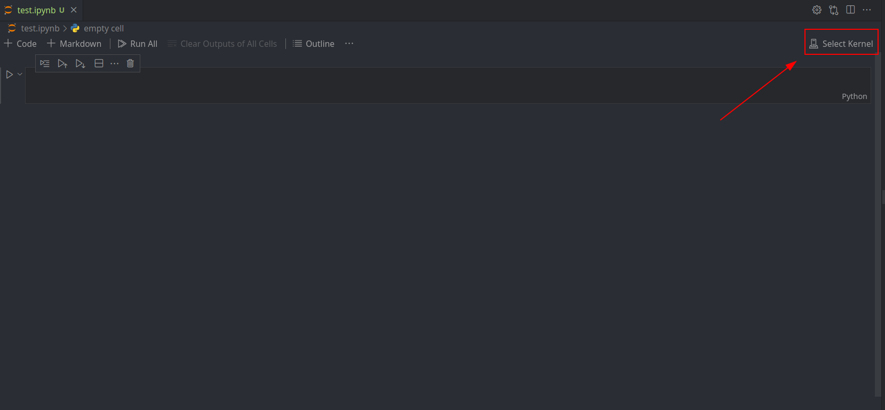
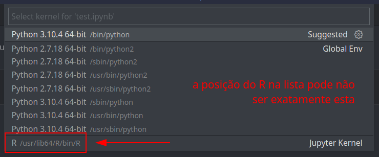

# Instalação e Configuração de R

```toc

```

## Instalar R

Para instruções gerais, seguir as instruções do [mirror de R](https://cloud.r-project.org/).

- **Linux:**

  Devem instalar R com o package manager da vossa distribuição.

  ```bash
  sudo pacman -S r           # ArchLinux
  sudo apt install r-base    # Debian/Ubuntu
  sudo dnf install R         # Fedora
  ```

- **Windows:**

  Fazer download do [instalador](https://cloud.r-project.org/bin/windows/base/) e execulá-lo.

- **MacOS:**

  Fazer download do [instalador](https://cloud.r-project.org/bin/macosx/) e execulá-lo.

Para verificar que o R ficou instalado, executar `R` no terminal.
Devem obter um output semelhante ao abaixo:

```bash
$ R

R version 4.2.0 (2022-04-22) -- "Vigorous Calisthenics"
Copyright (C) 2022 The R Foundation for Statistical Computing
Platform: x86_64-pc-linux-gnu (64-bit)

R is free software and comes with ABSOLUTELY NO WARRANTY.
You are welcome to redistribute it under certain conditions.
Type 'license()' or 'licence()' for distribution details.

  Natural language support but running in an English locale

R is a collaborative project with many contributors.
Type 'contributors()' for more information and
'citation()' on how to cite R or R packages in publications.

Type 'demo()' for some demos, 'help()' for on-line help, or
'help.start()' for an HTML browser interface to help.
Type 'q()' to quit R.
```

Escrever `q()` para sair.

### Radian Console

Se forem usar o terminal para configurar ou executar comandos em R, recomendo
vivamente a instalação de [radian](https://github.com/randy3k/radian), uma
consola alternativa com muito mais funcionalidades e mais estável.

A instalação pode ser feita através do `pip` (Python) ou pelo _package manager_
da vossa distribuição, se disponível:

```bash
pip3 install -U radian    # Python pip
paru -S radian            # ArchLinux (AUR)
```

Para usar o radian, executar o comando `radian`.

### RStudio

Para instalar o RStudio, um IDE para R, seguir as instruções no
[site oficial](https://www.rstudio.com/products/rstudio/) ou instalar pelo
_package manager_ da vossa distribuição Linux.

```bash
paru -S rstudio-desktop-bin    # ArchLinux (AUR)
```

### Jupyter Notebooks

Se já trabalharam com ferramentas associadas à ciência de dados e/ou à inteligência artificial e _machine learning_ em Python, já devem ter ouvido falar de [**Jupyter Notebooks**](color:green): uma ferramenta extremamente útil (e simples de usar) para desenvolver projetos ligados à manipulação de dados de forma simples e gradual, que permite uma apresentação atraente dos resultados obtidos (e do código utilizado para os obter). Têm uma integração bastante simples com o [**Visual Studio Code**](https://code.visualstudio.com/), e é precisamente com essa integração que vamos iniciar esta secção.

:::danger[Aviso]

Realçamos inicialmente que a docência recomenda a utilização do ambiente RStudio para o desenvolvimento do projeto, apesar de não ser de todo necessário fazê-lo nesse _IDE_. De qualquer maneira, cabe ao aluno decidir qual o ambiente de desenvolvimento com o qual consegue trabalhar de forma mais eficaz.

:::

Bem, como nota inicial é relevante realçar que temos de ter o VSCode instalado na nossa máquina para podermos prosseguir.

:::details[Instalar VSCode]

## Windows

Podem recorrer ao instalador vindo diretamente da [página oficial](https://code.visualstudio.com/download) para o instalar.

## MacOS

Deverão recorrer à linha de comandos e executar um dos seguintes comandos:

```bash
brew install visual-studio-code  # proprietary binary by microsoft
brew install vscodium            # open source version of vscode
```

Podem também, alternativamente, instalar diretamente da [página oficial](https://code.visualstudio.com/download), se assim preferirem.

## Linux

Obviamente variará de _distro_ para _distro_, mas o procedimento-base é semelhante para todas. Ilustram-se de seguida os procedimentos em Ubuntu e Arch Linux:

### Ubuntu

Deverão executar um dos seguintes comandos:

```bash
sudo apt install visual-studio-code-bin # proprietary binary by microsoft
sudo apt install code                   # open source version of vscode
```

### Arch Linux

Deverão executar um dos seguintes comandos:

```bash
sudo pacman -S visual-studio-code-bin # proprietary binary by microsoft
sudo pacman -S code                   # open source version of vscode
```

(Aqui podem, claro, recorrer ao `paru`, `yay` e amigos).

:::

Posto isto, instalado o VSCode (e assumindo que já têm também instalado o R na vossa máquina), podemos continuar.

Devemos, então, instalar as dependências necessárias para poder fazer o que precisamos:

```bash
pip install jupyterlab notebook
```

Se não tiverem o `pip` instalado na vossa máquina, devem fazê-lo:

- **Windows**

  Em Windows, o `pip` vem _shipped_ com o Python. Basta, portanto, [instalar o Python](https://www.python.org/downloads/windows/).

- **MacOS**

  Em MacOs, o `pip` vem _shipped_ com o Python, assim que o instalarem. Basta, portanto, executar o seguinte comando:

  ```bash
  brew install python
  ```

- **Linux**

  Deve-se executar um dos seguintes comandos (ou o equivalente para a vossa _distro_):

  ```bash
  sudo pacman -S python-pip # Arch Linux
  sudo apt install python-pip # Ubuntu
  ```

De seguida, devem abrir o R através da linha de comandos: escrever `R` e pressionar Enter basta para o efeito. Devem realizar dois passos:

- Correr `install.packages("IRkernel")` para instalar o [**IRKernel**](https://irkernel.github.io/irkernel/), o pacote necessário para o funcionamento do Jupyter Notebook com R;
- Correr `IRkernel::installspec()`, instala a _kernelspec_, ficando assim o Jupyter a saber que o IRKernel existe.

Ora, agora devemos estar completamente prontos para começar a usar Jupyter Notebooks! Para confirmar, devem criar um ficheiro qualquer do tipo `.ipynb` e abri-lo no VSCode. No canto superior direito devem ter uma opção `Switch Kernel` ou equivalente: cliquem, e se tudo tiver corrido bem, o _kernel_ de R deve aparecer.




Caso não apareça, verifiquem que respeitaram todos os passos supra-indicados.

A partir daqui, podem usar o Notebook normalmente! Cada célula corresponde a um trecho de código - "executar" uma célula corresponde a executar apenas esse trecho de código, salvaguardando contudo o contexto de todas as células corridas anteriormente.
