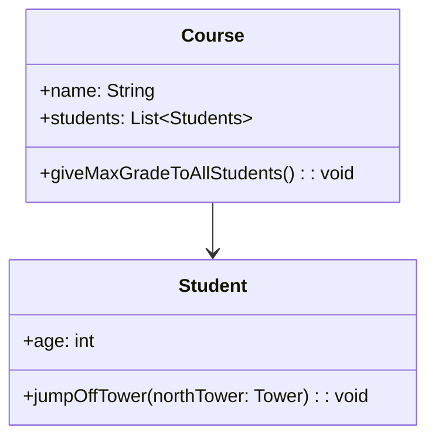

# Programação com Objetos

> Esta cadeira tem como objetivo dar a conhecer o paradigma de programação com objectos, as suas vantagens,
> inconvenientes e limitações; assim como o paradigma dos padrões de desenho, tanto no desenvolvimento, como na refactorização de aplicações.

## Recursos Adicionais

:::info[Resumos de PO]

A cadeira de Programação com Objectos está resumida de forma excelente pelo professor David Matos na wiki de PO, mantida pelo mesmo. Não achamos que faça sentido criar resumos nossos, visto que a UC já tem um material de apoio extremamente completo, pelo que nesta secção serão apenas mantidos links e recursos úteis para a cadeira, e não resumos da matéria em si.

:::

- [Wiki do Prof. David Matos](https://web.tecnico.ulisboa.pt/~david.matos/w/pt/index.php/Programa%C3%A7%C3%A3o_com_Objectos)
- [MermaidJS Live Editor](https://mermaid.live/) - Editor de gráficos UML
- [Umbrello UML Modeller](https://umbrello.kde.org/) - Editor de gráficos UML
- [Página da Cadeira - Fénix](https://fenix.tecnico.ulisboa.pt/disciplinas/PO3/2021-2022/1-semestre)

