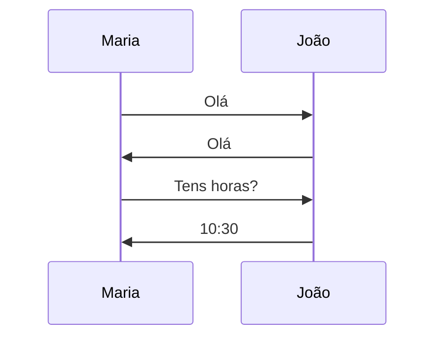
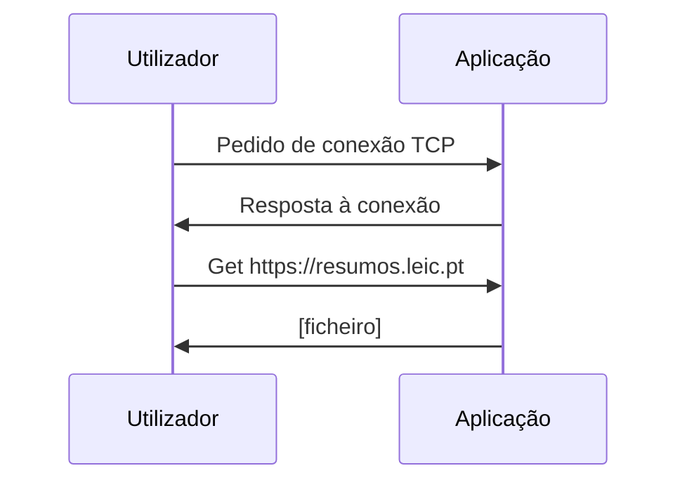

# Introdução

```toc

```

## A Internet

A _Internet_ é uma "rede de redes", vagamente hierarquizada.
A hierarquia de baixo para cima consiste em redes locais conectadas a um
_Internet Service Provider (ISP)_.
Para além da _Internet_ pública, também existem redes privadas,
que são denominadas de _Intranets_.

O envio e receção de mensagens através da _Internet_ funciona através de
protocolos (ex: TCP, IP, HTTP, SMTP, FTP, Ethernet).

## O que é um Protocolo?

Um protocolo define qual é o formato e a ordem das mensagens enviadas e
recebidas por entidades da rede e para além disso também das ações a tomar
na transmissão e receção de mensagens.

Podemos fazer uma analogia a protocolos olhando para a forma como os seres
humanos comunicam entre si.
Uma simples pergunta de "Que horas são?" ou apresentar-nos funcionam como
protocolos: estamos a transmitir uma mensagem e quando recebida certas ações
serão realizadas (Perguntas as horas -> Vêem as horas e respondem).

**Protocolo "humano"**



**Protocolo de rede de computador**



## Grupos de redes

Podemos considerar que existem vários grupos de rede:

### Redes residenciais

Em casa, devido a não existirem muitos dispositivos que precisem de rede e os
que precisam ligarem-se normalmente apenas à internet, a rede é simples.  
Tipicamente em cada casa existe um Modem, um Router e um AP, tudo na mesma "caixinha".  
Os dispositivos ligam-se então a essa "caixinha", tanto por cabo ou,
usualmente, por WiFi ao AP embutido.

### Redes locais

A rede em Universidades, Empresas, etc. considera-se uma LAN (Local Area Network),
onde existe um mix de rede cablada e sem fios.  
Nestes espaços é normal existirem switches e routers para melhor gerir o tráfego.

### Redes de Data Center

Ligações com bandwidth bastante elevada (entre 10Gbps e 100Gbps) que conectam
centenas ou milhares de servidores entre si e à Internet.

## Meios de transmissão

De forma a nos ligarmos a uma rede, precisamos de algum meio de acesso.
Existem vários tipos:

- Por cabo;
- Por fibra ótica;
- Wireless;
- etc.

Que se dividem em dois meios:

### Meio Físico

- Fios de cobre - Normalmente [cabos RJ-45](./terminology#cabo-rj-45):
  - Dos mais comuns;
  - Estes cabos têm diferentes categorias e diferentes tipos:
    - Categoria 3: Cabos de telefone e cabos de rede de até 10Mbps;
    - Categoria 5: Até 100Mbps;
    - Categoria 6: Até 1 Gbps;
    - Categoria 7: até 10 Gbps ou 100 Gbps se a distância for menor que 15 metros.
- Cabos coaxiais
  - Cabos bastante isolados, ideáis para para evitar interferências eletromagnéticas.
- Fibra ótica
  - É usada ótica (ou seja, luz) para transferir informação;
  - Alta velocidade;
  - Não é afetada por interferências de frequências;
  - Bastante frágil.

### Meio Wireless

Este meio de transmissão é bidirecional e usa antenas para comunicar entre dois dispositivos. Normalmente são usados [APs (Access Points)](./terminology#access-point) para transmitir o sinal de rede.

Apesar de parecer ideal apenas ser usada comunicação wireless, termos
de conveniência e substituindo os cabos, este esquema tem alguns problemas específicos:

- **Reflexão** - O sinal é enviado em múltiplos sentidos e, através de reflexão,
  mais que um sinal pode ir parar ao mesmo sítio que outro.
  Esta sobreposição faz com que exista ruído ou até mesmo que os sinais se cancelem;

- **Obstrução por objetos** - Alguns objetos, especialmente os metálicos,
  absorvem parte do sinal, fazendo com que a sua potência diminua;

- **Interferência** - Outros dispositivos que também emitem sinais
  (e.g. um micro-ondas, um rádio, outras antenas, etc.) podem causar interferências
  com o sinal original.

## Extremidade da Rede

É o nível mais baixo da hierarquia, composto por computadores, servidores,
também chamados de _end systems_ ou _hosts_, onde correm aplicações como web, e-mail.

**Modelo client/servidor:**
O _host_ do cliente faz um pedido e recebe um serviço de um servidor,
que se encontra sempre ligado, como por exemplo um _browser_ no lado do
cliente e um servidor _web_.

**Modelo _peer to peer_:**
Uso mínimo ou inexistente de servidores dedicados, como por exemplo o Skype e o BitTorrent.

## Estratégias de partilha de rede

### Circuit Switching

Os recursos da rede (e.g. largura de banda) encontram-se divididos em partes alocadas,
sendo estabelecido um canal exclusivo para cada host.
Não há partilha de recursos, ou seja se eu não estiver a utilizar a minha parte,
ninguém a está a utilizar.

A largura de banda pode ser dividida por frequências (Frequency division, FDM)
ou ao longo do tempo (Time division, TDM).  
Na prática, é usada uma mistura dos dois:

### FDM (Frequency division multiplexer)

A divisão é feita na frequência.  
São usados vários canais/frequências e colocados sobre a mesma fibra óptica/cabo. Cada utilizador usa uma das frequências.

')

### TDM (Time division multiplexer)

A divisão é feita no tempo.  
Cada host pode usar a fibra óptica/cabo durante um intervalo específico de tempo.

')

:::info[Exercício de comutação de circuitos]
**Quanto tempo demora enviar um ficheiro de 640.000 bits do _host_ A para o
_host_ B a partir de uma _network_ baseada em comutação de circuitos (_circuit switching_)?**

**A _bit rate_ de _links_ disponíveis é 2048 MBps;**  
**Cada _link_ é partilhado usando _TDM_, havendo 32 _slots_/linha;**  
**São precisos 500ms para estabelecer um circuito _end-to-end_**

Seja $L$ o tamanho do ficheiro e $R$ a _rate_ de transferência.  
Simplificando $L$, tem-se que $L = 640 \times 10^3 \op{bits} = 2^6 \times 10^4 \op{bits}$.

$R$ é a _rate_ de transferência, ou seja, a quantidade de bits que é possível
passar pelo cabo por segundo.
Como cada ligação é dividida em 32 slots, tem-se que dividir a _bit rate_ dada,
ou seja, calcula-se,

$$
R = \frac{\text{bit rate total}}{\text{Nº de slots}} = \frac{2048 \op{Mbps}}{32} = \frac{2^{11} \times 10^3}{2^5} = 64 \op{Kbits/s}
$$

O tempo total é dado então por:

$$
\begin{aligned}
t_{\text{total}} &= t_{\text{setup}} + t_{\text{transferir}}\\
          &= 0.5 \op{s} + \frac{L}{R}\\
          &= 0.5 \op{s} + \frac{640 \op{Kbits}}{64 \op{Kbits/s}}\\
          &= 0.5 + 10\\
          &= 10.5
\end{aligned}
$$

:::

#### Desvantagens

Esta estratégia tem alguns problemas:

- O aluguer de um canal exclusivo é muito caro e nada prático (e.g., é usado
  por emissores de televisão quando querem garantir a consistência da ligação);
- É um canal pequeno e não tem a performance que outras estratégias, como _packet switching_
  podem oferecer.

### Packet Switching

Em vez de dividir os recursos da rede, estes são partilhados e a comunicação
é dividida em pacotes.
Cada pacote utiliza o tamanho total da largura de banda e os recursos são
utilizados à medida que é necessário, ou seja, um host consegue ter o canal todo
para ele caso não existam outros hosts - **Statistical Multiplexing**.

O sistema de encaminhamento na internet é feito de forma a que cada pacote possa
ser enviado por caminhos diferentes (dependendo da congestão de um certo caminho).

Esta estratégia também tem problemas:

- A procura pode exceder os recursos disponíveis;
- Podem haver atrasos com pacotes à espera na fila ou perdas (Congestion);
- (**Store and forward**) - Cada pacote tem de ser recebido na totalidade antes de ser encaminhado.

#### _Store and forward_

Em cada link, o pacote tem que chegar por inteiro ao router antes de ser transmitido para o próximo link. Ou seja,


O router precisa de receber o pacote todo:

- para verificar se houve algum erro na transmissão. Se o pacote ficou
  corrompido, não faz sentido continuar a propagá-lo;
- para calcular o melhor caminho por onde o reencaminhar, visto que certos
  caminhos podem estar congestionados ou bloqueados.

Para calcular o tempo que um pacote demora a chegar ao seu destino tem que se
somar duas partes: o tempo de propagação e o tempo de transmissão.

O tempo de transmissão é calculado a partir da velocidade de transmissão e do
tamanho do pacote, enquanto o tempo de propagação é calculado a partir da
velocidade a que um sinal viaja num condutor e a distância entre os dois pontos.
Ou seja, o tempo de propagação não muda se mudar o tamanho dos pacotes ou o
número de pacotes a transmitir.

### Arquitetura em camadas

Cada camada fornece um serviço às camadas que se encontram acima.

#### Modelo Internet (Pilha de Protocolos da Internet)

- Aplicação:
  - Suporta aplicações de rede
  - Exemplos: [HTTP](https://en.wikipedia.org/wiki/Hypertext_Transfer_Protocol),
    [SMTP](https://en.wikipedia.org/wiki/Simple_Mail_Transfer_Protocol),
    [SSH](https://en.wikipedia.org/wiki/Secure_Shell),
    [FTP](https://en.wikipedia.org/wiki/File_Transfer_Protocol), ...
- Transporte:
  - Transferência de dados entre processos
  - Exemplos: TCP, UDP, ...
- Rede (Network):
  - Encaminhamento de _datagrams_ da origem ao destino
  - Exemplos: IP, protocolos de encaminhamento
- Ligação:
  - Transferência de dados entre elementos da rede vizinhos
  - Exemplos: Ethernet, Wi-Fi, [PPP](https://en.wikipedia.org/wiki/Point-to-Point_Protocol), ...
- Física:
  - Bits "no cabo"

#### Modelo OSI

- Application
- Presentation
- Session
- Transport
- Network
- Link
- Physical

As camadas _Application, Presentation e Session_ correspondem à camada Aplicação
no modelo Internet.
As restantes camadas são equivalentes às do modelo internet com o mesmo nome.
