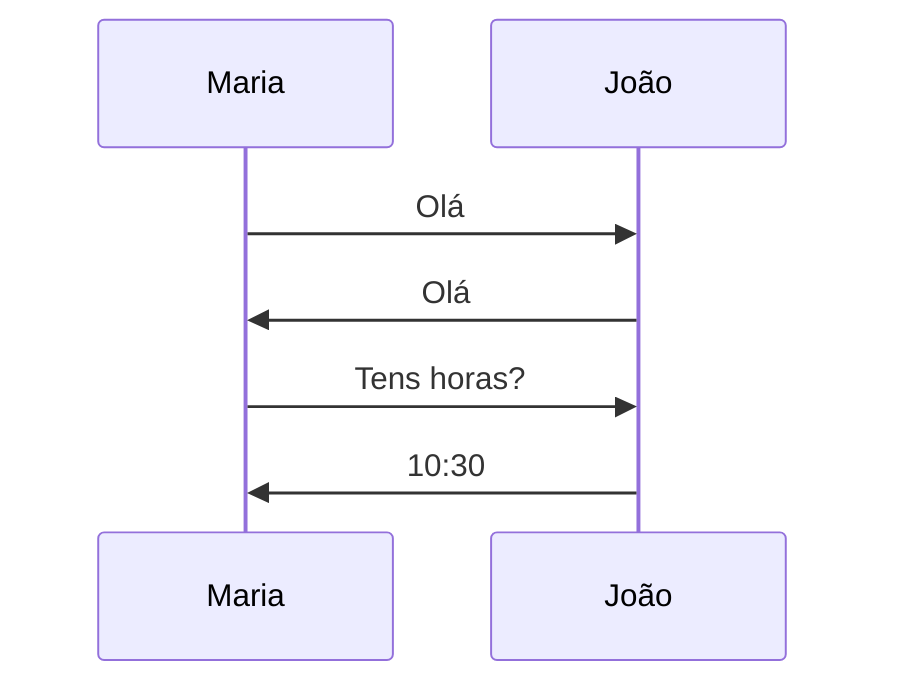
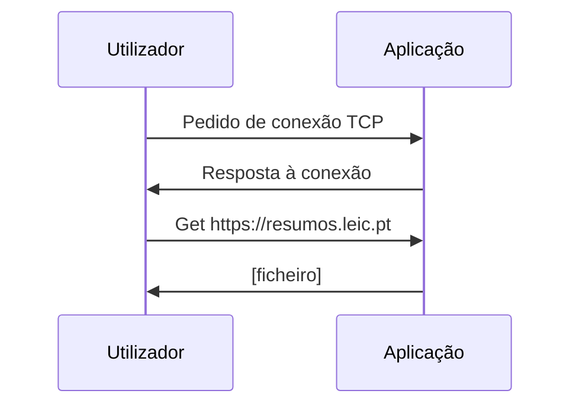

# Introdução

```toc

```

## A Internet
A *Internet* é uma "rede de redes", vagamente hierarquizada. A hierarquia de baixo para cima consiste em redes locais conectadas a um *Internet Service Provider (ISP)*. Para além da *Internet* pública, também existem redes privadas, que são denominadas de *Intranets*.

O envio e receção de mensagens através da *Internet* funciona através de protocolos (ex: TCP, IP, HTTP, SMTP, FTP, Ethernet).

## O que é um Protocolo?
Um protocolo define qual é o formato e a ordem das mensagens enviadas e recebidas por entidades da rede e para além disso também das ações a tomar na transmissão e receção de mensagens.

Podemos fazer uma analogia a protocolos olhando para a forma como os seres humanos comunicam entre si. Uma simples pergunta de "Que horas são?" ou apresentar-nos funcionam como protocolos, estamos a transmitir uma mensagem e quando recebida certas ações serão realizadas. (Perguntas as horas -> Vêem as horas e respondem).

Protocolo "humano"


Protocolo de rede de computador


## Estrutura da Rede
**Extremidade da rede**: 
Aplicações (Servidores) e Utilizadores (Computadores)

**Redes de acesso**:
Ligação por fio (wired) ou sem fios (wireless)

**Núcleo da rede**:
Composto por *routers* inter-ligados

### Extremidade da Rede
É o nível mais baixo da hierarquia, composto por computadores, servidores, também chamados de *end systems* ou *hosts*, onde correm aplicações como web, e-mail.

**Modelo client/servidor:**
O *host* do cliente faz um pedido e recebe um serviço de um servidor, que se encontra sempre ligado, como por exemplo um *browser* no lado do cliente e um servidor *web*.

**Modelo *peer to peer*:**
Uso mínimo ou inexistente de servidores dedicados, como por exemplo o Skype e o BitTorrent.
