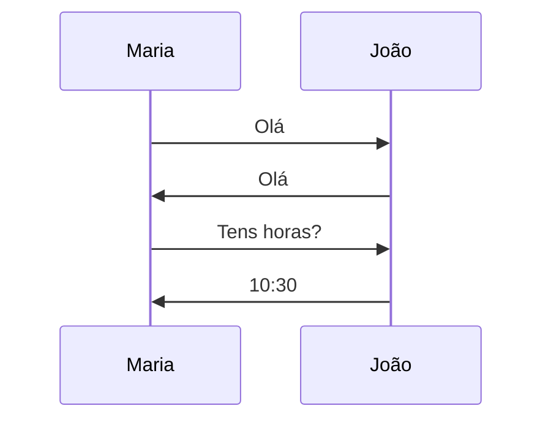
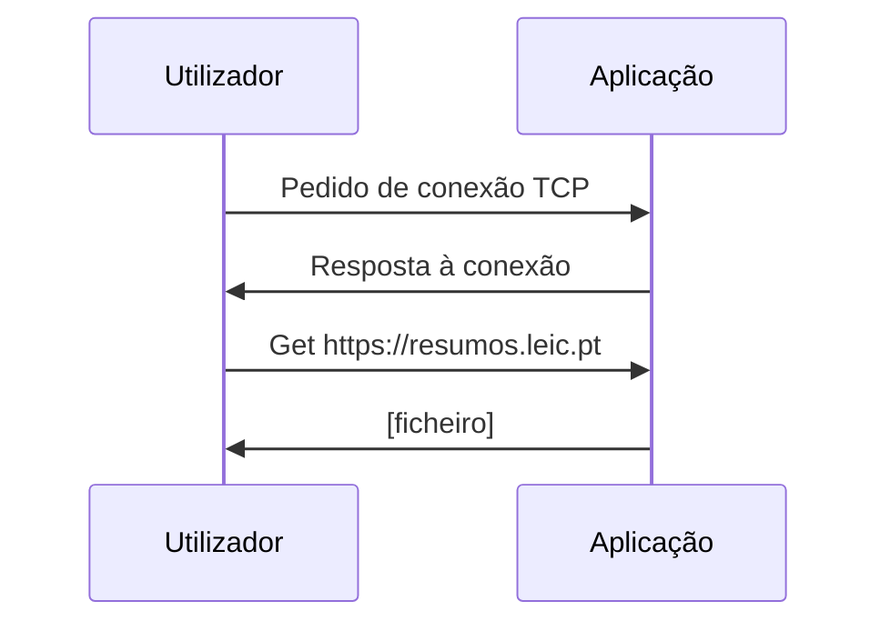

# Introdução

```toc

```

## A Internet

A _Internet_ é uma "rede de redes", vagamente hierarquizada.
A hierarquia de baixo para cima consiste em redes locais conectadas a um
_Internet Service Provider (ISP)_.
Para além da _Internet_ pública, também existem redes privadas,
que são denominadas de _Intranets_.

O envio e receção de mensagens através da _Internet_ funciona através de
protocolos (ex: TCP, IP, HTTP, SMTP, FTP, Ethernet).

## O que é um Protocolo?

Um protocolo define qual é o formato e a ordem das mensagens enviadas e
recebidas por entidades da rede e para além disso também das ações a tomar
na transmissão e receção de mensagens.

Podemos fazer uma analogia a protocolos olhando para a forma como os seres
humanos comunicam entre si.
Uma simples pergunta de "Que horas são?" ou apresentar-nos funcionam como
protocolos: estamos a transmitir uma mensagem e quando recebida certas ações
serão realizadas (Perguntas as horas -> Vêem as horas e respondem).

**Protocolo "humano"**



**Protocolo de rede de computador**



## Extremidade da Rede

É o nível mais baixo da hierarquia, composto por computadores, servidores,
também chamados de _end systems_ ou _hosts_, onde correm aplicações como web, e-mail.

**Modelo client/servidor:**
O _host_ do cliente faz um pedido e recebe um serviço de um servidor,
que se encontra sempre ligado, como por exemplo um _browser_ no lado do
cliente e um servidor _web_.

**Modelo _peer to peer_:**
Uso mínimo ou inexistente de servidores dedicados, como por exemplo o Skype e o BitTorrent.

## Estratégias de partilha de rede

### Circuit Switching

Os recursos da rede (e.g. largura de banda) encontram-se divididos em partes alocadas.
Não há partilha de recursos, ou seja se eu não estiver a utilizar a minha parte,
ninguém a está a utilizar.

A largura de banda pode ser dividida por frequências (Frequency division, FDM)
ou ao longo do tempo (Time division, TDM).

')

')

### Packet Switching

Em vez de dividir os recursos da rede, estes são partilhados e a comunicação
é dividida em pacotes.
Cada pacote utiliza o tamanho total da largura de banda e os recursos são
utilizados à medida que é necessário.

Contensão:

- A procura pode exceder os recursos disponíveis
- Podem haver atrasos com pacotes à espera na fila ou perdas (Congestion)
- (**Store and forward**) Cada pacote tem de ser recebido na totalidade antes de ser encaminhado

#### _Store and forward_

Para calcular o tempo que um pacote demora a chegar ao seu destino tem que se
somar duas partes: o tempo de propagação e o tempo de transmissão.

O tempo de transmissão é calculado a partir da velocidade de transmissão e do
tamanho do pacote, enquanto o tempo de propagação é calculado a partir da
velocidade a que um sinal viaja num condutor e a distância entre os dois pontos.
Ou seja, o tempo de propagação não muda se mudar o tamanho dos pacotes ou o
número de pacotes a transmitir.

### Arquitetura em camadas

Cada camada fornece um serviço às camadas que se encontram acima.

#### Modelo Internet (Pilha de Protocolos da Internet)

- Aplicação:
  - Suporta aplicações de rede
  - Exemplos: HTTP, SMTP, SSH, FTP, ...
- Transporte:
  - Transferência de dados entre processos
  - Exemplos: TCP, UDP, ...
- Rede (Network):
  - Encaminhamento de _datagrams_ da origem ao destino
  - Exemplos: IP, protocolos de encaminhamento
- Ligação:
  - Transferência de dados entre elementos da rede vizinhos
  - Exemplos: Ethernet, Wi-Fi, P2P, ...
- Física:
  - Bits "no cabo"

#### Modelo OSI

- Application
- Presentation
- Session
- Transport
- Network
- Link
- Physical

As camadas _Application, Presentation e Session_ correspondem à camada Aplicação
no modelo Internet.
As restantes camadas são equivalentes às do modelo internet com o mesmo nome.
