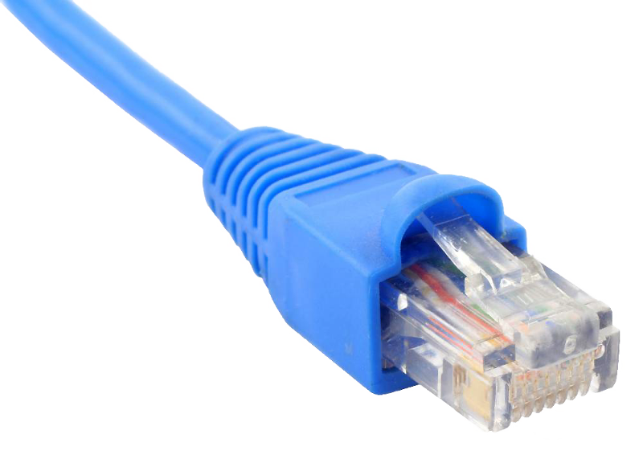

# Terminologia de Redes

```toc

```

O objetivo desta página é familiarizar os alunos com alguma terminologia usada em Redes, usando algumas imagens para tornar mais explícito.

## Terminologia

### Bastidor

Onde são guardados os equipamentos de rede de uma dada instalação. Pode-se considerar que é um "armário" com equipamentos de rede.  
Por exemplo,


### Cabo RJ-45

O cabo de ethernet que toda a gente conhece. É usada a nomenclatura RJ-45 por motivos históricos.
Por exemplo,


### Protocolo

Um protocolo estabelece um conjunto de regras que permite vários sistemas computacionais comunicarem entre si.  
As normas que um protocolo define incluem a forma como deve ser feita a conexão, a comunicação, a transferência de dados, como deve ser mantida a sessão, etc.  
São exemplos de protocolos:

- TCP / IP;
- UDP;
- HTTP / HTTPS.
