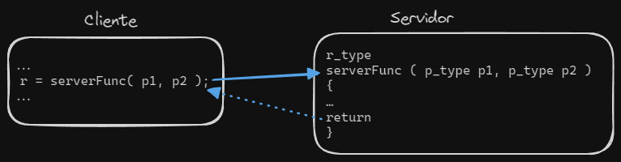

# APIs de Comunicação

## Exemplo de aplicação UDP

Vamos analisar o comportamento de uma aplicação cliente-servidor que utiliza UDP para a troca de mensagens. 
Ao utilizar UDP, sabemos que as mensagens podem:
- Perder-se 
- Chegar fora de ordem 
- Chegar repetidas 

Imaginemos um caso em que o cliente não recebe resposta ao seu pedido. Tem 2 hipóteses:
1. Retorna erro 
2. Repete envio 

Se a resposta chegar depois do reenvio, pode ter acontecido 1 de 3 cenários:
- O pedido original não atingiu o servidor (portanto correu tudo bem e a operação apenas foi executada 1 vez)
- A resposta ao pedido original perdeu-se (operação executada 2 vezes)
- O servidor recebeu o pedido original e começou a processá-lo, mas _crashou_, podendo a operação ter sido realizada ou não caso não seja atómica (operação executada 1 ou 2 vezes)

O facto de a operação ser repetida, além de desperdiçar tempo, pode ter efeitos inesperados caso esta não seja **idempotente** (operação que produz o mesmo estado e devolve a mesma resposta independentemente do número de vezes que for executada) 

Como é que o servidor pode evitar isto? 
Tem que ser capaz de verificar se o id do pedido já foi recebido antes:
- Se for a primeira vez: executa
- Se for repetido: deve ter guardado o histórico de respostas a pedidos executados e retornar a resposta correspondente (implica armazenamento de ids e suas respostas)

Conseguimos assim perceber que programar sistemas distribuídos através de sockets é bastante complexo e vulnerável a falhas,
 pelo que iremos utilizar mais um nível de abstração, o RPC.

## RPC

O RPC (_Remote Procedure Call_) permite que um cliente execute funções (_procedures_) remotamente num servidor
mas de forma aparentemente local. O facto de a execução ser remota levanta dois problemas principais: 
1. A rede entre o cliente e o servidor não é _reliable_, tendo tendência de perder e reordenar mensagens 
2. Os computadores onde ambos os processos correm podem ter arquiteturas muito diferentes 

Aspeto típico de programação com RPC: 

Este processo segue um mecânismo de _Request Reply_ (RR):
1. O cliente passa os argumentos do procedure para o _local stub_, que os transforma num _request_ (mantendo assim a ilusão de que se está a chamar um procedure local) 
2. O _stub_ invoca o protocolo RPC para enviar este request para o servidor 
3. O servidor recebe o request, que é traduzido pelo seu _stub_ de forma a obter os argumentos (utilizando o mesmo protocolo) 
4. Executa localmente o procedure 
5. Devolve uma resposta ao cliente de acordo com o protocolo  
6. O _stub_ do cliente traduz a resposta e obtém assim o valor, que devolve ao programa que chamou o procedure

Existem várias semânticas de invocação (e mecanismos associados):
- _**Maybe**_ : Não há garantias de que o procedure é executado 
  - mecanismos: **RPC timeout** 
- _**At-least-once**_ : O procedure é executado pelo menos 1 vez 
  - mecanismos: RPC timeout + **Resend** 
- _**At-most-once**_ : O procedure é executado no máximo 1 vez 
  - mecanismos: RPC timeout + Resend + **Message id + response history** 
- _**Exactly-once**_ : O procedure é executado exatamente 1 vez 
  - mecanismos: RPC timeout + Resend + Message id + response history + **Transaction rollback** 

O mecanismo que utilizaremos na cadeira é o **gRPC**. 

## gRPC 

Tem como base [HTTP/2](/rc/aplicacao/#http-20) e por sua vez [TLS](https://en.wikipedia.org/wiki/Transport_Layer_Security) e [TCP](/rc/transporte/#tcp---transmission-control-protocol). É um mecanismo focado em serviços cloud (e não no paradigma cliente/servidor) baseado no RPC utilizado internamente pela Google. 

- Utiliza uma **IDL** (Interface Definition Language) para especificar os tipos dos dados e quais as operações disponíveis. 
  - Um exemplo de IDL é o [**protobuf**](https://protobuf.dev/) utilizado pela Google, que fornece o seu compilador **protoc** para gerar código (por ex. Java)
- Fornece ferramentas de **geração de código a partir da IDL** (conversão de dados + invocação remota)
- As chamadas remotas podem ser **síncronas ou assíncronas** 

Uma chamada remota gRPC:
- É constituída por:
  - Um nome de serviço e de método, fornecido pelo cliente 
  - Meta-dados opcionais (key-value pairs) 
  - Um ou mais pedidos 
- Termina quando o servidor responde com:
  - Zero ou mais mensagens de resposta 
  - Meta-dados opcionais 
  - Um _trailer_ (indica se a chamada foi bem sucedida ou se ocorreu um erro) 

Dado que estamos a utilizar a rede, podem acontecer falhas (o que deve ser tido em conta ao escrever os clientes)
 e portanto podem ser devolvidas respostas com códigos de resultado em vez do tipo definido na IDL. Alguns exemplos: 
- **0** - OK
- **5** - not found
- **13** - internal 

De forma a saber como contactar o servidor, o **gRPC** utiliza por omissão [DNS](/rc/aplicacao/#dns---domain-name-system) como servidor de nomes.

## Referências

- Coulouris et al - Distributed Systems: Concepts and Design (5th Edition)
  - Secções 4.2 e 4.3
- Peterson and Davie - [Computer Networks: A Systems Approach](https://book.systemsapproach.org/e2e/rpc.html)
  - Secções 5.3
- Departamento de Engenharia Informática - Slides de Sistemas Distribuídos (2022/2023)
  - 2b - gRPC
- Departamento de Engenharia Informática - Slides de Sistemas Distribuídos (2023/2024)
  - SlidesTagus-Aula01b
- Larry Peterson and Bruce Davie - [Computer Networks: A Systems Approach](https://github.com/SystemsApproach/book) &copy; Elsevier 2012 (License [CC BY 4.0](https://creativecommons.org/licenses/by/4.0/))
  - Imagem que ilustra funcionamento do mecânismo _Request Reply_
