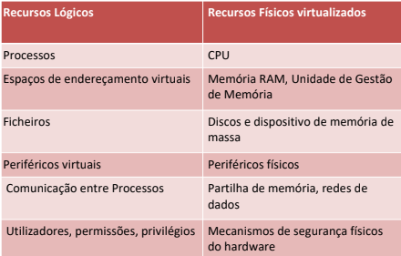
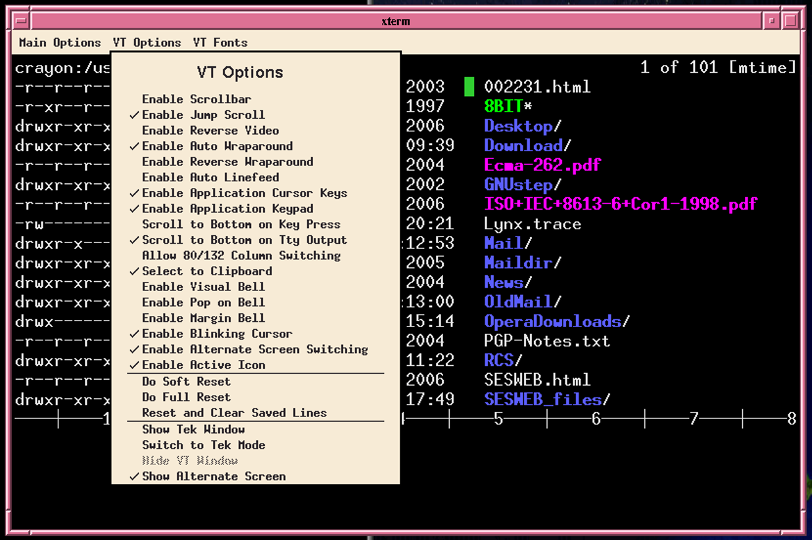
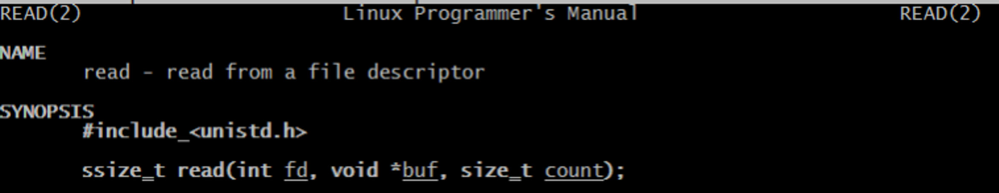

# Introdução aos Sistemas Operativos

```toc

```

## Definição

O SO define funcionalmente o uso
do computador

- É o SO que caracteriza a “máquina
  Informática” que usamos
- A “operação” baseia-se numa interface que a
  o SO disponibiliza

O Sistema Operativo cria uma máquina virtual totalmente independente
do hardware onde se executa

- O Sistema Operativo virtualiza praticamente
  todos os mecanismos de hardware e cria uma
  nova máquina

- Gerir Recursos

  - Seria difícil às aplicações controlar todos os
    aspectos da máquina física (interrupções,
    organização da memória, dispositivos, ...)
  - Abstrair os recursos físicos, oferecendo às
    aplicações um conjunto de recursos lógicos

- As aplicações com os seus dados são o que
  realmente tem valor para as organizações
- As grandes vantagens de ter uma aplicações
  que “corre” em Unix/Linux/Windows/MacOS:
  - Temos a certeza de a conseguir manter e fazer
    evoluir neste SO
  - O SO cria uma máquina virtual segura, fiável e
    otimizada

## Recursos Lógicos vs Físicos



## Missão do Sistema Operativo


- Criar uma máquina virtual sobre a máquina física que ofereça
  os recursos lógicos básicos necessários ao desenvolvimento das
  aplicações

- Independente do hardware onde se executa

- Os sistemas disponibilizam uma interface que
  permite a qualquer programador estender o
  seu ambiente de programação permitindo-lhe
  criar aplicações muito sofisticadas
  - Paralelismo
  - Optimização da memória
  - Persistência
  - Comunicação entre processos, local ou distribuída
  - Tratamento de erros - Novos periféricos, protocolos, etc.

## “Interfaces” do Sistema Operativo

### Interface Operacional




### Interface programática

(bibliotecas de funções sistema)



## Critérios de Qualidade do SO


Desempenho - Gestão eficiente dos recursos físicos que suportam os recursos lógicos - Tempo de resposta, Débito, Previsibilidade, Justiça

- Segurança.
  - Isolamento dos Utilizadores
  - Permitir partilha segura de recursos lógicos
- Fiabilidade e Disponibilidade
  - Detectar um conjunto de faltas
  - Tolerar um conjunto de erros
- Interface de programação completa e simples.
  - Facilitar a concepção das aplicações, a sua manutenção e portabilidade
- Interface de operação e gestão dos recursos lógicos fácil de utilizar
- Portabilidade
  - das aplicações e do próprio SO
- Adoção


Unix/Linux

- O Unix foi um sistema fundamental em toda a
  evolução da informática
  - O Unix é simples - Interfaces simples, centradas no conceito de ficheiro
  - O Unix e os seus programas utilitários estão escritos em C - Exemplo de como se consegue conceber um programa que
    com, muitas evoluções, vive há 4 décadas

---

Slides:

- [Slides 1](https://drive.google.com/file/d/1fO2-sTbu5bdwxVxBbaItqKj9ZWY65_GR/view?usp=sharing)
- [BREAD](https://www.google.com/search?q=bread&sxsrf=AOaemvLQ29HbuAbtPG2XTd8UTCJ3Kjg_zg:1638991190589&source=lnms&tbm=isch&sa=X&ved=2ahUKEwi_tdH99dT0AhUL8BQKHVIcCTYQ_AUoAXoECAMQAw#imgrc=jNHrKSVMzjONhM)
