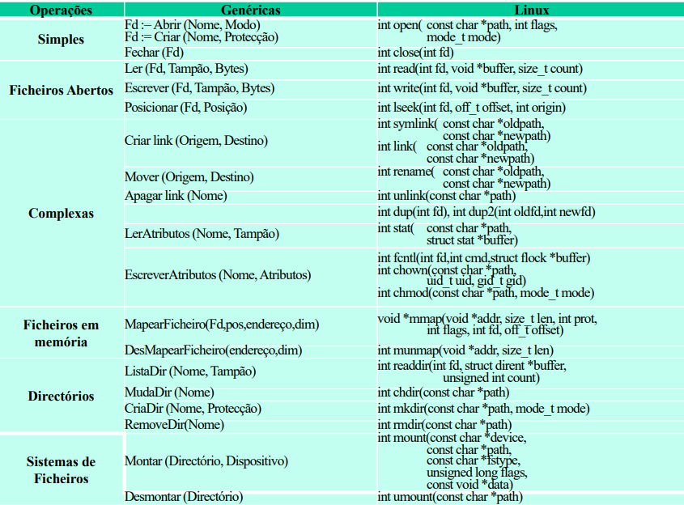

# Everything is a File

```toc

```

## Ficheiro

Toda a gente sabe o que é um [ficheiro](color:yellow), mas definir um exatamente pode ser algo mais difícil.  
Definimos um [ficheiro](color:yellow) como uma colecção de dados persientes, geralmente relacionados, identificados por um nome.
Os vários [ficheiros](color:yellow) de um certo sistema estão normalmente organizados num [sistema de ficheiros](color:orange).

Um [sistema de ficheiros](color:orange) deve ser composto por um conjunto de entidades fundamentais:

- um sistema de organização de nomes para identificação (humana) dos ficheiros (normalmente hierárquico);
- meta-informação sobre cada ficheiro que deve:
  - estar no mesmo sistema de memória secundária que a informação que descreve;
  - entre outros, estabelecer a associação entre o nome (identificador para os humanos) e um identificador numérico (para o computador);
- uma interface programática para comunicação entre os processos.


Ao executar o comando `ls` numa consola Linux podemos ver os ficheiros que se encontram numa diretoria.
Se usarmos a _flag_ `-l`, associada a cada ficheiro vem a sua meta-informação:

` -rwxr-xr-x 1 luis staff 8680 Nov 14 19:46 do_exec`

Eis a informação que está apresentada na linha a cima (por ordem):

- permissões do ficheiro: `-rwxr-xr-x`
  - podem ser de leitura (`r`), escrita (`w`) e execução (`x`);
  - o que o primeiro dos dez caracteres significa não é do compto desta cadeira;
  - os seguintes 9 caracteres dividem-se em 3 conjuntos - cada um representa as permissões de uma certa entidade. Nomeadamente, por esta ordem: **user**, **group** e **others**;
  - nomeadamente, a mensagem apresentada diz-nos que:
    - o utilizador do ficheiro tem todas as permissões sobre aquele ficheiro;
  - os restantes utilizadores do grupo têm permissões de escrita e execução, mas não de escrita;
  - qualquer outro utilizador também só pode ler ou executar;
- o número de _links_ que existem para este ficheiro (vamos ver melhor o que isto significa mais à frente): `1`;
- o nome do `utilizador` do ficheiro: `luis`;
- o nome do `grupo` do ficheiro: `staff`;
- o tamanho do ficheiro: `8680` (bytes);
- a data e hora da última modificação do ficheiro: `Nov 14 19:46`;
- o nome do ficheiro: `do_exec`.

Vamos começar por aprender a usar os sistemas de ficheiros (abstrações, APIs).

## Everything is a File

Iremos estudar uma filosofia de organização de dados onde tanto pastas como ficheiros serão tratados da mesma forma,
que é a base dos sistemas operativos Unix.

- Objetos que o SO gere são acessíveis aos processos através de descritores de ficheiro
  - Ficheiros, diretorias, dispositivos lógicos, canais de comunicação, etc.
- Vantagens para os utilizadores/programadores
  - Modelo de programação comum
  - Modelo de segurança comum
- Um dos princípios chave do Unix
  - Seguido por muitos SOs modernos
  - Algumas excepções (até no Unix)

### Nomes Absolutos e Nomes Relativos

Para aceder a um ficheiro temos de saber como referir ao SO a qual ficheiro estamos a querer aceder.

Temos assim 2 maneiras de o fazer:

- Nomes Absolutos:
  - Caminho de acesso desde a raiz (_root_, normalmente denomidado `/`)
  - **Exemplo:** `/home/joao/SO/project.zip`
- Nomes Relativos:
  - Caminho de acesso a partir do diretório corrente
  - O diretório corrente é mantido para cada processo como parte do seu contexto
  - Exemplos:
    - `./SO/project.zip` (supondo que o diretório corrente é `/home/joao`)
    - `../SO/project.zip` (supondo que o diretório corrente seja `/home/joao/teo`)

### Nomes vs. Ficheiros

Um ficheiro pode ser conhecido por vários nomes, ou seja, é possível designar o mesmo ficheiro com o nome `/a/b/c` e com o nome `/x/y`.  
É comum chamar a cada um destes nomes links (em Unix, chama-se _hard links_).

No entanto, isto levanta um problema: o que acontece quando se pretende apagar o ficheiro com o nome `/a/b/c`?  
A semântica utilizada na maioria dos sistemas de ficheiros é apagar apenas o nome `/a/b/c`
e deixar o ficheiro se ainda tiver mais nomes associados.

### Como organizar múltiplos sistemas de ficheiros?


```bash
mount -t <filesystem> /dev/hd1 /b
```

O comando `mount` liga a raiz do novo sistema de ficheiros a um diretório do sistema de ficheiros base.

Na figura acima, liga `/dev/hd1` ao diretório `/b`.

### Atributos de um Ficheiro

- Para além do tipo, a meta-informação do ficheiro possui usualmente os seguintes atributos:
  - **Protecção:** quem pode aceder ao ficheiro e quais as operações que pode realizar.
  - **Identificação do dono do ficheiro:** geralmente quem o criou.
  - Dimensão do ficheiro
  - Data de criação, última leitura e última escrita

## Programar com Ficheiros

### Como manipular ficheiros?

- As operações mais frequentes sobre ficheiros são a leitura e escrita da sua informação

#### Abrir e fechar ficheiros

**Processo:** é a instância de um programa em execução.

- É mantida uma **Tabela de Ficheiros Abertos** por processo
- Abrir um ficheiro:
  - Pesquisar o diretório
  - Verificar se o processo tem permissões para o modo de acesso que pede
  - Copia a meta-informação para memória (incluindo o modo de acesso solicitado)
  - Devolve ao utilizador um identificador que é usado como referência para essa posição de memória
- Ler e escrever sobre ficheiros abertos:
  - Dado o identificador de ficheiro aberto, permite obter rapidamente o descritor do ficheiro em memória
- Fechar do ficheiro:
  - Liberta a memória que continha a meta-informação do ficheiro
  - Caso necessário, atualiza essa informação no sistema de memória secundária

### Primitivas do Sistema de Ficheiros

Podemos dividir as funções relacionadas com o sistema de ficheiros em seis grupos:

- Abertura, criação e fecho de ficheiros
- Operações sobre ficheiros abertos
- Operações complexas sobre ficheiros
- Operações sobre diretórios
- Acesso a ficheiros mapeados em memória (Não vai ser dado a SO)
- Operações de gestão dos sistemas de ficheiros.

#### Abertura, Criação e Fecho de Ficheiros

| Retorno |  Nome  |    Parâmetros    |       Descrição       |
| :-----: | :----: | :--------------: | :-------------------: |
| `fd :=` | Abrir  |   (Nome, Modo)   |   Abre um ficheiro    |
| `fd :=` | Criar  | (Nome, Proteção) | Cria um novo ficheiro |
|         | Fechar |       (fd)       |   Fecha um ficheiro   |

Na tabela acima, `fd` simboliza o [_file descriptor_](https://en.wikipedia.org/wiki/File_descriptor).

#### Operações sobre Ficheiros Abertos

|    Nome    |     Parâmetros      |                  Descrição                  |
| :--------: | :-----------------: | :-----------------------------------------: |
|    Ler     | (fd, buffer, bytes) | Lê de um ficheiro para um buffer de memória |
|  Escrever  | (fd, buffer, bytes) |     Escreve um buffer para um ficheiro      |
| Posicionar |    (fd, posição)    |  Posiciona o cursor de leitura ou escrita   |

#### Operações complexas sobre ficheiros

Algumas operações sobre ficheiros permitem realizar operações sobre a totalidade do ficheiro, como copiá-lo, apagá-lo ou movê-lo.

|       Nome        |    Parâmetros     |                  Descrição                  |
| :---------------: | :---------------: | :-----------------------------------------: |
|      Copiar       | (Origem, Destino) |              Copia um ficheiro              |
|       Mover       | (Origem, Destino) | Move um ficheiro de um diretório para outro |
|      Apagar       |      (Nome)       |              Apaga um ficheiro              |
|   LerAtributos    |  (Nome, Tampão)   |         Lê atributos de um ficheiro         |
| EscreverAtributos | (Nome, Atributos) |            Modifica os atributos            |

Na tabela acima, memória tampão significa _buffer_.

#### Operações sobre diretórios

|   Nome   |    Parâmetros    |                   Descrição                    |
| :------: | :--------------: | :--------------------------------------------: |
| ListaDir |  (Nome, Tampão)  |         Lê o conteúdo de um diretório          |
| MudaDir  |      (Nome)      | Muda o diretório por omissão (diretório atual) |
| CriaDir  | (Nome, Proteção) |             Cria um novo diretório             |

#### Canais Standard

Inicialmente, quando um processo é iniciado, a sua tabela de ficheiros é preenchida com 3 ficheiros abertos:

- `stdin` (standard input)
- `stdout` (standard output)
- `stderr` (standard error)

Normalmente, estes _ficheiros_ referenciam os canais de input e output da consola em que o processo foi lançado.

No entanto, estes canais podem ser alterados, podendo também receber e enviar para ficheiros:

```bash
foo < out.txt      # redireciona o conteúdo de out.txt para o stdin de foo
ls > listagem.txt  # redireciona o stdout de foo para listagem.txt
foo >& erros.txt   # redireciona o stderr para o mesmo local que o stdout
```

## API do Sistema de Ficheiros

### Trabalhar com Ficheiros usando as Funções da `stdio`

#### Abrir Ficheiro

Até este momento fizemos sempre leituras do stdin e escrevemos sempre para o stdout.
Vamos ver agora como realizar estas operações sobre ficheiros.

```cpp
FILE *fp; // Ponteiro para estrutura que representa o ficheiro aberto
fp=fopen("tests.txt", "r"); // Modo de abertura do ficheiro.
                            // Neste caso estamos a abrir o ficheiro
                            // em modo de leitura.
```

- `r` - abre para leitura (read)
- `w` - abre um ficheiro vazio para escrita (o ficheiro não precisa de existir)
- `a` - abre para acrescentar no fim (“append” ; ficheiro não precisa de existir)
- `r+` - abre para escrita e leitura; começa no início; o ficheiro tem de existir
- `w+` - abre para escrita e leitura (tal como o “w” ignora qualquer ficheiro que exista com o mesmo nome, criando um novo ficheiro)
- `a+` - abre para escrita e leitura (output é sempre colocado no fim)

Existem outros tipos de abertura, mas estes são os principais.

:::details[Exemplos]

```c
#include <stdio.h>
#include <stdlib.h>
int main()
{
  FILE *fp;
  fp = fopen("teste.txt", "r"); // Se não conseguir abrir,
                                // fp fica igual a NULL
  if (fp == NULL) {
    printf("teste.txt: No such file or directory\n");
    exit(1);
  }
  return 0;
}
```

```c
#include <stdio.h>
#include <stdlib.h>
int main()
{
  FILE *fp;
  fp = fopen("teste.txt", "r");
  if (fp == NULL) {
    // Escreve a mesma mensagem de erro.
    // perror() escreve no "standard error" (stderr)
    // a descrição do último erro encontrado na chamada a
    // um sistema ou biblioteca.
    perror("teste.txt");
    exit(1);
  }
  return 0;
}
```

```c
#include <stdio.h>
#include <stdlib.h>
int main()
{
  FILE *fp;
  fp = fopen("teste.txt", "r");
  if (fp == NULL) {
    perror("teste.txt");
    exit(1);
  }
  fclose(fp); // Fecha o ficheiro
  return 0;
}
```

```c
#include <stdio.h>
#include <stdlib.h>
int main()
{
  FILE *fp;
  // Permite escrever para um ficheiro
  fp = fopen("teste.txt", "w");
  if (fp == NULL) {
    perror("teste.txt");
    exit(1);
  }
  fprintf(fp, "Hi file!\n"); // Escreve para o ficheiro
  fclose(fp); // Fecha o ficheiro
  return 0;
}
```

```c
#include <stdio.h>
#include <stdlib.h>
int main()
{
  FILE *fp;
  fp = fopen("teste.txt", "w");
  if (fp == NULL) {
    perror("teste.txt");
    exit(1);
  }
  fputs("Hi file!", fp); // Escreve para um ficheiro (alternativa)
  fclose(fp);
  return 0;
}
```

A função `fputs` muda de linha após escrever no ficheiro (adiciona `\n`),
mas não permite usar strings formatadas (e.g. `%s`, `%d`, etc) como o `fprintf`.

```c
#include <stdio.h>
#include <stdlib.h>
int main()
{
  FILE *myfile; int i;
  float mydata[100];
  myfile = fopen("info.dat", "r"); // Permite ler o ficheiro
  if (myfile == NULL) {
    perror("info.dat");
    exit(1);
  }
  // Lê um conjunto de 100 floats
  for (i = 0; i < 100; i++)
    fscanf(myfile, "%f", &mydata[i]); // guardados num ficheiro
  fclose(myfile);
  return 0;
}
```

```c
#include <stdio.h>
#include <stdlib.h>
int main()
{
  FILE *myfile;
  int i;
  // Permite adicionar ao final do ficheiro
  myfile = fopen("info.dat", "a");
  for (i = 0; i < 100; i++)
    fprintf(myfile, "%d\n", i);
  fclose(myfile);
  return 0;
}
```

:::

### O Cursor

- Para qualquer ficheiro aberto, é mantido um cursor, isto é, em que local do ficheiro estamos.  
  O cursor avança automaticamente com cada byte lido ou escrito.
- Para sabermos em que posição estamos, podemos usar função `ftell`:
  ```c
  long ftell(FILE *stream);
  ```
- Para repor o cursor noutra posição, podemos usar a função `fseek`.
  ```c
  int fseek(FILE *stream, long offset, int whence);
  ```
  - O argumento `offset` indica quantos bytes queremos andar para frente (positivo) ou para trás (negativo),
    relativo ao argumento que passamos para `whence`.
  - O argumento `whence` recebe uma das constantes `SEEK_SET`, `SEEK_CUR` ou `SEEK_END`, que indica
    se o `offset` é relativo ao início da `stream`, à posição atual ou ao final da `stream`, respetivamente.

#### Escritas são imediatamente persistentes?

Após escrita em ficheiro, essa escrita está garantidamente persistente no disco? [**Nem sempre!**](color:red)

Para optimizar o desempenho, escritas são propagadas para disco tardiamente,
pelo que poderá não estar tudo guardado em disco quando a escrita termina.

A função `fflush` permite ao programa forçar que escritas feitas até agora sejam persistidas em disco:

- Função só retorna quando houver essa garantia
- No entanto, é uma função demorada, pelo que se deve usar apenas quando necessário
  ```c
  int fflush(FILE *stream);
  ```

## Trabalhar com ficheiros usando as Funções da API do SF do Unix

Em vez de usarmos a biblioteca `stdio`, poderíamos utilizar diretamente
as funções da API do sistema de ficheiros do Unix.

Temos os seguintes prós e contras:

[**Prós:**](color:green)

- Em geral, são funções de mais baixo nível, logo permitem maior controlo
- Algumas operações sobre ficheiros só estão disponíveis através desta API

[**Contras:**](color:red)

- Normalmente, programa que usa `stdio` é mais simples e optimizado (será falado no futuro)



---

Slides:

- [Slides 2](https://drive.google.com/file/d/1dTCxBOOKYOcabgxErJXzgwMBrbSbPTc9/view?usp=sharing)
