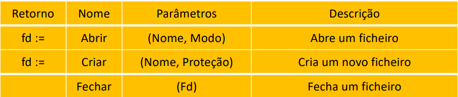
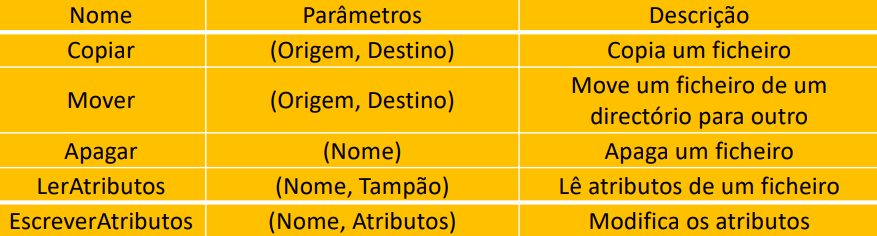
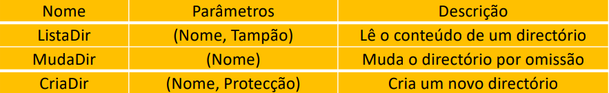

# Everything is a File

```toc

```

## Ficheiro

- Colecção de dados persientes, geralmente relacionados,
  identificados por um nome
- Organizado em hierarquia de pastas

Vamos começar por aprender a usar os sistemas de ficheiros (abrastções, APIs)

### Sistema de Ficheiros

- Composto por um conjunto de entidades
  fundamentais:
  - um sistema de organização de nomes para identificação
    dos ficheiros
  - uma interface programática para comunicação entre os
    processos
  - sistema de ficheiros

### Árvore de diretórios


- Mantém a meta-informação sobre ficheiros
  - no mesmo sistema de memória secundária que a
    informação que descreve
  - entre outros, estabelece a associação entre o nome e um
    identificador numérico do ficheiro

### O que é um ficheiro?

Ao executar o comando `ls` na consola podemos ver os ficheiros que se encontram numa diretoria

` -rwxr -xr -x 1 luis staff 8680 Nov 14 19:46 do_exec`

## Everything is a file

Iremos estudar uma filosofia de organização de dados onde tanto pastas como ficheiros serão tratados da mesma forma

- Objetos que o SO gere são acessíveis aos processos
  através de descritores de ficheiro
  - Ficheiros, diretorias, dispositivos lógicos, canais de
    comunicação, etc.
- Vantagens para os utilizadores/programadores
  - Modelo de programação comum
  - Modelo de segurança comum
- Um dos princípios chave do Unix
  - Seguido por muitos SOs modernos
  - Algumas excepções (até no Unix)

### Nomes absolutos e nomes relativos

Para aceder a um ficheiro temos de saber como referir ao SO a qual ficheiro estamos a querer aceder.

Temos assim 2 maneiras de o fazer:

- Nomes absolutos:
  - caminho de acesso
    desde a raiz
  - Exemplo:
    - /home/joao/SO/project.zip
- Nomes relativos:

  - caminho de acesso a partir do diretório corrente
  - diretório corrente mantido para cada processo como parte do seu contexto
  - Exemplos:

    - ./SO/project.zip (supondo que o diretório corrente é /home/joao)

    - ../SO/project.zip (supondo que o diretório corrente seja /home/joao/teo)

### Nomes vs. Ficheiros

- Um ficheiro pode ser conhecido por vários nomes:
  - é possível designar o mesmo ficheiro com o nome /a/b/c e com o nome /x/y.
  - é comum chamar a cada um destes nomes links
- Problema:
  - quando se pretende apagar o ficheiro com o nome /a/b/c.
- A semântica utilizada na maioria dos sistemas de
  ficheiros é apagar apenas o nome /a/b/c

### Como organizar múltiplos sistemas de ficheiros?


`mount -t <filesystem> /dev/hd1 /b`

- Mount:

  - liga a raiz do novo sistema de ficheiros a um directório do sistema de ficheiros base

  Neste casos liga /dev/hd1 ao diretório b

### Atributos de um Ficheiro

- Para além do tipo, a meta-informação do ficheiro possui usualmente os seguintes atributos:
  - Protecção
    - quem pode aceder ao ficheiro e quais as operações que pode realizar.
  - Identificação do dono do ficheiro
    - geralmente quem o criou.
  - Dimensão do ficheiro
  - Data de criação, última leitura e última escrita

## Programar com Ficheiros

### Como manipular ficheiros?

- As operações mais frequentes sobre ficheiros são a
  leitura e escrita da sua informação

#### Abrir e fechar ficheiros

Um Processo é a instância de um programa em execução

- É mantida uma Tabela de Ficheiros Abertos por processo
- Abrir um ficheiro:
  - Pesquisar o diretório
  - Verificar se o processo tem permissões para o modo de acesso que pede
  - Copia a meta-informação para memória (incluindo o modo de acesso solicitado)
  - Devolve ao utilizador um identificador que é usado como referência para essa posição de memória
- Ler e escrever sobre ficheiros abertos:
  - Dado o identificador de ficheiro aberto, permite obter rapidamente o descritor do ficheiro em memória
- Fechar do ficheiro:
  - Liberta a memória que continha a meta-informação do ficheiro
  - Caso necessário, atualiza essa informação no sistema de memória secundária

### Primitivas do Sistema de Ficheiros

- Podemos dividir as funções relacionadas com o sistema de ficheiros em seis grupos:
  - Abertura, criação e fecho de ficheiros
  - Operações sobre ficheiros abertos
  - Operações complexas sobre ficheiros
  - Operações sobre directórios
  - Acesso a ficheiros mapeados em memória (Não vai ser dado a SO)
  - Operações de gestão dos sistemas de ficheiros.

#### Abertura, Criação e Fecho de Ficheiros



#### Operações sobre Ficheiros Abertos


#### Operações complexas sobre ficheiros

- Algumas operações sobre ficheiros permitem realizar operações sobre a
  totalidade do ficheiro, como copiá-lo, apagá-lo ou movê-lo

  

#### Operações sobre directórios



#### Os canais standard

- Inicialmente, tabela de ficheiros de um processo preenchida com 3 ficheiros abertos:
  - stdin, stdout, stderr
- Normalmente, referenciam os canais de input e output da consola em que o processo foi lançado
- Podemos também receber e enviar para ficheiros

```
  foo < out.txt
  ls > listagem.txt
  foo >& erros.txt
```

## API do Sistema de Ficheiros (Revisão de IAED)

### Trabalhar com Ficheiros usando as Funções da stdio

#### Abrir Ficheiro

- Até este momento fizemos sempre leituras do stdin
  e escrevemos sempre para o stdout. Vamos ver
  agora como realizar estas operações sobre
  ficheiros.

```cpp
  FILE *fp; // Ponteiro para estrutura que representa o ficheiro aberto
  fp=fopen("tests.txt", "r"); // Modo de abertura do ficheiro.
                              // Neste caso estamos a abrir o ficheiro em
                              // modo de leitura
```

r - abre para leitura (read)\
w - abre um ficheiro vazio para escrita (o ficheiro não precisa de existir)\
a - abre para acrescentar no fim (“append” ; ficheiro não precisa de existir)\
r+ - abre para escrita e leitura; começa no início; o ficheiro tem de existir\
w+ - abre para escrita e leitura (tal como o “w” ignora qualquer ficheiro que
exista com o mesmo nome, criando um novo ficheiro)\
a+ - abre para escrita e leitura (output é sempre colocado no fim)\

- Existem outros tipos de abertura

:::details[Exemplos]

```cpp
#include <stdio.h>
#include <stdlib.h>
int main()
{
FILE *fp;
fp = fopen("teste.txt", "r"); // Se não conseguir abrir,
                              // fp fica igual a NULL
if (fp == NULL) {
   printf(“teste.txt: No such file or directory\n”);
   exit(1);
}
return 0;
}
----------------------------------------------------------------------
#include <stdio.h>
#include <stdlib.h>
int main()
{
FILE *fp;
fp = fopen("teste.txt", "r");
if (fp == NULL) {
   perror(“teste.txt”); // Escreve a mesma mensagem de erro.
                        // perror() escreve no “standard error” (stderr)
                        // a descrição do último erro encontrado na chamada a
                        // um sistema ou biblioteca.
   exit(1);
}
return 0;
}
----------------------------------------------------------------------
#include <stdio.h>
#include <stdlib.h>
int main()
{
FILE *fp;
fp = fopen("teste.txt", "r");
if (fp == NULL) {
   perror(“teste.txt”);
   exit(1);
}
fclose(fp); // Fecha o ficheiro
return 0;
}
----------------------------------------------------------------------
#include <stdio.h>
#include <stdlib.h>
int main()
{
FILE *fp;
fp = fopen("teste.txt", "w"); // Pernite escrever para um ficheiro
if (fp == NULL) {
   perror(“teste.txt”);
   exit(1);
}
fprintf(fp, "Hi file!\n"); // Escreve para o ficheiro
fclose(fp); // Fecha o ficheiro
return 0;
}
----------------------------------------------------------------------
#include <stdio.h>
#include <stdlib.h>
int main()
{
FILE *fp;
fp = fopen("teste.txt", "w");
if (fp == NULL) {
   perror(“teste.txt”);
   exit(1);
}
fputs("Hi file!", fp); // Escreve para um ficheiro (alternativa)
fclose(fp);
return 0;
}
----------------------------------------------------------------------
#include <stdio.h>
#include <stdlib.h>
int main()
{
FILE *myfile; int i;
float mydata[100];
myfile = fopen(”info.dat", ”r"); // Permite ler o ficheiro
if (myfile== NULL) {
   perror(“info.dat”);
   exit(1);
}
for (i=0;i<100;i++)                 // Lê um conjunto
                                    // de 100 floats
   fscanf(myfile,”%f”,&mydata[i]);  // guardados num
                                    //ficheiro
fclose(myfile);
return 0;
}
----------------------------------------------------------------------
#include <stdio.h>
#include <stdlib.h>
int main()
{
FILE *myfile; int i;
myfile = fopen(”info.dat", ”a"); // Permite adicionar ao final do ficheiro
for (i=0;i<100;i++)
   fprintf(myfile,”%d\n”,i);
fclose(myfile);
return 0;
}
```

:::

### O Cursor

- Para qualquer ficheiro aberto, é mantido um cursor
  - Avança automaticamente com cada byte lido ou escrito
- Para sabermos em que posição estamos, usar função `ftell`\
  `long ftell(FILE \*stream);`
- Para repor o cursor noutra posição, usar função `fseek`
  - Por exemplo, colocar cursor no início ou final do ficheiro\
    `int fseek(FILE \*stream, long offset, int whence);`

#### Escritas são imediatamente persistentes?

- Após escrita em ficheiro, essa escrita está
  garantidamente persistente no disco?
  - Nem sempre!
  - Para optimizar o desempenho, escritas são propagadas
    para disco tardiamente
- Função `fflush` permite ao programa forçar que
  escritas feitas até agora sejam persistidas em disco
  - Função só retorna quando houver essa garantia
  - Função demorada, usar apenas quando necessário
    `int fflush(FILE \*stream);`

## Trabalhar com ficheiros usando as Funções da API do SF do Unix

### Prós:

- Em geral, são funções de mais baixo nível, logo
  permitem maior controlo
- Algumas operações sobre ficheiros só estão
  disponíveis através desta API

### Contras:

- Normalmente, programa que usa stdio é mais
  simples e optimizado (será falado no futuro)

---

Slides:

- [Slides 2](https://drive.google.com/file/d/1dTCxBOOKYOcabgxErJXzgwMBrbSbPTc9/view?usp=sharing)
