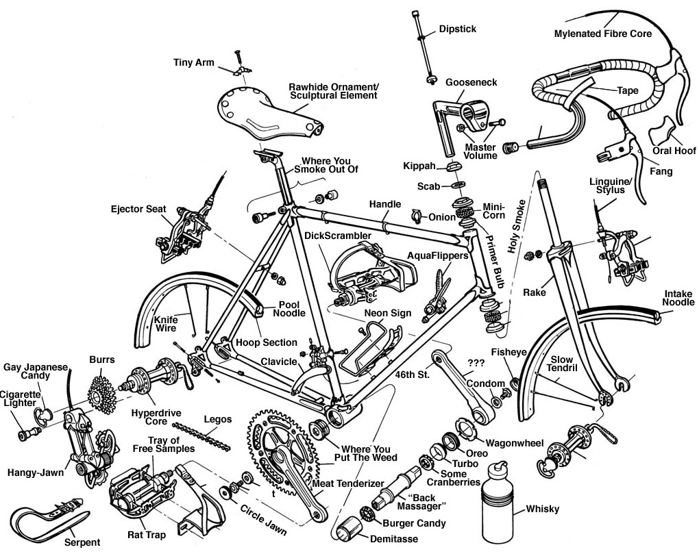
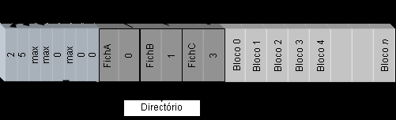

# File System

## Ficheiro

- Colecção de dados persientes, geralmente relacionados,
  identificados por um nome
- Organizado em hierarquia de pastas

Vamos começar por aprender a usar os sistemas de ficheiros (abrastções, APIs)

### Sistema de Ficheiros

- Composto por um conjunto de entidades
  fundamentais:
  - um sistema de organização de nomes para identificação
    dos ficheiros
  - uma interface programática para comunicação entre os
    processos
  - sistema de ficheiros

### Árvore de diretórios

- Mantém a meta -informação sobre ficheiros
  - no mesmo sistema de memória secundária que a
    informação que descreve
  - entre outros, estabelece a associação entre o nome e um
    identificador numérico do ficheiro

// add image pag 6

### O que é um ficheiro?

Ao executar o comando `ls` na consola podemos ver os ficheiros que se encontram numa diretoria

` -rwxr -xr -x 1 luis staff 8680 Nov 14 19:46 do_exec`

## Everything is a file

Iremos estudar uma filosofia de organização de dados onde tanto pastas como ficheiros serão tratados da mesma forma

- Objetos que o SO gere são acessíveis aos processos
  através de descritores de ficheiro
  - Ficheiros, diretorias, dispositivos lógicos, canais de
    comunicação, etc.
- Vantagens para os utilizadores/programadores
  - Modelo de programação comum
  - Modelo de segurança comum
- Um dos princípios chave do Unix
  - Seguido por muitos SOs modernos
  - Algumas excepções (até no Unix)

### Nomes absolutos e nomes relativos

Para aceder a um ficheiro temos de saber como referir ao SO a qual ficheiro estamos a querer aceder.

Temos assim 2 maneiras de o fazer:

- Nomes absolutos:
  - caminho de acesso
    desde a raiz
  - Exemplo:
    - /home/joao/SO/project.zip
- Nomes relativos:

  - caminho de acesso a partir do diretório corrente
  - diretório corrente mantido para cada processo como parte do seu contexto
  - Exemplos:

    - ./SO/project.zip (supondo que o diretório corrente é /home/joao)

    - ../SO/project.zip (supondo que o diretório corrente seja /home/joao/teo)

### Nomes vs. Ficheiros

- Um ficheiro pode ser conhecido por vários nomes:
  - é possível designar o mesmo ficheiro com o nome /a/b/c e com o nome /x/y.
  - é comum chamar a cada um destes nomes links
- Problema:
  - quando se pretende apagar o ficheiro com o nome /a/b/c.
  - apagar o conteúdo do ficheiro ou apenas o nome?
- A semântica utilizada na maioria dos sistemas de
  ficheiros é apagar apenas o nome /a/b/c

### Como organizar múlLplos sistemas de ficheiros?

// adicionar imagem 12

`mount -t <filesystem> /dev/hd1 /b`

- Mount:

  - liga a raiz do novo sistema de ficheiros a um directório do sistema de ficheiros base

  Neste casos liga /dev/hd1 ao diretório b

### Atributos de um Ficheiro

- Para além do tipo, a meta-informação do ficheiro possui usualmente os seguintes atributos:
  - Protecção
    - quem pode aceder ao ficheiro e quais as operações que pode realizar.
  - Identificação do dono do ficheiro
    - geralmente quem o criou.
  - Dimensão do ficheiro
  - Data de criação, última leitura e última escrita

## Programar com Ficheiros

### Como manipular ficheiros?

- As operações mais frequentes sobre ficheiros são a
  leitura e escrita da sua informação

#### Abrir e fechar ficheiros

Um Processo é a instância de um programa em execução

- É mantida uma Tabela de Ficheiros Abertos por processo
- Abrir um ficheiro:
  - Pesquisar o diretório
  - Verificar se o processo tem permissões para o modo de acesso que pede
  - Copia a meta-informação para memória (incluindo o modo de acesso solicitado)
  - Devolve ao u@lizador um iden@ficador que é usado como referência para essa posição de memória
- Ler e escrever sobre ficheiros abertos:
  - Dado o identificador de ficheiro aberto, permite obter rapidamente o descritor do ficheiro em memória
- Fechar do ficheiro:
  - Liberta a memória que con@nha a meta -informação do ficheiro
  - Caso necessário, atualiza essa informação no sistema de memória secundária

### Primitivas do Sistema de Ficheiros

- Podemos dividir as funções relacionadas com o sistema de ficheiros em seis grupos:
  - Abertura, criação e fecho de ficheiros
  - Operações sobre ficheiros abertos
  - Operações complexas sobre ficheiros
  - Operações sobre directórios
  - Acesso a ficheiros mapeados em memória (Não vai ser dado a SO)
  - Operações de gestão dos sistemas de ficheiros.

#### Abertura, Criação e Fecho de Ficheiros

// adicionar tabela 19

#### Operações sobre Ficheiros Abertos

// adicionar tabela 20

#### Operações complexas sobre ficheiros

- Algumas operações sobre ficheiros permitem realizar operações sobre a
  totalidade do ficheiro, como copiá-lo, apagá-lo ou movê-lo

  // adicionar tabela 21

#### Operações sobre directórios

// adicionar tabela 21

#### Os canais standard

- Inicialmente, tabela de ficheiros de um processo preenchida com 3 ficheiros abertos:
  - stdin, stdout, stderr
- Normalmente, referenciam os canais de input e output da consola em que o processo foi lançado
- Podemos também receber e enviar para ficheiros
  foo < out.txt
  ls > listagem.txt
  foo >& erros.txt

## API do Sistema de Ficheiros (Revisão de IAED)

### Trabalhar com Ficheiros usando as Funções da stdio

#### Abrir Ficheiro

- Até este momento fizemos sempre leituras do stdin
  e escrevemos sempre para o stdout. Vamos ver
  agora como realizar estas operações sobre
  ficheiros.

```cpp
  FILE *fp; // Ponteiro para estrutura que representa o ficheiro aberto
  fp=fopen("tests.txt", "r"); // Modo de abertura do ficheiro.
                              // Neste caso estamos a abrir o ficheiro em
                              // modo de leitura
```

r - abre para leitura (read)\
w - abre um ficheiro vazio para escrita (o ficheiro não precisa de existir)\
a - abre para acrescentar no fim (“append” ; ficheiro não precisa de existir)\
r+ - abre para escrita e leitura; começa no início; o ficheiro tem de existir\
w+ - abre para escrita e leitura (tal como o “w” ignora qualquer ficheiro que
exista com o mesmo nome, criando um novo ficheiro)\
a+ - abre para escrita e leitura (output é sempre colocado no fim)\

- Existem outros tipos de abertura

:::details[Exemplos]

```cpp
#include <stdio.h>
#include <stdlib.h>
int main()
{
FILE *fp;
fp = fopen("teste.txt", "r"); // Se não conseguir abrir,
                              // fp fica igual a NULL
if (fp == NULL) {
   printf(“teste.txt: No such file or directory\n”);
   exit(1);
}
return 0;
}
----------------------------------------------------------------------
#include <stdio.h>
#include <stdlib.h>
int main()
{
FILE *fp;
fp = fopen("teste.txt", "r");
if (fp == NULL) {
   perror(“teste.txt”); // Escreve a mesma mensagem de erro.
                        // perror() escreve no “standard error” (stderr)
                        // a descrição do último erro encontrado na chamada a
                        // um sistema ou biblioteca.
   exit(1);
}
return 0;
}
----------------------------------------------------------------------
#include <stdio.h>
#include <stdlib.h>
int main()
{
FILE *fp;
fp = fopen("teste.txt", "r");
if (fp == NULL) {
   perror(“teste.txt”);
   exit(1);
}
fclose(fp); // Fecha o ficheiro
return 0;
}
----------------------------------------------------------------------
#include <stdio.h>
#include <stdlib.h>
int main()
{
FILE *fp;
fp = fopen("teste.txt", "w"); // Pernite escrever para um ficheiro
if (fp == NULL) {
   perror(“teste.txt”);
   exit(1);
}
fprintf(fp, "Hi file!\n"); // Escreve para o ficheiro
fclose(fp); // Fecha o ficheiro
return 0;
}
----------------------------------------------------------------------
#include <stdio.h>
#include <stdlib.h>
int main()
{
FILE *fp;
fp = fopen("teste.txt", "w");
if (fp == NULL) {
   perror(“teste.txt”);
   exit(1);
}
fputs("Hi file!", fp); // Escreve para um ficheiro (alternativa)
fclose(fp);
return 0;
}
----------------------------------------------------------------------
#include <stdio.h>
#include <stdlib.h>
int main()
{
FILE *myfile; int i;
float mydata[100];
myfile = fopen(”info.dat", ”r"); // Permite ler o ficheiro
if (myfile== NULL) {
   perror(“info.dat”);
   exit(1);
}
for (i=0;i<100;i++)                 // Lê um conjunto
                                    // de 100 floats
   fscanf(myfile,”%f”,&mydata[i]);  // guardados num
                                    //ficheiro
fclose(myfile);
return 0;
}
----------------------------------------------------------------------
#include <stdio.h>
#include <stdlib.h>
int main()
{
FILE *myfile; int i;
myfile = fopen(”info.dat", ”a"); // Permite adicionar ao final do ficheiro
for (i=0;i<100;i++)
   fprintf(myfile,”%d\n”,i);
fclose(myfile);
return 0;
}
```

:::

### O cursor

- Para qualquer ficheiro aberto, é mantido um cursor
  - Avança automaticamente com cada byte lido ou escrito
- Para sabermos em que posição estamos, usar função
  ftell
  long ftell(FILE \*stream);
- Para repor o cursor noutra posição, usar função
  fseek
  - Por exemplo, colocar cursor no início ou final do ficheiro
    int fseek(FILE \*stream, long offset, int whence);
    39

Escritas são imediatamente persistentes?

- Após escrita em ficheiro, essa escrita está
  garantidamente persistente no disco?
  - Nem sempre!
  - Para optimizar o desempenho, escritas são propagadas
    para disco tardiamente
- Função fflush permite ao programa forçar que
  escritas feitas até agora sejam persistidas em disco
  - Função só retorna quando houver essa garantia
  - Função demorada, usar apenas quando necessário
    int fflush(FILE \*stream);
    40

Modelo de programação:
A API do sistema de ficheiros
(Revisão de IAED)
Abordagem 2:
Trabalhar com ficheiros usando as funções
da API do sistema de ficheiros do Unix

O que ganho/perco?
Prós:

- Em geral, são funções de mais baixo nível, logo
  permitem maior controlo
- Algumas operações sobre ficheiros só estão
  disponíveis através desta API
  Contras:
- Normalmente, programa que usa stdio é mais
  simples e optimizado
  - Discutiremos mais à frente em SO porque é que stdio é
    mais optimizado
    42

Sistema de Ficheiros do Unix
Operações
Genéricas
Linux
Simples
Fd :=Abrir (Nome, Modo)
Fd := Criar (Nome, Protecção)
int open( const char *path, int flags,
mode_t mode)
Fechar (Fd)
int close(int fd)
Ficheiros Abertos
Ler (Fd,Tampão, Bytes)
int read(int fd, void *buffer, size_t count)
Escrever (Fd,Tampão, Bytes)
int write(int fd, void *buffer, size_t count)
Posicionar (Fd, Posição)
int lseek(int fd, off_t offset, int origin)
Complexas
Criar link (Origem, Destino)
int symlink( const char *oldpath,
const char *newpath)
int link( const char *oldpath,
const char *newpath)
Mover (Origem, Destino)
int rename( const char *oldpath,
const char *newpath)
Apagar link (Nome)
int unlink(const char *path)
int dup(int fd), int dup2(int oldfd,int newfd)
LerAtributos (Nome,Tampão)
int stat(
const char *path,
struct stat *buffer)
EscreverAtributos (Nome,Atributos)
int fcntl(int fd,int cmd,struct flock *buffer)
int chown(const char *path,
uid_t uid, gid_t gid)
int chmod(const char *path, mode_t mode)
Ficheiros em
memória
MapearFicheiro(Fd,pos,endereço,dim)
void *mmap(void *addr, size_t len, int prot,
int flags, int fd, off_t offset)
DesMapearFicheiro(endereço,dim)
int munmap(void *addr, size_t len)
Directórios
ListaDir (Nome,Tampão)
int readdir(int fd, struct dirent *buffer,
unsigned int count)
MudaDir (Nome)
int chdir(const char *path)
CriaDir (Nome, Protecção)
int mkdir(const char *path, mode_t mode)
RemoveDir(Nome)
int rmdir(const char *path)
Sistemas de
Ficheiros
Montar (Directório, Dispositivo)
int mount(const char *device,
const char *path,
const char *fstype,
unsigned long flags,
const void *data)
Desmontar (Directório)
int umount(const char \*path)





Plano das próximas aulas
1ª Parte
2ª Parte
Aprender a usar os sistemas
de ficheiros (abstrações, APIs)
Introduzir a organização interna
dos sistemas de ficheiros: -
relevante para o projeto -
voltaremos à tópicos avançados
(caching, VFSs) mais logo


Como implementar estas abstrações?
/
b
a
c
d
e
x
y
z
/dev/hd0
/dev/hd1
f


Organização lógica de um disco
Como organizar a informação necessária para
suportar um sistema de ficheiros?


Alternativa 1: Organização em Lista


Organização em Lista

- Forma mais simples de organizar um sistema de
  ficheiros
- Cada ficheiro é constituído por um registo de
  dimensão variável com quatro campos
- No caso dos sistemas de ficheiros em CD/DVD, que
  só podem ser escritos uma vez, todos os ficheiros
  ficam compactados uns a seguir aos outros
  - No caso de sistemas onde é possível apagar ficheiros, é
    necessário manter também uma lista de espaços livres
    Desvantagens ?

Alternativa 1: desvantagens

- Tempo necessário para localizar um ficheiro através
  do seu nome
- Ficheiros que mudam de tamanho ou são apagados
  são problemáticos:
  - Espaço ocupado por cada ficheiro é contínuo
  - Fragmentação da memória
    Todos estes problemas aplicam -se a sistemas de
    ficheiros em DVD?

Alternativa 2

Dimensão
*dados
Nome
Dimensão
*dados
Nome
Dimensão

Dados

Dados
\*dados

Dados
Nome
Directório
Dados

Alternativa 2

- Solução para a primeira desvantagem:
  - criando um directório único onde todos os nomes dos
    ficheiros estão juntos
  - os nomes dos ficheiros ficam perto uns dos outros no
    disco
  - aumenta a eficência da procura de um ficheiro dado o
    seu nome

Dimensão
*dados
Nome
Dimensão
*dados
Nome
Dimensão

Dados

Dados
\*dados

Dados
Nome
Directório
Dados


Organização em Lista - desvantagens (cont.)

- Solução para a segunda
  desvantagem: dividir os
  dados de cada ficheiro em
  blocos de dimensão fixa
- O sistema de ficheiros do
  CP/M (um dos primeiros
  para PCs, 1977) utilizava
  uma estrutura deste tipo
  CP/M advertisement in the November
  29, 1982 issue of InfoWorld magazine


Sistema de Ficheiros do CP/M

- Estrutura de uma entrada do directório do sistema de
  ficheiros do CP/M:
- Neste sistema:
  - cada bloco possuía 1 Kbyte (por omissão)
  - mapa de blocos com 16 entradas, logo dimensão máxima de
    um ficheiro = 16 KBytes
- Como aumentar a dimensão máxima dos ficheiros?
  Mapa de blocos de dados
  contém os números dos
  blocos de dados do ficheiro


Sistema de Ficheiros do CP/M

- Estrutura de uma entrada do directório do sistema de
  ficheiros do CP/M:
- Neste sistema:
  - cada bloco possuía 1 Kbyte (por omissão)
  - mapa de blocos com 16 entradas, logo dimensão máxima de
    um ficheiro = 16 KBytes
- Como aumentar a dimensão máxima dos ficheiros?
  - Aumentar o mapa de blocos è ineficiente para fich. pequenos
  - Aumentar o tamanho dos blocos è maior fragmentação
    Mapa de blocos de dados
    contém os números dos
    blocos de dados do ficheiro


Sistema de Ficheiros do MS -DOS

- Evoluiu a partir do sistema CP/M
- Possui uma estrutura de sistema de
  ficheiros semelhante
- Em vez de um mapa de blocos por
  ficheiro, no MS -DOS existe:
  - uma tabela de blocos global partilhada por todos os ficheiros
  - esta tabela única é tão representativa da estrutura do sistema
    de ficheiros que deu origem ao nome do sistema de ficheiros
    mais popular que a usa: o sistema de ficheiros FAT (Tabela de
    Alocação de Ficheiros — File Allocation Table).
    The original MS -DOS advertisement
    in 1981




Alternativa 4: File Allocation Table (FAT)
Anúncio do MS -DOS, 1981

Sistemas de Ficheiros do Tipo FAT

- A partição contém três secções distintas:
  - a tabela de alocação (File Allocation Table, FAT),
  - uma diretoria com os nomes dos ficheiros presentes no sistema de
    ficheiros, e
  - uma secção com o espaço restante dividido em blocos, de igual
    dimensão, para conter os dados dos ficheiros

Sistemas de Ficheiros do Tipo FAT (cont.)

- FAT é vetor composto por 2n inteiros de n bits
  - Designado de FAT -16 (n=16) ou FAT -32 (n=32), etc.
- Dimensionado para:
  - Caber em memória RAM (FAT carregada do disco em
    RAM quando o FS é montado)
  - Ter tantas entradas quanto o número de blocos de dados
    na partição em disco
- As entradas da FAT:
  - com o valor zero indicam que o respectivo bloco está
    livre,
  - com valores diferentes de zero indicam que o respectivo
    bloco faz parte de um ficheiro


Sistemas de Ficheiros do Tipo FAT (cont.)

- Os blocos de um ficheiro são determinados assim:
  - 1º bloco: indicado por um número na respectiva entrada
    no directório.
  - restantes blocos: referenciados em lista ligada pelas
    entradas da FAT

Desvantagens do FAT

- Elevada dimensão da FAT quando os discos têm
  dimensões muito grandes:
  - Por exemplo, uma partição 1 Tbyte
  - Usando FAT -32 e blocos de 4 Kbytes...
  - ...a FAT pode ocupar 1 GByte (1TBytes/4KBytes × 4 bytes)
- Tabelas desta dimensão não são possíveis de
  manter em RAM permanentemente:
  - Ler à FAT do disco, prejudica muito o acesso à cadeia de
    blocos de um ficheiro

Alternativa 5: Organização com Descritores
Individuais de Ficheiros (i -nodes)

- Manter a descrição do ficheiro num descritor
  próprio de cada ficheiro, chamado i -node
  - Exemplos de atributos incluídos no i -node: tipo de
    ficheiro, dono, datas de últimos acessos, permissões,
    dimensão, localizações dos blocos de dados
  - É a estrutura que está entre as entradas dos diretórios
    que referenciam o ficheiro e os seus blocos de dados
- Vantagem: podem existir várias entradas de
  diretório a apontar para o mesmo ficheiro
  - Noção de hard link

Organização com Descritores
Individuais de Ficheiros (i -nodes)

- Os i -nodes são guardados numa estrutura especial de
  tamanho fixo antes dos blocos de dados
- No Linux tem o nome de tabela de inodes
- No Windows tem o nome:
  - MFT (Master File Table).
- O número máximo de ficheiros numa partição é dado
  pelo número máximo de i -nodes nessa tabela

Directório
Ficheiro
Blocos
Descritores
de ficheiros
Tabela de
alocação
Descritor do
volume
Bloco de
boot
Volume

A sequência de passos para aceder ao
conteúdo de um ficheiro
Caminho de acesso (pathname)
i -number
i -node
Bloco de dados com os bytes
relativos ao cursor atual
f=open(pathname, …)
read(f, …)
write(f, …)
etc
Percorrendo a árvore
de diretórios
Via cache de i -nodes (em RAM)
ou tabela de i -nodes (em disco)
cursor
atual

Organização com Descritores
Individuais de Ficheiros (i -nodes)

- Um ficheiro é univocamente identificado, dentro de
  cada partição, pelo número de i -node (muitas vezes
  chamado i -number)
- Os directórios só têm que efetuar a ligação entre
  um nome do ficheiro e o número do seu descritor

Número
do Inode
Dimensão
do
Registo
Dimensã
o
do nome
Tipo
Nome

0

1
2
1
2
.
\0 \0
\0

12

1
2
2
2
.
.
\0
\0

24

1
6
6
1
c
a
r
l
o
s
\0
\0
40

1
6
7
1
m
a
r
q
u
e
s
\0

54
79
23
256
https://xuanyidong.com/asse
ts/projects/NATS -Bench

Percorrer a árvore de diretórios

1. Começar pelo diretório raíz

- i -number tem valor pré -conhecido (e.g., i -num=2)

2. Dado o i -number, obter o i -node do diretório

- Na cache de i -nodes (em RAM) ou na tabela de i -nodes
  (em disco)

3. A partir do i -node, descobrir os índices dos blocos
   de dados com o conteúdo do diretório
4. Ler cada bloco do diretório e pesquisar nele uma
   entrada com o próximo nome do pathname
5. Assim que seja encontrada, a entrada indica o i -
   num do próximo nome
6. Repetir a partir do passo 2 para este novo nome
   Recursivamente para
   cada elemento do pathname

Organização com Descritores
Individuais de Ficheiros (i -nodes)

- Descritor do Volume:
  - possui a informação geral de descrição do sistema de ficheiros
  - por exemplo, a localização da tabela
    de descritores e a estrutura da tabela
    de blocos livres
  - é geralmente replicado noutros
    blocos (a informação nele guardada é
    de importância fundamental)
  - se se corromper pode ser impossível recuperar a
    informação do sistema de ficheiros
- Implementação do descritor de volume:
  - Unix - bloco especial denominado superbloco
  - NTFS - ficheiro especial
  - FAT - a informação em causa é descrita directamente no setor de
    boot

Directório
Ficheiro
Blocos
Descritores
de ficheiros
Tabela de
alocação
Descritor do
volume
Bloco de
boot
Volume

Tabela de Blocos Livres (ou Tabela de Alocação)

- Mantém um conjunto de estruturas necessárias à
  localização de blocos livres:
  - i.e. blocos da partição que não estão ocupados por nenhum
    bloco de nenhum ficheiro.
- Pode ser um simples bitmap:
  - um bit por cada bloco na partição,
  - indica se o respetivo bloco está livre ou ocupado
- Tabela de blocos livres desacoplada dos i -nodes tem
  vantagens:
  - é possível ter estruturas muito mais densas (a tabela de blocos
    livres possui, usualmente, apenas um bit por cada bloco)
  - pode -se organizar a tabela de blocos livres em várias tabelas
    de menor dimensão para blocos adjacentes

Directório
Ficheiro
Blocos
Descritores
de ficheiros
Tabela de
alocação
Descritor do
volume
Bloco de
boot
Volume

Sistema de ficheiros Ext
Principal Sistema de ficheiros do Linux
Sistema referência para outros sistemas
de ficheiros atuais

i -node (index node)

- Meta -dados do
  ficheiro
- Localização dos
  dados do ficheiro
  - Índices do 1º bloco,
    do 2º bloco, etc.
    Campo
    Descrição
    i_mode
    Tipo de ficheiro e direitos de acesso
    i_uid
    Identificador do utilizador
    i_size
    Dimensão do ficheiro
    i_atime
    Tempo do último acesso
    i_ctime
    Tempo da última alteração do inode
    i_mtime
    Tempo da última alteração do ficheiro
    i_dtime
    Tempo da remoção do ficheiro
    i_gid
    Identificador do grupo do utilizador
    i_links_count
    Contador de hard links
    i_blocks
    Número de blocos ocupado pelo ficheiro
    i_flags
    Flags várias do ficheiro
    i_block[15]
    Vector de 15 unidades para blocos de dados
    Outros campos ainda não utilizados

Exemplo de FS que usa i -nodes: ext3

- Índice dos blocos do ficheiro é mantido num vetor
  i_block do i -node, com 15 posições
  - 12 entradas diretas
  - Caso dimensão > 12 blocos, 3 últimas posições do vector
    contêm referências para blocos com índices para outros
    blocos
- Primeira entrada é indireção de 1 nível
- Segunda é indireção de 2 níveis
- Terceira é indireção de 3 níveis
- Só se usam as entradas (e blocos de índices)
  necessários

Exemplo de FS que usa i -nodes: ext3

Blocos de dados

Blocos índices
de 1º nível
Blocos índices
de 2º nível
Três níveis
de indirecção
Protecção
Datas
Etc.
inode
B bytes
B bytes
dimensão máxima de um ficheiro = B x (12 + B/R + (B/R)2 + (B/R)3)
B é a dimensão em bytes de um bloco de dados
R é a dimensão em bytes de uma referência para um bloco
Com blocos de 1 Kbyte e referências de 4 byte, a dimensão máxima de um ficheiro é ~16 Gbyte

Tabela de i -nodes no volume

- Mantidos em tabela em zona propria no volume
- Dentro de um volume, cada i -node é identificado
  por um i -number
  - Índice do i -node na tabela de i -nodes no volume

Directório
Ficheiro
Blocos
Descritores
de ficheiros
Tabela de
alocação
Descritor do
volume
Bloco de
boot
Volume
Tabela de i -nodes

Tabelas de Inodes e Bitmaps

- Cada partição tem um número máximo de i -nodes:
  - que servem para armazenar os i -nodes de todos os ficheiros
    da partição.
  - logo, existe um número máximo de ficheiros, correspondente
    à dimensão máxima da tabela de i -nodes
- Dentro de uma partição:
  - um i -node é univocamente identificado pelo índice dentro da
    tabela de inodes.
- Para além da tabela de inodes existem em cada partição
  ainda duas outras tabelas:
  - o bitmap de i -nodes - posições dos i -nodes livres
  - o bitmap de blocos, - posições dos blocos livres

Estruturas em RAM de suporte ao FS

Estruturas de Suporte à Utilização dos Ficheiros

- Todos os sistemas de ficheiros definem um conjunto de
  estruturas em memória volátil para os ajudar a gerir a
  informação persistente mantida em disco.
- Objectivos:
  - Criar e gerir os canais virtuais entre as aplicações e a informação em
    disco
  - Aumentar o desempenho do sistema mantendo a informação em
    caches
  - Tolerar eventuais faltas
  - Isolar as aplicações da organização do sistema de ficheiros
  - Possibilitar a gestão de várias organizações de estruturas de
    ficheiros em simultâneo

Visão Global
open/read/write/close
programa
stdio
FILE\*
iobuf
flush
Processo
Tabela de descritores do processo
Tabela de Ficheiros
abertos
Cache de i -nodes
CACHE de dados
DISCO
O programa contém um
ponteiro para uma estrutura do
tipo FILE.
A FILE é mantida pela biblioteca stdio e contém um
buffer e o “file descriptor” do ficheiro aberto. O buffer
serve para optimizar as escritas e leituras. O fd
identifica o ficheiro na tabela de descritores. É
possível utilizar o fd directamente.
A tabela de descritores contém uma entrada por cada
ficheiro ou dispositivo aberto. A entrada 0 representa
o dispositivo de entrada, a entrada 1 o dispositivo de
saída e a 2 o dispositivo de saída para erros. Cada
uma das entradas aponta para uma tabela global no
núcleo
A tabela de ficheiros abertos com os
cursores de escrita e leitura nos ficheiros,
a indicação do tipo de acesso
(leitura/escrita) e o número do primeiro
bloco de índice do ficheiro
A tabela de i -nodes é uma cache para os
blocos de índices dos ficheiros acedidos.
Cada bloco de índices referencia os blocos
do disco que compõem um ficheiro.


Estruturas de Suporte à Utilização dos Ficheiros

- Quando existe uma operação sobre um ficheiro já aberto, o identificador do ficheiro permite
  identificar na estrutura de descritores de ficheiros abertos do processo o ponteiro para o objecto
  que descreve o ficheiro na estrutura de ficheiros abertos global (passo ).
- De seguida é perguntado ao gestor de cache se o pedido pode ser satisfeito pela cache (passo ‚).
- Se não puder então é invocada a função correspondente à operação desejada do sistema de
  ficheiros, dando -lhe como parâmetro o descritor de ficheiro correspondente (passo ƒ).
- Finalmente, os blocos de dados do ficheiro são lidos ou escritos a partir da informação de
  localização dos blocos residente no descritor de ficheiro (passo „).

Tabelas de Ficheiros

- file table contem:
  - Cursor que indica a
    posição actual de
    leitura/escrita
  - modo como o ficheiro
    foi aberto
    fd1 = open (“fileA”, O_RDONLY);
    fd2 = open (“fileB”, O_WRONLY);
    fd3 = open (“fileA”, O_RDWR);
    user file
    descriptor
    table
    file
    table
    inode
    table
    uma por
    cada processo
    partilhadas por todos os processos
    read
    write
    r/w
    2 | file A
    1 | file B

Estruturas de Suporte à Utilização dos Ficheiros
(cont.)

- Tabela de ficheiros abertos - por processo:
  - contém um descritor para cada um dos ficheiros abertos
  - mantida no espaço de memória protegida que só pode ser acedida pelo
    núcleo
- Tabela de ficheiros abertos - global:
  - contém informação relativa a um ficheiro aberto
  - mantida no espaço de memória protegida que só pode ser acedida pelo
    núcleo
- A existência de duas tabelas é fundamental para:
  - garantir o isolamento entre processos
  - permitindo a partilha de ficheiros sempre que necessário (e.g. os
    cursores de escrita e leitura de um ficheiro entre dois ou mais
    processos)
- Note -se que:
  - os identificadores para a tabela global estão na tabela privada que está
    em memória protegida, pelo que não podem ser alterados

```

```
